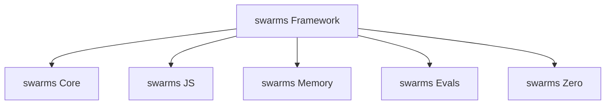
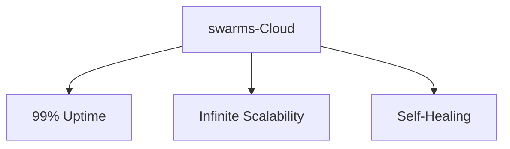
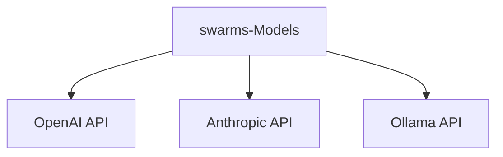
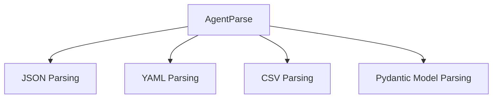
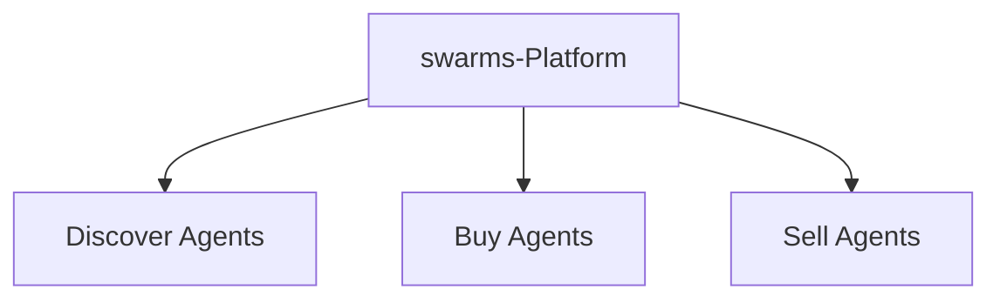
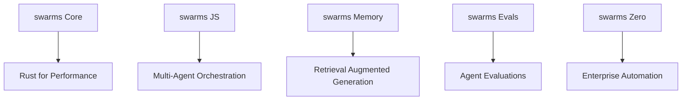

# Understanding the swarms Ecosystem

The [swarms Ecosystem](https://github.com/The-Swarm-Corporation/swarm-ecosystem) is a powerful suite of tools and frameworks designed to help developers build, deploy, and manage swarms of autonomous agents. This ecosystem covers various domains, from Large Language Models (LLMs) to IoT data integration, providing a comprehensive platform for automation and scalability. Below, we’ll explore the key components and how they contribute to this groundbreaking ecosystem.

#### 1. **swarms Framework**

The [swarms Framework](https://github.com/The-Swarm-Corporation/swarm-ecosystem) is a Python-based toolkit that simplifies the creation, orchestration, and scaling of swarms of agents. Whether you are dealing with marketing, accounting, or data analysis, the swarms Framework allows developers to automate complex workflows efficiently.

#### 2. **swarms-Cloud**

[swarms-Cloud](https://github.com/The-Swarm-Corporation/swarm-ecosystem) is a cloud-based solution that enables you to deploy your agents with enterprise-level guarantees. It provides 99% uptime, infinite scalability, and self-healing capabilities, making it ideal for mission-critical operations.

#### 3. **swarms-Models**

[swarms-Models](https://github.com/The-Swarm-Corporation/swarm-ecosystem) offer a seamless interface to leading LLM providers like OpenAI, Anthropic, and Ollama. It allows developers to tap into cutting-edge natural language understanding for their agents.

#### 4. **AgentParse**

[AgentParse](https://github.com/The-Swarm-Corporation/swarm-ecosystem) is a high-performance library for mapping structured data like JSON, YAML, CSV, and Pydantic models into formats understandable by agents. This ensures fast, seamless data ingestion.

#### 5. **swarms-Platform**

The [swarms-Platform](https://github.com/The-Swarm-Corporation/swarm-ecosystem) is a marketplace where developers can find, buy, and sell autonomous agents. It enables the rapid scaling of agent ecosystems by leveraging ready-made solutions.

#### Extending the Ecosystem: **swarms Core**, **JS**, and More

In addition to the core components, the swarms Ecosystem offers several other powerful packages:

- **[swarms Core](https://github.com/kyegomez/swarms)**: Built in Rust, swarms Core handles concurrency, multi-threading, and execution strategies.
- **[swarms JS](https://github.com/The-Swarm-Corporation/swarm-js)**: Allows JavaScript-based orchestration of multi-agent systems.
- **[swarms Memory](https://github.com/The-Swarm-Corporation/swarm-memory)**: Provides Retrieval Augmented Generation (RAG) systems for long-term memory in agents.
- **[swarms Evals](https://github.com/The-Swarm-Corporation/swarm-evals)**: Used for evaluating the performance of swarms of agents.
- **[swarms Zero](https://github.com/The-Swarm-Corporation/zero)**: An RPC-based enterprise-grade automation framework.

### Conclusion

The swarms Ecosystem is a comprehensive, flexible, and scalable platform for managing and deploying autonomous agents. Whether you’re working with LLMs, IoT data, or building new models, the ecosystem provides the tools necessary to simplify automation at scale.

Start exploring the possibilities by checking out the [swarms Ecosystem GitHub repository](https://github.com/The-Swarm-Corporation/swarm-ecosystem) and join our growing community of developers and innovators.
