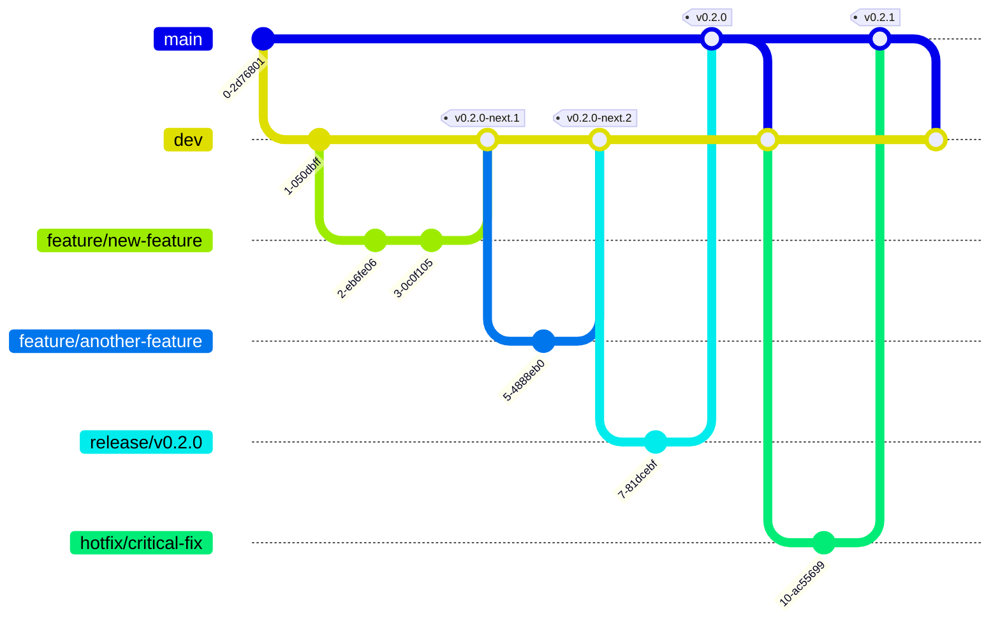

# Contributing to CodeMap

First off, thank you for considering contributing to CodeMap! We welcome contributions from everyone, and we're excited to see how you can help make this AI-powered developer toolkit even better.

This document provides guidelines for contributing to the project. Please read it carefully to ensure a smooth and effective contribution process.

## Table of Contents

- [Contributing to CodeMap](#contributing-to-codemap)
  - [Table of Contents](#table-of-contents)
  - [How Can I Contribute?](#how-can-i-contribute)
    - [Reporting Bugs](#reporting-bugs)
    - [Suggesting Enhancements](#suggesting-enhancements)
    - [Code Contributions](#code-contributions)
  - [Getting Started](#getting-started)
  - [Branching Strategy (Simplified Git Flow)](#branching-strategy-simplified-git-flow)
    - [Core Branches](#core-branches)
    - [Supporting Branches](#supporting-branches)
    - [Workflow Examples](#workflow-examples)
  - [Code Contribution Workflow](#code-contribution-workflow)
  - [Coding Standards](#coding-standards)
  - [Testing](#testing)
  - [Commit Message Guidelines](#commit-message-guidelines)
  - [Pull Request Process](#pull-request-process)
  - [Release Process](#release-process)
    - [Automatic Releases](#automatic-releases)
    - [Release Preparation](#release-preparation)
    - [Hotfix Process](#hotfix-process)
  - [Questions?](#questions)

## How Can I Contribute?

### Reporting Bugs

If you encounter a bug, please help us by reporting it!

1.  **Check Existing Issues:** Before creating a new issue, please search the [GitHub Issues](https://github.com/SarthakMishra/codemap/issues) to see if the bug has already been reported.
2.  **Create a New Issue:** If the bug hasn't been reported, create a new issue. Please include:
    *   A clear and descriptive title.
    *   Your operating system and Python version.
    *   Steps to reproduce the bug reliably.
    *   What you expected to happen.
    *   What actually happened (including any error messages or tracebacks).
    *   Screenshots or code snippets if relevant.

### Suggesting Enhancements

We welcome suggestions for new features or improvements to existing ones.

1.  **Check Existing Issues/Discussions:** Search the [GitHub Issues](https://github.com/SarthakMishra/codemap/issues) and [Discussions](https://github.com/SarthakMishra/codemap/discussions) to see if your idea has already been proposed.
2.  **Create a New Issue/Discussion:** If not, open a new issue or start a discussion thread. Describe:
    *   The enhancement you're proposing.
    *   The problem it solves or the use case it addresses.
    *   Any potential implementation ideas (optional).

### Code Contributions

If you'd like to contribute code (bug fixes, new features), please follow the workflow outlined below.

## Getting Started

Before you start coding, make sure you have set up your development environment correctly by following the [Development Setup Guide](index.md).

## Branching Strategy (Simplified Git Flow)

We use a simplified Git Flow model to manage branches and releases, with automated releases powered by Python Semantic Release.



### Core Branches

-   **`main`**:
    -   Represents the latest **stable production-ready** release.
    -   Pushes to `main` trigger automatic stable version releases.
    -   Protected branch with required reviews. Changes come via approved PRs from `release/*` or `hotfix/*` branches.
-   **`dev`**:
    -   The primary integration branch for **ongoing development** and upcoming features.
    -   Pushes to `dev` trigger automatic pre-release versions with the `-next` tag.
    -   All feature branches are merged into `dev`.
    -   Continuously tested via CI.

### Supporting Branches

-   **Feature branches (`feature/*`)**:
    -   Branched off `dev`.
    -   Used for developing new features or significant changes.
    -   Named descriptively (e.g., `feature/add-pr-update-command`).
    -   Merged back into `dev` via Pull Requests (PRs).
-   **Release branches (`release/*`)**:
    -   Branched off `dev` when preparing for a new stable release.
    -   Used for final testing, documentation updates, and version stabilization.
    -   Format: `release/vX.Y.0` (e.g., `release/v1.2.0`).
    -   Merged into `main` via PR, which triggers automatic release.
    -   No need for manual version bumping as this is handled by semantic-release.
-   **Hotfix branches (`hotfix/*`)**:
    -   Branched off `main`.
    -   Used for critical bug fixes needed in the production version.
    -   Merged into `main` via PR, triggering automatic patch release.
    -   Also merged back into `dev` (usually by merging the updated `main`).

### Workflow Examples

1.  **New Feature Development**:

    ```bash
    # Start from the dev branch
    git checkout dev
    git pull origin dev

    # Create your feature branch
    git checkout -b feature/your-feature-name

    # --- Make your changes ---

    # Push your feature branch
    git push -u origin feature/your-feature-name

    # Open a Pull Request to merge `feature/your-feature-name` into `dev`
    # When merged, a new pre-release version may be created automatically
    ```

2.  **Release Preparation**:

    ```bash
    git checkout dev
    git pull origin dev
    
    # Create a release branch (no need to bump versions manually)
    git checkout -b release/v1.3.0
    
    # Make any final adjustments, documentation updates, etc.
    # Push the release branch
    git push -u origin release/v1.3.0
    
    # Create a PR from release/v1.3.0 to main
    # When the PR is approved and merged:
    # 1. A new release will be automatically created
    # 2. The package will be built and published to PyPI
    # 3. Main should be merged back to dev to sync the version changes
    git checkout dev
    git pull origin dev
    git merge origin/main
    git push origin dev
    ```

3.  **Hotfix Process**:
    ```bash
    git checkout main
    git pull origin main
    
    # Create a hotfix branch
    git checkout -b hotfix/critical-bug-fix
    
    # Fix the bug and commit using conventional commit format
    # (preferably using `codemap commit`)
    
    # Push the hotfix branch
    git push -u origin hotfix/critical-bug-fix
    
    # Create a PR from hotfix/critical-bug-fix to main
    # When merged, a patch release will be automatically created
    
    # After the hotfix is released, sync changes back to dev
    git checkout dev
    git pull origin dev
    git merge origin/main
    git push origin dev
    ```

## Code Contribution Workflow

1.  **Fork & Clone:** Fork the repository on GitHub and clone your fork locally.
    ```bash
    git clone https://github.com/YOUR_USERNAME/codemap.git
    cd codemap
    git remote add upstream https://github.com/SarthakMishra/codemap.git
    ```
2.  **Setup:** Follow the [Development Setup](index.md) instructions.
3.  **Branch:** Create a new branch based on the correct base branch (`dev` for features/improvements, `main` only for agreed-upon hotfixes).
    ```bash
    # For features/improvements
    git checkout dev
    git pull upstream dev # Keep dev up-to-date
    git checkout -b feature/your-descriptive-name

    # For hotfixes (usually maintainers)
    # git checkout main
    # git pull upstream main
    # git checkout -b hotfix/your-fix-name
    ```
4.  **Code:** Make your changes. Write clean, well-commented code. Add or update tests as necessary.
5.  **Format & Lint:** Ensure your code adheres to the project's style guidelines.
    ```bash
    task format
    task lint
    # Or run all checks
    task ci
    ```
6.  **Test:** Run the test suite to ensure your changes haven't broken anything.
    ```bash
    task test
    # Check coverage
    task coverage
    ```
7.  **Commit:** Commit your changes using meaningful commit messages. **We strongly encourage using the `codemap commit` command** to generate conventional commit messages.
    ```bash
    # Stage your changes
    git add .
    # Use the interactive commit tool
    codemap commit
    # Or if you prefer manual commits, follow conventional commit format
    # git commit -m "feat(cli): add option for custom output format"
    ```
8.  **Push:** Push your branch to your fork.
    ```bash
    git push -u origin feature/your-descriptive-name
    ```
9.  **Pull Request:** Open a Pull Request (PR) from your fork's branch to the `upstream/dev` branch (or `upstream/main` for hotfixes). Provide a clear description of your changes.

## Coding Standards

- Follow [PEP 8](https://www.python.org/dev/peps/pep-0008/) for Python code.
- Use type hints (`typing` module).
- Write docstrings for public modules, classes, and functions (see project docs rules).
- Use `ruff` for linting and formatting (`task format`, `task lint`).

## Testing

- Write tests using `pytest`.
- Aim for good test coverage (`task coverage`).
- Ensure all tests pass (`task test`) before submitting a PR.

## Commit Message Guidelines

We follow the [Conventional Commits](https://www.conventionalcommits.org/en/v1.0.0/) specification.

- **Format:** `<type>[optional scope]: <description>`
- **Example:** `feat(commit): add semantic diff splitting strategy`
- **Use `codemap commit`:** The easiest way to ensure compliance is to use the built-in `codemap commit` command.

## Pull Request Process

1.  Ensure all CI checks (linting, testing) pass.
2.  Provide a clear title and description for your PR.
3.  Link any related issues.
4.  Request reviews from maintainers.
5.  Address any feedback promptly.
6.  Once approved, a maintainer will merge the PR.

## Release Process

Releases are managed automatically using [Python Semantic Release](https://python-semantic-release.readthedocs.io/).

### Automatic Releases

- Merging a PR into `dev` **may** trigger a pre-release (e.g., `v1.2.0-next.1`).
- Merging a PR from a `release/*` or `hotfix/*` branch into `main` **will** trigger a stable release (e.g., `v1.2.0` or `v1.2.1`).
- The release process includes:
    - Bumping the version based on commit messages.
    - Generating a changelog.
    - Tagging the commit in Git.
    - Creating a GitHub Release.
    - Building the package.
    - Publishing to PyPI.

### Release Preparation

Maintainers will create `release/*` branches off `dev` when ready to stabilize for a release. This branch allows for final testing and documentation updates before merging to `main`.

### Hotfix Process

Critical bugs in `main` are fixed using `hotfix/*` branches, which are merged directly back into `main` to trigger a patch release.


## Questions?

If you have questions, feel free to open an issue or start a discussion on GitHub. 