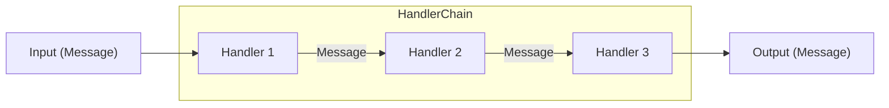

# Conflux

A simple Python library to build prompt pipelines and applications with Large Language Models (LLMs). Conflux is designed for flexibility, composability, and ease of use, making it easy to create complex LLM workflows.

## Core Concept



Conflux has three main components:

- **Messages**: Entities in an application communicate through `Message` objects.
- **Handlers**: `Message`s are passed through `Handler`s that can modify, transform, or format the message.
- **HandlerChains**: `Handler`s are chained together to form a `HandlerChain`, which executes handlers in order.

## Installation

```bash
pip install conflux-ai
```

or, if you use faiss for similarity search:

```bash
pip install -U "conflux-ai[faiss]"
```

## Example Usage

```python
import asyncio
from conflux import HandlerChain, Message, handler
from conflux.handlers import OpenAiLLM

@handler
async def company_name(msg: Message, chain: HandlerChain) -> str:
    chain.variables["product"] = msg.primary
    return (
        f"What would be an appropriate name for a business specializing in {msg.primary}?"
        "Only mention the company name and nothing else."
    )

@handler
async def company_tagline(msg: Message, chain: HandlerChain) -> str:
    return (
        f"What would be an appropriate tagline for a business specializing in {chain.variables['product']}"
        f" and with company name {msg.primary}?\nFormat your output in the following"
        f" format:\n{msg.primary}: <tagline>"
    )

def main():
    name_and_tagline_generator = (
        company_name >> OpenAiLLM() >> company_tagline >> OpenAiLLM()
    )
    res = asyncio.run(name_and_tagline_generator("bike"))
    print(res)

if __name__ == "__main__":
    main() # Socket: The best socks in the world
```

# Advanced Examples

Explore more advanced usage patterns and integrations in the `examples/` directory:

- [MCP Tool Call Example](examples/mcp_tool_call.py): How to call tools from an MCP (Model Context Protocol) server as part of your handler chain.
- [Retrieval-Augmented Generation (RAG) Example](examples/rag_example.py): How to build a RAG pipeline using OpenAI embeddings and a FAISS vector index.

For more, see the `examples/` folder in the repository.

## Why Conflux?

Applications with LLMs can get complex quickly. Conflux is designed for simplicity and scalability, giving you control over prompts and execution while maintaining an intuitive API. Unlike more rigid frameworks, Conflux lets you customize every step of your pipeline.

---
