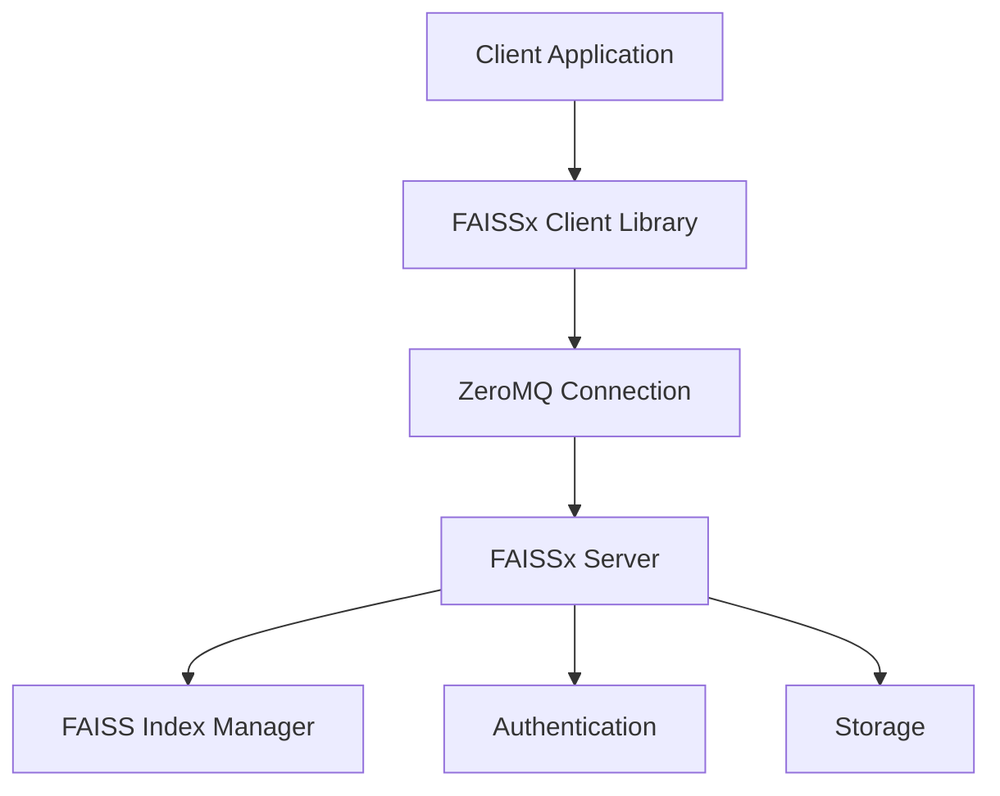

# FAISSx (FAISS Extended)

[](https://github.com/muxi-ai/faissx)
[](https://opensource.org/licenses/Apache-2.0)
[](./examples/)
&nbsp;
[](./CONTRIBUTING.md)

### A high-performance vector similarity search service that extends FAISS with remote execution capabilities while maintaining full API compatibility.

---

> [!TIP]
> #### Support this project by starring this repo on GitHub!
>
> More stars → more visibility → more contributors → better features → more robust tool for everyone 🎉
>
> <a href="https://github.com/muxi-ai/faissx" target="_blank"></a>
>
> Thank you for your support! 🙏

---

## 📚 Table of Contents

- [Overview](#-overview)
- [Why FAISSx?](#-why-faissx)
- [Getting Started](#-getting-started)
- [Key Features](#-key-features)
- [Architecture](#-architecture)
- [Server Setup](#-server-setup)
- [Client Implementation](#-client-implementation)
- [Docker Deployment](#-docker-deployment)
- [Performance](#-performance)
- [Development](#-development)
- [Project Structure](#-project-structure)
- [License](#-license)

## 👉 Overview

**FAISSx** is essentially "FAISS, but over the network, with enterprise features" - taking Facebook's excellent local vector search library and making it suitable for distributed, multi-tenant production deployments.

The client library acts as a true drop-in replacement for FAISS, meaning you can use it without changing your existing code - simply change your import statements and optionally configure remote execution. FAISSx seamlessly transitions between local FAISS execution and remote server operations based on your configuration.

Built with ZeroMQ and msgpack for efficient binary communication, FAISSx is designed for production workloads requiring authentication, multi-tenancy, and reliable vector similarity search at scale.

---

## 🤔 Why FAISSx?

Teams choose FAISSx over vanilla FAISS when they need vector search capabilities but their architecture, scale, or security requirements mean they can't just embed FAISS directly in their applications:

### **🏢 Enterprise & Multi-Tenant Applications**
- **SaaS Platforms**: Each customer needs isolated vector search (document similarity, recommendation engines) without cross-contamination
- **Enterprise Search**: Company-wide semantic search where different departments need access but data must stay separated
- **Consulting/Agency Work**: Serve multiple clients from one infrastructure with proper data isolation

### **🔧 Microservices & Modern Architecture**
- **Distributed Systems**: Multiple services need vector search without each maintaining their own FAISS instances
- **Language Diversity**: Teams using different languages (JavaScript, Go, Java) can all access the same vector service
- **Stateless Applications**: Applications deployed in containers/Kubernetes that can't maintain large in-memory indices

### **📈 Scale & Performance**
- **Memory Optimization**: Instead of loading 10GB indices in 20 different application instances, centralize it in one optimized service
- **Concurrent Access**: Multiple teams/applications hitting the same indices simultaneously
- **Resource Isolation**: Separate heavy vector computation from lightweight application logic

### **🤝 Team Collaboration**
- **Shared ML Infrastructure**: Data scientists can build and share vector indices that multiple applications consume
- **Experimentation**: Teams can test different embedding models/indices without disrupting production applications
- **MLOps Workflows**: Proper deployment pipeline for vector search with versioning, rollbacks, and monitoring

### **🚀 Production Requirements**
- **Authentication & Security**: Production systems that need proper API keys, logging, and access control
- **High Availability**: Need redundancy and failover for critical vector search workloads
- **Operational Simplicity**: Easier to monitor, backup, and maintain one vector service vs. embedded instances across your entire application fleet

---

## 🚀 Getting Started

### Installation

```bash
# Install from PyPI
pip install faissx

# For development
git clone https://github.com/muxi-ai/faissx.git
cd faissx
pip install -e .
```

### Quick Start: Running FAISSx Server

```bash
# Start the server with default settings
faissx.server run

# Start with custom options
faissx.server run --port 45678 --data-dir ./data --enable-auth --auth-keys "key1:tenant1,key2:tenant2"
```

### Quick Start: Using FAISSx Client

**1. Using FAISS locally - no configuration needed**

```python
from faissx import client as faiss  # ← replace "import faiss" with this
import numpy as np

# Do FAISS stuff...
dimension = 128
index = faiss.IndexFlatL2(dimension)
vectors = np.random.rand(100, dimension).astype(np.float32)
index.add(vectors)
distances, indices = index.search(np.random.rand(1, dimension).astype(np.float32), k=5)
```

**2. Using a remote FAISSx server**

```python
from faissx import client as faiss
import numpy as np

# Connect to a remove FAISSx server
faiss.configure(
    server="tcp://localhost:45678",  # ZeroMQ server address
    api_key="test-key-1",            # API key for authentication
    tenant_id="tenant-1"             # Tenant ID for multi-tenant isolation
)

# All operations after configure() will use the remote server
index = faiss.IndexFlatL2(128)
vectors = np.random.rand(100, 128).astype(np.float32)
index.add(vectors)
distances, indices = index.search(np.random.rand(1, 128).astype(np.float32), k=5)
```

---

## ✨ Key Features

| Feature | Description |
|---------|-------------|
| **📦 Drop-in replacement** | Use your existing FAISS code with minimal changes |
| **🔄 Binary protocol** | ZeroMQ and msgpack for efficient data transfer |
| **🌐 Multi-tenant support** | API key authentication for secure multi-tenant deployment |
| **📊 Vector operations** | Create indices, add vectors, and perform similarity searches |
| **🚀 High performance** | Significantly faster than HTTP-based alternatives |
| **📦 Persistent storage** | Optional persistence for vector indices |
| **🐳 Docker deployment** | Easy deployment with Docker images (Server) |
| **🔍 Multiple index types** | Support for various FAISS index types (FlatL2, IVFPQ, HNSW, etc.) |
| **🖥️ GPU acceleration** | Client-side GPU support for local computations |
| **🔧 Optimization controls** | Fine-grained parameters for performance tuning |
| **💾 Memory management** | Advanced memory usage control and monitoring |
| **🔀 Index modification** | Merge and split indices for flexible organization |
| **🔌 Error recovery** | Automatic retries and reconnection with exponential backoff |
| **📈 Robust implementations** | Optimized index implementations with fallback strategies |
| **🔄 Vector caching** | Enhanced vector reconstruction with caching |
| **⚡ Batched operations** | Efficient processing for large vector sets |

---

## 🏗️ Architecture

FAISSx follows a client-server architecture with high-performance binary communication:



### Components

1. **Client Library**: Drop-in replacement for FAISS with remote execution capabilities
   - Uses the same API as FAISS
   - Implements local FAISS by default when unconfigured
   - Supports remote execution when explicitly configured
   - Modular architecture with separate index class implementations
   - Optimized implementations with robust fallback strategies

2. **ZeroMQ Communication**: High-performance binary messaging
   - Zero-copy binary protocol
   - Efficient msgpack serialization
   - Low latency, persistent connections

3. **Server**: Main service that handles client requests
   - Multi-tenant support
   - Authentication
   - Vector index management

4. **FAISS Index Manager**: Core component that handles vector operations
   - Creates and manages multiple indices
   - Performs vector addition and search operations
   - Optimizes memory usage

---

## 🖥️ Server Setup

FAISSx server can be set up in multiple ways:

### Python API

```python
from faissx import server

server.configure(
    port=45678,  # default is 45678
    bind_address="0.0.0.0",  # default is "0.0.0.0"
    data_dir="/data",  # if omitted, faissx it will use in-memory indices
    auth_keys={"test-key-1": "tenant-1", "test-key-2": "tenant-2"},  # default is empty dict
    enable_auth=True,  # default is False
)

# Alternative: load API keys from a JSON file
# server.configure(
#     port=45678,
#     bind_address="0.0.0.0",
#     auth_file="path/to/auth.json",  # JSON file with API keys mapping
#     enable_auth=True,
# )

server.run()
```

### Command-Line Interface

```bash
# Start the server with default settings
faissx.server run

# Start with custom options
faissx.server run --port 45678 --data-dir ./data --enable-auth --auth-keys "key1:tenant1,key2:tenant2"

# Using authentication file instead of inline keys
faissx.server run --enable-auth --auth-file path/to/auth.json

# Show help
faissx.server run --help

# Show version
faissx.server --version
```

Note: For authentication, you can provide API keys either inline with `--auth-keys` or from a JSON file with `--auth-file`. The JSON file should have the format `{"api_key1": "tenant1", "api_key2": "tenant2"}`. Only one authentication method can be used at a time.

---

## 📱 Client Implementation

The FAISSx client provides a true drop-in replacement for FAISS, with the ability to transparently use either local FAISS or a remote FAISSx server:

### Local Mode (Default)

By default, FAISSx will use your local FAISS installation with no extra configuration required:

```python
# Just change the import - everything else stays the same
from faissx import client as faiss
import numpy as np

# Create and use FAISS exactly as you would normally
dimension = 128
index = faiss.IndexFlatL2(dimension)
vectors = np.random.random((100, dimension)).astype('float32')
index.add(vectors)
distances, indices = index.search(np.random.random((1, dimension)).astype('float32'), k=5)
```

### Remote Mode

When you want to use the remote FAISSx server instead of local processing, just add a configure() call:

```python
from faissx import client as faiss
import numpy as np

# Configure to use the remote server
faiss.configure(
    server="tcp://your-server:45678",
    api_key="your-api-key",
    tenant_id="your-tenant-id"
)

# After configure(), all operations will use the remote server
dimension = 128
index = faiss.IndexFlatL2(dimension)
vectors = np.random.random((100, dimension)).astype('float32')
index.add(vectors)
distances, indices = index.search(np.random.random((1, dimension)).astype('float32'), k=5)
```

**Note**: When you call `configure()`, all subsequent operations MUST use the remote server. If the server connection fails, operations will fail - there is no automatic fallback to local mode after `configure()` is called.

### Environment Variables

You can configure the client using environment variables:

- `FAISSX_SERVER`: ZeroMQ server address (default: `tcp://localhost:45678`)
- `FAISSX_API_KEY`: API key for authentication
- `FAISSX_TENANT_ID`: Tenant ID for multi-tenant isolation

### Optimization Controls

FAISSx provides fine-grained parameter controls for optimizing search quality, speed, and resource usage:

```python
# Create an index
index = faiss.IndexIVFFlat(dimensions, nlist=100)

# Set nprobe parameter to control search quality vs. speed
index.set_parameter('nprobe', 20)

# Set batch size for operations
index.set_parameter('batch_size', 5000)

# Configure memory management
from faissx.client.optimization import memory_manager
memory_manager.set_option('max_memory_usage_mb', 1024)  # 1GB limit
memory_manager.set_option('use_memory_mapping', True)   # Use mmap for large indices
```

These controls allow you to fine-tune performance for different workloads and hardware configurations.

### Error Recovery and Reconnection

FAISSx provides robust error recovery and automatic reconnection capabilities:

```python
# Import recovery utilities
from faissx.client.recovery import configure_recovery, on_reconnect, with_retry

# Configure recovery behavior
configure_recovery(
    max_retries=5,           # Maximum retry attempts
    initial_backoff=1.0,     # Initial backoff in seconds
    backoff_factor=2.0       # Exponential backoff factor
)

# Register a callback for successful reconnection
on_reconnect(lambda: print("Reconnected to server!"))

# Use automatic retry for operations
with_retry(index.add, vectors)
```

This makes client applications more resilient to network issues and temporary server outages.

### Recent Client-side Optimizations

Recent versions include significant client-side optimizations:

1. **Robust Vector Reconstruction**
   - Multiple fallback methods for accessing vectors
   - Vector caching for improved performance
   - Batched operations to optimize large vector sets

2. **Enhanced Index Implementations**
   - Optimized IndexPQ with comprehensive fallbacks
   - Improved IndexIVFScalarQuantizer with better error handling
   - Enhanced index modification module for merging and splitting

3. **Persistence Layer Improvements**
   - Better handling for both local and remote modes
   - Special handling for IDMap and IDMap2 classes
   - Optimized file formats for different index types

4. **Performance Enhancements**
   - Detailed performance logging
   - Batched processing for large operations
   - More efficient error recovery

### Supported Index Types

FAISSx supports all major FAISS index types:

- `IndexFlatL2` - Exact L2 distance search
- `IndexFlatIP` - Exact inner product search
- `IndexIVFFlat` - Inverted file with exact distance
- `IndexIVFPQ` - Inverted file with product quantization
- `IndexHNSW` - Hierarchical Navigable Small World graph index
- `IndexPQ` - Product quantization index
- `IndexScalarQuantizer` - Scalar quantization index
- `IndexIDMap` and `IndexIDMap2` - Mapping between user-provided IDs and internal indices
- `IndexBinaryFlat` - Exact Hamming distance for binary vectors
- `IndexBinaryIVF` - Inverted file with Hamming distance for binary vectors
- `IndexBinaryHash` - Hash-based lookup for binary vectors
- `IndexPreTransform` - Apply vector transformations before indexing (PCA, L2 normalization, etc.)

All indices support:
- GPU acceleration in local mode when available
- Parameter tuning for performance optimization
- Memory usage management and monitoring
- Persistence via write_index/read_index operations
- Vector reconstruction with robust fallbacks

The library also provides advanced factory pattern support with `index_factory()` for creating indices from string descriptions.

---

## 🐳 Docker Deployment

FAISSx provides Docker images through GitHub Container Registry for easy deployment:

```bash
# Pull the image from GitHub Container Registry
docker pull ghcr.io/muxi-ai/faissx:latest

# Or use the optimized slim version (recommended for production)
docker pull ghcr.io/muxi-ai/faissx:latest-slim

# Run with default settings
docker run -p 45678:45678 ghcr.io/muxi-ai/faissx:latest

# Run with persistent data and authentication
docker run -p 45678:45678 \
  -v /path/to/data:/data \
  -v /path/to/auth.json:/auth.json \
  -e FAISSX_DATA_DIR=/data \
  -e FAISSX_AUTH_FILE=/auth.json \
  -e FAISSX_ENABLE_AUTH=true \
  ghcr.io/muxi-ai/faissx:latest-slim
```

You can also use docker-compose:

```yaml
# docker-compose.yml
services:
  faissx:
    image: ghcr.io/muxi-ai/faissx:latest-slim
    ports:
      - "45678:45678"
    volumes:
      - ./data:/data
      - ./auth.json:/auth.json
    environment:
      - FAISSX_DATA_DIR=/data
      - FAISSX_AUTH_FILE=/auth.json
      - FAISSX_ENABLE_AUTH=true
```

Then run:
```bash
docker-compose up
```

---

## 📊 Performance

The ZeroMQ-based implementation provides significant performance improvements over HTTP-based alternatives:

- Binary protocol minimizes serialization overhead
- Persistent connections reduce latency
- Efficient vector operations through direct numpy integration
- No JSON encoding/decoding overhead for large vector data
- Enhanced vector caching for improved reconstruction operations

Recent optimizations include:

- Batched processing for large vector operations
- More efficient error handling with graceful fallbacks
- Improved serialization for vector data
- Better memory management through vector caching

---

## 🛠️ Development

To set up a development environment:

```bash
# Clone the repository
git clone https://github.com/muxi-ai/faissx.git
cd faissx

# Install in development mode with all dependencies
pip install -e .

# Run tests
pytest

# Run examples
python examples/server_example.py
```

### Running Client Tests

To run tests for the client component:

```bash
cd client
./run_tests.sh
```

### Docker Development

To build the Docker images:

```bash
cd server
./build_docker.sh
```

---

## 📁 Project Structure

```
/faissx                    - Python package source code
  /server                  - Server implementation
  /client                  - Client library implementation
    /indices               - Separate implementations for each index type
      base.py              - Common base utilities
      flat.py              - IndexFlatL2 implementation
      hnsw_flat.py         - IndexHNSWFlat implementation
      ivf_flat.py          - IndexIVFFlat implementation
      pq.py                - IndexPQ implementation
      ivf_pq.py            - IndexIVFPQ implementation
      scalar_quantizer.py  - IndexScalarQuantizer implementation
      ivf_sq.py            - IndexIVFScalarQuantizer implementation
    /io                    - Persistence layer implementation
    /optimization          - Performance optimization utilities
    /modification          - Index modification functionality
    /recovery              - Error recovery and reconnection utilities
/server                    - Server utilities, docker configs
/client                    - Client README.md
/examples                  - Example code for both client and server
/data                      - Default directory for FAISS data files
```

---

## Current Status and Next Steps

FAISSx **v0.0.3** has completed all high and medium priority features from the initial roadmap and **all examples are fully working**. Recent optimizations have significantly improved the client-side implementation with robust fallback strategies.

Recent comprehensive fixes:

- ✅ Authentication system bug fixed and fully tested
- ✅ All segfault issues in examples resolved
- ✅ Index modification operations working perfectly
- ✅ IVF index creation safety implemented
- ✅ Range search and batch operations working
- ✅ API method consistency improved across all index implementations

---

> [!IMPORTANT]
> **The Remote Mode Policy is "No Fallbacks"**: When remote mode is explicitly configured (`configure()` is called), FAISSx will NEVER fall back to local mode for any operations.
> Our goal is to ensure 100% remote mode support with no silent fallbacks for any index type or operation.

---

## 📄 License

FAISSx is licensed under the [Apache 2.0 license](./LICENSE).

> [!NOTE]
> FAISSx depends on [FAISS](https://github.com/facebookresearch/faiss), which is licensed under the MIT License.

### Why Apache 2.0?

I chose the Apache 2.0 license to make FAISSx easy to adopt, integrate, and build on. This license:

- Allows you to freely use, modify, and distribute the library in both open-source and proprietary software
- Encourages wide adoption by individuals, startups, and enterprises alike
- Includes a clear patent grant for legal peace of mind
- Enables flexible usage without the complexity of copyleft restrictions

---

## 🙏 Thank You

Thank you for trying out FAISSx! Your interest and support mean a lot to this project. Whether you're using it in your applications or just exploring the capabilities, your participation helps drive this project forward.

If you find FAISSx useful in your work:

- Consider starring the repository on GitHub
- Share your experiences or use cases with the community
- Let me know how I can make it better for your needs

**Ran Aroussi**<br>
𝕏 / [@aroussi](https://x.com/aroussi)
