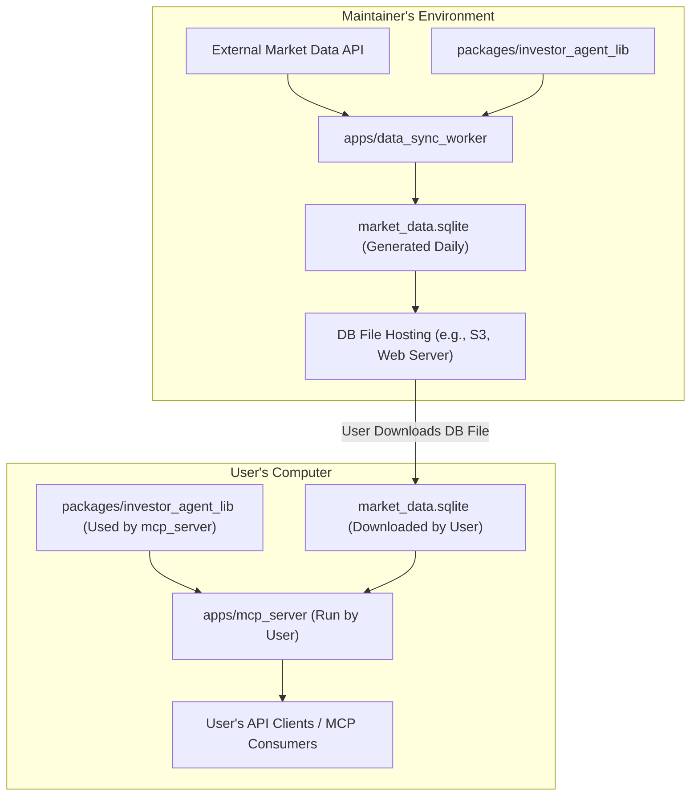

# Monorepo Architecture Plan for finance-tools-mcp

## 1. Goal

To restructure the `finance-tools-mcp` project (formerly `invest-agent`) into a monorepo. This monorepo will house:
*   A core reusable library (`investor_agent_lib`).
*   A user-facing MCP server application (`mcp_server`).
*   An internal data synchronization worker (`data_sync_worker`) used by the project maintainer.

This structure aims to improve code sharing, simplify dependency management, and streamline the development and release process.

## 2. Proposed Monorepo Directory Structure

```
finance-tools-mcp/
├── pyproject.toml         # Root project configuration for uv, Hatchling
├── uv.lock
├── README.md              # Updated project README with user instructions
├── LICENSE
├── .gitignore
├── packages/              # Directory for reusable library code
│   └── investor_agent_lib/ # Core library (financial calcs, yfinance tools, etc.)
│       ├── __init__.py
│       ├── yfinance_tools.py
│       ├── calc_basic_statistics.py
│       └── ...            # Other modules from the current src/investor_agent/
├── apps/                  # Directory for runnable applications
│   ├── mcp_server/        # User-facing MCP server application
│   │   ├── __init__.py
│   │   ├── main.py        # Entry point (e.g., FastAPI app object)
│   │   ├── cli.py         # CLI handler for starting server, parsing args (e.g., DB path)
│   │   └── ...            # Other server-specific configs or files
│   └── data_sync_worker/  # Internal data synchronization worker
│       ├── __init__.py
│       ├── main.py        # Main script for the sync logic
│       ├── cli.py         # CLI handler for triggering the sync
│       └── ...            # (e.g., scheduling logic if not using system cron)
├── data/                  # (Potentially .gitignored) For locally generated DB by the worker
│   └── market_data.sqlite # The SQLite database
└── reports/               # Existing reports directory
```

## 3. Component Roles & User Workflow

*   **`packages/investor_agent_lib`**: The core shared library containing all business logic, financial calculations, data fetching utilities (e.g., from Yahoo Finance via `yfinance_tools.py`, `calc_basic_statistics.py`).
*   **`apps/data_sync_worker`**:
    *   An application run internally by the project maintainer.
    *   Uses `investor_agent_lib` to fetch market data daily.
    *   Processes and stores this data into an SQLite database (`market_data.sqlite`).
*   **`market_data.sqlite` Hosting**: The maintainer makes the daily-generated `market_data.sqlite` file available for users to download (e.g., via cloud storage, a simple web server).
*   **`apps/mcp_server`**:
    *   The application end-users will run.
    *   Users download the `finance-tools-mcp` package from PyPI.
    *   Users download the `market_data.sqlite` file provided by the maintainer.
    *   Users run `mcp_server` (e.g., via a CLI command like `mcp_server_cli --db-path /path/to/their/market_data.sqlite`), which uses the downloaded SQLite database to serve data.

### Workflow Diagram:



## 4. Dependency Management (`pyproject.toml`)

*   **Main Dependencies (`[project.dependencies]`):**
    *   Will include all dependencies required for `packages/investor_agent_lib` to function.
    *   Will also include all essential runtime dependencies for `apps/mcp_server` (e.g., `fastapi`, `uvicorn`, `httpx`, `lxml`, `mcp[cli]`, `yfinance`, `pandas`, etc., based on the current `pyproject.toml` but reviewed for direct `mcp_server` needs).
*   **Optional Dependencies (`[project.optional-dependencies]`):**
    *   `data-sync-worker`: Will list dependencies *exclusively* needed by `apps/data_sync_worker` (e.g., `apscheduler` if used, cloud SDKs like `boto3` if used for uploading the DB).
    *   `dev`: For development tools (e.g., `pytest`, `ruff`).
*   **User Installation:** A simple `pip install finance-tools-mcp` will provide users with a working `mcp_server` and its necessary dependencies. The `data_sync_worker` code will be present but its specific dependencies will not be installed.
*   **Maintainer Installation:** The maintainer will install with extras like `uv pip install .[data-sync-worker,dev]`.

## 5. Packaging & Distribution (PyPI)

*   A single Python package named `finance-tools-mcp` (or as per current `pyproject.toml`) will be built and released to PyPI.
*   This package will contain the code for all components: `packages/investor_agent_lib`, `apps/mcp_server`, and `apps/data_sync_worker`.
*   The build system (Hatchling) will be configured via `[tool.hatch.build.targets.wheel]` in `pyproject.toml` to correctly locate and include these components. The `packages` directive will be updated (e.g., `packages = ["packages/investor_agent_lib", "apps/mcp_server", "apps/data_sync_worker"]`).

## 6. Script Entry Points (`pyproject.toml`)

The `[project.scripts]` section will be updated:
*   **User-facing `mcp_server`:**
    `mcp_server_cli = "apps.mcp_server.cli:main"` (or similar, assuming `apps/mcp_server/cli.py` has a `main` function that handles argument parsing for DB path and starts the server).
*   **Internal `data_sync_worker`:**
    `data_sync_worker_cli = "apps.data_sync_worker.cli:main"` (or similar, for the maintainer to trigger the data sync).
*   The existing `finance-tools-mcp = "src.investor_agent.server:main"` will be replaced or adapted. The `test` script will also be updated if its path changes.

## 7. README.md Update

The main `README.md` file will be updated to:
*   Explain the new workflow for users.
*   Provide instructions on how to install `finance-tools-mcp`.
*   Clearly state where to download the daily `market_data.sqlite` file.
*   Show how to run the `mcp_server_cli`, including how to specify the path to their downloaded database file.

This plan provides a comprehensive approach to restructuring the project for better maintainability, clear separation of concerns, and an improved user experience.