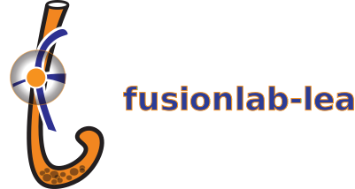

<p align="center">
  
</p>

-----------------------------------------------------

<h1 align="center">Igniting Next-Generation Fusion Models</h1>

<p align="center"><em>🔥🧪 A Modular Library for Temporal Fusion Transformer (TFT) Variants &amp; Beyond</em></p>


[](https://fusion-lab.readthedocs.io/en/latest/?badge=latest)

[](https://www.python.org/)


*Extend, experiment, and fuse time-series predictions with state-of-the-art architectures.*

---

<!-- [](https://github.com/earthai-tech/fusionlab/actions) -->

**FusionLab** provides a flexible and extensible framework in Python
for working with advanced time-series forecasting models. It focuses
on the **Temporal Fusion Transformer (TFT)** architecture and its
powerful extensions like the **Extreme Temporal Fusion Transformer (XTFT)**,
offering reusable components and pre-configured models.

Whether you're a researcher exploring novel architectures or a
practitioner building robust forecasting systems, FusionLab provides
tools built on top of **TensorFlow/Keras** to accelerate your work.

---

## ✨ Key Features

### 🔧 **Modular Architecture**
- **Reusable Neural Blocks** for custom model building:
  - Gated Residual Networks (GRNs)
  - Variable Selection Networks (VSNs)
  - Specialized Attention Layers (Temporal, Cross, Hierarchical, Memory-Augmented)
  - Multi-Scale LSTMs, Fusion Mechanisms
  - Learned Normalization & Positional Encoding

### 🧠 **Implemented Architectures**
- `TemporalFusionTransformer` – Standard TFT model
- `DummyTFT` – Point forecast variant with structured inputs
- `XTFT` – *Extreme TFT* with advanced attention and anomaly tools
- `SuperXTFT` – Experimental, VSN-enhanced 

### 🚨 **Anomaly Detection**
- Integrated within `XTFT`
- Based on features or predictions
- Supports loss weighting and anomaly-aware learning

### 🛠️ **Utility Functions**
- Time series tools: `ts_utils`, `create_sequences`, `reshape_xtft_data`
- Forecast prep and visualization: `prepare_spatial_future_data`, `generate_forecast`, `visualize_forecasts`
- Hyperparameter tuning: `forecast_tuner` (via Keras Tuner)

### ⚙️ **Framework**
- Built on **TensorFlow/Keras**
- **Planned support** for PyTorch and JAX in future updates

---

## 🚀 Getting Started

### Installation

1.  **Prerequisites:**
    * Python 3.9+
    * TensorFlow 2.x (See [TensorFlow Installation Guide](https://www.tensorflow.org/install))

2.  **Install from PyPI (Recommended):**
    ```bash
    pip install fusionlab-learn
    ```
    *(TensorFlow might need separate installation depending on your system)*

3.  **Install from Source (for Development):**
    ```bash

    git clone [https://github.com/earthai-tech/fusionlab-learn.git](https://github.com/earthai-tech/fusionlab-learn.git)
    cd fusionlab-learn

    pip install -e .
    # Optional: Install dev dependencies
    # pip install -e .[dev]
    ```

### Quick Example

```python
import numpy as np
import tensorflow as tf
from fusionlab.nn import TemporalFusionTransformer # Or XTFT etc.

# --- 1. Prepare Dummy Data ---
# (Replace with your actual preprocessed & sequenced data)
B, T, D_dyn = 16, 10, 3  # Batch, TimeSteps, DynamicFeatures
D_stat = 2              # StaticFeatures
D_fut = 1               # FutureFeatures
H = 5                   # Forecast Horizon

# Model expects list: [Static, Dynamic, Future] (if available)
dummy_static = np.random.rand(B, D_stat).astype(np.float32)
dummy_dynamic = np.random.rand(B, T, D_dyn).astype(np.float32)
dummy_future = np.random.rand(B, T + H, D_fut).astype(np.float32) # Needs horizon length
dummy_target = np.random.rand(B, H, 1).astype(np.float32) # Point forecast

# Prepare inputs list (adjust if not using all input types)
# Note: Real data prep involves tools like reshape_xtft_data
model_inputs = [dummy_static, dummy_dynamic, dummy_future]

# --- 2. Instantiate Model ---
# (Using simple TFT for this example)
model = TemporalFusionTransformer(
    static_input_dim=D_stat,
    dynamic_input_dim=D_dyn,
    future_input_dim=D_fut,
    forecast_horizon=H,
    hidden_units=16, # Smaller units for quick example
    num_heads=2
    # quantiles=None # for point forecast (default)
)

# --- 3. Compile & Train ---
model.compile(optimizer='adam', loss='mse')
print("Training simple model...")
model.fit(model_inputs, dummy_target, epochs=2, batch_size=4, verbose=0)
print("Training finished.")

# --- 4. Predict ---
# (Use appropriately prepared inputs for prediction)
# For simplicity, predict on same inputs (not recommended practice)
print("Making predictions...")
predictions = model.predict(model_inputs)
print("Prediction shape:", predictions.shape)
# Expected: (16, 5, 1) -> (Batch, Horizon, NumOutputs)
````

*(See the* [*Quickstart Guide*](https://fusion-lab.readthedocs.io/en/latest/quickstart.html) *for a more detailed walkthrough.)*

-----

## 📚 Documentation

For detailed usage, tutorials, API reference, and explanations of the
underlying concepts, please see the full documentation:

**[Read the Documentation](https://fusion-lab.readthedocs.io/)**

-----


## 📄 License

This project is licensed under the **BSD-3-Clause**. See the
[LICENSE](https://github.com/earthai-tech/fusionlab-learn/blob/main/LICENSE) file for details.

----

## 🤝 Contributing

We welcome contributions\! Whether it's adding new features, fixing bugs,
or improving documentation, your help is appreciated. Please see our
[Contribution Guidelines](https://fusion-lab.readthedocs.io/en/latest/contributing.html) for more details on how to get
started.

-----

## 📞 Contact & Support

  * **Bug Reports & Feature Requests:** The best place to report issues,
    ask questions about usage, or request new features is the
    [**GitHub Issues**](https://github.com/earthai-tech/fusionlab-learn/issues) page for the project.

  * **Developer Contact:** For direct inquiries related to the project's
    origins or specific collaborations, you can reach the author:

      * **Name:** Laurent Kouadio
      * 📧 **Email:** [etanoyau@gmail.com](mailto:etanoyau@gmail.com)
      * 💼 **LinkedIn:** [linkedin.com/in/laurent-kouadio-483b2baa](https://linkedin.com/in/laurent-kouadio-483b2baa)
      * 🆔 **ORCID:** [0000-0001-7259-7254](https://orcid.org/0000-0001-7259-7254)
