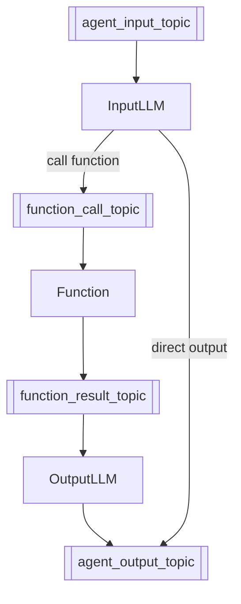
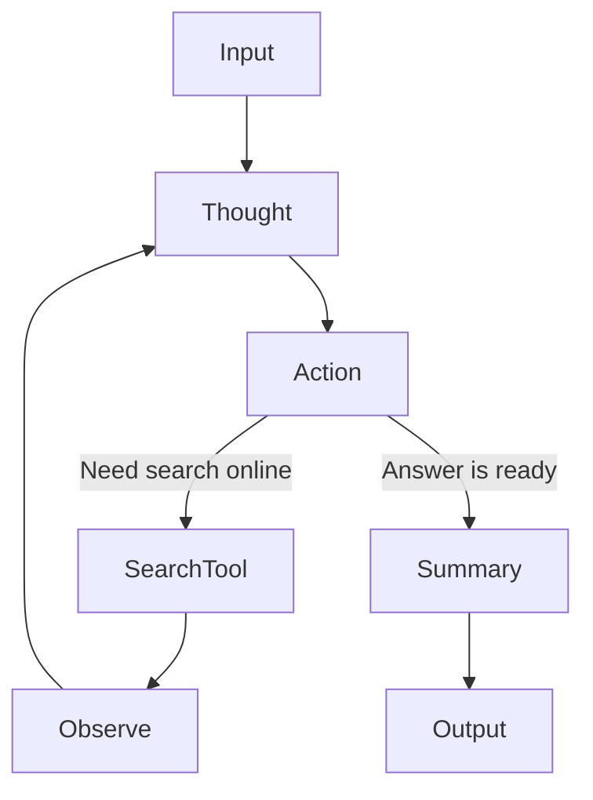
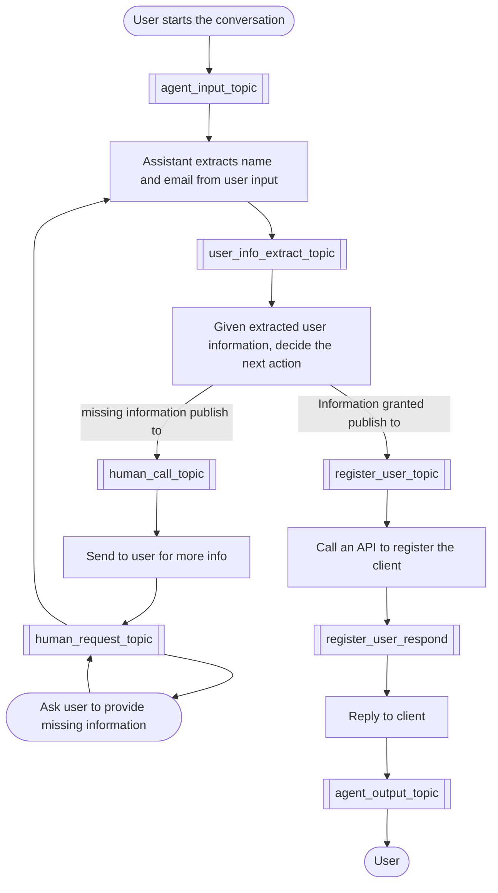

<p align="center">
  <picture>
    <source srcset="/assets/graphite_logo_light.png" media="(prefers-color-scheme: dark)">
    
  </picture>
</p>

## Introduction

Graphite is a flexible, event-driven framework for building AI agents using modular, composable workflows. Graphite helps you easily build AI agents with:

1. **Observability**  
   Complex AI solutions involve multiple steps, data sources, and models. Graphite’s event-driven architecture, logging, and tracing make it possible to pinpoint bottlenecks or errors in real time, ensuring that each component’s behavior is transparent and measurable.

2. **Idempotency**  
   Asynchronous workflows often require retries when partial failures occur or network conditions fluctuate. Graphite’s design emphasizes idempotent operations, preventing pub/sub data duplication or corruption when calls must be repeated.

3. **Auditability**  
   By treating events as the single source of truth, Graphite automatically logs every state change and decision path. This level of detailed recordkeeping is indispensable for users working in regulated sectors or who need full traceability for debugging and compliance.

4. **Restorability**  
   Long-running AI tasks risk substantial rework if they fail mid-execution. In Graphite, checkpoints and event-based playback enable workflows to resume from the precise point of interruption, minimizing downtime and maximizing resource efficiency ([Example](/examples/react_assistant/react_assistant_recovery_example.py)).

Graphite is based on:

- **Event-driven Architecture**: Components communicate through events, making workflows easy to trace, debug, and extend.
- **Modular Design**: Independently developed components simplify building, testing, and deployment.

Key benefits include:

- Effortless workflow customization for AI agents
- Clear visibility into agent behavior via event sourcing
- Reliable fault recovery and state restoration
- Scalable, stateless architecture
- End-to-end auditability with persistent event tracking
- Enables both online and offline data processing by capturing all events in an event store — users can build memory, knowledge bases, analytics, or fine-tuning pipelines on top of it

Graphite is ideal for building robust and transparent AI agent, seamlessly scaling from proof of concept to enterprise deployment

## Core Components

Graphite is structured into three conceptual layers — *Assistants*, *Nodes*, and *Tools* — coordinated through a lightweight, Pub/Sub *workflow* orchestration mechanism:

- **Assistants**: High-level orchestration layer that manages AI agent workflows and user interactions. Assistants handle the complete lifecycle of requests, from initial input to final response.
- **Nodes**: A node is a discrete component in a graph-based agent system that operates under an event-driven model. Its primary role is to represent its position within a workflow graph, manage event subscriptions, and designate topics for publishing.
- **Tools**:  In our platform, tools represent the execution components within a workflow. A Tool is essentially a function designed to transform input data into output based on specified rules or logic.
- **Workflow**: Orchestrates interactions among nodes using a Pub/Sub pattern with in-memory message queuing.


Additionally, Graphite offers modules that support essential architectural patterns such as *Event Sourcing*, the *Command Pattern*, and *Pub/Sub* communication, along with multiple layers to manage different communication life cycles:

- **Event**: Core to Graphite’s event-driven architecture. Events represent every state change, stored in a durable event store, serving as the single source of truth for downstream processing, auditing, workflow restoration, and more.
- **Topic**: Implements lightweight FIFO message queuing, essential for Pub/Sub interactions.
- **Command**: Implements the Command pattern, clearly separating request initiators from executors through defined Command objects and handlers. Commands carry all necessary context, allowing nodes to invoke tools independently and cleanly.
- **Decorators**: Automatically capture execution details (inputs, outputs, and errors) as events without altering core business logic, facilitating auditability and traceability.
- **Execution Context**: Manages identifiers across message life cycles:
  - `conversation_id`: Manages conversations, which may include multiple executions.
  - `assistant_request_id`: Tracks requests at the assistant level, facilitating complex multi-node workflows.
  - `execution_id`: Handles individual user requests, potentially involving multiple assistants in complex scenarios.
  - `user_id`: Identifies individual users, supporting multiple conversations per user.

For more details, visit the Graphite [documentation](/Document.md).

## Getting Started

Install Graphite:

```bash
pip install grafi
```

While Graphite maintains a lightweight core framework, we've developed several pre-built [examples](/examples/) that demonstrate some simple assistants for various use cases. These examples serve as both practical implementations and inspiration for your own custom solutions.

### Run a Simple Workflow with Function calling

One of the simplest of our pre-built workflows is [`SimpleFunctionCallAssistant`](/examples/function_call_assistant/simple_function_call_assistant.py) - given the input, LLM will decide either run a function, or directly response to the user. The workflow looks like this:



Here is an example of using this assistant with [Tavily](https://docs.tavily.com/welcome) search as *function tool*. The example code is [simple_function_call_assistant_tavily_example.py](/examples/function_call_assistant/simple_function_call_assistant_tavily_example.py)

```py
# file name: simple_function_call_assistant.py
import uuid

from .simple_function_call_assistant import (
    SimpleFunctionCallAssistant,
)
from grafi.common.models.execution_context import ExecutionContext
from grafi.common.models.message import Message
from grafi.tools.function_calls.impl.tavily_tool import TavilyTool

api_key = "<YOUR_OPENAI_API_KEY>"
tavily_key = "<YOUR_TAVILY_API_KEY>"

execution_context = ExecutionContext(
    conversation_id="conversation_id",
    execution_id=uuid.uuid4().hex,
    assistant_request_id=uuid.uuid4().hex,
)

assistant = (
    SimpleFunctionCallAssistant.Builder()
        .name("SimpleFunctionCallAssistant")
        .api_key(api_key)
        .function_tool(
            TavilyTool.Builder()
                .name("TavilyTestTool")
                .api_key(tavily_key)
                .max_tokens(6000)
                .search_depth("advanced")
                .build()
        )
        .build()
)

input_data = [Message(role="user", content="Hello, who is the Prime Minister of the United Kingdom in 2025?")]

output = assistant.execute(execution_context, input_data)

print(output[0].content)
```

Keep these two files `simple_function_call_assistant.py` and `simple_function_call_assistant_tavily_example.py` in the same directory, then run the example with:

```bash
python simple_function_call_assistant_tavily_example.py
```

One of the possible output would be:

`As of 2025, the Prime Minister of the United Kingdom is Sir Keir Starmer. He took office on July 5, 2024.`

### Run an Assistant with a ReAct Workflow

The ReAct (Reasoning and Action) pattern combines reasoning and action to solve complex problems step by step. To learn more about this and other agent patterns, check out our article: [AI agents Workflow Design Patterns — An Overview](https://medium.com/binome/ai-agent-workflow-design-patterns-an-overview-cf9e1f609696).



This agent workflow can continue its “ReAct” reasoning cycle until it finds the final answer.

See the [ReAct Agent Example](/examples/react_assistant/) for a working example.

### Create Your Own Assistant

Graphite empowers you to design and deploy custom agentic workflows that address your specific business needs. The framework's modular architecture makes it straightforward to build assistants that follow your precise requirements. In this section, we'll walk through the complete process of creating, implementing, and optimizing your own assistant workflow, using Phoenix for observability.

#### 1. Design the workflow

When designing an AI-based workflow, keep in mind that large language models introduce uncertainty. It’s helpful to follow [Occam's razor principle](https://en.wikipedia.org/wiki/Occam%27s_razor), which means the simpler the workflow, the better.

Suppose you want to create a “Know Your Client (KYC)” assistant for a gym registration process, with human-in-the-loop (HITL) functionality. The user must provide their full name and email address to finish the registration workflow. And if anything is missing, the workflow pauses and asks client for more information. Clearly the real world problem would need more information, but here we just simplify it for this demo.

A modified ReAct workflow for this KYC assistant with topic could look like this:



#### 2. Build the assistant

From graph, we will need add following components:

- 5 nodes:
  - LLM Node [thought] to extract name and email from user input
  - LLM Node [action] to create action given extracted information
  - Function Tool Node [human-in-the-loop] to ask user for missing information if any
  - Function Tool Node [register] to register the client
  - LLM Node [summary] to draft the final respond to user
- 7 topics:
  - agent input topic (framework provided)
  - user info extract topic
  - human call topic
  - human in the loop topic (framework provided)
  - register user topic topic
  - register user respond topic
  - agent output topic (framework provided)

We use build in `Builder` to create this workflow in assistant. Here is the [workflow constructs](/examples/hith_assistant/kyc_assistant.py)

#### 3. Run the assistant

Let's create a python script with system prompts and command input.

```python
import json
import uuid

from kyc_assistant import KycAssistant
from grafi.common.decorators.llm_function import llm_function
from grafi.common.models.execution_context import ExecutionContext
from grafi.common.models.message import Message
from grafi.tools.function_calls.function_tool import FunctionCallTool


class ClientInfo(FunctionCallTool):

    @llm_function
    def request_client_information(self, question_description: str):
        """
        Requests client input for personal information based on a given question description.
        """
        return json.dumps({"question_description": question_description})


class RegisterClient(FunctionCallTool):

    @llm_function
    def register_client(self, name: str, email: str):
        """
        Registers a user based on their name and email.
        """
        return f"User {name}, email {email} has been registered."


user_info_extract_system_message = """
"You are a strict validator designed to check whether a given input contains a user's full name and email address. Your task is to analyze the input and determine if both a full name (first and last name) and a valid email address are present.

### Validation Criteria:
- **Full Name**: The input should contain at least two words that resemble a first and last name. Ignore common placeholders (e.g., 'John Doe').
- **Email Address**: The input should include a valid email format (e.g., example@domain.com).
- **Case Insensitivity**: Email validation should be case insensitive.
- **Accuracy**: Avoid false positives by ensuring random text, usernames, or partial names don’t trigger validation.
- **Output**: Respond with Valid if both a full name and an email are present, otherwise respond with Invalid. Optionally, provide a reason why the input is invalid.

### Example Responses:
- **Input**: "John Smith, john.smith@email.com" → **Output**: "Valid"
- **Input**: "john.smith@email.com" → **Output**: "Invalid - Full name is missing"
- **Input**: "John" → **Output**: "Invalid - Full name and email are missing"

Strictly follow these validation rules and do not assume missing details."
"""


def get_execution_context() -> ExecutionContext:
    return ExecutionContext(
        conversation_id="conversation_id",
        execution_id=uuid.uuid4().hex,
        assistant_request_id=uuid.uuid4().hex,
    )


def test_kyc_assistant():
    execution_context = get_execution_context()

    assistant = (
        KycAssistant.Builder()
        .name("KycAssistant")
        .api_key(
            "YOUR_OPENAI_API_KEY"
        )
        .user_info_extract_system_message(user_info_extract_system_message)
        .action_llm_system_message(
            "Select the most appropriate tool based on the request."
        )
        .summary_llm_system_message(
            "Response to user with result of registering. You must include 'registered' in the response if succeed."
        )
        .hitl_request(ClientInfo(name="request_human_information"))
        .register_request(RegisterClient(name="register_client"))
        .build()
    )

    while True:
        # Initial User Input
        user_input = input("User: ")
        input_data = [Message(role="user", content=user_input)]

        output = assistant.execute(execution_context, input_data)

        responses = []
        for message in output:
            try:
                content_json = json.loads(message.content)
                responses.append(content_json["question_description"])
            except json.JSONDecodeError:
                responses.append(message.content)

        respond_to_user = " and ".join(responses)
        print("Assistant:", respond_to_user)

        if "registered" in output[0].content:
            break


if __name__ == "__main__":
    test_kyc_assistant()
```

#### 4. Test, Observe, Debug, and Improve

Graphite uses [OpenTelemetry](https://opentelemetry.io/) and Arize's [OpenInference](https://docs.arize.com/phoenix/reference/open-inference) to trace and observe the assistant behavior.

To capture the traces locally, we can start [phoenix](https://phoenix.arize.com/) locally.

```bash
phoenix serve
```

Here is an example of the conversation between user and assistant

```text
> User: Hi, I'd like to sign up for your gym. Could you help me with the process?
> Assistant: Please provide your full name and email address to sign up for the gym.
> User: my name is Craig Li, and here is my email: craig@example.com
> Assistant: Congratulations, Craig! You are now registered at our gym. If you have any questions or need assistance, feel free to ask!
```

Looks good. But if you push the boundary of the tests, you will hit the error real quick. Like this

```text
> User: Hi, how are you today?
```

An error occurs, and when we debug with Phoenix, we can pinpoint its exact location:


The issue originates from the Action LLM. Given the input, it should select the appropriate tool, but instead, it generates a plain string response.

To fix this, we can provide clear instructions: if the user asks a question unrelated to gym registration, the LLM should use the request_client_information tool to respond politely and ask if they need assistance with gym registration.

so let's update action LLM system prompt

```python
.action_llm_system_message(
            "Select the most appropriate tool based on the request. if the user asks a question unrelated to gym registration, the LLM should use the `request_client_information` tool to respond politely and ask if they need assistance with gym registration."
        )
```

and try again

```text
> User: Hi, how are you today?
> Assistant: I'm here to assist you with gym registration. Could you please provide your full name and email?
```

You've now built an agent that can assist with gym registrations! You can find the assistant's code at this [link](/examples/hith_assistant/kyc_assistant.py) and an example is available [here](/examples/hith_assistant/kyc_assistant_example.py).

## Conventional Rules

While the platform is designed for maximum flexibility, certain conventions guide how components interact. These rules ensure consistency, maintainability, and ease of integration across a range of use cases—especially when handling user requests, generating outputs, and enabling powerful LLM features.

### Reserved Topics

#### Agent Input Topic

- **Triggering the Workflow**: All new assistant requests with a fresh `assistant_request_id` begin by publishing the user input to the **agent_input_topic**.
- **Downstream Consumption**: Nodes that need to process initial requests consume from this topic, triggering the rest of the workflow.

#### Agent Output Topics

- **Final Responses**: All output events route to **agent_output_topic**, which the Assistant consumes to return data to the user or caller.
- **Single Consumer**: Only the Assistant should subscribe to this topic, avoiding conflicting read operations.

#### Agent Stream Output Topics

- **Final Responses**: All stream output events route to **agent_stream_output_topic**, which the Assistant consumes to return stream data to the user or caller.
- **Single Consumer**: Only the Assistant should subscribe to this topic, avoiding conflicting read operations.

#### Human Request Topic

- **Human in the Loop**: Used when user intervention is required; the system posts an `OutputTopicEvent` here, which the Assistant can consume to display prompts or questions.
- **User Response**: When the user replies, `append_user_input()` posts a `PublishToTopicEvent` (the user’s answer). This message is then read by downstream nodes.
- **Assistant Role**: The Assistant only consumes `OutputTopicEvent` objects, while nodes consume both the question (`OutputTopicEvent`) and the final user reply (`PublishToTopicEvent`).

**Rationale**: Structuring input and output channels ensures clarity, preventing multiple consumers from inadvertently processing final outputs and providing a clear path for user-driven requests.

### OutputTopicEvent

- **Dedicated for Assistant**: If a newly received event is an `OutputTopicEvent`, the workflow’s `on_event()` skips subscription checks, since only the Assistant should consume it.
- **Exclusive Destination**: `OutputTopicEvent` can only be published to **agent_output_topic** or **human_request_topic**, ensuring a clear boundary for user-facing outputs.

**Rationale**: Limiting `OutputTopicEvent` usage avoids confusion over who should read final results, reinforcing the principle of single responsibility for returning data to the user.

### Stream Usage

- **Output Only**: Streaming is only relevant for final outputs, letting the LLM emit partial content in real time.
- **Asynchronous Requirement**: Nodes, workflows, and assistants do not support synchronous streaming. Though the LLM tool may have a synchronous stream function, the system’s architecture uses async flows.
- **Usage Pattern**: For practical examples, see `stream_assistant`; it shows how to handle partial token streams differently from normal async generators.

**Rationale**: Maintaining an async-only stream approach for nodes, workflows, and assistants simplifies concurrency, reduces potential race conditions, and provides a consistent development experience.

### LLMFunctionCall

- **Agent-Like Interactions**: By calling functions, the LLM can access additional tools—making the system more agent-like.
- **Separation of Concerns**: The LLM node focuses on generating or interpreting responses, while a separate `LLMFunctionCall` node invokes tool logic.
- **Upstream Connections**: Each `LLMFunctionCall` must directly connect to one or more LLM node via topic(s) when want to enable upstream LLM node tool calling feature.
- **Downstream Connections**: Each LLM node can directly connect to one or more `LLMFunctionCall` nodes. If the workflow builder detects an `LLMFunctionCall` node downstream, it attaches the relevant function specs to the LLM node’s final output message, letting the LLM know which tools are available.

**Rationale**: Decoupling LLM operations from tool invocation keeps the graph modular, fosters reusability, and ensures that an LLM can dynamically discover and call specialized tools within a single workflow.

## Why Graphite?

You might ask why we created another agent framework. The short answer is: we see a gap when it comes to solving real-world problems with AI tools. Many generic agents — like a typical ReAct or CoT agent — aren’t enough for mission-critical tasks where mistakes can be costly.

For a typical business problem (e.g., purchasing a property), there’s usually a well-defined procedure — or a workflow — guided by domain expertise. This process might include know your client, searching online, analyzing data, or summarizing findings, all of which can be orchestrated in a controlled manner.

Graphite simplifies constructing these AI powered workflows, much like building with LEGO bricks. It offers businesses a straightforward way to automate complex tasks while integrating seamlessly into existing software development life cycles.

## Contributing

We warmly welcome contributions to enhance and expand our project. Contributions can take many forms, including but not limited to:

### Reporting and Fixing Bugs

- Clearly report issues by providing detailed reproduction steps, expected outcomes, and actual results.
- Participate in investigating, diagnosing, and fixing bugs to enhance the platform's stability.

### Suggesting Improvements and Designs

- Propose enhancements or new design patterns aimed at improving usability, performance, or maintainability.
- Engage actively with the community through discussions and pull requests to collaboratively shape optimal solutions.

### Creating New Assistants and Tools

- Develop new assistants or tools to broaden the functionality and versatility of the platform.
- Adhere to existing interfaces and design patterns to maintain compatibility and consistency.

We greatly appreciate your insights and contributions!

## License

Mozilla Public License Version 2.0
