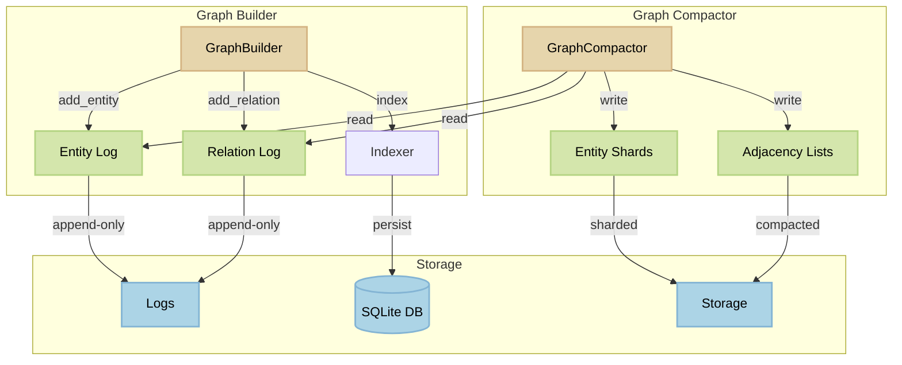

<p align="center">
  
</p>

This library builds a graph (entities and relations) incrementally, and stores them in append-only logs. Now supports optional community tagging.

[](https://pypi.org/project/graph_builder)
[](https://github.com/beanone/graph_builder/blob/main/LICENSE)
[](https://github.com/beanone/graph_builder/actions?query=workflow%3Atests)
[](https://codecov.io/gh/beanone/graph_builder)
[](https://github.com/astral-sh/ruff)
[](https://pypi.org/project/graph_builder)


## Table of Contents

- [Architecture](#architecture)
  - [Core Components](#core-components)
  - [Architecture Diagram](#architecture-diagram)
  - [Storage Structure](#storage-structure)
  - [Data Model](#data-model)
- [Usage](#usage)
  - [Basic Usage](#basic-usage)
  - [Compaction](#compaction)
- [Features](#features)
- [Installation](#installation)
- [Requirements](#requirements)
- [License](#license)


## Architecture

The library follows a modular architecture with the following components:

### Core Components

1. **GraphBuilder**
   - Main class for building and managing the graph.
   - Supports incremental entity and relation updates.
   - Maintains append-only logs for all changes.
   - Integrates with configurable indexers for efficient lookups.

2. **GraphCompactor**
   - Processes the append-only logs to create compacted representations.
   - Merges entity updates based on timestamps.
   - Builds adjacency lists for efficient graph traversal.
   - Supports sharding for large datasets.

3. **Indexers**
   - Abstract interface for entity indexing
   - Implementations:
     - `SQLiteIndexer`: Persistent storage using SQLite
     - `MemoryIndexer`: In-memory storage with JSON serialization

### Architecture Diagram



### Storage Structure

```
output_dir/
├── entities/          # Compacted entity shards
├── relations/         # Relation data
├── logs/             # Append-only update logs
│   ├── entity_updates.jsonl
│   └── relation_updates.jsonl
├── adjacency/        # Compacted adjacency lists
└── index.db         # SQLite index (if using SQLiteIndexer)
```

### Data Model

- **Entities**: Nodes in the graph with properties
- **Relations**: Directed edges between entities with properties
- **Updates**: Timestamped changes to entities and relations
- **Shards**: Partitioned storage for efficient processing

## Usage

### Basic Usage

```python
from graph_builder.storage_manager import GraphBuilder
from graph_builder.config import GraphBuilderConfig

config = GraphBuilderConfig(output_dir="graph_output")
graph = GraphBuilder(config)

# Ingest entities with optional community
graph.add_entity(1, {"name": "Alice", "type": "Person", "community_id": "team_alpha"})
graph.add_entity(2, {"name": "Bob", "type": "Person", "community_id": "team_alpha"})

# Create a relation
graph.add_relation(100, 1, 2, {"type": "FRIENDS_WITH"})

graph.finalize()
```

### Compaction

```python
from graph_builder import GraphCompactor

# Compact the graph data
compactor = GraphCompactor(base_dir="graph_output")
compactor.compact_entities()  # Merge entity updates
compactor.build_adjacency()   # Build adjacency lists
```

## Features

- **Incremental Updates**: Support for timestamped updates to entities and relations
- **Efficient Storage**: Append-only logs with periodic compaction
- **Flexible Indexing**: Choose between SQLite or in-memory indexing
- **Sharding**: Support for large datasets through sharding
- **Timestamp Tracking**: All changes are tracked with UTC timestamps

## Installation

```bash
pip install graph-builder
```

## Requirements

- Python 3.12+
- SQLite3 (for SQLiteIndexer)

## License

MIT License
