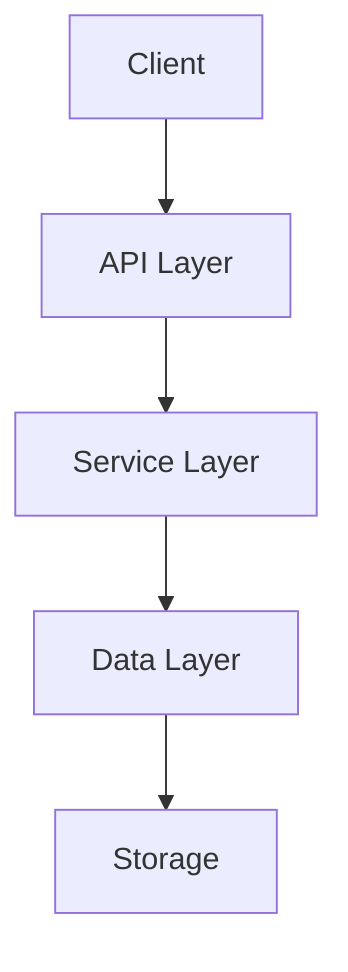

# Guidance

**Purpose**\
To document your in-depth research findings about new technologies, architecture
approaches, or library evaluations. Provides evidence-based recommendations for
the Architect to rely on.

**When to Use**

- Whenever the Orchestrator requests a deep dive on a specific domain or
  problem.
- Before or during the design phase.

**Best Practices**

- Include comparisons (tables of pros/cons, cost, performance).
- Cite sources.
- Focus on actionable insights relevant to khive’s constraints.

---

# Research Report: [Component/Technology Name]

## Executive Summary

_A concise (2-3 paragraph) summary of key findings and recommendations,
highlighting the main takeaways._

## 1. Introduction

### 1.1 Research Objective

_What question or challenge does this research address?_

### 1.2 Methodology

_How you approached the research, resources used, criteria for evaluating
solutions._

### 1.3 Context

_Background on how this topic fits into the khive architecture._

## 2. Technical Analysis

### 2.1 Technology Landscape

_Overview of relevant libraries, frameworks, or patterns in this domain._

### 2.2 Comparative Analysis

| Factor            | Option A   | Option B   | Option C   |
| ----------------- | ---------- | ---------- | ---------- |
| Performance       | ⭐⭐⭐⭐⭐ | ⭐⭐⭐     | ⭐⭐⭐⭐   |
| Security          | ⭐⭐⭐⭐   | ⭐⭐⭐⭐⭐ | ⭐⭐⭐     |
| Maintainability   | ⭐⭐⭐⭐   | ⭐⭐⭐     | ⭐⭐⭐⭐⭐ |
| Community/Support | ⭐⭐⭐⭐⭐ | ⭐⭐⭐     | ⭐⭐       |
| Integration Ease  | ⭐⭐⭐     | ⭐⭐⭐⭐   | ⭐⭐⭐⭐⭐ |
| Cost              | ⭐⭐       | ⭐⭐⭐⭐⭐ | ⭐⭐⭐     |

_Discuss pros/cons for each option thoroughly._

### 2.3 Performance Considerations

_Identified bottlenecks or best practices for speed._

### 2.4 Security Implications

_Threats, vulnerabilities, or secure configuration steps._

### 2.5 Scalability Assessment

_How each solution scales with data volume or concurrency._

## 3. Implementation Patterns

### 3.1 Architecture Patterns



### 3.2 Code Examples

```python
# Example usage snippet
class VectorStoreService:
    def __init__(self, config: ServiceConfig):
        self.openai_client = OpenAI(api_key=config.openai_key)

    async def index_document(self, doc: Document):
        # Implementation detail...
```

### 3.3 Error Handling Strategy

_Key considerations for error detection, transformation, rethrowing, etc._

### 3.4 Testing Approach

_Suggest test harnesses or frameworks. Mention security/performance testing
strategies._

## 4. Integration Considerations

### 4.1 Dependencies

_External libraries or services needed._

### 4.2 Configuration Requirements

_Environment variables or secrets needed._

### 4.3 Interface Design

_If relevant, propose a sample interface or data model that emerges from the
research._

## 5. Recommendations

### 5.1 Recommended Approach

_Which solution or pattern do you recommend, and why?_

### 5.2 Implementation Roadmap

_If you see a phased approach, outline it here (like “Phase 1: basic
integration,” “Phase 2: advanced caching,” etc.)._

### 5.3 Risk Assessment

_Potential pitfalls or edge cases. How to mitigate them?_

### 5.4 Alternative Approaches

_If the recommended approach fails, provide fallback ideas._

## 6. References

1. [Source Name](URL) - Relevance
2. [Source Name](URL) - Relevance

## Appendices

### Appendix A: Detailed Benchmarks

_Raw data or performance logs, if any._

### Appendix B: Configuration Examples

_Sample config files or environment variables._

### Appendix C: Additional Code Samples

_More extensive code examples if needed._
