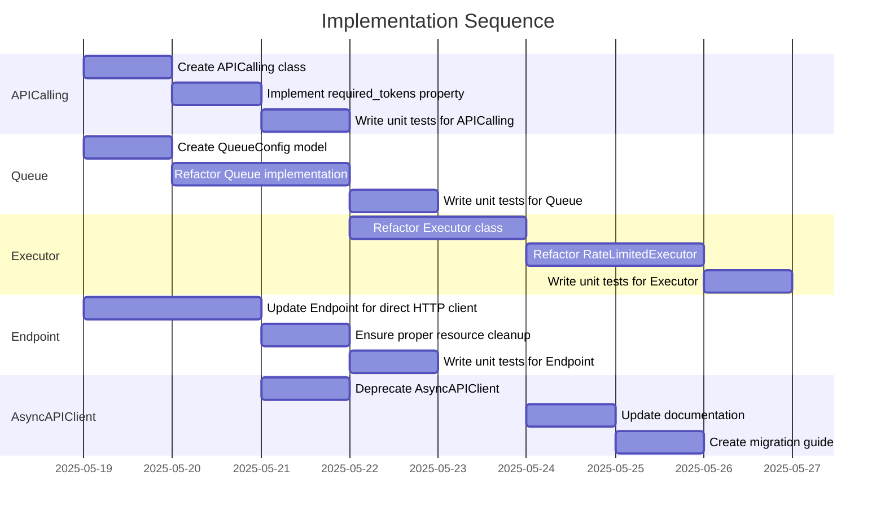

# Implementation Plan: API Client Architecture Refactor - Phase 1

## 1. Overview

### 1.1 Component Purpose

This implementation plan covers Phase 1 of the API Client Architecture Refactor
as defined in Issue #100. The refactoring aims to improve the cohesion and
clarity of the API client, executor, and queue components while introducing new
abstractions like `APICalling` and `iModel`. Phase 1 focuses on implementing the
core components needed for the new architecture.

### 1.2 Design Reference

- Technical Design Specification: [TDS-100.md](/.khive/reports/tds/TDS-100.md)
- Issue #100: API Client Architecture Refactor
- User-provided code snippets in Issue #100 comments

### 1.3 Implementation Approach

We will follow a Test-Driven Development (TDD) approach:

1. Write failing tests for each component
2. Implement the component to make tests pass
3. Refactor as needed while maintaining passing tests

The implementation will be done incrementally, focusing on one component at a
time to ensure proper integration and minimize disruption to existing
functionality.

## 2. Implementation Phases

### 2.1 Phase 1: Core Components

Phase 1 focuses on implementing the foundational components of the new
architecture:

**Key Deliverables:**

- `APICalling` Event Class implementation
- Refactored `Queue` and `QueueConfig` implementation
- Refactored `Executor` and `RateLimitedExecutor` implementation
- Updated `Endpoint` for direct HTTP client management
- Deprecation/removal of `AsyncAPIClient` or significant role reduction

**Dependencies:**

- `pydapter.protocols.event` for `Event` base class
- `pydapter.protocols.temporal` for `Temporal` base class
- Existing `khive` components: `Endpoint`, resilience patterns

**Estimated Complexity:** High

## 3. Test Strategy

### 3.1 Unit Tests

#### 3.1.1 Test Group: APICalling

| ID   | Description                                                               | Fixtures/Mocks  | Assertions                                    |
| ---- | ------------------------------------------------------------------------- | --------------- | --------------------------------------------- |
| UT-1 | Test APICalling initialization with valid parameters                      | `mock_endpoint` | Event properties match expected values        |
| UT-2 | Test APICalling invoke method calls endpoint.call with correct parameters | `mock_endpoint` | Endpoint.call called with expected parameters |
| UT-3 | Test required_tokens property and setter                                  | None            | Property returns expected value after setting |

#### 3.1.2 Test Group: Queue

| ID   | Description                                     | Fixtures/Mocks | Assertions                              |
| ---- | ----------------------------------------------- | -------------- | --------------------------------------- |
| UT-4 | Test Queue initialization with valid parameters | None           | Queue properties match expected values  |
| UT-5 | Test Queue enqueue and dequeue operations       | `mock_event`   | Event is properly enqueued and dequeued |
| UT-6 | Test Queue concurrency control                  | `mock_event`   | Concurrency limits are respected        |

#### 3.1.3 Test Group: Executor

| ID   | Description                                        | Fixtures/Mocks | Assertions                                |
| ---- | -------------------------------------------------- | -------------- | ----------------------------------------- |
| UT-7 | Test Executor initialization with valid parameters | None           | Executor properties match expected values |
| UT-8 | Test Executor append and pop operations            | `mock_event`   | Event is properly added and retrieved     |
| UT-9 | Test Executor process_event method                 | `mock_event`   | Event is properly processed               |

#### 3.1.4 Test Group: RateLimitedExecutor

| ID    | Description                                                            | Fixtures/Mocks | Assertions                                              |
| ----- | ---------------------------------------------------------------------- | -------------- | ------------------------------------------------------- |
| UT-10 | Test RateLimitedExecutor initialization with valid parameters          | None           | Executor properties match expected values               |
| UT-11 | Test RateLimitedExecutor request_permission method with token limits   | `mock_event`   | Permission granted/denied based on token availability   |
| UT-12 | Test RateLimitedExecutor request_permission method with request limits | `mock_event`   | Permission granted/denied based on request availability |

#### 3.1.5 Test Group: Endpoint

| ID    | Description                                       | Fixtures/Mocks        | Assertions                                        |
| ----- | ------------------------------------------------- | --------------------- | ------------------------------------------------- |
| UT-13 | Test Endpoint direct HTTP client management       | `mock_aiohttp_client` | Client is properly created and managed            |
| UT-14 | Test Endpoint call method with direct HTTP client | `mock_aiohttp_client` | Call is properly executed with correct parameters |
| UT-15 | Test Endpoint resource cleanup                    | `mock_aiohttp_client` | Resources are properly cleaned up                 |

### 3.2 Integration Tests

#### 3.2.1 Test Group: APICalling with Endpoint

| ID   | Description                                        | Setup                                    | Assertions                                                        |
| ---- | -------------------------------------------------- | ---------------------------------------- | ----------------------------------------------------------------- |
| IT-1 | Test APICalling integration with Endpoint          | Initialize APICalling with test Endpoint | APICalling correctly invokes Endpoint.call and processes response |
| IT-2 | Test APICalling handles Endpoint errors gracefully | Configure Endpoint to raise errors       | APICalling properly captures and reports errors                   |

#### 3.2.2 Test Group: Executor with Queue

| ID   | Description                                     | Setup                                          | Assertions                                                            |
| ---- | ----------------------------------------------- | ---------------------------------------------- | --------------------------------------------------------------------- |
| IT-3 | Test Executor integration with Queue            | Initialize Executor with test Queue            | Executor correctly enqueues and processes events                      |
| IT-4 | Test RateLimitedExecutor integration with Queue | Initialize RateLimitedExecutor with test Queue | RateLimitedExecutor correctly applies rate limits to Queue operations |

#### 3.2.3 Test Group: Endpoint HTTP Client Management

| ID   | Description                                   | Setup                                       | Assertions                                         |
| ---- | --------------------------------------------- | ------------------------------------------- | -------------------------------------------------- |
| IT-5 | Test Endpoint with real aiohttp.ClientSession | Initialize Endpoint with test configuration | Endpoint correctly manages ClientSession lifecycle |
| IT-6 | Test Endpoint with mock HTTP responses        | Configure mock HTTP responses               | Endpoint correctly processes HTTP responses        |

### 3.3 Mock and Stub Requirements

| Dependency            | Mock/Stub Type | Key Behaviors to Mock                                  |
| --------------------- | -------------- | ------------------------------------------------------ |
| Endpoint              | Mock           | call method, configuration properties                  |
| aiohttp.ClientSession | Mock           | request method, close method, context manager behavior |
| Event                 | Mock           | invoke method, execution status properties             |
| Queue                 | Mock           | enqueue, dequeue, task_done methods                    |

## 4. Implementation Tasks

### 4.1 APICalling Implementation

| ID  | Task                               | Description                                                  | Dependencies | Priority | Complexity |
| --- | ---------------------------------- | ------------------------------------------------------------ | ------------ | -------- | ---------- |
| T-1 | Create APICalling class            | Implement the APICalling event class based on pydapter.Event | None         | High     | Medium     |
| T-2 | Implement required_tokens property | Add property and setter for token requirements               | T-1          | High     | Low        |
| T-3 | Write unit tests for APICalling    | Create comprehensive tests for APICalling functionality      | T-1, T-2     | High     | Medium     |

### 4.2 Queue Refactoring

| ID  | Task                          | Description                                        | Dependencies | Priority | Complexity |
| --- | ----------------------------- | -------------------------------------------------- | ------------ | -------- | ---------- |
| T-4 | Create QueueConfig model      | Implement the QueueConfig model                    | None         | High     | Low        |
| T-5 | Refactor Queue implementation | Update Queue based on the new design               | T-4          | High     | High       |
| T-6 | Write unit tests for Queue    | Create comprehensive tests for Queue functionality | T-4, T-5     | High     | Medium     |

### 4.3 Executor Refactoring

| ID  | Task                          | Description                                           | Dependencies | Priority | Complexity |
| --- | ----------------------------- | ----------------------------------------------------- | ------------ | -------- | ---------- |
| T-7 | Refactor Executor class       | Update Executor based on the new design               | T-5          | High     | High       |
| T-8 | Refactor RateLimitedExecutor  | Update RateLimitedExecutor for the new design         | T-7          | High     | High       |
| T-9 | Write unit tests for Executor | Create comprehensive tests for Executor functionality | T-7, T-8     | High     | Medium     |

### 4.4 Endpoint Updates

| ID   | Task                                   | Description                                                   | Dependencies | Priority | Complexity |
| ---- | -------------------------------------- | ------------------------------------------------------------- | ------------ | -------- | ---------- |
| T-10 | Update Endpoint for direct HTTP client | Modify Endpoint to directly manage aiohttp.ClientSession      | None         | High     | Medium     |
| T-11 | Ensure proper resource cleanup         | Verify and enhance resource cleanup in Endpoint               | T-10         | High     | Medium     |
| T-12 | Write unit tests for Endpoint          | Create comprehensive tests for updated Endpoint functionality | T-10, T-11   | High     | Medium     |

### 4.5 AsyncAPIClient Transition

| ID   | Task                     | Description                                                         | Dependencies        | Priority | Complexity |
| ---- | ------------------------ | ------------------------------------------------------------------- | ------------------- | -------- | ---------- |
| T-13 | Deprecate AsyncAPIClient | Mark AsyncAPIClient as deprecated                                   | T-10                | Medium   | Low        |
| T-14 | Update documentation     | Update documentation to reflect the new architecture                | T-1, T-5, T-7, T-10 | Medium   | Medium     |
| T-15 | Create migration guide   | Document how to migrate from AsyncAPIClient to the new architecture | T-13, T-14          | Medium   | Medium     |

## 5. Implementation Sequence



## 6. Acceptance Criteria

### 6.1 Component Level

| ID   | Criterion                                           | Validation Method                                     |
| ---- | --------------------------------------------------- | ----------------------------------------------------- |
| AC-1 | APICalling correctly invokes Endpoint.call          | Unit test UT-2, Integration test IT-1                 |
| AC-2 | Queue properly manages event queuing and processing | Unit tests UT-4, UT-5, UT-6                           |
| AC-3 | Executor correctly processes events                 | Unit tests UT-7, UT-8, UT-9                           |
| AC-4 | RateLimitedExecutor properly applies rate limits    | Unit tests UT-10, UT-11, UT-12                        |
| AC-5 | Endpoint correctly manages HTTP client lifecycle    | Unit tests UT-13, UT-14, UT-15, Integration test IT-5 |

### 6.2 Integration Level

| ID   | Criterion                                             | Validation Method            |
| ---- | ----------------------------------------------------- | ---------------------------- |
| AC-6 | APICalling and Endpoint work together correctly       | Integration tests IT-1, IT-2 |
| AC-7 | Executor and Queue work together correctly            | Integration tests IT-3, IT-4 |
| AC-8 | Endpoint correctly manages real aiohttp.ClientSession | Integration test IT-5        |
| AC-9 | All components maintain proper resource cleanup       | Integration tests IT-5, IT-6 |

## 7. Test Implementation Plan

### 7.1 Test Implementation Sequence

1. Implement base test fixtures and mocks for Endpoint, Event, Queue
2. Implement unit tests for APICalling
3. Implement unit tests for Queue
4. Implement unit tests for Executor and RateLimitedExecutor
5. Implement unit tests for Endpoint
6. Implement integration tests for component interactions

### 7.2 Test Code Examples

#### Unit Test Example for APICalling

```python
def test_api_calling_initialization():
    # Arrange
    mock_endpoint = Mock(spec=Endpoint)
    request = {"param": "value"}

    # Act
    api_call = APICalling(
        endpoint=mock_endpoint,
        request=request,
        cache_control=True,
        requires_tokens=True
    )

    # Assert
    assert api_call.requires_tokens is True
    assert api_call.event_type == "api_calling"
    assert api_call.event_invoke_function == mock_endpoint.call
    assert api_call.event_invoke_kwargs == {
        "request": request,
        "cache_control": True
    }
```

#### Integration Test Example for APICalling with Endpoint

```python
async def test_api_calling_invokes_endpoint():
    # Arrange
    mock_response = {"result": "success"}
    mock_endpoint = Mock(spec=Endpoint)
    mock_endpoint.call = AsyncMock(return_value=mock_response)

    request = {"param": "value"}
    api_call = APICalling(
        endpoint=mock_endpoint,
        request=request
    )

    # Act
    await api_call.invoke()

    # Assert
    mock_endpoint.call.assert_called_once_with(request=request, cache_control=False)
    assert api_call.execution.status == ExecutionStatus.COMPLETED
    assert api_call.execution.result == mock_response
```

## 8. Implementation Risks and Mitigations

| Risk                                  | Impact | Likelihood | Mitigation                                                                                            |
| ------------------------------------- | ------ | ---------- | ----------------------------------------------------------------------------------------------------- |
| Breaking changes to existing services | High   | Medium     | Implement comprehensive tests, provide clear migration guide, consider adapter pattern for transition |
| Resource leaks in async code          | High   | Medium     | Implement thorough resource cleanup tests, use context managers consistently                          |
| Performance regression                | Medium | Low        | Benchmark tests comparing old and new implementations                                                 |
| Increased complexity                  | Medium | Medium     | Clear documentation, consistent patterns, comprehensive test coverage                                 |
| Race conditions in executor/queue     | High   | Medium     | Extensive concurrency testing, proper lock usage, clear ownership of shared resources                 |

## 9. Dependencies and Environment

### 9.1 External Libraries

| Library        | Version | Purpose                                 |
| -------------- | ------- | --------------------------------------- |
| aiohttp        | ^3.8.0  | HTTP client for API interactions        |
| pydantic       | ^2.0.0  | Data validation and models              |
| pydapter       | ^1.0.0  | Protocols and base classes for adapters |
| pytest         | ^7.0.0  | Testing framework                       |
| pytest-asyncio | ^0.20.0 | Async testing support                   |

### 9.2 Environment Setup

```bash
# Initialize development environment
khive init

# Run tests
uv run pytest tests/clients/test_api_call.py
uv run pytest tests/clients/test_queue.py
uv run pytest tests/clients/test_executor.py
uv run pytest tests/connections/test_endpoint.py
```

## 10. Additional Resources

### 10.1 Reference Implementation

- User-provided code snippets in Issue #100 comments
- Current implementations in `src/khive/clients/` and `src/khive/connections/`

### 10.2 Relevant Documentation

- [pydapter documentation](https://github.com/pydapter/pydapter)
- [aiohttp documentation](https://docs.aiohttp.org/)
- [asyncio documentation](https://docs.python.org/3/library/asyncio.html)

### 10.3 Design Patterns

- Event-based architecture
- Dependency injection
- Context managers for resource management
- Adapter pattern for transitioning from old to new architecture
