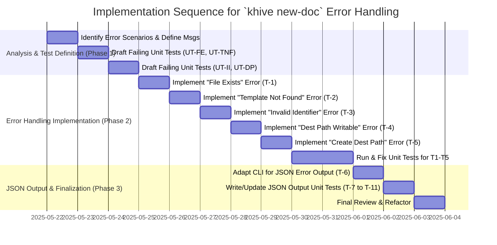

# Guidance

**Purpose** Plan out the entire coding effort before writing code. Clarify
**phases**, **tasks**, dependencies, test strategy, and acceptance criteria.

**When to Use**

- After design is approved, before actual implementation starts.

**Best Practices**

- Include TDD approach details (e.g., required test coverage).
- Provide a clear sequence of tasks.
- Reference external docs or prior designs.

---

# Implementation Plan: Enhance `khive new-doc` Error Messages (Issue #103)

## 1. Overview

### 1.1 Component Purpose

The `khive new-doc` command
([`src/khive/cli/khive_new_doc.py`](src/khive/cli/khive_new_doc.py:0)) is used
to scaffold new documentation files from predefined templates. This enhancement
aims to improve its usability by providing clearer, more informative error
messages when common issues occur.

### 1.2 Design Reference

This implementation is based on the requirements outlined in Issue #103. No
separate formal technical design specification (TDS) exists for this specific
enhancement, as it's a refinement of an existing command.

### 1.3 Implementation Approach

The approach will follow Test-Driven Development (TDD).

1. **Identify Error Scenarios:** Analyze the current logic in
   [`src/khive/cli/khive_new_doc.py`](src/khive/cli/khive_new_doc.py:0) and
   [`src/khive/commands/new_doc.py`](src/khive/commands/new_doc.py:0) to
   pinpoint potential failure points.
2. **Write Failing Tests:** For each scenario, write unit tests in
   [`tests/cli/test_khive_new_doc.py`](tests/cli/test_khive_new_doc.py:0) that
   expect specific, user-friendly error messages (for both standard and JSON
   output). These tests will initially fail.
3. **Implement Error Handling:** Modify the command's code to detect these error
   conditions and raise/return the improved error messages.
4. **Refactor (if needed):** Ensure the code remains clean and maintainable.

## 2. Implementation Phases

### 2.1 Phase 1: Error Scenario Identification & Test Definition

**Description:** Review the `khive new-doc` codebase
([`src/khive/cli/khive_new_doc.py`](src/khive/cli/khive_new_doc.py:0) and
[`src/khive/commands/new_doc.py`](src/khive/commands/new_doc.py:0)) to list all
relevant error scenarios. Define the expected error messages and JSON output
structure for each. **Key Deliverables:**

- A documented list of error scenarios.
- Drafts of new unit tests in
  [`tests/cli/test_khive_new_doc.py`](tests/cli/test_khive_new_doc.py:0) for
  each scenario (these will fail initially). **Dependencies:** Access to the
  current codebase. **Estimated Complexity:** Medium

### 2.2 Phase 2: Error Handling Implementation

**Description:** Modify
[`src/khive/cli/khive_new_doc.py`](src/khive/cli/khive_new_doc.py:0) and/or
[`src/khive/commands/new_doc.py`](src/khive/commands/new_doc.py:0) to implement
the improved error handling and messaging. This will involve adding `try-except`
blocks, conditional checks, and crafting the error strings. **Key
Deliverables:**

- Updated Python code with new error handling logic.
- Passing unit tests for all new error message scenarios. **Dependencies:**
  Phase 1 completion. **Estimated Complexity:** Medium

### 2.3 Phase 3: JSON Output Refinement & Final Testing

**Description:** Ensure that when `--json-output` is used, errors are
consistently reported with a `status: "error"` field and a descriptive `message`
field. Perform final testing of all scenarios. **Key Deliverables:**

- Verified JSON error output structure.
- All unit tests passing for both standard and JSON output. **Dependencies:**
  Phase 2 completion. **Estimated Complexity:** Low

## 3. Test Strategy

### 3.1 Unit Tests

Location: [`tests/cli/test_khive_new_doc.py`](tests/cli/test_khive_new_doc.py:0)

#### 3.1.1 Test Group: File Exists Error

| ID      | Description                                                               | Fixtures/Mocks                                      | Assertions                                                                                                           |
| ------- | ------------------------------------------------------------------------- | --------------------------------------------------- | -------------------------------------------------------------------------------------------------------------------- |
| UT-FE-1 | Test error message when output file exists and `--force` is not used.     | `runner`, pre-existing output file                  | Correct error message printed to stderr, non-zero exit code.                                                         |
| UT-FE-2 | Test JSON error output when output file exists and `--force` is not used. | `runner`, pre-existing output file, `--json-output` | JSON output contains `{"status": "error", "message": "Output file '...' already exists. Use --force to overwrite."}` |
| UT-FE-3 | Test successful overwrite when output file exists and `--force` is used.  | `runner`, pre-existing output file, `--force`       | File is overwritten, zero exit code.                                                                                 |

#### 3.1.2 Test Group: Template Not Found Error

| ID       | Description                                                              | Fixtures/Mocks                                   | Assertions                                                                                       |
| -------- | ------------------------------------------------------------------------ | ------------------------------------------------ | ------------------------------------------------------------------------------------------------ |
| UT-TNF-1 | Test error message when specified template type/name does not exist.     | `runner`, invalid template name                  | Correct error message printed to stderr (e.g., "Template 'X' not found..."), non-zero exit code. |
| UT-TNF-2 | Test JSON error output when specified template type/name does not exist. | `runner`, invalid template name, `--json-output` | JSON output contains `{"status": "error", "message": "Template 'X' not found..."}`               |

#### 3.1.3 Test Group: Invalid Identifier Error (if applicable)

_(Assuming identifiers have specific validation rules, e.g., no spaces. If not,
this group might be minimal or not needed.)_

| ID      | Description                                                | Fixtures/Mocks                                       | Assertions                                                                                       |
| ------- | ---------------------------------------------------------- | ---------------------------------------------------- | ------------------------------------------------------------------------------------------------ |
| UT-II-1 | Test error message for an invalid document identifier.     | `runner`, invalid identifier string                  | Correct error message printed to stderr (e.g., "Invalid identifier 'X'..."), non-zero exit code. |
| UT-II-2 | Test JSON error output for an invalid document identifier. | `runner`, invalid identifier string, `--json-output` | JSON output contains `{"status": "error", "message": "Invalid identifier 'X'..."}`               |

#### 3.1.4 Test Group: Destination Path Issues

| ID      | Description                                                                     | Fixtures/Mocks                                        | Assertions                                                                                                   |
| ------- | ------------------------------------------------------------------------------- | ----------------------------------------------------- | ------------------------------------------------------------------------------------------------------------ |
| UT-DP-1 | Test error message when `--dest` path is not writable (e.g., permissions).      | `runner`, non-writable `--dest` path (mocked)         | Correct error message printed to stderr (e.g., "Destination path 'X' is not writable."), non-zero exit code. |
| UT-DP-2 | Test JSON error output when `--dest` path is not writable.                      | `runner`, non-writable `--dest` path, `--json-output` | JSON output contains `{"status": "error", "message": "Destination path 'X' is not writable."}`               |
| UT-DP-3 | Test error message when `--dest` path does not exist and cannot be created.     | `runner`, invalid `--dest` path (mocked)              | Correct error message printed to stderr (e.g., "Cannot create destination path 'X'."), non-zero exit code.   |
| UT-DP-4 | Test JSON error output when `--dest` path does not exist and cannot be created. | `runner`, invalid `--dest` path, `--json-output`      | JSON output contains `{"status": "error", "message": "Cannot create destination path 'X'."}`                 |

### 3.3 Mock and Stub Requirements

| Dependency               | Mock/Stub Type | Key Behaviors to Mock                                                                 |
| ------------------------ | -------------- | ------------------------------------------------------------------------------------- |
| `pathlib.Path.exists`    | Mock           | Return `True` to simulate existing file, `False` otherwise.                           |
| `pathlib.Path.is_dir`    | Mock           | Return `True` / `False` for destination path checks.                                  |
| `os.access`              | Mock           | Simulate writable/non-writable paths.                                                 |
| `Path.mkdir`             | Mock           | Simulate successful/failed directory creation, raise `OSError` for permission issues. |
| Template discovery logic | Mock           | Simulate template found / not found scenarios.                                        |

## 4. Implementation Tasks

### 4.1 Core Logic Modification in `src/khive/commands/new_doc.py` (and/or CLI layer)

| ID  | Task                                                                                                    | Description                                                                                                                                 | Dependencies | Priority | Complexity |
| --- | ------------------------------------------------------------------------------------------------------- | ------------------------------------------------------------------------------------------------------------------------------------------- | ------------ | -------- | ---------- |
| T-1 | Implement "File Exists" error handling.                                                                 | Check if output file exists before writing. If so, and `--force` is not set, raise/return a specific error.                                 | None         | High     | Low        |
| T-2 | Implement "Template Not Found" error handling.                                                          | Enhance template discovery to return a clear error if a template cannot be resolved from `type_or_template_name`.                           | None         | High     | Medium     |
| T-3 | Implement "Invalid Identifier" error handling (if rules exist).                                         | Add validation for the `identifier` argument if specific rules apply (e.g., character sets, length).                                        | None         | Medium   | Low        |
| T-4 | Implement "Destination Path Not Writable" error handling.                                               | Before attempting to write, check if the destination directory (from `--dest` or default) is writable.                                      | None         | High     | Medium     |
| T-5 | Implement "Cannot Create Destination Path" error handling.                                              | If the destination path doesn't exist, attempt to create it. Handle errors during creation (e.g., permissions, invalid path components).    | T-4          | High     | Medium     |
| T-6 | Adapt CLI layer ([`src/khive/cli/khive_new_doc.py`](src/khive/cli/khive_new_doc.py:0)) for JSON output. | Ensure that all new errors are caught and formatted correctly when `--json-output` is specified, including `status: "error"` and `message`. | T1-T5        | High     | Medium     |

### 4.2 Unit Test Implementation in `tests/cli/test_khive_new_doc.py`

| ID   | Task                                                                     | Description                                                | Dependencies | Priority | Complexity |
| ---- | ------------------------------------------------------------------------ | ---------------------------------------------------------- | ------------ | -------- | ---------- |
| T-7  | Write tests for "File Exists" scenario (standard and JSON).              | Cover cases with and without `--force`.                    | None         | High     | Medium     |
| T-8  | Write tests for "Template Not Found" scenario (standard and JSON).       | Test with various invalid template names/types.            | None         | High     | Medium     |
| T-9  | Write tests for "Invalid Identifier" (standard and JSON, if applicable). | Test with identifiers that violate defined rules.          | None         | Medium   | Low        |
| T-10 | Write tests for "Destination Path Not Writable" (standard and JSON).     | Mock `os.access` or similar to simulate permission issues. | None         | High     | Medium     |
| T-11 | Write tests for "Cannot Create Destination Path" (standard and JSON).    | Mock `Path.mkdir` to simulate creation failures.           | None         | High     | Medium     |

## 5. Implementation Sequence

## 6. Acceptance Criteria

### 6.1 Component Level

| ID    | Criterion                                                                                                                         | Validation Method                    |
| ----- | --------------------------------------------------------------------------------------------------------------------------------- | ------------------------------------ |
| AC-1  | When an output file exists and `--force` is not used, a clear error message is shown, and the command exits with a non-zero code. | Unit Test UT-FE-1                    |
| AC-2  | For AC-1 with `--json-output`, the JSON includes `status: "error"` and the correct message.                                       | Unit Test UT-FE-2                    |
| AC-3  | When a specified template is not found, a clear error message is shown, and the command exits with a non-zero code.               | Unit Test UT-TNF-1                   |
| AC-4  | For AC-3 with `--json-output`, the JSON includes `status: "error"` and the correct message.                                       | Unit Test UT-TNF-2                   |
| AC-5  | When a destination path is not writable, a clear error message is shown, and the command exits with a non-zero code.              | Unit Test UT-DP-1                    |
| AC-6  | For AC-5 with `--json-output`, the JSON includes `status: "error"` and the correct message.                                       | Unit Test UT-DP-2                    |
| AC-7  | When a destination path cannot be created, a clear error message is shown, and the command exits with a non-zero code.            | Unit Test UT-DP-3                    |
| AC-8  | For AC-7 with `--json-output`, the JSON includes `status: "error"` and the correct message.                                       | Unit Test UT-DP-4                    |
| AC-9  | (If applicable) When an invalid identifier is used, a clear error message is shown, and the command exits with a non-zero code.   | Unit Test UT-II-1                    |
| AC-10 | (If applicable) For AC-9 with `--json-output`, the JSON includes `status: "error"` and the correct message.                       | Unit Test UT-II-2                    |
| AC-11 | Command functions normally for valid inputs and scenarios.                                                                        | Existing successful-case unit tests. |

## 7. Test Implementation Plan

Covered in section 3.1 Unit Tests and 4.2 Implementation Tasks. The TI document
(`TI-103.md`) will elaborate further on specific test cases and mock strategies.

## 8. Implementation Risks and Mitigations

| Risk                                             | Impact | Likelihood | Mitigation                                                                                                                                                                                  |
| ------------------------------------------------ | ------ | ---------- | ------------------------------------------------------------------------------------------------------------------------------------------------------------------------------------------- |
| Overlooking an error scenario.                   | Medium | Low        | Thorough code review of [`src/khive/commands/new_doc.py`](src/khive/commands/new_doc.py:0) and [`src/khive/cli/khive_new_doc.py`](src/khive/cli/khive_new_doc.py:0). Peer review of the IP. |
| Inconsistent error message style.                | Low    | Medium     | Define message formats early. Review all messages together.                                                                                                                                 |
| Breaking existing JSON output for success cases. | Medium | Low        | Carefully test JSON output for both success and new error cases. Ensure backward compatibility if possible.                                                                                 |
| Difficulty in mocking filesystem/permissions.    | Medium | Medium     | Utilize `unittest.mock` effectively. If complex, simplify test scenarios or use temporary file utilities.                                                                                   |

## 9. Dependencies and Environment

- Python 3.x
- `click` library (used by `khive` CLI)
- `pytest` for unit testing
- `uv` for environment management

No new external libraries are anticipated.

## 10. Additional Resources

- Issue #103 description.
- Existing code:
  [`src/khive/cli/khive_new_doc.py`](src/khive/cli/khive_new_doc.py:0),
  [`src/khive/commands/new_doc.py`](src/khive/commands/new_doc.py:0)
- Existing tests:
  [`tests/cli/test_khive_new_doc.py`](tests/cli/test_khive_new_doc.py:0)
- Khive CLI documentation for `khive new-doc`
  ([`docs/commands/khive_new_doc.md`](docs/commands/khive_new_doc.md:0)).
