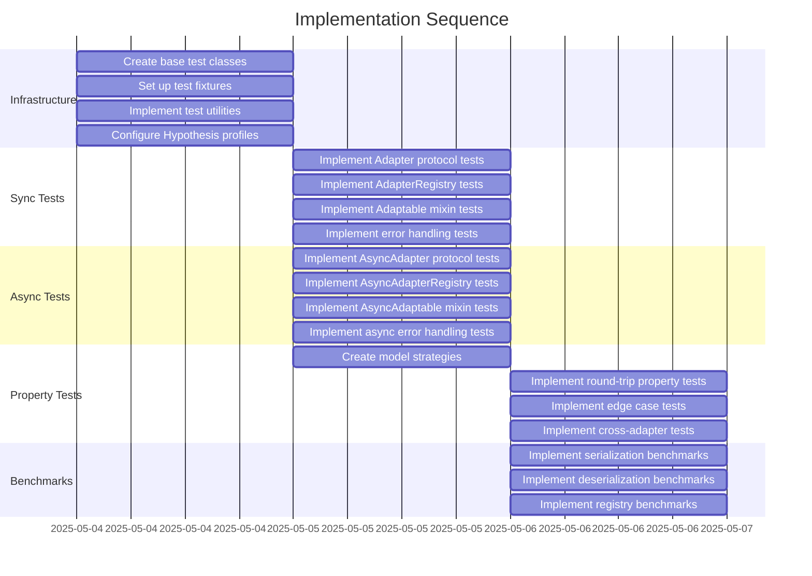

# Implementation Plan: Core Unit Tests

## 1. Overview

### 1.1 Component Purpose

This implementation plan outlines the approach for developing comprehensive unit
tests for pydapter's core interfaces, focusing on protocol conformance, adapter
registration, and data conversion functionality across both synchronous and
asynchronous variants.

### 1.2 Design Reference

This implementation is based on the approved Technical Design Specification
(TDS-15.md, PR #23), which outlines the testing strategy for pydapter's core
components.

### 1.3 Implementation Approach

The implementation will follow Test-Driven Development (TDD) principles, with a
focus on:

1. Creating base test classes for reusability
2. Implementing property-based tests using Hypothesis
3. Ensuring comprehensive coverage of edge cases
4. Providing performance benchmarks for key operations
5. Supporting both synchronous and asynchronous testing

## 2. Implementation Phases

### 2.1 Phase 1: Test Infrastructure

**Description:** Set up the foundational test infrastructure, including base
test classes, fixtures, and utilities.

**Key Deliverables:**

- Base test classes for adapter testing
- Shared fixtures for test data generation
- Utility functions for validation and error checking
- Hypothesis profiles for property-based testing

**Dependencies:**

- pytest
- pytest-asyncio
- hypothesis
- pytest-benchmark

**Estimated Complexity:** Medium

### 2.2 Phase 2: Synchronous Component Tests

**Description:** Implement tests for synchronous components (Adapter,
AdapterRegistry, Adaptable).

**Key Deliverables:**

- Protocol compliance tests for Adapter
- Registration and retrieval tests for AdapterRegistry
- Mixin functionality tests for Adaptable
- Error handling tests for all components

**Dependencies:**

- Phase 1 infrastructure
- pydapter core module

**Estimated Complexity:** Medium

### 2.3 Phase 3: Asynchronous Component Tests

**Description:** Implement tests for asynchronous components (AsyncAdapter,
AsyncAdapterRegistry, AsyncAdaptable).

**Key Deliverables:**

- Protocol compliance tests for AsyncAdapter
- Registration and retrieval tests for AsyncAdapterRegistry
- Mixin functionality tests for AsyncAdaptable
- Error handling tests for all async components

**Dependencies:**

- Phase 1 infrastructure
- pydapter async_core module

**Estimated Complexity:** High

### 2.4 Phase 4: Property-Based Tests

**Description:** Implement property-based tests using Hypothesis to validate
adapter behavior across a wide range of inputs.

**Key Deliverables:**

- Property-based tests for round-trip conversions
- Edge case validation
- Cross-implementation consistency tests

**Dependencies:**

- Phase 1 infrastructure
- Hypothesis strategies for test data generation

**Estimated Complexity:** High

### 2.5 Phase 5: Performance Benchmarks

**Description:** Implement benchmark tests to measure and track adapter
performance.

**Key Deliverables:**

- Serialization benchmarks
- Deserialization benchmarks
- Registry lookup benchmarks

**Dependencies:**

- Phase 2 and 3 tests
- pytest-benchmark

**Estimated Complexity:** Low

## 3. Test Strategy

### 3.1 Unit Tests

#### 3.1.1 Test Group: Protocol Compliance

| ID   | Description                           | Fixtures/Mocks | Assertions                                                      |
| ---- | ------------------------------------- | -------------- | --------------------------------------------------------------- |
| UT-1 | Test Adapter protocol compliance      | None           | Class implements Adapter protocol, has required attributes      |
| UT-2 | Test AsyncAdapter protocol compliance | None           | Class implements AsyncAdapter protocol, has required attributes |
| UT-3 | Test adapter method signatures        | None           | Methods accept correct parameters, return expected types        |
| UT-4 | Test async adapter method signatures  | None           | Async methods accept correct parameters, return expected types  |

#### 3.1.2 Test Group: Registry

| ID    | Description                              | Fixtures/Mocks      | Assertions                                              |
| ----- | ---------------------------------------- | ------------------- | ------------------------------------------------------- |
| UT-5  | Test adapter registration                | Mock adapters       | Adapters are correctly registered with their keys       |
| UT-6  | Test adapter retrieval                   | Mock adapters       | Registered adapters can be retrieved by key             |
| UT-7  | Test error handling for missing adapters | None                | KeyError raised for unregistered adapters               |
| UT-8  | Test error handling for invalid adapters | Invalid adapters    | AttributeError raised for adapters missing obj_key      |
| UT-9  | Test async adapter registration          | Mock async adapters | Async adapters are correctly registered with their keys |
| UT-10 | Test async adapter retrieval             | Mock async adapters | Registered async adapters can be retrieved by key       |

#### 3.1.3 Test Group: Adaptable Mixin

| ID    | Description                                | Fixtures/Mocks      | Assertions                                                   |
| ----- | ------------------------------------------ | ------------------- | ------------------------------------------------------------ |
| UT-11 | Test adapter registration via mixin        | Model factory       | Adapters are correctly registered with the model class       |
| UT-12 | Test round-trip conversion via mixin       | Sample model        | Model can be serialized and deserialized correctly           |
| UT-13 | Test async adapter registration via mixin  | Async model factory | Async adapters are correctly registered with the model class |
| UT-14 | Test async round-trip conversion via mixin | Async sample model  | Model can be serialized and deserialized asynchronously      |

### 3.2 Integration Tests

#### 3.2.1 Test Group: Adapter Interactions

| ID   | Description                              | Setup                                   | Assertions                                              |
| ---- | ---------------------------------------- | --------------------------------------- | ------------------------------------------------------- |
| IT-1 | Test multiple adapter registrations      | Register multiple adapters with a model | All adapters are available and function correctly       |
| IT-2 | Test adapter inheritance                 | Create adapter subclasses               | Subclasses inherit and can override parent behavior     |
| IT-3 | Test async adapter with external systems | Set up mock external systems            | Async adapters correctly interact with external systems |

### 3.3 Mock and Stub Requirements

| Dependency        | Mock/Stub Type | Key Behaviors to Mock                           |
| ----------------- | -------------- | ----------------------------------------------- |
| External Database | Mock           | Connection, query execution, result retrieval   |
| Async Context     | AsyncMock      | **aenter**, **aexit**, async method calls       |
| Invalid Adapters  | Stub           | Missing attributes, incorrect method signatures |

## 4. Implementation Tasks

### 4.1 Test Infrastructure

| ID  | Task                          | Description                                               | Dependencies | Priority | Complexity |
| --- | ----------------------------- | --------------------------------------------------------- | ------------ | -------- | ---------- |
| T-1 | Create base test classes      | Implement AdapterTestBase and AsyncAdapterTestBase        | None         | High     | Medium     |
| T-2 | Set up test fixtures          | Create fixtures for model factories and sample data       | None         | High     | Low        |
| T-3 | Implement test utilities      | Create helper functions for validation and error checking | None         | Medium   | Low        |
| T-4 | Configure Hypothesis profiles | Set up profiles for development and CI environments       | None         | Medium   | Low        |

### 4.2 Synchronous Component Tests

| ID  | Task                             | Description                                          | Dependencies | Priority | Complexity |
| --- | -------------------------------- | ---------------------------------------------------- | ------------ | -------- | ---------- |
| T-5 | Implement Adapter protocol tests | Test protocol compliance for Adapter implementations | T-1, T-2     | High     | Medium     |
| T-6 | Implement AdapterRegistry tests  | Test registration and retrieval functionality        | T-1, T-2     | High     | Medium     |
| T-7 | Implement Adaptable mixin tests  | Test mixin functionality for model classes           | T-1, T-2     | High     | Medium     |
| T-8 | Implement error handling tests   | Test error conditions for sync components            | T-1, T-3     | Medium   | Medium     |

### 4.3 Asynchronous Component Tests

| ID   | Task                                  | Description                                               | Dependencies | Priority | Complexity |
| ---- | ------------------------------------- | --------------------------------------------------------- | ------------ | -------- | ---------- |
| T-9  | Implement AsyncAdapter protocol tests | Test protocol compliance for AsyncAdapter implementations | T-1, T-2     | High     | High       |
| T-10 | Implement AsyncAdapterRegistry tests  | Test registration and retrieval functionality             | T-1, T-2     | High     | High       |
| T-11 | Implement AsyncAdaptable mixin tests  | Test mixin functionality for async model classes          | T-1, T-2     | High     | High       |
| T-12 | Implement async error handling tests  | Test error conditions for async components                | T-1, T-3     | Medium   | High       |

### 4.4 Property-Based Tests

| ID   | Task                                | Description                                                | Dependencies | Priority | Complexity |
| ---- | ----------------------------------- | ---------------------------------------------------------- | ------------ | -------- | ---------- |
| T-13 | Create model strategies             | Implement Hypothesis strategies for generating test models | T-4          | High     | Medium     |
| T-14 | Implement round-trip property tests | Test round-trip conversions with property-based testing    | T-13         | High     | High       |
| T-15 | Implement edge case tests           | Test handling of edge cases with property-based testing    | T-13         | Medium   | High       |
| T-16 | Implement cross-adapter tests       | Test consistency across different adapter implementations  | T-13         | Medium   | High       |

### 4.5 Performance Benchmarks

| ID   | Task                                 | Description                                   | Dependencies | Priority | Complexity |
| ---- | ------------------------------------ | --------------------------------------------- | ------------ | -------- | ---------- |
| T-17 | Implement serialization benchmarks   | Benchmark adapter serialization performance   | T-5, T-9     | Low      | Low        |
| T-18 | Implement deserialization benchmarks | Benchmark adapter deserialization performance | T-5, T-9     | Low      | Low        |
| T-19 | Implement registry benchmarks        | Benchmark registry lookup performance         | T-6, T-10    | Low      | Low        |

## 5. Implementation Sequence



## 6. Acceptance Criteria

### 6.1 Component Level

| ID   | Criterion                                       | Validation Method        |
| ---- | ----------------------------------------------- | ------------------------ |
| AC-1 | All tests pass for synchronous components       | pytest execution         |
| AC-2 | All tests pass for asynchronous components      | pytest execution         |
| AC-3 | Property-based tests cover edge cases           | Hypothesis statistics    |
| AC-4 | Benchmark tests establish performance baselines | pytest-benchmark results |

### 6.2 Coverage Level

| ID   | Criterion                                       | Validation Method |
| ---- | ----------------------------------------------- | ----------------- |
| AC-5 | Test coverage for core.py is at least 90%       | pytest-cov report |
| AC-6 | Test coverage for async_core.py is at least 90% | pytest-cov report |
| AC-7 | All error conditions are tested                 | Code review       |
| AC-8 | All public methods and classes are tested       | Code review       |

## 7. Test Implementation Plan

### 7.1 Test Implementation Sequence

1. Set up test infrastructure (base classes, fixtures, utilities)
2. Implement synchronous component tests
3. Implement asynchronous component tests
4. Implement property-based tests
5. Implement benchmark tests

### 7.2 Test Code Examples

#### Unit Test Example

```python
def test_adapter_protocol_compliance():
    """Test that concrete adapters implement the Adapter protocol."""
    from pydapter.adapters import JsonAdapter, CsvAdapter, TomlAdapter

    # Verify each concrete adapter implements the protocol
    assert isinstance(JsonAdapter, Adapter)
    assert isinstance(CsvAdapter, Adapter)
    assert isinstance(TomlAdapter, Adapter)

    # Verify required attributes exist
    assert hasattr(JsonAdapter, "obj_key")
    assert JsonAdapter.obj_key == "json"
```

#### Property-Based Test Example

```python
@given(
    id=st.integers(),
    name=st.text(min_size=1, max_size=50),
    value=st.floats(allow_nan=False, allow_infinity=False)
)
def test_json_adapter_roundtrip(id, name, value, model_factory):
    """Test that objects can be round-tripped through the JsonAdapter."""
    model = model_factory(id=id, name=name, value=value)
    serialized = model.adapt_to(obj_key="json")
    deserialized = model.__class__.adapt_from(serialized, obj_key="json")
    assert deserialized == model
```

#### Async Test Example

```python
@pytest.mark.asyncio
async def test_async_adapter_protocol_compliance():
    """Test that concrete async adapters implement the AsyncAdapter protocol."""
    from pydapter.extras.async_postgres_ import AsyncPostgresAdapter
    from pydapter.extras.async_mongo_ import AsyncMongoAdapter

    # Verify each concrete adapter implements the protocol
    assert isinstance(AsyncPostgresAdapter, AsyncAdapter)
    assert isinstance(AsyncMongoAdapter, AsyncAdapter)

    # Verify required attributes exist
    assert hasattr(AsyncPostgresAdapter, "obj_key")
    assert AsyncPostgresAdapter.obj_key == "async_pg"
```

## 8. Implementation Risks and Mitigations

| Risk                                        | Impact | Likelihood | Mitigation                                                                                       |
| ------------------------------------------- | ------ | ---------- | ------------------------------------------------------------------------------------------------ |
| Container startup failures in CI            | High   | Medium     | Implement fallback mocking when containers unavailable with `@pytest.mark.skipif`                |
| Flaky async tests                           | High   | Medium     | Add retries for integration tests and use event loop isolation in pytest-asyncio (pplx:53ee45a2) |
| Performance degradation from property tests | Medium | High       | Use `--hypothesis-profile=dev` for faster runs during development (pplx:bbefd11c)                |
| Test maintenance burden                     | Medium | Medium     | Create base classes and utilities to reduce code duplication (pplx:c9986b53)                     |
| Protocol validation failures                | Medium | Low        | Use explicit runtime protocol checks in dedicated test functions                                 |

## 9. Dependencies and Environment

### 9.1 External Libraries

| Library          | Version  | Purpose                   |
| ---------------- | -------- | ------------------------- |
| pytest           | >=7.0.0  | Core testing framework    |
| pytest-cov       | >=4.0.0  | Test coverage reporting   |
| pytest-asyncio   | >=0.21.0 | Asynchronous test support |
| pytest-benchmark | >=4.0.0  | Performance benchmarking  |
| hypothesis       | >=6.82.0 | Property-based testing    |
| testcontainers   | >=3.7.0  | Container-based testing   |

### 9.2 Environment Setup

```bash
# Install test dependencies
pip install pytest pytest-cov pytest-asyncio pytest-benchmark hypothesis testcontainers

# Run tests
pytest tests/

# Run tests with coverage
pytest tests/ --cov=pydapter

# Run tests with specific markers
pytest tests/ -m "unit"
pytest tests/ -m "property"
pytest tests/ -m "benchmark"
```

## 10. Additional Resources

### 10.1 Reference Implementation

The existing test files in the project provide a reference for implementation:

- tests/conftest.py
- tests/test_core_adapters.py
- tests/test_async_adapters.py
- tests/test_bench_json.py

### 10.2 Relevant Documentation

- [pytest Documentation](https://docs.pytest.org/)
- [Hypothesis Documentation](https://hypothesis.readthedocs.io/)
- [pytest-asyncio Documentation](https://pytest-asyncio.readthedocs.io/)
- [pytest-benchmark Documentation](https://pytest-benchmark.readthedocs.io/)

### 10.3 Design Patterns

- Protocol-based testing
- Property-based testing
- Fixture composition
- Parameterized testing
