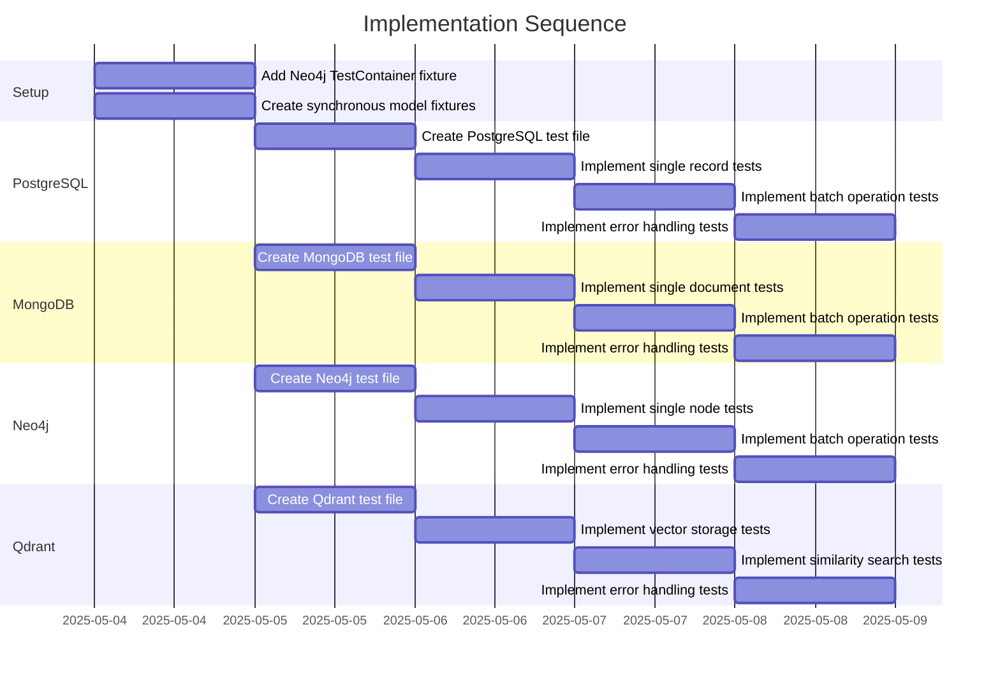

# Implementation Plan: Database Integration Tests with TestContainers

## 1. Overview

### 1.1 Component Purpose

This implementation will add comprehensive integration tests for pydapter's
database adapters using TestContainers. These tests will verify that our
adapters can properly interact with real database systems in isolated
containers, ensuring reliable data storage and retrieval across different
database backends.

### 1.2 Design Reference

Based on Issue #17: "Implement database integration tests with TestContainers"

### 1.3 Implementation Approach

We will use a Test-Driven Development (TDD) approach to implement integration
tests for the following database adapters:

- PostgreSQL
- MongoDB
- Neo4j
- Qdrant

The implementation will leverage the TestContainers Python library to spin up
isolated database containers during test execution. We'll create fixtures for
each database type and implement tests that verify CRUD operations, batch
operations, and error handling scenarios.

## 2. Implementation Phases

### 2.1 Phase 1: Setup TestContainers Fixtures

**Key Deliverables:**

- Complete Neo4j TestContainer fixture in conftest.py (PostgreSQL, MongoDB, and
  Qdrant fixtures already exist)
- Create model fixtures for synchronous adapter testing
- Ensure proper container cleanup

**Dependencies:**

- TestContainers Python library
- Docker installed on the test environment

**Estimated Complexity:** Low

### 2.2 Phase 2: Implement PostgreSQL Integration Tests

**Key Deliverables:**

- Integration tests for PostgreSQL adapter
- Tests for single and batch operations
- Error handling tests

**Dependencies:**

- Phase 1 completion
- PostgreSQL adapter implementation

**Estimated Complexity:** Medium

### 2.3 Phase 3: Implement MongoDB Integration Tests

**Key Deliverables:**

- Integration tests for MongoDB adapter
- Tests for single and batch operations
- Error handling tests

**Dependencies:**

- Phase 1 completion
- MongoDB adapter implementation

**Estimated Complexity:** Medium

### 2.4 Phase 4: Implement Neo4j Integration Tests

**Key Deliverables:**

- Integration tests for Neo4j adapter
- Tests for single and batch operations
- Error handling tests

**Dependencies:**

- Phase 1 completion
- Neo4j adapter implementation

**Estimated Complexity:** Medium

### 2.5 Phase 5: Implement Qdrant Integration Tests

**Key Deliverables:**

- Integration tests for Qdrant vector database adapter
- Tests for vector similarity search
- Error handling tests

**Dependencies:**

- Phase 1 completion
- Qdrant adapter implementation

**Estimated Complexity:** Medium

## 3. Test Strategy

### 3.1 Unit Tests

The existing unit tests with mocks will remain in place. The new integration
tests will complement these by testing against real database instances.

### 3.2 Integration Tests

#### 3.2.1 Test Group: PostgreSQL Integration

| ID   | Description                                                     | Fixtures/Mocks | Assertions                        |
| ---- | --------------------------------------------------------------- | -------------- | --------------------------------- |
| IT-1 | Test PostgreSQL adapter can store and retrieve a single record  | `pg_url`       | Retrieved data matches original   |
| IT-2 | Test PostgreSQL adapter can store and retrieve multiple records | `pg_url`       | Retrieved data matches original   |
| IT-3 | Test PostgreSQL adapter handles errors correctly                | `pg_url`       | Appropriate exceptions are raised |

#### 3.2.2 Test Group: MongoDB Integration

| ID   | Description                                                    | Fixtures/Mocks | Assertions                        |
| ---- | -------------------------------------------------------------- | -------------- | --------------------------------- |
| IT-4 | Test MongoDB adapter can store and retrieve a single document  | `mongo_url`    | Retrieved data matches original   |
| IT-5 | Test MongoDB adapter can store and retrieve multiple documents | `mongo_url`    | Retrieved data matches original   |
| IT-6 | Test MongoDB adapter handles errors correctly                  | `mongo_url`    | Appropriate exceptions are raised |

#### 3.2.3 Test Group: Neo4j Integration

| ID   | Description                                              | Fixtures/Mocks | Assertions                        |
| ---- | -------------------------------------------------------- | -------------- | --------------------------------- |
| IT-7 | Test Neo4j adapter can store and retrieve a single node  | `neo4j_url`    | Retrieved data matches original   |
| IT-8 | Test Neo4j adapter can store and retrieve multiple nodes | `neo4j_url`    | Retrieved data matches original   |
| IT-9 | Test Neo4j adapter handles errors correctly              | `neo4j_url`    | Appropriate exceptions are raised |

#### 3.2.4 Test Group: Qdrant Integration

| ID    | Description                                              | Fixtures/Mocks | Assertions                        |
| ----- | -------------------------------------------------------- | -------------- | --------------------------------- |
| IT-10 | Test Qdrant adapter can store and retrieve vectors       | `qdrant_url`   | Retrieved data matches original   |
| IT-11 | Test Qdrant adapter can perform vector similarity search | `qdrant_url`   | Search results are relevant       |
| IT-12 | Test Qdrant adapter handles errors correctly             | `qdrant_url`   | Appropriate exceptions are raised |

### 3.3 Mock and Stub Requirements

No mocks are needed for these integration tests as we'll be using real database
instances in containers.

## 4. Implementation Tasks

### 4.1 TestContainers Setup

| ID  | Task                              | Description                                           | Dependencies | Priority | Complexity |
| --- | --------------------------------- | ----------------------------------------------------- | ------------ | -------- | ---------- |
| T-1 | Add Neo4j TestContainer fixture   | Create a Neo4j container fixture in conftest.py       | None         | High     | Low        |
| T-2 | Create synchronous model fixtures | Create model fixtures for synchronous adapter testing | None         | High     | Low        |

### 4.2 PostgreSQL Integration Tests

| ID  | Task                            | Description                                            | Dependencies | Priority | Complexity |
| --- | ------------------------------- | ------------------------------------------------------ | ------------ | -------- | ---------- |
| T-3 | Create PostgreSQL test file     | Create test file for PostgreSQL integration tests      | T-1, T-2     | High     | Low        |
| T-4 | Implement single record tests   | Test storing and retrieving a single record            | T-3          | High     | Medium     |
| T-5 | Implement batch operation tests | Test storing and retrieving multiple records           | T-3          | High     | Medium     |
| T-6 | Implement error handling tests  | Test error scenarios (connection errors, invalid data) | T-3          | Medium   | Medium     |

### 4.3 MongoDB Integration Tests

| ID   | Task                            | Description                                            | Dependencies | Priority | Complexity |
| ---- | ------------------------------- | ------------------------------------------------------ | ------------ | -------- | ---------- |
| T-7  | Create MongoDB test file        | Create test file for MongoDB integration tests         | T-1, T-2     | High     | Low        |
| T-8  | Implement single document tests | Test storing and retrieving a single document          | T-7          | High     | Medium     |
| T-9  | Implement batch operation tests | Test storing and retrieving multiple documents         | T-7          | High     | Medium     |
| T-10 | Implement error handling tests  | Test error scenarios (connection errors, invalid data) | T-7          | Medium   | Medium     |

### 4.4 Neo4j Integration Tests

| ID   | Task                            | Description                                            | Dependencies | Priority | Complexity |
| ---- | ------------------------------- | ------------------------------------------------------ | ------------ | -------- | ---------- |
| T-11 | Create Neo4j test file          | Create test file for Neo4j integration tests           | T-1, T-2     | High     | Low        |
| T-12 | Implement single node tests     | Test storing and retrieving a single node              | T-11         | High     | Medium     |
| T-13 | Implement batch operation tests | Test storing and retrieving multiple nodes             | T-11         | High     | Medium     |
| T-14 | Implement error handling tests  | Test error scenarios (connection errors, invalid data) | T-11         | Medium   | Medium     |

### 4.5 Qdrant Integration Tests

| ID   | Task                              | Description                                            | Dependencies | Priority | Complexity |
| ---- | --------------------------------- | ------------------------------------------------------ | ------------ | -------- | ---------- |
| T-15 | Create Qdrant test file           | Create test file for Qdrant integration tests          | T-1, T-2     | High     | Low        |
| T-16 | Implement vector storage tests    | Test storing and retrieving vectors                    | T-15         | High     | Medium     |
| T-17 | Implement similarity search tests | Test vector similarity search                          | T-15         | High     | Medium     |
| T-18 | Implement error handling tests    | Test error scenarios (connection errors, invalid data) | T-15         | Medium   | Medium     |

## 5. Implementation Sequence



## 6. Acceptance Criteria

### 6.1 Component Level

| ID   | Criterion                                                | Validation Method    |
| ---- | -------------------------------------------------------- | -------------------- |
| AC-1 | All database adapters have integration tests             | Test suite execution |
| AC-2 | Tests verify data integrity for all CRUD operations      | Test assertions      |
| AC-3 | Tests include batch operations                           | Test assertions      |
| AC-4 | Tests handle error scenarios appropriately               | Test assertions      |
| AC-5 | Tests clean up after themselves (no leftover containers) | Manual verification  |

### 6.2 API Level

| ID   | Criterion                                              | Validation Method |
| ---- | ------------------------------------------------------ | ----------------- |
| AC-6 | PostgreSQL adapter correctly stores and retrieves data | Integration tests |
| AC-7 | MongoDB adapter correctly stores and retrieves data    | Integration tests |
| AC-8 | Neo4j adapter correctly stores and retrieves data      | Integration tests |
| AC-9 | Qdrant adapter correctly stores and retrieves vectors  | Integration tests |

## 7. Test Implementation Plan

### 7.1 Test Implementation Sequence

1. Set up TestContainers fixtures
2. Implement PostgreSQL integration tests
3. Implement MongoDB integration tests
4. Implement Neo4j integration tests
5. Implement Qdrant integration tests

### 7.2 Test Code Examples

#### PostgreSQL Integration Test Example

```python
def test_postgres_adapter_integration(pg_url, sync_model_factory):
    """Test PostgreSQL adapter with a real database."""
    # Create test instance
    test_model = sync_model_factory(id=42, name="test_postgres", value=12.34)

    # Register adapter
    test_model.__class__.register_adapter(PostgresAdapter)

    # Store in database
    test_model.adapt_to(
        obj_key="postgres",
        engine_url=pg_url,
        table="test_table"
    )

    # Retrieve from database
    retrieved = test_model.__class__.adapt_from(
        {
            "engine_url": pg_url,
            "table": "test_table",
            "selectors": {"id": 42}
        },
        obj_key="postgres",
        many=False
    )

    # Verify data integrity
    assert retrieved.id == test_model.id
    assert retrieved.name == test_model.name
    assert retrieved.value == test_model.value
```

#### MongoDB Batch Operations Test Example

```python
def test_mongodb_batch_operations(mongo_url, sync_model_factory):
    """Test batch operations with MongoDB."""
    model_cls = sync_model_factory(id=1, name="test", value=1.0).__class__

    # Register adapter
    model_cls.register_adapter(MongoAdapter)

    # Create multiple test instances
    models = [
        model_cls(id=i, name=f"batch_{i}", value=i * 1.5)
        for i in range(1, 11)
    ]

    # Store batch in database
    MongoAdapter.to_obj(
        models,
        url=mongo_url,
        db="testdb",
        collection="batch_collection",
        many=True
    )

    # Retrieve all from database
    retrieved = model_cls.adapt_from(
        {
            "url": mongo_url,
            "db": "testdb",
            "collection": "batch_collection"
        },
        obj_key="mongo",
        many=True
    )

    # Verify all records were stored and retrieved correctly
    assert len(retrieved) == 10
    for i, model in enumerate(retrieved, 1):
        assert model.id in [m.id for m in models]
        assert model.name in [m.name for m in models]
```

## 8. Implementation Risks and Mitigations

| Risk                                    | Impact | Likelihood | Mitigation                                                                                            |
| --------------------------------------- | ------ | ---------- | ----------------------------------------------------------------------------------------------------- |
| Docker not available in CI environment  | High   | Low        | Ensure CI configuration includes Docker support or skip tests if Docker is not available              |
| Tests are flaky due to container issues | Medium | Medium     | Use proper container cleanup, randomize container names, and add retries for container initialization |
| Tests are slow due to container startup | Medium | High       | Use session-scoped fixtures to reuse containers across tests                                          |
| Database-specific errors in tests       | Medium | Medium     | Add specific error handling for each database type and clear error messages                           |

## 9. Dependencies and Environment

### 9.1 External Libraries

| Library               | Version | Purpose                        |
| --------------------- | ------- | ------------------------------ |
| testcontainers-python | ^3.7.0  | Container management for tests |
| pytest                | ^7.3.1  | Test framework                 |
| pytest-asyncio        | ^0.21.0 | Async test support             |
| docker                | ^6.1.0  | Docker API for Python          |

### 9.2 Environment Setup

```bash
# Install dependencies
pip install testcontainers-python pytest pytest-asyncio docker

# Ensure Docker is running
docker info

# Run tests
pytest tests/test_integration_*.py -v
```

## 10. Additional Resources

### 10.1 Reference Implementation

The existing async adapter tests in `tests/test_async_adapters.py` provide a
reference for how to use TestContainers.

### 10.2 Relevant Documentation

- TestContainers Python:
  [GitHub - testcontainers/testcontainers-python](https://github.com/testcontainers/testcontainers-python)
- TestContainers getting started:
  [TestContainers Python Guide](https://testcontainers.com/guides/getting-started-with-testcontainers-for-python/)
- Database integration testing:
  [Real-world database testing in Python](https://www.fullstackpython.com/integration-testing.html)
