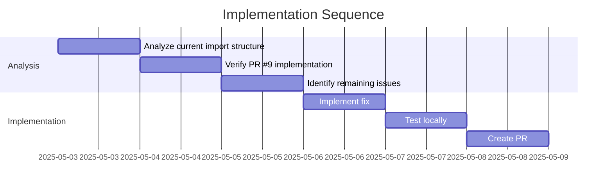

# Implementation Plan: Fix ImportError for Adaptable

## 1. Overview

### 1.1 Component Purpose

Fix the `ImportError: cannot import name 'Adaptable' from 'pydapter'` occurring
during test execution in the CI environment. This is blocking further progress
and needs to be fixed before we can review the new adapter PRs (#11, #12, #13,
#14).

### 1.2 Design Reference

This implementation is based on Issue #2 (ohdearquant/pydapter#2), which tracks
the stabilization of the testing infrastructure.

### 1.3 Implementation Approach

The approach will be to:

1. Analyze the current import structure
2. Verify that the fix from PR #9 is correctly implemented
3. Identify any remaining issues with imports
4. Implement a solution that ensures all classes are properly exported and
   importable
5. Test the solution locally
6. Create a PR with the fix

## 2. Implementation Phases

### 2.1 Phase 1: Analysis

**Key Deliverables:**

- Understand the current import structure
- Identify the root cause of the ImportError

**Dependencies:**

- Access to the codebase
- Understanding of Python import system

**Estimated Complexity:** Low

### 2.2 Phase 2: Implementation

**Key Deliverables:**

- Fix the ImportError issue
- Ensure all tests pass locally

**Dependencies:**

- Successful completion of Phase 1

**Estimated Complexity:** Low

### 2.3 Phase 3: Verification

**Key Deliverables:**

- Verify that the fix works in the CI environment
- Ensure that the fix doesn't break any existing functionality

**Dependencies:**

- Successful completion of Phase 2

**Estimated Complexity:** Low

## 3. Test Strategy

### 3.1 Unit Tests

#### 3.1.1 Test Group: Import Tests

| ID   | Description                                            | Fixtures/Mocks | Assertions      |
| ---- | ------------------------------------------------------ | -------------- | --------------- |
| UT-1 | Test that Adaptable can be imported from pydapter      | None           | Import succeeds |
| UT-2 | Test that AsyncAdaptable can be imported from pydapter | None           | Import succeeds |

### 3.2 Integration Tests

#### 3.2.1 Test Group: Adapter Tests

| ID   | Description                                                             | Setup                                            | Assertions                        |
| ---- | ----------------------------------------------------------------------- | ------------------------------------------------ | --------------------------------- |
| IT-1 | Test that adapters can be registered and used with Adaptable            | Create a model that inherits from Adaptable      | Adapter functions correctly       |
| IT-2 | Test that async adapters can be registered and used with AsyncAdaptable | Create a model that inherits from AsyncAdaptable | Async adapter functions correctly |

### 3.3 Mock and Stub Requirements

No mocks or stubs are required for this implementation.

## 4. Implementation Tasks

### 4.1 Core Framework

| ID  | Task                             | Description                                            | Dependencies | Priority | Complexity |
| --- | -------------------------------- | ------------------------------------------------------ | ------------ | -------- | ---------- |
| T-1 | Analyze current import structure | Check how Adaptable is currently exported and imported | None         | High     | Low        |
| T-2 | Verify PR #9 implementation      | Check if the fix from PR #9 is correctly implemented   | T-1          | High     | Low        |
| T-3 | Identify remaining issues        | Determine if there are any other issues with imports   | T-2          | High     | Low        |
| T-4 | Implement fix                    | Make necessary changes to fix the ImportError          | T-3          | High     | Low        |
| T-5 | Test locally                     | Verify that the fix works locally                      | T-4          | High     | Low        |
| T-6 | Create PR                        | Create a PR with the fix                               | T-5          | High     | Low        |

## 5. Implementation Sequence



## 6. Acceptance Criteria

### 6.1 Component Level

| ID   | Criterion                                        | Validation Method |
| ---- | ------------------------------------------------ | ----------------- |
| AC-1 | The ImportError is resolved                      | CI tests pass     |
| AC-2 | All tests pass in the CI environment             | CI tests pass     |
| AC-3 | The fix doesn't break any existing functionality | CI tests pass     |

## 7. Test Implementation Plan

### 7.1 Test Implementation Sequence

1. Run tests locally to verify the fix
2. Push the fix to GitHub and verify that CI tests pass

### 7.2 Test Code Examples

#### Import Test Example

```python
def test_adaptable_import():
    from pydapter import Adaptable
    assert Adaptable is not None

def test_async_adaptable_import():
    from pydapter import AsyncAdaptable
    assert AsyncAdaptable is not None
```

## 8. Implementation Risks and Mitigations

| Risk                                | Impact | Likelihood | Mitigation                                                                                           |
| ----------------------------------- | ------ | ---------- | ---------------------------------------------------------------------------------------------------- |
| Fix doesn't resolve the issue in CI | High   | Low        | Thoroughly test the fix locally and ensure it addresses the root cause                               |
| Fix breaks existing functionality   | High   | Low        | Run all tests locally before pushing the fix                                                         |
| Issue is environment-specific       | Medium | Medium     | Consider environment differences between local and CI, such as Python version or installation method |

## 9. Dependencies and Environment

### 9.1 External Libraries

No external libraries are required for this implementation.

### 9.2 Environment Setup

```bash
# Create virtual environment
python -m venv venv
source venv/bin/activate

# Install dependencies
pip install -e ".[all,dev]"

# Run tests
pytest
```

## 10. Additional Resources

### 10.1 Reference Implementation

PR #9 attempted to fix this issue by adding AsyncAdaptable, AsyncAdapter, and
AsyncAdapterRegistry to the package exports.

### 10.2 Relevant Documentation

- [Python Import System](https://docs.python.org/3/reference/import.html)
- [Python Packaging Guide](https://packaging.python.org/en/latest/guides/distributing-packages-using-setuptools/)
