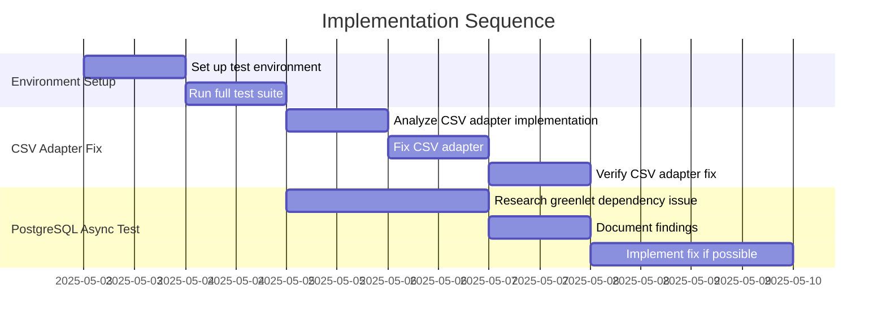

# Implementation Plan: Test Infrastructure Fixes

## 1. Overview

### 1.1 Component Purpose

This implementation plan addresses known issues in the pydapter testing
infrastructure, specifically focusing on:

1. Fixing the failing CSV adapter test (`test_text_roundtrip` for
   `adapter_key='csv'`)
2. Investigating the skipped PostgreSQL async test (`test_async_roundtrip` for
   `adapter_key='async_pg'`)

### 1.2 Design Reference

This implementation is based on Issue #2, which outlines the need to verify and
fix the testing infrastructure.

### 1.3 Implementation Approach

We'll follow a Test-Driven Development (TDD) approach:

1. Run the existing tests to confirm the failures
2. Analyze the failing tests to understand the root causes
3. Implement fixes for the identified issues
4. Verify that the fixes resolve the issues
5. Document any remaining issues or limitations

## 2. Implementation Phases

### 2.1 Phase 1: Environment Setup and Test Verification

**Key Deliverables:**

- Confirmation of test environment setup
- Documentation of test failures and skips

**Dependencies:**

- Python environment with all required dependencies

**Estimated Complexity:** Low

### 2.2 Phase 2: CSV Adapter Fix

**Key Deliverables:**

- Fixed implementation of the CSV adapter
- Passing `test_text_roundtrip` test for CSV adapter

**Dependencies:**

- Understanding of the current CSV adapter implementation
- Identification of the specific issue causing the test failure

**Estimated Complexity:** Medium

### 2.3 Phase 3: PostgreSQL Async Test Investigation

**Key Deliverables:**

- Analysis of the greenlet dependency issue
- Recommendation for addressing the skipped test

**Dependencies:**

- Understanding of the async PostgreSQL adapter implementation
- Knowledge of greenlet compatibility issues

**Estimated Complexity:** Medium

## 3. Test Strategy

### 3.1 Unit Tests

#### 3.1.1 Test Group: CSV Adapter

| ID   | Description                                              | Fixtures/Mocks | Assertions                    |
| ---- | -------------------------------------------------------- | -------------- | ----------------------------- |
| UT-1 | Test that CSV adapter correctly handles single object    | `sample`       | Restored object matches input |
| UT-2 | Test that CSV adapter correctly handles multiple objects | `sample`       | Restored objects match input  |

#### 3.1.2 Test Group: Async PostgreSQL Adapter

| ID   | Description                                            | Fixtures/Mocks | Assertions                    |
| ---- | ------------------------------------------------------ | -------------- | ----------------------------- |
| UT-3 | Test that async PostgreSQL adapter works with greenlet | `async_sample` | Restored object matches input |

## 4. Implementation Tasks

### 4.1 Environment Setup

| ID  | Task                    | Description                                             | Dependencies | Priority | Complexity |
| --- | ----------------------- | ------------------------------------------------------- | ------------ | -------- | ---------- |
| T-1 | Set up test environment | Install all dependencies and verify test infrastructure | None         | High     | Low        |
| T-2 | Run full test suite     | Execute all tests and document failures                 | T-1          | High     | Low        |

### 4.2 CSV Adapter Fix

| ID  | Task                               | Description                                          | Dependencies | Priority | Complexity |
| --- | ---------------------------------- | ---------------------------------------------------- | ------------ | -------- | ---------- |
| T-3 | Analyze CSV adapter implementation | Identify the issue in the CSV adapter implementation | T-2          | High     | Medium     |
| T-4 | Fix CSV adapter                    | Implement the fix for the CSV adapter                | T-3          | High     | Medium     |
| T-5 | Verify CSV adapter fix             | Run tests to confirm the fix works                   | T-4          | High     | Low        |

### 4.3 PostgreSQL Async Test Investigation

| ID  | Task                               | Description                                                     | Dependencies | Priority | Complexity |
| --- | ---------------------------------- | --------------------------------------------------------------- | ------------ | -------- | ---------- |
| T-6 | Research greenlet dependency issue | Investigate the greenlet dependency issue with PostgreSQL async | T-2          | Medium   | Medium     |
| T-7 | Document findings                  | Document findings and recommendations                           | T-6          | Medium   | Low        |
| T-8 | Implement fix if possible          | If a simple fix is possible, implement it                       | T-7          | Low      | Medium     |

## 5. Implementation Sequence



## 6. Acceptance Criteria

### 6.1 Component Level

| ID   | Criterion                                              | Validation Method              |
| ---- | ------------------------------------------------------ | ------------------------------ |
| AC-1 | The CSV adapter correctly handles roundtrip tests      | `test_text_roundtrip` passes   |
| AC-2 | The PostgreSQL async test issue is documented          | Documentation in PR            |
| AC-3 | The PostgreSQL async test is fixed or properly skipped | Test runs or skip is justified |

## 7. Test Implementation Plan

### 7.1 Test Implementation Sequence

1. Run existing tests to confirm failures
2. Fix CSV adapter implementation
3. Run tests again to verify fix
4. Investigate PostgreSQL async test issue
5. Document findings and implement fix if possible

### 7.2 Test Code Examples

#### CSV Adapter Test

```python
def test_csv_adapter_single_object(sample):
    # Arrange
    adapter = CsvAdapter()

    # Act
    csv_str = adapter.to_obj(sample, many=False)
    restored = adapter.from_obj(sample.__class__, csv_str, many=False)

    # Assert
    assert restored == sample
```

## 8. Implementation Risks and Mitigations

| Risk                                       | Impact | Likelihood | Mitigation                                                                                 |
| ------------------------------------------ | ------ | ---------- | ------------------------------------------------------------------------------------------ |
| Greenlet dependency cannot be easily fixed | Medium | High       | Document the issue clearly and provide a workaround or justification for skipping the test |
| CSV adapter fix breaks other functionality | High   | Low        | Ensure comprehensive test coverage for all CSV adapter functionality                       |
| Environment setup issues                   | Medium | Medium     | Document the exact steps to set up the environment and verify it works                     |

## 9. Dependencies and Environment

### 9.1 External Libraries

| Library        | Version | Purpose                               |
| -------------- | ------- | ------------------------------------- |
| pytest         | ^8.3.5  | Testing framework                     |
| pytest-asyncio | ^0.26.0 | Async testing support                 |
| greenlet       | ^3.0.0  | Required for async PostgreSQL adapter |
| asyncpg        | ^0.29   | PostgreSQL async driver               |

### 9.2 Environment Setup

```bash
# Create virtual environment
python -m venv venv
source venv/bin/activate

# Install dependencies
uv pip install -e .[all,test]

# Run tests
pytest
```

## 10. Additional Resources

### 10.1 Reference Implementation

N/A

### 10.2 Relevant Documentation

- [SQLAlchemy asyncio documentation](http://docs.sqlalchemy.org/en/latest/orm/extensions/asyncio.html)
- [Greenlet GitHub issues](https://github.com/python-greenlet/greenlet/issues)

### 10.3 Design Patterns

- Adapter Pattern - Used throughout the project for data conversion
- Test-Driven Development - Used for fixing the issues
