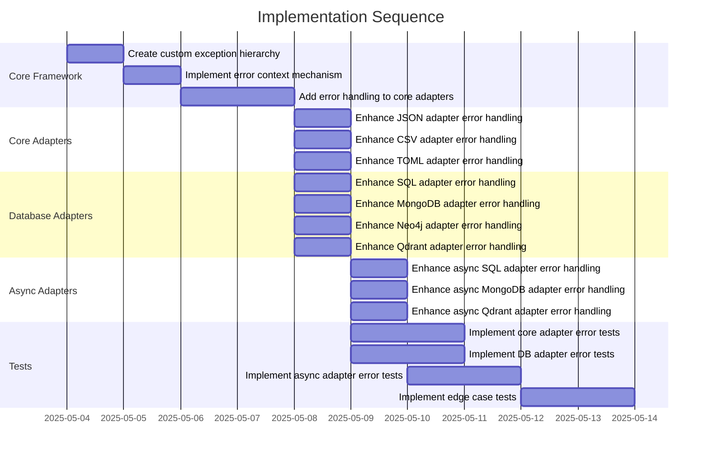

# Implementation Plan: Comprehensive Error Handling and Edge Case Tests

## 1. Overview

### 1.1 Component Purpose

This implementation focuses on enhancing the error handling capabilities and
test coverage for the pydapter library. The goal is to ensure that all adapters
properly handle edge cases, validate inputs, and provide meaningful error
messages when failures occur. This will improve the robustness and reliability
of the library, making it more resilient in real-world applications.

### 1.2 Design Reference

This implementation is based on Issue #20, which calls for comprehensive error
handling and edge case tests for the pydapter library.

### 1.3 Implementation Approach

We will follow a Test-Driven Development (TDD) approach:

1. First, we'll identify all potential error scenarios and edge cases for each
   adapter type
2. Write failing tests for each scenario
3. Implement or enhance error handling in the adapters to make the tests pass
4. Refactor the code to ensure it's clean and maintainable

The implementation will focus on both synchronous and asynchronous adapters,
covering all supported data formats and database integrations.

## 2. Implementation Phases

### 2.1 Phase 1: Core Adapter Error Handling

_Implement error handling for the core adapters (JSON, CSV, TOML)._

**Key Deliverables:**

- Enhanced error handling for missing values in all core adapters
- Special character handling in CSV adapter
- Boundary condition tests for all core adapters
- Custom exception classes for better error reporting

**Dependencies:**

- Existing core adapter implementations
- Pydantic validation mechanisms

**Estimated Complexity:** Medium

### 2.2 Phase 2: Database Adapter Error Handling

_Implement error handling for database adapters (SQL, PostgreSQL, MongoDB,
Qdrant, Neo4j)._

**Key Deliverables:**

- Connection error handling for all database adapters
- Query error handling
- Transaction failure handling
- Resource cleanup in error scenarios

**Dependencies:**

- Existing database adapter implementations
- Database-specific error types

**Estimated Complexity:** High

### 2.3 Phase 3: Async Adapter Error Handling

_Implement error handling for asynchronous adapters._

**Key Deliverables:**

- Async-specific error handling patterns
- Proper cancellation and cleanup of async resources
- Error propagation in async contexts

**Dependencies:**

- Existing async adapter implementations
- Understanding of asyncio error handling patterns

**Estimated Complexity:** High

### 2.4 Phase 4: Edge Case Testing

_Implement comprehensive edge case tests for all adapters._

**Key Deliverables:**

- Tests for extreme values
- Tests for malformed inputs
- Tests for resource constraints (memory, connections, etc.)
- Tests for concurrent access patterns

**Dependencies:**

- Enhanced error handling from previous phases

**Estimated Complexity:** Medium

## 3. Test Strategy

### 3.1 Unit Tests

#### 3.1.1 Test Group: Core Adapter Error Handling

| ID   | Description                                   | Fixtures/Mocks | Assertions                                         |
| ---- | --------------------------------------------- | -------------- | -------------------------------------------------- |
| UT-1 | Test JSON adapter with malformed JSON         | None           | JSONDecodeError is raised with meaningful message  |
| UT-2 | Test CSV adapter with missing headers         | None           | Appropriate error is raised                        |
| UT-3 | Test TOML adapter with syntax errors          | None           | TOML parsing error is raised                       |
| UT-4 | Test adapters with empty input                | None           | Appropriate error is raised                        |
| UT-5 | Test adapters with NULL bytes in input        | None           | NULL bytes are handled or appropriate error raised |
| UT-6 | Test CSV adapter with different dialects      | None           | CSV is correctly parsed with different dialects    |
| UT-7 | Test adapters with Unicode special characters | None           | Special characters are handled correctly           |

#### 3.1.2 Test Group: Database Adapter Error Handling

| ID    | Description                                        | Fixtures/Mocks | Assertions                                        |
| ----- | -------------------------------------------------- | -------------- | ------------------------------------------------- |
| UT-8  | Test SQL adapter with invalid connection string    | Mock DB        | ConnectionError is raised with meaningful message |
| UT-9  | Test SQL adapter with invalid table name           | Mock DB        | Appropriate error is raised                       |
| UT-10 | Test MongoDB adapter with authentication failure   | Mock DB        | AuthenticationError is raised                     |
| UT-11 | Test Neo4j adapter with connection timeout         | Mock DB        | TimeoutError is raised                            |
| UT-12 | Test Qdrant adapter with invalid vector dimensions | Mock DB        | ValidationError is raised                         |

#### 3.1.3 Test Group: Async Adapter Error Handling

| ID    | Description                                   | Fixtures/Mocks | Assertions                        |
| ----- | --------------------------------------------- | -------------- | --------------------------------- |
| UT-13 | Test async SQL adapter with connection errors | Mock DB        | ConnectionError is raised         |
| UT-14 | Test async MongoDB adapter with timeout       | Mock DB        | TimeoutError is raised            |
| UT-15 | Test async adapter cancellation               | Mock DB        | Resources are properly cleaned up |

### 3.2 Integration Tests

#### 3.2.1 Test Group: Database Integration Error Handling

| ID   | Description                                             | Setup                                          | Assertions                                                   |
| ---- | ------------------------------------------------------- | ---------------------------------------------- | ------------------------------------------------------------ |
| IT-1 | Test SQL adapter with real database connection failures | PostgreSQL container with network interruption | Connection errors are handled gracefully                     |
| IT-2 | Test MongoDB adapter with invalid queries               | MongoDB container with prepared data           | Query errors are handled with appropriate error messages     |
| IT-3 | Test Neo4j adapter with constraint violations           | Neo4j container with constraints               | Constraint violations are reported with clear error messages |

### 3.3 Mock and Stub Requirements

| Dependency        | Mock/Stub Type | Key Behaviors to Mock                                 |
| ----------------- | -------------- | ----------------------------------------------------- |
| SQLAlchemy Engine | Mock           | Connection errors, query errors, transaction failures |
| MongoDB Client    | Mock           | Connection errors, authentication failures, timeouts  |
| Neo4j Driver      | Mock           | Connection errors, query failures, constraint errors  |
| Qdrant Client     | Mock           | API errors, validation errors, timeout errors         |

## 4. Implementation Tasks

### 4.1 Core Error Handling Framework

| ID  | Task                                | Description                                                       | Dependencies | Priority | Complexity |
| --- | ----------------------------------- | ----------------------------------------------------------------- | ------------ | -------- | ---------- |
| T-1 | Create custom exception hierarchy   | Define a hierarchy of custom exceptions for different error types | None         | High     | Low        |
| T-2 | Implement error context mechanism   | Create a mechanism to attach context information to errors        | T-1          | High     | Medium     |
| T-3 | Add error handling to core adapters | Enhance core adapters with proper error handling                  | T-1, T-2     | High     | Medium     |

### 4.2 Core Adapter Error Handling

| ID  | Task                                | Description                                                      | Dependencies | Priority | Complexity |
| --- | ----------------------------------- | ---------------------------------------------------------------- | ------------ | -------- | ---------- |
| T-4 | Enhance JSON adapter error handling | Improve error handling in JSON adapter                           | T-3          | High     | Low        |
| T-5 | Enhance CSV adapter error handling  | Improve error handling in CSV adapter, including dialect support | T-3          | High     | Medium     |
| T-6 | Enhance TOML adapter error handling | Improve error handling in TOML adapter                           | T-3          | High     | Low        |

### 4.3 Database Adapter Error Handling

| ID   | Task                                   | Description                               | Dependencies | Priority | Complexity |
| ---- | -------------------------------------- | ----------------------------------------- | ------------ | -------- | ---------- |
| T-7  | Enhance SQL adapter error handling     | Improve error handling in SQL adapter     | T-3          | High     | Medium     |
| T-8  | Enhance MongoDB adapter error handling | Improve error handling in MongoDB adapter | T-3          | High     | Medium     |
| T-9  | Enhance Neo4j adapter error handling   | Improve error handling in Neo4j adapter   | T-3          | High     | Medium     |
| T-10 | Enhance Qdrant adapter error handling  | Improve error handling in Qdrant adapter  | T-3          | High     | Medium     |

### 4.4 Async Adapter Error Handling

| ID   | Task                                         | Description                                     | Dependencies | Priority | Complexity |
| ---- | -------------------------------------------- | ----------------------------------------------- | ------------ | -------- | ---------- |
| T-11 | Enhance async SQL adapter error handling     | Improve error handling in async SQL adapter     | T-7          | High     | High       |
| T-12 | Enhance async MongoDB adapter error handling | Improve error handling in async MongoDB adapter | T-8          | High     | High       |
| T-13 | Enhance async Qdrant adapter error handling  | Improve error handling in async Qdrant adapter  | T-10         | High     | High       |

### 4.5 Test Implementation

| ID   | Task                                | Description                                       | Dependencies        | Priority | Complexity |
| ---- | ----------------------------------- | ------------------------------------------------- | ------------------- | -------- | ---------- |
| T-14 | Implement core adapter error tests  | Create tests for core adapter error scenarios     | T-4, T-5, T-6       | High     | Medium     |
| T-15 | Implement DB adapter error tests    | Create tests for database adapter error scenarios | T-7, T-8, T-9, T-10 | High     | Medium     |
| T-16 | Implement async adapter error tests | Create tests for async adapter error scenarios    | T-11, T-12, T-13    | High     | High       |
| T-17 | Implement edge case tests           | Create tests for various edge cases               | T-14, T-15, T-16    | Medium   | Medium     |

## 5. Implementation Sequence



## 6. Acceptance Criteria

### 6.1 Component Level

| ID   | Criterion                                           | Validation Method               |
| ---- | --------------------------------------------------- | ------------------------------- |
| AC-1 | All adapters handle invalid inputs gracefully       | Unit tests pass                 |
| AC-2 | Database adapters handle connection errors properly | Integration tests pass          |
| AC-3 | Async adapters handle cancellation and cleanup      | Async tests pass                |
| AC-4 | Error messages are clear and actionable             | Manual review of error messages |
| AC-5 | Test coverage for error handling is at least 90%    | Coverage report                 |

### 6.2 API Level

| ID   | Criterion                                          | Validation Method               |
| ---- | -------------------------------------------------- | ------------------------------- |
| AC-6 | Custom exceptions provide context about the error  | Unit tests for exceptions       |
| AC-7 | Error handling doesn't leak implementation details | Manual review of error messages |
| AC-8 | Error handling is consistent across all adapters   | Manual review of code           |

## 7. Test Implementation Plan

### 7.1 Test Implementation Sequence

1. Implement tests for custom exceptions
2. Implement tests for core adapter error handling
3. Implement tests for database adapter error handling
4. Implement tests for async adapter error handling
5. Implement tests for edge cases

### 7.2 Test Code Examples

#### Unit Test Example for JSON Adapter

```python
def test_json_adapter_malformed_json():
    """Test that the JSON adapter properly handles malformed JSON."""
    class TestModel(Adaptable, BaseModel):
        id: int
        name: str
        value: float

    TestModel.register_adapter(JsonAdapter)

    # Test with malformed JSON
    with pytest.raises(json.JSONDecodeError) as exc_info:
        TestModel.adapt_from("{invalid json}", obj_key="json")

    # Verify the error message is helpful
    assert "Expecting property name" in str(exc_info.value)
```

#### Integration Test Example for Database Adapter

```python
def test_sql_adapter_connection_error(monkeypatch):
    """Test that the SQL adapter properly handles connection errors."""
    # Mock SQLAlchemy's create_engine to raise an error
    def mock_create_engine(*args, **kwargs):
        raise sqlalchemy.exc.SQLAlchemyError("Connection failed")

    monkeypatch.setattr(sqlalchemy, "create_engine", mock_create_engine)

    class TestModel(Adaptable, BaseModel):
        id: int
        name: str
        value: float

    TestModel.register_adapter(SQLAdapter)

    # Test with connection error
    with pytest.raises(Exception) as exc_info:
        TestModel.adapt_from({"engine_url": "invalid://url", "table": "test"}, obj_key="sql")

    # Verify the error message is helpful
    assert "Connection failed" in str(exc_info.value)
```

## 8. Implementation Risks and Mitigations

| Risk                                         | Impact | Likelihood | Mitigation                                                                                       |
| -------------------------------------------- | ------ | ---------- | ------------------------------------------------------------------------------------------------ |
| Database-specific errors may be hard to test | High   | Medium     | Use mocks and stubs for most tests, with a smaller set of integration tests using real databases |
| Async error handling is complex              | High   | High       | Research best practices for async error handling, use try/except/finally patterns consistently   |
| Error handling might impact performance      | Medium | Low        | Profile code before and after changes to ensure no significant performance regression            |
| Custom exceptions might break existing code  | High   | Low        | Ensure new exceptions inherit from appropriate base classes, maintain backward compatibility     |

## 9. Dependencies and Environment

### 9.1 External Libraries

| Library        | Version | Purpose                   |
| -------------- | ------- | ------------------------- |
| pytest         | ^7.0.0  | Testing framework         |
| pytest-asyncio | ^0.18.0 | Async testing support     |
| pytest-mock    | ^3.7.0  | Mocking support for tests |
| pytest-cov     | ^3.0.0  | Test coverage reporting   |

### 9.2 Environment Setup

```bash
# Create virtual environment
python -m venv venv
source venv/bin/activate

# Install dependencies
pip install -r requirements.txt

# Run tests
pytest tests/test_error_handling.py -v
```

## 10. Additional Resources

### 10.1 Reference Implementation

The existing error handling tests in `tests/test_error_handling.py` provide a
starting point for the enhanced error handling implementation.

### 10.2 Relevant Documentation

- [Pydantic validation documentation](https://docs.pydantic.dev/latest/usage/validation_errors/)
- [SQLAlchemy error handling](https://docs.sqlalchemy.org/en/20/core/exceptions.html)
- [Asyncio error handling](https://docs.python.org/3/library/asyncio-dev.html#error-handling)

### 10.3 Design Patterns

- Use of custom exception hierarchy for better error reporting
- Context manager pattern for resource cleanup
- Decorator pattern for consistent error handling across adapters
