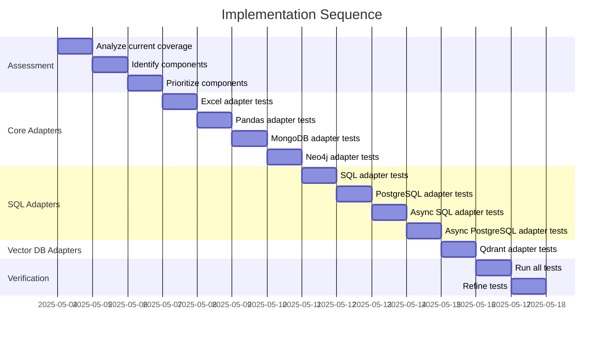

# Implementation Plan: Increase Test Coverage

## 1. Overview

### 1.1 Component Purpose

This implementation plan outlines the approach to increase test coverage in PR
#24 to meet the project requirement of ≥ 80% coverage. The focus is on adding
tests for adapter components that currently have low or no coverage.

### 1.2 Design Reference

This implementation is based on the existing test structure and patterns in the
project, particularly focusing on the adapter components that need additional
test coverage.

### 1.3 Implementation Approach

We'll follow a Test-Driven Development (TDD) approach, creating tests for each
adapter component that needs coverage. We'll use mocking to isolate the
components being tested and ensure that the tests are focused on the adapter
functionality rather than external dependencies.

## 2. Implementation Phases

### 2.1 Phase 1: Initial Assessment

**Key Deliverables:**

- Analyze current test coverage
- Identify components with low or no coverage
- Prioritize components for testing

**Dependencies:**

- Existing test suite
- Coverage reports

**Estimated Complexity:** Low

### 2.2 Phase 2: Implement Tests for Core Adapters

**Key Deliverables:**

- Tests for Excel adapter
- Tests for Pandas adapter
- Tests for MongoDB adapter
- Tests for Neo4j adapter

**Dependencies:**

- Understanding of adapter interfaces
- Mocking strategies for external dependencies

**Estimated Complexity:** Medium

### 2.3 Phase 3: Implement Tests for SQL Adapters

**Key Deliverables:**

- Tests for SQL adapter
- Tests for PostgreSQL adapter
- Tests for Async SQL adapter
- Tests for Async PostgreSQL adapter

**Dependencies:**

- Understanding of SQL adapter interfaces
- Mocking strategies for SQLAlchemy

**Estimated Complexity:** Medium

### 2.4 Phase 4: Implement Tests for Vector Database Adapters

**Key Deliverables:**

- Tests for Qdrant adapter

**Dependencies:**

- Understanding of vector database interfaces
- Mocking strategies for Qdrant client

**Estimated Complexity:** Medium

### 2.5 Phase 5: Verification and Refinement

**Key Deliverables:**

- Run all tests to verify coverage
- Refine tests as needed to reach ≥ 80% coverage

**Dependencies:**

- Completed tests from previous phases

**Estimated Complexity:** Low

## 3. Test Strategy

### 3.1 Unit Tests

#### 3.1.1 Test Group: Adapter Protocol Compliance

| ID   | Description                                             | Fixtures/Mocks | Assertions                                  |
| ---- | ------------------------------------------------------- | -------------- | ------------------------------------------- |
| UT-1 | Test that adapter implements the Adapter protocol       | None           | Adapter has required attributes and methods |
| UT-2 | Test that adapter methods can be called as classmethods | None           | Methods are callable                        |

#### 3.1.2 Test Group: Adapter Functionality

| ID   | Description                                           | Fixtures/Mocks       | Assertions                        |
| ---- | ----------------------------------------------------- | -------------------- | --------------------------------- |
| UT-3 | Test conversion from model to adapter-specific format | Mock adapter methods | Result matches expected value     |
| UT-4 | Test conversion from adapter-specific format to model | Mock adapter methods | Result matches expected model     |
| UT-5 | Test conversion with many=False                       | Mock adapter methods | Result is a single model instance |

#### 3.1.3 Test Group: Error Handling

| ID   | Description                        | Fixtures/Mocks       | Assertions                                |
| ---- | ---------------------------------- | -------------------- | ----------------------------------------- |
| UT-6 | Test handling of connection errors | Mock adapter methods | Exception is raised with expected message |
| UT-7 | Test handling of invalid data      | Mock adapter methods | Exception is raised with expected message |

### 3.2 Mock and Stub Requirements

| Dependency         | Mock/Stub Type | Key Behaviors to Mock                                                  |
| ------------------ | -------------- | ---------------------------------------------------------------------- |
| External Libraries | Mock           | Import and initialization, connection methods, data conversion methods |
| Adapter Methods    | Mock           | to_obj and from_obj methods                                            |

## 4. Implementation Tasks

### 4.1 Excel Adapter Tests

| ID  | Task                       | Description                                     | Dependencies | Priority | Complexity |
| --- | -------------------------- | ----------------------------------------------- | ------------ | -------- | ---------- |
| T-1 | Create Excel adapter tests | Implement tests for Excel adapter functionality | None         | High     | Medium     |

### 4.2 Pandas Adapter Tests

| ID  | Task                        | Description                                      | Dependencies | Priority | Complexity |
| --- | --------------------------- | ------------------------------------------------ | ------------ | -------- | ---------- |
| T-2 | Create Pandas adapter tests | Implement tests for Pandas adapter functionality | None         | High     | Medium     |

### 4.3 MongoDB Adapter Tests

| ID  | Task                         | Description                                       | Dependencies | Priority | Complexity |
| --- | ---------------------------- | ------------------------------------------------- | ------------ | -------- | ---------- |
| T-3 | Create MongoDB adapter tests | Implement tests for MongoDB adapter functionality | None         | High     | Medium     |

### 4.4 Neo4j Adapter Tests

| ID  | Task                       | Description                                     | Dependencies | Priority | Complexity |
| --- | -------------------------- | ----------------------------------------------- | ------------ | -------- | ---------- |
| T-4 | Create Neo4j adapter tests | Implement tests for Neo4j adapter functionality | None         | High     | Medium     |

### 4.5 SQL Adapter Tests

| ID  | Task                                  | Description                                                | Dependencies | Priority | Complexity |
| --- | ------------------------------------- | ---------------------------------------------------------- | ------------ | -------- | ---------- |
| T-5 | Create SQL adapter tests              | Implement tests for SQL adapter functionality              | None         | High     | Medium     |
| T-6 | Create PostgreSQL adapter tests       | Implement tests for PostgreSQL adapter functionality       | None         | High     | Medium     |
| T-7 | Create Async SQL adapter tests        | Implement tests for Async SQL adapter functionality        | None         | High     | Medium     |
| T-8 | Create Async PostgreSQL adapter tests | Implement tests for Async PostgreSQL adapter functionality | None         | High     | Medium     |

### 4.6 Vector Database Adapter Tests

| ID  | Task                        | Description                                      | Dependencies | Priority | Complexity |
| --- | --------------------------- | ------------------------------------------------ | ------------ | -------- | ---------- |
| T-9 | Create Qdrant adapter tests | Implement tests for Qdrant adapter functionality | None         | High     | Medium     |

### 4.7 Verification

| ID   | Task          | Description                                    | Dependencies | Priority | Complexity |
| ---- | ------------- | ---------------------------------------------- | ------------ | -------- | ---------- |
| T-10 | Run all tests | Run all tests to verify coverage               | T-1 to T-9   | High     | Low        |
| T-11 | Refine tests  | Refine tests as needed to reach ≥ 80% coverage | T-10         | High     | Medium     |

## 5. Implementation Sequence



## 6. Acceptance Criteria

### 6.1 Component Level

| ID   | Criterion                                   | Validation Method            |
| ---- | ------------------------------------------- | ---------------------------- |
| AC-1 | All adapter tests pass                      | Run pytest                   |
| AC-2 | Test coverage is ≥ 80%                      | Run pytest with --cov option |
| AC-3 | Tests follow project patterns and standards | Code review                  |

## 7. Test Implementation Plan

### 7.1 Test Implementation Sequence

1. Implement tests for adapter protocol compliance
2. Implement tests for adapter functionality
3. Implement tests for error handling
4. Run tests and verify coverage
5. Refine tests as needed

### 7.2 Test Code Examples

#### Adapter Protocol Compliance Test

```python
def test_adapter_protocol_compliance(self):
    """Test that Adapter implements the Adapter protocol."""
    # Verify required attributes
    assert hasattr(Adapter, "obj_key")
    assert isinstance(Adapter.obj_key, str)

    # Verify method signatures
    assert hasattr(Adapter, "from_obj")
    assert hasattr(Adapter, "to_obj")

    # Verify the methods can be called as classmethods
    assert callable(Adapter.from_obj)
    assert callable(Adapter.to_obj)
```

#### Adapter Functionality Test

```python
@patch("pydapter.extras.adapter_module.dependency")
def test_adapter_to_obj(self, mock_dependency, sample):
    """Test conversion from model to adapter-specific format."""
    # We need to patch the entire adapter's to_obj method
    with patch("pydapter.extras.adapter_module.Adapter.to_obj") as mock_to_obj:
        # Configure the mock to return an adapter-specific format
        expected_result = {"id": 1, "name": "test", "value": 42.5}
        mock_to_obj.return_value = expected_result

        # Test to_obj
        result = sample.adapt_to(obj_key="adapter_key")

        # Verify the result
        assert result == expected_result

        # Verify the mock was called with the correct arguments
        mock_to_obj.assert_called_once()
```

#### Error Handling Test

```python
@patch("pydapter.extras.adapter_module.dependency")
def test_adapter_connection_error(self, mock_dependency, sample):
    """Test handling of connection errors."""
    # Configure the mock to raise a connection error
    mock_dependency.connect.side_effect = Exception("Connection error")

    # We need to patch the entire adapter's to_obj method to pass through the error
    with patch("pydapter.extras.adapter_module.Adapter.to_obj", side_effect=Exception("Connection error")):
        # Test to_obj with connection error
        with pytest.raises(Exception, match="Connection error"):
            sample.adapt_to(obj_key="adapter_key", url="connection_url")
```

## 8. Implementation Risks and Mitigations

| Risk                                    | Impact | Likelihood | Mitigation                                                          |
| --------------------------------------- | ------ | ---------- | ------------------------------------------------------------------- |
| External dependencies not available     | High   | Medium     | Use mocking to isolate tests from external dependencies             |
| Tests not covering all code paths       | Medium | Medium     | Use coverage reports to identify uncovered code paths and add tests |
| Tests failing due to environment issues | Medium | Low        | Use consistent test environment and mocking strategies              |

## 9. Dependencies and Environment

### 9.1 External Libraries

| Library        | Version  | Purpose               |
| -------------- | -------- | --------------------- |
| pytest         | >=8.3.5  | Test framework        |
| pytest-cov     | >=4.1.0  | Coverage reporting    |
| pytest-asyncio | >=0.26.0 | Async test support    |
| pandas         | >=2.2    | Pandas adapter tests  |
| sqlalchemy     | >=2.0    | SQL adapter tests     |
| neo4j          | >=5.19   | Neo4j adapter tests   |
| motor          | >=3      | MongoDB adapter tests |

### 9.2 Environment Setup

```bash
# Install dependencies
uv pip install pytest pytest-cov pytest-asyncio pandas sqlalchemy neo4j motor
```

## 10. Additional Resources

### 10.1 Reference Implementation

Existing tests in the project, particularly in the `tests/` directory.

### 10.2 Relevant Documentation

- [pytest documentation](https://docs.pytest.org/)
- [pytest-cov documentation](https://pytest-cov.readthedocs.io/)
- [pytest-asyncio documentation](https://pytest-asyncio.readthedocs.io/)

### 10.3 Design Patterns

- Test-Driven Development (TDD)
- Mocking external dependencies
- Fixture-based test setup
