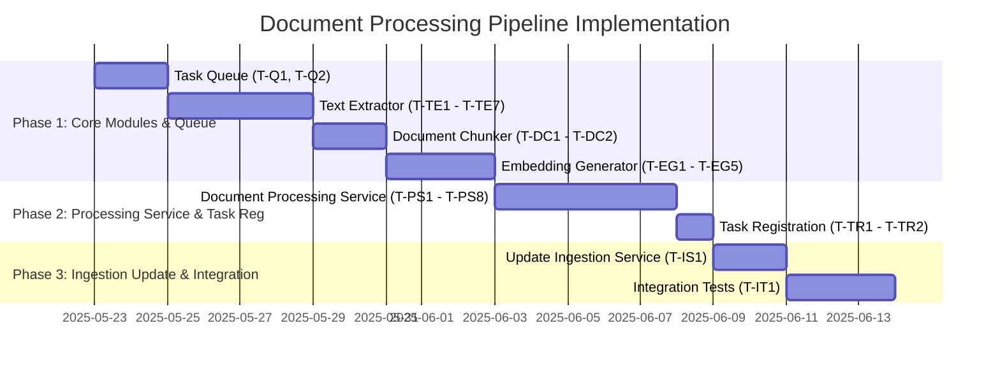

# Guidance

**Purpose** Plan out the entire coding effort before writing code. Clarify
**phases**, **tasks**, dependencies, test strategy, and acceptance criteria.

**When to Use**

- After design is approved, before actual implementation starts.

**Best Practices**

- Include TDD approach details (e.g., required test coverage).
- Provide a clear sequence of tasks.
- Reference external docs or prior designs.

---

# Implementation Plan: Reader Microservice - Document Processing Pipeline

## 1. Overview

### 1.1 Component Purpose

This implementation plan details the steps to build the core document processing
pipeline for the Khive Reader Microservice. This includes:

- An asynchronous task queue system.
- A text extraction module for various document formats (PDF, DOCX, HTML, TXT).
- A text chunking module.
- An embedding generation module using OpenAI API with a Sentence Transformers
  fallback.
- A document processing service to orchestrate these components.
- Integration of this pipeline into the existing ingestion service.

### 1.2 Design Reference

The primary design reference for this implementation is **Issue #27: "Implement
background worker and document processing pipeline"**. All specifications, code
snippets, and structural details are derived from this issue.

### 1.3 Implementation Approach

The implementation will strictly follow Test-Driven Development (TDD)
principles. Each module and service will be developed with corresponding unit
tests aiming for at least 80% code coverage. The development will proceed by
creating individual components first, followed by their integration into the
`DocumentProcessingService`, and finally updating the ingestion service.

## 2. Implementation Phases

### 2.1 Phase 1: Core Processing Modules & Task Queue

_Description: Develop the foundational components for task management and the
initial stages of document processing._

**Key Deliverables:**

- `src/khive/reader/tasks/queue.py`: `AsyncTaskQueue` implementation.
- `src/khive/reader/processing/text_extraction.py`: `TextExtractor` class.
- `src/khive/reader/processing/chunking.py`: `DocumentChunker` class.
- `src/khive/reader/processing/embeddings.py`: `EmbeddingGenerator` class.
- Unit tests for all above modules.

**Dependencies:**

- Python 3.x, `asyncio`
- `PyPDF2` (for PDF)
- `python-docx` (for DOCX)
- `html2text` (for HTML)
- `openai` (for OpenAI embeddings)
- `sentence-transformers` (for fallback embeddings)

**Estimated Complexity:** Medium

### 2.2 Phase 2: Document Processing Service & Task Registration

_Description: Integrate the core modules into a cohesive service and set up task
registration._

**Key Deliverables:**

- `src/khive/reader/services/processing_service.py`: `DocumentProcessingService`
  implementation.
- `src/khive/reader/tasks/__init__.py`: Registration of `process_document_task`.
- Unit tests for `DocumentProcessingService`.

**Dependencies:**

- All deliverables from Phase 1.
- `DocumentRepository` (existing or to be mocked).
- `DocumentChunkRepository` (existing or to be mocked).
- `ObjectStorageClient` (existing or to be mocked).

**Estimated Complexity:** Medium

### 2.3 Phase 3: Update Ingestion Service & Integration Testing

_Description: Modify the existing ingestion service to utilize the new task
queue and conduct integration testing of the entire pipeline._

**Key Deliverables:**

- Modified ingestion service (specific file path to be confirmed based on
  existing structure, likely within `src/khive/reader/services/`).
- Integration tests covering the flow from ingestion to embedding storage.

**Dependencies:**

- All deliverables from Phase 2.
- Existing Ingestion Service.

**Estimated Complexity:** Medium

## 3. Test Strategy

### 3.1 Unit Tests

#### 3.1.1 Test Group: Task Queue (`queue.py`)

| ID    | Description                                      | Fixtures/Mocks   | Assertions                                       |
| ----- | ------------------------------------------------ | ---------------- | ------------------------------------------------ |
| UT-Q1 | Test submitting a task to an empty queue         | None             | Queue size increases, task is retrievable        |
| UT-Q2 | Test retrieving a task from a non-empty queue    | Pre-filled queue | Task is returned, queue size decreases           |
| UT-Q3 | Test retrieving a task from an empty queue       | Empty queue      | Returns `None` or raises appropriate exception   |
| UT-Q4 | Test `get_task` blocks until a task is available | `asyncio.Event`  | `get_task` waits and then returns submitted task |
| UT-Q5 | Test `task_done` functionality                   | Active task      | Task count decreases                             |

#### 3.1.2 Test Group: Text Extractor (`text_extraction.py`)

| ID     | Description                                       | Fixtures/Mocks          | Assertions                                      |
| ------ | ------------------------------------------------- | ----------------------- | ----------------------------------------------- |
| UT-TE1 | Test text extraction from a valid PDF file        | Sample PDF file         | Extracted text matches expected content         |
| UT-TE2 | Test text extraction from a valid DOCX file       | Sample DOCX file        | Extracted text matches expected content         |
| UT-TE3 | Test text extraction from a valid HTML file       | Sample HTML file        | Extracted text matches expected content         |
| UT-TE4 | Test text extraction from a valid TXT file        | Sample TXT file         | Extracted text matches expected content         |
| UT-TE5 | Test handling of unsupported file type            | Sample unsupported file | Raises `ValueError` or specific exception       |
| UT-TE6 | Test handling of a corrupted/empty supported file | Corrupted PDF           | Handles gracefully, returns empty or logs error |

#### 3.1.3 Test Group: Document Chunker (`chunking.py`)

| ID     | Description                                     | Fixtures/Mocks    | Assertions                                                   |
| ------ | ----------------------------------------------- | ----------------- | ------------------------------------------------------------ |
| UT-DC1 | Test chunking text smaller than chunk size      | Short text string | Returns a single chunk identical to input                    |
| UT-DC2 | Test chunking text larger than chunk size       | Long text string  | Returns multiple chunks, each not exceeding `max_chunk_size` |
| UT-DC3 | Test chunk overlap functionality                | Long text string  | Overlapping parts of consecutive chunks match                |
| UT-DC4 | Test with zero chunk size or overlap (if valid) | Text string       | Behaves as expected (e.g., error or default)                 |

#### 3.1.4 Test Group: Embedding Generator (`embeddings.py`)

| ID     | Description                                            | Fixtures/Mocks                                   | Assertions                                                             |
| ------ | ------------------------------------------------------ | ------------------------------------------------ | ---------------------------------------------------------------------- |
| UT-EG1 | Test generating embeddings using OpenAI (mocked)       | Mock `openai.Embedding.create`                   | Returns expected embedding format, OpenAI client called correctly      |
| UT-EG2 | Test fallback to Sentence Transformers if OpenAI fails | Mock `openai.Embedding.create` to raise error    | Sentence Transformers model is used, returns expected embedding format |
| UT-EG3 | Test direct use of Sentence Transformers (mocked)      | Mock `SentenceTransformer.encode`                | Returns expected embedding format, model called correctly              |
| UT-EG4 | Test handling of empty text list                       | Empty list of texts                              | Returns empty list or handles gracefully                               |
| UT-EG5 | Test OpenAI API error handling (e.g., rate limit)      | Mock `openai.Embedding.create` to raise APIError | Logs error, potentially retries or falls back                          |

#### 3.1.5 Test Group: Document Processing Service (`services/processing_service.py`)

| ID     | Description                                                        | Fixtures/Mocks                                                                                                                        | Assertions                                                                                           |
| ------ | ------------------------------------------------------------------ | ------------------------------------------------------------------------------------------------------------------------------------- | ---------------------------------------------------------------------------------------------------- |
| UT-PS1 | Test successful processing of a document (happy path)              | Mock `ObjectStorageClient`, `TextExtractor`, `DocumentChunker`, `EmbeddingGenerator`, `DocumentRepository`, `DocumentChunkRepository` | All steps are called in order, document status updated to `PROCESSED`, chunks and embeddings stored. |
| UT-PS2 | Test handling of text extraction failure                           | Mock `TextExtractor` to raise error                                                                                                   | Document status updated to `ERROR_EXTRACTION`, error logged.                                         |
| UT-PS3 | Test handling of chunking failure                                  | Mock `DocumentChunker` to raise error                                                                                                 | Document status updated to `ERROR_CHUNKING`, error logged.                                           |
| UT-PS4 | Test handling of embedding generation failure                      | Mock `EmbeddingGenerator` to raise error                                                                                              | Document status updated to `ERROR_EMBEDDING`, error logged.                                          |
| UT-PS5 | Test handling of object storage download failure                   | Mock `ObjectStorageClient.download_file` to raise error                                                                               | Document status updated to `ERROR_DOWNLOADING`, error logged.                                        |
| UT-PS6 | Test interaction with `DocumentRepository` for status updates      | Mock `DocumentRepository`                                                                                                             | `update_status` method called with correct statuses at each stage.                                   |
| UT-PS7 | Test interaction with `DocumentChunkRepository` for storing chunks | Mock `DocumentChunkRepository`                                                                                                        | `create_many` or similar method called with correct chunk data.                                      |

### 3.2 Integration Tests

#### 3.2.1 Test Group: Full Document Processing Pipeline

| ID    | Description                                                                  | Setup                                                                                                                               | Assertions                                                                                                                                      |
| ----- | ---------------------------------------------------------------------------- | ----------------------------------------------------------------------------------------------------------------------------------- | ----------------------------------------------------------------------------------------------------------------------------------------------- |
| IT-P1 | Process a PDF document from task queue to embedding storage                  | Real `AsyncTaskQueue`, mocked external services (OpenAI, Object Storage), real processing modules, mocked repositories. Sample PDF. | Task is picked up, document processed, status updated, text extracted, chunks created, embeddings generated and "stored" (via mock repository). |
| IT-P2 | Process a DOCX document similarly                                            | Sample DOCX. Other setup as IT-P1.                                                                                                  | Similar to IT-P1 for DOCX.                                                                                                                      |
| IT-P3 | Test pipeline with OpenAI API failure, ensuring fallback to local embeddings | Setup as IT-P1, but configure OpenAI mock to fail.                                                                                  | Pipeline completes using Sentence Transformers, embeddings are generated.                                                                       |

#### 3.2.2 Test Group: Ingestion Service Integration

| ID    | Description                                                              | Setup                                                                                                    | Assertions                                                                                                                                  |
| ----- | ------------------------------------------------------------------------ | -------------------------------------------------------------------------------------------------------- | ------------------------------------------------------------------------------------------------------------------------------------------- |
| IT-I1 | Ingestion service queues a document, and it gets processed by the worker | Real Ingestion Service (or relevant part), real `AsyncTaskQueue`, worker running `process_document_task` | Document is added to queue by ingestion, worker picks it up, processing service is invoked, document status eventually becomes `PROCESSED`. |

### 3.3 Mock and Stub Requirements

| Dependency                | Mock/Stub Type | Key Behaviors to Mock                                                                |
| ------------------------- | -------------- | ------------------------------------------------------------------------------------ |
| `DocumentRepository`      | Mock           | `get_by_id`, `update_status`, `set_processed_text_path`                              |
| `DocumentChunkRepository` | Mock           | `create_many_chunks_with_embeddings` (or similar for storing chunks and embeddings)  |
| `ObjectStorageClient`     | Mock           | `download_file_to_temp`, `upload_file` (if processed text is stored back)            |
| `openai.Embedding`        | Mock           | `create` method, raising various `openai` exceptions (APIError, RateLimitError etc.) |
| `sentence_transformers`   | Mock           | `SentenceTransformer` class, `encode` method.                                        |
| `TextExtractor`           | Mock           | `extract_text` method (for testing `DocumentProcessingService` in isolation)         |
| `DocumentChunker`         | Mock           | `chunk_text` method (for testing `DocumentProcessingService` in isolation)           |
| `EmbeddingGenerator`      | Mock           | `generate_embeddings` method (for testing `DocumentProcessingService` in isolation)  |

## 4. Implementation Tasks

### 4.1 Task Queue (`src/khive/reader/tasks/queue.py`)

| ID   | Task                                  | Description                                                                   | Dependencies | Priority | Complexity |
| ---- | ------------------------------------- | ----------------------------------------------------------------------------- | ------------ | -------- | ---------- |
| T-Q1 | Implement `AsyncTaskQueue` class      | Based on `asyncio.Queue` with methods `submit_task`, `get_task`, `task_done`. | `asyncio`    | High     | Low        |
| T-Q2 | Write unit tests for `AsyncTaskQueue` | Cover submission, retrieval, empty queue, blocking `get_task`.                | T-Q1         | High     | Low        |

### 4.2 Text Extraction (`src/khive/reader/processing/text_extraction.py`)

| ID    | Task                                               | Description                                                                   | Dependencies               | Priority | Complexity |
| ----- | -------------------------------------------------- | ----------------------------------------------------------------------------- | -------------------------- | -------- | ---------- |
| T-TE1 | Implement `TextExtractor` class                    | Method `extract_text(file_path: Path, mime_type: str) -> str`.                | `pathlib`                  | High     | Low        |
| T-TE2 | Add PDF extraction logic                           | Use `PyPDF2`.                                                                 | T-TE1, `PyPDF2`            | High     | Medium     |
| T-TE3 | Add DOCX extraction logic                          | Use `python-docx`.                                                            | T-TE1, `python-docx`       | High     | Medium     |
| T-TE4 | Add HTML extraction logic                          | Use `html2text`.                                                              | T-TE1, `html2text`         | High     | Medium     |
| T-TE5 | Add TXT extraction logic                           | Simple file read.                                                             | T-TE1                      | High     | Low        |
| T-TE6 | Implement error handling for unsupported/bad files | Raise `ValueError` for unsupported, handle exceptions from parsing libraries. | T-TE2, T-TE3, T-TE4, T-TE5 | High     | Medium     |
| T-TE7 | Write unit tests for `TextExtractor`               | Cover all supported formats, error cases, corrupted files.                    | T-TE1 to T-TE6             | High     | Medium     |

### 4.3 Text Chunking (`src/khive/reader/processing/chunking.py`)

| ID    | Task                                   | Description                                                                   | Dependencies | Priority | Complexity |
| ----- | -------------------------------------- | ----------------------------------------------------------------------------- | ------------ | -------- | ---------- |
| T-DC1 | Implement `DocumentChunker` class      | Method `chunk_text(text: str) -> List[str]`, configurable chunk size/overlap. | None         | High     | Medium     |
| T-DC2 | Write unit tests for `DocumentChunker` | Cover various text lengths, overlap, edge cases.                              | T-DC1        | High     | Medium     |

### 4.4 Embedding Generation (`src/khive/reader/processing/embeddings.py`)

| ID    | Task                                           | Description                                                                                              | Dependencies                      | Priority | Complexity |
| ----- | ---------------------------------------------- | -------------------------------------------------------------------------------------------------------- | --------------------------------- | -------- | ---------- |
| T-EG1 | Implement `EmbeddingGenerator` class           | Method `generate_embeddings(texts: List[str]) -> List[List[float]]`. Configurable OpenAI model, API key. | `openai`, `sentence-transformers` | High     | Medium     |
| T-EG2 | Implement OpenAI embedding generation logic    | Call `openai.Embedding.create`.                                                                          | T-EG1, `openai`                   | High     | Medium     |
| T-EG3 | Implement Sentence Transformers fallback logic | If OpenAI fails or is not configured, use local `SentenceTransformer` model.                             | T-EG1, `sentence-transformers`    | High     | Medium     |
| T-EG4 | Handle API errors from OpenAI gracefully       | Catch exceptions, log, and trigger fallback.                                                             | T-EG2                             | High     | Medium     |
| T-EG5 | Write unit tests for `EmbeddingGenerator`      | Cover OpenAI success, failure/fallback, direct Sentence Transformers use, error handling.                | T-EG1 to T-EG4                    | High     | Medium     |

### 4.5 Document Processing Service (`src/khive/reader/services/processing_service.py`)

| ID    | Task                                                                 | Description                                                                                                                                       | Dependencies                                   | Priority | Complexity |
| ----- | -------------------------------------------------------------------- | ------------------------------------------------------------------------------------------------------------------------------------------------- | ---------------------------------------------- | -------- | ---------- |
| T-PS1 | Implement `DocumentProcessingService` class                          | Constructor takes repositories, object storage client, text extractor, chunker, embedder. Method `process_document(document_id: str)`.            | T-TE1, T-DC1, T-EG1, Repositories, ObjectStore | High     | Medium     |
| T-PS2 | Implement document download logic                                    | Use `ObjectStorageClient` to download file. Update status to `DOWNLOADING`, `DOWNLOADED`, or `ERROR_DOWNLOADING`.                                 | T-PS1                                          | High     | Medium     |
| T-PS3 | Implement text extraction step                                       | Use `TextExtractor`. Store extracted text (e.g., to object storage or temp file). Update status to `EXTRACTING`, `EXTRACTED`, `ERROR_EXTRACTION`. | T-PS2                                          | High     | Medium     |
| T-PS4 | Implement text chunking step                                         | Use `DocumentChunker`. Update status to `CHUNKING`, `CHUNKED`, `ERROR_CHUNKING`.                                                                  | T-PS3                                          | High     | Medium     |
| T-PS5 | Implement embedding generation step                                  | Use `EmbeddingGenerator` for chunks. Update status to `EMBEDDING`, `EMBEDDED`, `ERROR_EMBEDDING`.                                                 | T-PS4                                          | High     | Medium     |
| T-PS6 | Implement storage of chunks and embeddings                           | Use `DocumentChunkRepository`.                                                                                                                    | T-PS5                                          | High     | Medium     |
| T-PS7 | Implement final document status update to `PROCESSED` or error state | Use `DocumentRepository`.                                                                                                                         | T-PS6                                          | High     | Medium     |
| T-PS8 | Write unit tests for `DocumentProcessingService`                     | Mock dependencies, test full flow, error handling at each step, status updates.                                                                   | T-PS1 to T-PS7                                 | High     | High       |

### 4.6 Task Registration & Ingestion Update (`src/khive/reader/tasks/__init__.py` & Ingestion Service)

| ID    | Task                                                                 | Description                                                                                                               | Dependencies                            | Priority | Complexity |
| ----- | -------------------------------------------------------------------- | ------------------------------------------------------------------------------------------------------------------------- | --------------------------------------- | -------- | ---------- |
| T-TR1 | Create `process_document_task(document_id: str)` in `tasks`          | This task will instantiate `DocumentProcessingService` and call `process_document`.                                       | T-PS1, T-Q1                             | High     | Low        |
| T-TR2 | Register `process_document_task` with the `AsyncTaskQueue` worker    | Ensure the worker picks up and executes this task. (Worker implementation details might be part of Issue #27 or assumed). | T-TR1                                   | High     | Low        |
| T-IS1 | Modify existing Ingestion Service                                    | Update it to submit `document_id` to `AsyncTaskQueue` using `submit_task` instead of processing synchronously.            | T-Q1, Existing Ingestion Service        | High     | Medium     |
| T-IT1 | Write integration tests for the updated Ingestion Service & pipeline | Verify end-to-end flow from ingestion to document processing completion.                                                  | T-IS1, T-TR2, All processing components | High     | High       |

## 5. Implementation Sequence



## 6. Acceptance Criteria

### 6.1 Component Level

| ID   | Criterion                                                                                                                                                                     | Validation Method                                     |
| ---- | ----------------------------------------------------------------------------------------------------------------------------------------------------------------------------- | ----------------------------------------------------- |
| AC-1 | Documents of types PDF, DOCX, HTML, TXT are successfully processed end-to-end.                                                                                                | Integration Tests (IT-P1, IT-P2), Manual Verification |
| AC-2 | Text is correctly extracted from supported document types.                                                                                                                    | Unit Tests (UT-TE*), Manual Verification              |
| AC-3 | Extracted text is correctly chunked according to specified parameters.                                                                                                        | Unit Tests (UT-DC*), Manual Verification              |
| AC-4 | Embeddings are generated for text chunks using OpenAI, with a fallback to Sentence Transformers.                                                                              | Unit Tests (UT-EG*), Integration Tests (IT-P3)        |
| AC-5 | Document status (`DOWNLOADING`, `EXTRACTING`, `CHUNKING`, `EMBEDDING`, `PROCESSED`, various `ERROR_*` states) is accurately updated in the `DocumentRepository`.              | Unit Tests (UT-PS*), Integration Tests                |
| AC-6 | Chunks and their embeddings are correctly stored via `DocumentChunkRepository`.                                                                                               | Unit Tests (UT-PS*), Integration Tests                |
| AC-7 | Errors during any stage of processing (download, extraction, chunking, embedding) are handled gracefully, logged, and result in an appropriate error status for the document. | Unit Tests (UT-PS*), Integration Tests                |

### 6.2 Task Queue & Ingestion Level

| ID   | Criterion                                                                                                 | Validation Method        |
| ---- | --------------------------------------------------------------------------------------------------------- | ------------------------ |
| AC-8 | Submitting a document ID to the `AsyncTaskQueue` via the (updated) Ingestion Service triggers processing. | Integration Test (IT-I1) |
| AC-9 | The `AsyncTaskQueue` correctly manages and dispatches tasks to workers.                                   | Unit Tests (UT-Q*)       |

## 7. Test Implementation Plan

A detailed Test Implementation (TI) plan, `TI-27.md`, will be created. It will
include:

- Detailed test cases for each unit test group outlined in section 3.1.
- Specific scenarios for integration tests.
- Examples of test code structure and mock usage.
- Strategy for achieving >=80% test coverage for new modules.

## 8. Implementation Risks and Mitigations

| Risk                                                | Impact | Likelihood | Mitigation                                                                                                                                                                               |
| --------------------------------------------------- | ------ | ---------- | ---------------------------------------------------------------------------------------------------------------------------------------------------------------------------------------- |
| OpenAI API unavailability, rate limits, or errors   | High   | Medium     | Implement robust retry mechanisms (e.g., exponential backoff). Ensure reliable fallback to Sentence Transformers. Comprehensive logging.                                                 |
| Sentence Transformers model download/compatibility  | Medium | Low        | Pre-test model compatibility. Ensure model is bundled or downloaded correctly during setup.                                                                                              |
| Difficulty parsing diverse/corrupted document files | Medium | Medium     | Use battle-tested libraries (`PyPDF2`, `python-docx`, `html2text`). Implement thorough error handling within `TextExtractor`. Test with a wide variety of sample files.                  |
| Performance bottlenecks with large files/many tasks | Medium | Medium     | Design for asynchronous processing. Profile and optimize critical sections (extraction, chunking, embedding) if necessary post-MVP. Consider streaming for very large files if feasible. |
| Complex interactions between services/repositories  | Medium | Medium     | Clear API contracts (even if internal). Comprehensive integration tests. Thorough mocking for unit tests to isolate components.                                                          |
| Dependency management and conflicts                 | Low    | Low        | Use `uv` for dependency management. Add new dependencies to `pyproject.toml` and verify with `uv sync`.                                                                                  |

## 9. Dependencies and Environment

### 9.1 External Libraries

| Library                 | Version      | Purpose                                          |
| ----------------------- | ------------ | ------------------------------------------------ |
| `openai`                | `^1.0.0`     | OpenAI API client for embeddings                 |
| `sentence-transformers` | `^2.2.0`     | Local embedding generation (fallback)            |
| `PyPDF2`                | `^3.0.0`     | PDF text extraction                              |
| `python-docx`           | `^1.0.0`     | DOCX text extraction                             |
| `html2text`             | `^2020.1.16` | HTML to text conversion                          |
| `asyncio`               | (std lib)    | Asynchronous programming                         |
| `pydantic`              | `^2.0.0`     | (Likely used for models, confirm if needed here) |

_(Versions are illustrative and should be confirmed/updated as per project
standards)_

### 9.2 Environment Setup

```bash
# Ensure project is initialized with khive init / uv sync
# Add new dependencies to pyproject.toml:
# openai, sentence-transformers, PyPDF2, python-docx, html2text

# Example of adding to pyproject.toml under [project.dependencies] or [project.optional-dependencies]
# "openai >=1.0.0",
# "sentence-transformers >=2.2.0",
# "PyPDF2 >=3.0.0",
# "python-docx >=1.0.0",
# "html2text >=2020.1.16"

uv sync # To install new dependencies

# Environment variables for OpenAI API Key
export OPENAI_API_KEY="your_api_key_here"
```

## 10. Additional Resources

### 10.1 Design Reference

- GitHub Issue #27: "Implement background worker and document processing
  pipeline"

### 10.2 Relevant Documentation

- OpenAI API Documentation:
  [https://platform.openai.com/docs/api-reference/embeddings](https://platform.openai.com/docs/api-reference/embeddings)
- Sentence Transformers Documentation:
  [https://www.sbert.net/](https://www.sbert.net/)
- PyPDF2, python-docx, html2text library documentation.

### 10.3 Design Patterns

- **Task Queue:** For decoupling task submission from execution.
- **Strategy Pattern:** Potentially within `TextExtractor` for different file
  types, or `EmbeddingGenerator` for different embedding providers (though
  direct conditional logic might suffice initially).
- **Repository Pattern:** For abstracting data access (assumed to be existing).
