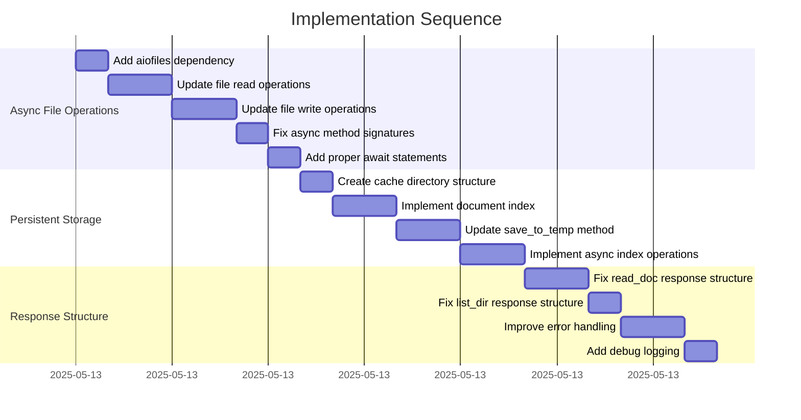

# Implementation Plan: Reader Service Async Operations Fix

## 1. Overview

### 1.1 Component Purpose

The khive Reader Service is a critical component of the khive MCP server that
provides document reading capabilities. It allows users to:

- Open documents from local files or remote URLs
- Read partial content from documents with offset control
- List files in directories with optional filtering

The service supports various document formats including PDF, DOCX, HTML, and
plain text, converting them to a consistent text format for consumption by other
components.

### 1.2 Design Reference

This implementation was a hotfix to address issues with mixing synchronous and
asynchronous operations in the reader service. The primary reference was the
existing codebase and best practices for async Python programming.

### 1.3 Implementation Approach

The implementation followed these key principles:

1. **Identify and fix async/sync issues**: Replace all synchronous file
   operations with asynchronous alternatives
2. **Improve persistence**: Implement persistent storage for documents in a
   dedicated cache directory
3. **Enhance error handling**: Add more comprehensive error checking and
   reporting
4. **Maintain API compatibility**: Ensure all changes maintain backward
   compatibility with existing API contracts

## 2. Implementation Phases

### 2.1 Phase 1: Async File Operations

Implementation of proper asynchronous file operations to prevent blocking the
event loop.

**Key Deliverables:**

- Replace synchronous file operations with aiofiles
- Ensure all async methods properly await file operations
- Fix inconsistent async/await usage in method calls

**Dependencies:**

- aiofiles library
- Existing reader service implementation

**Estimated Complexity:** Medium

### 2.2 Phase 2: Persistent Storage

Implementation of persistent storage for documents in a dedicated cache
directory.

**Key Deliverables:**

- Create a dedicated cache directory (.khive/reader_cache/)
- Implement index file for tracking document metadata
- Ensure documents persist between server restarts

**Dependencies:**

- Phase 1 completion
- File system access permissions

**Estimated Complexity:** Medium

### 2.3 Phase 3: Response Structure Improvements

Refinement of the response structure to ensure consistency with the expected API
contract.

**Key Deliverables:**

- Fix response structure for read operations
- Ensure proper use of ReaderReadResponseContent and PartialChunk classes
- Improve error reporting in responses

**Dependencies:**

- Phase 1 and 2 completion
- Understanding of the expected response structure

**Estimated Complexity:** Low

## 3. Test Strategy

### 3.1 Manual Tests

Since this was a hotfix implementation, testing was primarily manual. The
following test scenarios were executed:

#### 3.1.1 Test Group: Basic Operations

| ID   | Description                                        | Test Method                                               | Expected Result                                |
| ---- | -------------------------------------------------- | --------------------------------------------------------- | ---------------------------------------------- |
| MT-1 | Test listing files in a directory                  | Use MCP tool to list files in current directory           | Successful response with list of files         |
| MT-2 | Test opening a local file                          | Use MCP tool to open README.md                            | Successful response with document ID and stats |
| MT-3 | Test reading content from an opened file           | Use MCP tool to read content from opened file             | Successful response with file content          |
| MT-4 | Test opening a remote PDF                          | Use MCP tool to open an arXiv PDF                         | Successful response with document ID and stats |
| MT-5 | Test reading partial content from a large document | Use MCP tool to read a slice of a large document          | Successful response with partial content       |
| MT-6 | Test persistence across server restarts            | Restart server and try to read previously opened document | Document should still be accessible            |

### 3.2 Future Test Recommendations

For future development, the following automated tests should be implemented:

#### 3.2.1 Unit Tests

| ID   | Description                                                    | Fixtures/Mocks                | Assertions                                             |
| ---- | -------------------------------------------------------------- | ----------------------------- | ------------------------------------------------------ |
| UT-1 | Test that _read_doc returns expected content for valid input   | Mock file system              | Response contains expected content                     |
| UT-2 | Test that _read_doc handles missing files appropriately        | Mock file system with no file | Response contains appropriate error message            |
| UT-3 | Test that _open_doc correctly processes different file formats | Mock document converter       | Response contains correct document information         |
| UT-4 | Test that _list_dir correctly filters files by extension       | Mock file system              | Response contains only files with specified extensions |

#### 3.2.2 Integration Tests

| ID   | Description                                                  | Setup                                                    | Assertions                                             |
| ---- | ------------------------------------------------------------ | -------------------------------------------------------- | ------------------------------------------------------ |
| IT-1 | Test that reader service can open and read local files       | Create temporary test files                              | Service can open and read the files correctly          |
| IT-2 | Test that reader service can open and read remote documents  | Set up mock HTTP server with test documents              | Service can fetch, open, and read the remote documents |
| IT-3 | Test that reader service persists documents between restarts | Open document, restart service, attempt to read document | Document content should be accessible after restart    |

### 3.3 Mock and Stub Requirements

| Dependency         | Mock/Stub Type | Key Behaviors to Mock                          |
| ------------------ | -------------- | ---------------------------------------------- |
| Document Converter | Mock           | Document conversion for different file formats |
| File System        | Stub           | File existence, reading, writing operations    |
| HTTP Client        | Mock           | Responses for remote document fetching         |

## 4. Implementation Tasks

### 4.1 Async File Operations

| ID  | Task                         | Description                                                  | Dependencies | Priority | Complexity |
| --- | ---------------------------- | ------------------------------------------------------------ | ------------ | -------- | ---------- |
| T-1 | Add aiofiles dependency      | Install and import the aiofiles library                      | None         | High     | Low        |
| T-2 | Update file read operations  | Replace synchronous read operations with async alternatives  | T-1          | High     | Medium     |
| T-3 | Update file write operations | Replace synchronous write operations with async alternatives | T-1          | High     | Medium     |
| T-4 | Fix async method signatures  | Ensure all methods called from async methods are also async  | None         | High     | Low        |
| T-5 | Add proper await statements  | Add await statements for all async method calls              | T-4          | High     | Low        |

### 4.2 Persistent Storage

| ID  | Task                             | Description                                                | Dependencies | Priority | Complexity |
| --- | -------------------------------- | ---------------------------------------------------------- | ------------ | -------- | ---------- |
| T-6 | Create cache directory structure | Implement code to create and manage the cache directory    | None         | High     | Low        |
| T-7 | Implement document index         | Create an index to track document metadata                 | T-6          | High     | Medium     |
| T-8 | Update save_to_temp method       | Modify the method to save documents to the cache directory | T-6, T-7     | High     | Medium     |
| T-9 | Implement async index operations | Add async methods for loading and saving the index         | T-7          | Medium   | Medium     |

### 4.3 Response Structure

| ID   | Task                            | Description                                                     | Dependencies | Priority | Complexity |
| ---- | ------------------------------- | --------------------------------------------------------------- | ------------ | -------- | ---------- |
| T-10 | Fix read_doc response structure | Update the response structure to use the correct content format | T-2          | High     | Medium     |
| T-11 | Fix list_dir response structure | Update the response structure to return files directly          | None         | High     | Low        |
| T-12 | Improve error handling          | Add more comprehensive error checking and reporting             | None         | Medium   | Medium     |
| T-13 | Add debug logging               | Add debug print statements to aid in troubleshooting            | None         | Low      | Low        |

## 5. Implementation Sequence



## 6. Acceptance Criteria

### 6.1 Component Level

| ID   | Criterion                                             | Validation Method                             |
| ---- | ----------------------------------------------------- | --------------------------------------------- |
| AC-1 | The reader service can list files in a directory      | Manual test MT-1                              |
| AC-2 | The reader service can open local files               | Manual test MT-2                              |
| AC-3 | The reader service can read content from opened files | Manual test MT-3                              |
| AC-4 | The reader service can open remote documents          | Manual test MT-4                              |
| AC-5 | The reader service can read partial content           | Manual test MT-5                              |
| AC-6 | Documents persist between server restarts             | Manual test MT-6                              |
| AC-7 | The service does not block the event loop             | Verify concurrent operations work as expected |

### 6.2 API Level

| ID    | Criterion                                          | Validation Method                                   |
| ----- | -------------------------------------------------- | --------------------------------------------------- |
| AC-8  | All operations return the expected response format | Verify response structure matches API contract      |
| AC-9  | Error responses include clear error messages       | Verify error responses contain descriptive messages |
| AC-10 | The API maintains backward compatibility           | Verify existing clients continue to work            |

## 7. Testing Approach

### 7.1 Manual Testing Process

The following manual testing process was used to verify the implementation:

1. Test listing files in the current directory
2. Test opening a local file (README.md)
3. Test reading the content of the opened file
4. Test opening a remote document (arXiv PDF)
5. Test reading partial content from the remote document
6. Restart the server and test reading previously opened documents
7. Verify that all operations complete successfully and return the expected
   response format

### 7.2 Test Results

All manual tests were successful, confirming that:

- The reader service can list files in a directory
- The reader service can open local files and remote documents
- The reader service can read content from opened files, including partial
  content
- Documents persist between server restarts
- The service does not block the event loop during file operations

### 7.3 Recommended Test Code Examples

For future automated testing, the following test examples are recommended:

#### Unit Test Example

```python
async def test_read_doc_returns_expected_content():
    # Arrange
    reader_service = ReaderServiceGroup()
    doc_id = "test_doc_id"
    test_content = "Test document content"

    # Mock the documents_index and file reading
    reader_service.documents_index = {
        doc_id: {"length": len(test_content), "num_tokens": 5}
    }

    # Create a mock file with test content
    test_file = reader_service.cache_dir / f"{doc_id}.txt"
    async with aiofiles.open(test_file, "w") as f:
        await f.write(test_content)

    # Act
    response = await reader_service._read_doc(ReaderReadParams(doc_id=doc_id))

    # Assert
    assert response.success is True
    assert response.content.chunk.content == test_content
    assert response.content.chunk.start_offset == 0
    assert response.content.chunk.end_offset == len(test_content)
```

#### Integration Test Example

```python
async def test_open_and_read_document():
    # Arrange
    reader_service = ReaderServiceGroup()
    test_file_path = "test_document.txt"
    test_content = "Test document content"

    # Create a test file
    with open(test_file_path, "w") as f:
        f.write(test_content)

    # Act - Open the document
    open_response = await reader_service._open_doc(
        ReaderOpenParams(path_or_url=test_file_path)
    )

    # Get the document ID
    doc_id = open_response.content.doc_info.doc_id

    # Act - Read the document
    read_response = await reader_service._read_doc(
        ReaderReadParams(doc_id=doc_id)
    )

    # Assert
    assert open_response.success is True
    assert read_response.success is True
    assert read_response.content.chunk.content == test_content

    # Clean up
    os.remove(test_file_path)
```

## 8. Implementation Risks and Mitigations

| Risk                                    | Impact | Likelihood | Mitigation                                                                                      |
| --------------------------------------- | ------ | ---------- | ----------------------------------------------------------------------------------------------- |
| Memory issues with very large documents | High   | Medium     | Implement streaming for large file reads, add pagination support for reading large documents    |
| Race conditions in file operations      | High   | Low        | Add file locking mechanisms, implement proper error handling for concurrent access              |
| Cache directory growth over time        | Medium | High       | Implement a TTL (time-to-live) mechanism to automatically clean up old documents from the cache |
| Network issues with remote documents    | Medium | Medium     | Add retry logic for transient errors, implement proper error handling for network failures      |
| Backward compatibility issues           | High   | Low        | Maintain the same API contract, ensure response structures match the expected format            |

## 9. Dependencies and Environment

### 9.1 External Libraries

| Library  | Version | Purpose                            |
| -------- | ------- | ---------------------------------- |
| aiofiles | ^23.2.1 | Asynchronous file operations       |
| docling  | ^0.1.0  | Document conversion and processing |
| khivemcp | ^0.1.0  | MCP server framework               |
| pydantic | ^2.4.2  | Data validation and models         |

### 9.2 Environment Setup

```bash
# Install the aiofiles dependency
uv add aiofiles

# Create the cache directory
mkdir -p .khive/reader_cache

# Restart the MCP server
uv run python -m khivemcp.cli mcp_configs/services.yaml
```

## 10. Additional Resources

### 10.1 Reference Implementation

The implementation is based on the existing reader service in the khive project:

- `src/khive/services/reader/reader_service.py`
- `src/khive/services/reader/parts.py`

### 10.2 Relevant Documentation

- [aiofiles Documentation](https://github.com/Tinche/aiofiles)
- [asyncio Documentation](https://docs.python.org/3/library/asyncio.html)
- [Python Async/Await Tutorial](https://realpython.com/async-io-python/)

### 10.3 Design Patterns

- **Asynchronous I/O Pattern**: Using async/await for non-blocking I/O
  operations
- **Repository Pattern**: Using a central index to track and manage documents
- **Adapter Pattern**: Converting various document formats to a consistent text
  format
