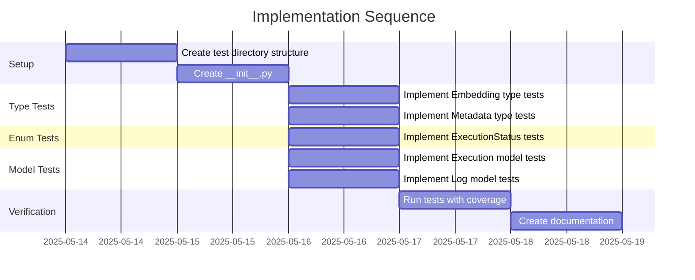

# Implementation Plan: khive/protocols/types.py Test Suite

## 1. Overview

### 1.1 Component Purpose

This implementation plan outlines the approach for creating a comprehensive test
suite for the `khive/protocols/types.py` module. The test suite will ensure that
all types, enums, and models defined in the module function correctly and
maintain their expected behavior.

### 1.2 Design Reference

This implementation is based on issue #65, which requires the creation of a
comprehensive test suite for the `khive/protocols/types.py` module. This is part
of a broader effort to improve test coverage across the khive protocols.

### 1.3 Implementation Approach

The implementation will follow Test-Driven Development (TDD) principles:

1. Analyze the existing `types.py` module to understand its components
2. Create test cases for each type, enum, and model
3. Implement tests to verify behavior, including edge cases
4. Ensure >80% test coverage for the module
5. Document the test implementation

## 2. Implementation Phases

### 2.1 Phase 1: Setup Test Environment

Set up the necessary test directory structure and ensure all test dependencies
are available.

**Key Deliverables:**

- Create `tests/protocols` directory
- Create `tests/protocols/__init__.py`
- Verify pytest and pytest-cov are available

**Dependencies:**

- None

**Estimated Complexity:** Low

### 2.2 Phase 2: Implement Core Tests

Implement tests for all types, enums, and models in the `types.py` module.

**Key Deliverables:**

- Tests for `Embedding` type
- Tests for `Metadata` type
- Tests for `ExecutionStatus` enum
- Tests for `Execution` class
- Tests for `Log` class

**Dependencies:**

- Phase 1 completion

**Estimated Complexity:** Medium

### 2.3 Phase 3: Verify Coverage

Run tests with coverage reporting to ensure adequate test coverage.

**Key Deliverables:**

- Test coverage report
- Documentation of test results

**Dependencies:**

- Phase 2 completion

**Estimated Complexity:** Low

## 3. Test Strategy

### 3.1 Unit Tests

#### 3.1.1 Test Group: Type Definitions

| ID   | Description                             | Fixtures/Mocks | Assertions                        |
| ---- | --------------------------------------- | -------------- | --------------------------------- |
| UT-1 | Test that Embedding is a list of floats | None           | Type is list, elements are floats |
| UT-2 | Test that Metadata is a dictionary      | None           | Type is dict                      |

#### 3.1.2 Test Group: ExecutionStatus Enum

| ID   | Description                          | Fixtures/Mocks | Assertions                              |
| ---- | ------------------------------------ | -------------- | --------------------------------------- |
| UT-3 | Test enum values are correct         | None           | Enum values match expected strings      |
| UT-4 | Test enum conversion from string     | None           | String conversion produces correct enum |
| UT-5 | Test invalid enum value raises error | None           | ValueError is raised for invalid string |

#### 3.1.3 Test Group: Execution Class

| ID    | Description                          | Fixtures/Mocks | Assertions                           |
| ----- | ------------------------------------ | -------------- | ------------------------------------ |
| UT-6  | Test default values                  | None           | Default values are as expected       |
| UT-7  | Test with specific values            | None           | Values are set correctly             |
| UT-8  | Test with Pydantic model as response | None           | Model is converted to dict           |
| UT-9  | Test status serialization            | None           | Status is serialized to string value |
| UT-10 | Test invalid status raises error     | None           | ValidationError is raised            |

#### 3.1.4 Test Group: Log Class

| ID    | Description               | Fixtures/Mocks | Assertions                               |
| ----- | ------------------------- | -------------- | ---------------------------------------- |
| UT-11 | Test required fields      | None           | ValidationError raised if missing fields |
| UT-12 | Test with valid values    | None           | Values are set correctly                 |
| UT-13 | Test default values       | None           | Default values are as expected           |
| UT-14 | Test with empty embedding | None           | Empty embedding is accepted              |

### 3.2 Integration Tests

No integration tests are required for this module as it consists of type
definitions and models without external dependencies.

### 3.3 Mock and Stub Requirements

No mocks or stubs are required for this module as it doesn't have external
dependencies.

## 4. Implementation Tasks

### 4.1 Setup

| ID  | Task                            | Description                                 | Dependencies | Priority | Complexity |
| --- | ------------------------------- | ------------------------------------------- | ------------ | -------- | ---------- |
| T-1 | Create test directory structure | Create protocols test directory             | None         | High     | Low        |
| T-2 | Create **init**.py              | Create **init**.py file for protocols tests | T-1          | High     | Low        |

### 4.2 Type Tests

| ID  | Task                           | Description                     | Dependencies | Priority | Complexity |
| --- | ------------------------------ | ------------------------------- | ------------ | -------- | ---------- |
| T-3 | Implement Embedding type tests | Create tests for Embedding type | T-2          | High     | Low        |
| T-4 | Implement Metadata type tests  | Create tests for Metadata type  | T-2          | High     | Low        |

### 4.3 Enum Tests

| ID  | Task                            | Description                           | Dependencies | Priority | Complexity |
| --- | ------------------------------- | ------------------------------------- | ------------ | -------- | ---------- |
| T-5 | Implement ExecutionStatus tests | Create tests for ExecutionStatus enum | T-2          | High     | Low        |

### 4.4 Model Tests

| ID  | Task                            | Description                      | Dependencies | Priority | Complexity |
| --- | ------------------------------- | -------------------------------- | ------------ | -------- | ---------- |
| T-6 | Implement Execution model tests | Create tests for Execution class | T-2          | High     | Medium     |
| T-7 | Implement Log model tests       | Create tests for Log class       | T-2          | High     | Medium     |

### 4.5 Verification

| ID  | Task                    | Description                             | Dependencies        | Priority | Complexity |
| --- | ----------------------- | --------------------------------------- | ------------------- | -------- | ---------- |
| T-8 | Run tests with coverage | Verify test coverage meets requirements | T-3,T-4,T-5,T-6,T-7 | High     | Low        |
| T-9 | Create documentation    | Document test implementation            | T-8                 | Medium   | Low        |

## 5. Implementation Sequence



## 6. Acceptance Criteria

### 6.1 Component Level

| ID   | Criterion                                 | Validation Method        |
| ---- | ----------------------------------------- | ------------------------ |
| AC-1 | All tests pass                            | Run pytest               |
| AC-2 | Test coverage is >80% for types.py module | Run pytest with coverage |
| AC-3 | Tests cover all types, enums, and models  | Code review              |

## 7. Test Implementation Plan

### 7.1 Test Implementation Sequence

1. Set up test directory structure
2. Implement tests for simple types (Embedding, Metadata)
3. Implement tests for ExecutionStatus enum
4. Implement tests for Execution class
5. Implement tests for Log class
6. Verify test coverage

### 7.2 Test Code Examples

#### Unit Test Example for Embedding Type

```python
def test_embedding_type():
    """Test that Embedding is a list of floats."""
    # Valid embeddings
    valid_embedding: Embedding = [0.1, 0.2, 0.3]
    assert isinstance(valid_embedding, list)
    assert all(isinstance(x, float) for x in valid_embedding)

    # Empty embedding is valid
    empty_embedding: Embedding = []
    assert isinstance(empty_embedding, list)
```

#### Unit Test Example for ExecutionStatus Enum

```python
def test_execution_status_enum():
    """Test the ExecutionStatus enum values."""
    assert ExecutionStatus.PENDING.value == "pending"
    assert ExecutionStatus.PROCESSING.value == "processing"
    assert ExecutionStatus.COMPLETED.value == "completed"
    assert ExecutionStatus.FAILED.value == "failed"

    # Test enum conversion from string
    assert ExecutionStatus("pending") == ExecutionStatus.PENDING
    assert ExecutionStatus("processing") == ExecutionStatus.PROCESSING
    assert ExecutionStatus("completed") == ExecutionStatus.COMPLETED
    assert ExecutionStatus("failed") == ExecutionStatus.FAILED

    # Test invalid enum value
    with pytest.raises(ValueError):
        ExecutionStatus("invalid_status")
```

## 8. Implementation Risks and Mitigations

| Risk                                          | Impact | Likelihood | Mitigation                                                                |
| --------------------------------------------- | ------ | ---------- | ------------------------------------------------------------------------- |
| Changes to types.py module during development | Medium | Low        | Coordinate with team to ensure module stability during test development   |
| Missing edge cases in tests                   | Medium | Medium     | Review test coverage carefully and add tests for edge cases               |
| Test dependencies not available               | Low    | Low        | Verify all test dependencies are installed before starting implementation |

## 9. Dependencies and Environment

### 9.1 External Libraries

| Library    | Version | Purpose                    |
| ---------- | ------- | -------------------------- |
| pytest     | ^8.3.5  | Test framework             |
| pytest-cov | ^6.1.1  | Test coverage reporting    |
| pydantic   | ^2.9.1  | Data validation and models |

### 9.2 Environment Setup

```bash
# Ensure virtual environment is activated
# Install test dependencies
uv sync
```

## 10. Additional Resources

### 10.1 Reference Implementation

Existing test files in the project, such as:

- `tests/services/reader/test_reader_utils.py`
- `tests/cli/test_khive_cli.py`

### 10.2 Relevant Documentation

- [pytest Documentation](https://docs.pytest.org/)
- [pydantic Documentation](https://docs.pydantic.dev/)

### 10.3 Design Patterns

- Test-Driven Development (TDD)
- Arrange-Act-Assert pattern for test structure
