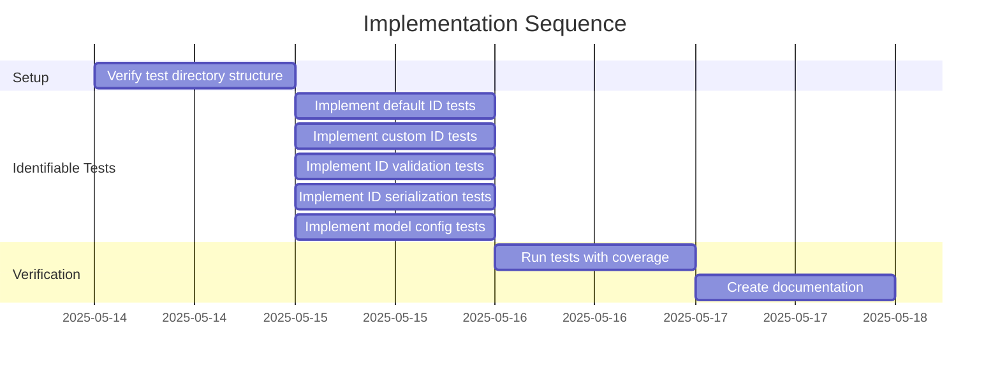

# Implementation Plan: khive/protocols/identifiable.py Test Suite

## 1. Overview

### 1.1 Component Purpose

This implementation plan outlines the approach for creating a comprehensive test
suite for the `khive/protocols/identifiable.py` module. The test suite will
ensure that the `Identifiable` class functions correctly, including its ID
generation, validation, and serialization capabilities.

### 1.2 Design Reference

This implementation is based on issue #67, which requires the creation of a
comprehensive test suite for the `khive/protocols/identifiable.py` module. This
is part of a broader effort to improve test coverage across the khive protocols,
following the successful implementation of tests for the `types.py` module
(issue #65).

### 1.3 Implementation Approach

The implementation will follow Test-Driven Development (TDD) principles:

1. Analyze the existing `identifiable.py` module to understand its components
2. Create test cases for the `Identifiable` class and its methods
3. Implement tests to verify behavior, including edge cases
4. Ensure >80% test coverage for the module
5. Document the test implementation

## 2. Implementation Phases

### 2.1 Phase 1: Setup Test Environment

Ensure the necessary test directory structure is available and all test
dependencies are in place.

**Key Deliverables:**

- Verify `tests/protocols` directory exists
- Verify pytest and pytest-cov are available

**Dependencies:**

- None

**Estimated Complexity:** Low

### 2.2 Phase 2: Implement Core Tests

Implement tests for the `Identifiable` class in the `identifiable.py` module.

**Key Deliverables:**

- Tests for default ID generation
- Tests for custom ID assignment
- Tests for ID validation
- Tests for ID serialization
- Tests for model configuration

**Dependencies:**

- Phase 1 completion

**Estimated Complexity:** Medium

### 2.3 Phase 3: Verify Coverage

Run tests with coverage reporting to ensure adequate test coverage.

**Key Deliverables:**

- Test coverage report
- Documentation of test results

**Dependencies:**

- Phase 2 completion

**Estimated Complexity:** Low

## 3. Test Strategy

### 3.1 Unit Tests

#### 3.1.1 Test Group: Identifiable Class

| ID    | Description                       | Fixtures/Mocks | Assertions                               |
| ----- | --------------------------------- | -------------- | ---------------------------------------- |
| UT-1  | Test default ID generation        | None           | ID is a valid UUID                       |
| UT-2  | Test custom UUID ID               | None           | ID matches provided UUID                 |
| UT-3  | Test string UUID ID               | None           | String is converted to UUID              |
| UT-4  | Test ID serialization             | None           | ID is serialized to string               |
| UT-5  | Test invalid string ID validation | None           | ValidationError is raised                |
| UT-6  | Test invalid type ID validation   | None           | ValidationError is raised                |
| UT-7  | Test ID immutability              | None           | Exception raised when modifying ID       |
| UT-8  | Test model configuration          | None           | Extra fields are rejected                |
| UT-9  | Test JSON serialization           | None           | Object serializes to valid JSON          |
| UT-10 | Test dict serialization           | None           | Object serializes to dict with string ID |

### 3.2 Integration Tests

No integration tests are required for this module as it consists of a base class
without external dependencies.

### 3.3 Mock and Stub Requirements

No mocks or stubs are required for this module as it doesn't have external
dependencies.

## 4. Implementation Tasks

### 4.1 Setup

| ID  | Task                            | Description                            | Dependencies | Priority | Complexity |
| --- | ------------------------------- | -------------------------------------- | ------------ | -------- | ---------- |
| T-1 | Verify test directory structure | Ensure protocols test directory exists | None         | High     | Low        |

### 4.2 Identifiable Tests

| ID  | Task                             | Description                            | Dependencies | Priority | Complexity |
| --- | -------------------------------- | -------------------------------------- | ------------ | -------- | ---------- |
| T-2 | Implement default ID tests       | Create tests for default ID generation | T-1          | High     | Low        |
| T-3 | Implement custom ID tests        | Create tests for custom ID assignment  | T-1          | High     | Low        |
| T-4 | Implement ID validation tests    | Create tests for ID validation         | T-1          | High     | Medium     |
| T-5 | Implement ID serialization tests | Create tests for ID serialization      | T-1          | High     | Low        |
| T-6 | Implement model config tests     | Create tests for model configuration   | T-1          | Medium   | Low        |

### 4.3 Verification

| ID  | Task                    | Description                             | Dependencies        | Priority | Complexity |
| --- | ----------------------- | --------------------------------------- | ------------------- | -------- | ---------- |
| T-7 | Run tests with coverage | Verify test coverage meets requirements | T-2,T-3,T-4,T-5,T-6 | High     | Low        |
| T-8 | Create documentation    | Document test implementation            | T-7                 | Medium   | Low        |

## 5. Implementation Sequence



## 6. Acceptance Criteria

### 6.1 Component Level

| ID   | Criterion                                        | Validation Method        |
| ---- | ------------------------------------------------ | ------------------------ |
| AC-1 | All tests pass                                   | Run pytest               |
| AC-2 | Test coverage is >80% for identifiable.py module | Run pytest with coverage |
| AC-3 | Tests cover all methods and edge cases           | Code review              |

## 7. Test Implementation Plan

### 7.1 Test Implementation Sequence

1. Set up test file structure
2. Implement tests for default ID generation
3. Implement tests for custom ID assignment
4. Implement tests for ID validation
5. Implement tests for ID serialization
6. Implement tests for model configuration
7. Verify test coverage

### 7.2 Test Code Examples

#### Unit Test Example for Default ID Generation

```python
def test_identifiable_default_id():
    """Test that Identifiable generates a default UUID."""
    obj = Identifiable()
    assert isinstance(obj.id, uuid.UUID)
    assert obj.id is not None
```

#### Unit Test Example for ID Validation

```python
def test_identifiable_id_validation_invalid_string():
    """Test that invalid UUID strings are rejected."""
    with pytest.raises(ValidationError):
        Identifiable(id="not-a-uuid")
```

## 8. Implementation Risks and Mitigations

| Risk                                                 | Impact | Likelihood | Mitigation                                                                |
| ---------------------------------------------------- | ------ | ---------- | ------------------------------------------------------------------------- |
| Changes to identifiable.py module during development | Medium | Low        | Coordinate with team to ensure module stability during test development   |
| Missing edge cases in tests                          | Medium | Medium     | Review test coverage carefully and add tests for edge cases               |
| Test dependencies not available                      | Low    | Low        | Verify all test dependencies are installed before starting implementation |

## 9. Dependencies and Environment

### 9.1 External Libraries

| Library    | Version | Purpose                    |
| ---------- | ------- | -------------------------- |
| pytest     | ^8.3.5  | Test framework             |
| pytest-cov | ^6.1.1  | Test coverage reporting    |
| pydantic   | ^2.9.1  | Data validation and models |

### 9.2 Environment Setup

```bash
# Ensure virtual environment is activated
# Install test dependencies
uv sync
```

## 10. Additional Resources

### 10.1 Reference Implementation

Existing test files in the project, such as:

- `tests/protocols/test_types.py`

### 10.2 Relevant Documentation

- [pytest Documentation](https://docs.pytest.org/)
- [pydantic Documentation](https://docs.pydantic.dev/)
- [UUID Documentation](https://docs.python.org/3/library/uuid.html)

### 10.3 Design Patterns

- Test-Driven Development (TDD)
- Arrange-Act-Assert pattern for test structure
