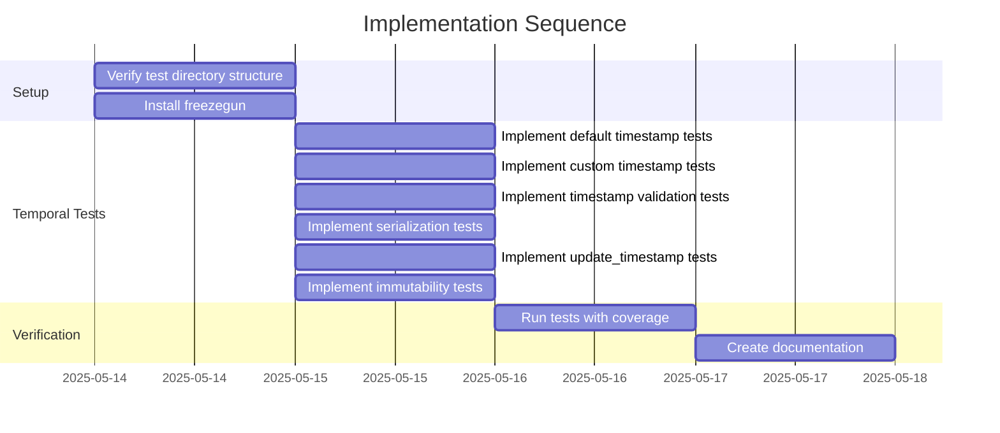

# Implementation Plan: khive/protocols/temporal.py Test Suite

## 1. Overview

### 1.1 Component Purpose

This implementation plan outlines the approach for creating a comprehensive test
suite for the `khive/protocols/temporal.py` module. The test suite will ensure
that the `Temporal` class functions correctly, including its timestamp
initialization, validation, serialization, and update functionality.

### 1.2 Design Reference

This implementation is based on issue #68, which requires the creation of a
comprehensive test suite for the `khive/protocols/temporal.py` module. This is
part of a broader effort to improve test coverage across the khive protocols,
following the successful implementation of tests for the `types.py` module
(issue #65) and `identifiable.py` module (issue #67).

### 1.3 Implementation Approach

The implementation will follow Test-Driven Development (TDD) principles:

1. Analyze the existing `temporal.py` module to understand its components
2. Create test cases for the `Temporal` class and its methods
3. Implement tests to verify behavior, including edge cases
4. Ensure >80% test coverage for the module
5. Document the test implementation

## 2. Implementation Phases

### 2.1 Phase 1: Setup Test Environment

Ensure the necessary test directory structure is available and all test
dependencies are in place.

**Key Deliverables:**

- Verify `tests/protocols` directory exists
- Verify pytest, pytest-cov, and freezegun are available

**Dependencies:**

- None

**Estimated Complexity:** Low

### 2.2 Phase 2: Implement Core Tests

Implement tests for the `Temporal` class in the `temporal.py` module.

**Key Deliverables:**

- Tests for default timestamp initialization
- Tests for custom timestamp assignment
- Tests for timestamp validation
- Tests for timestamp serialization
- Tests for the update_timestamp() method
- Tests for timestamp immutability/mutability

**Dependencies:**

- Phase 1 completion

**Estimated Complexity:** Medium

### 2.3 Phase 3: Verify Coverage

Run tests with coverage reporting to ensure adequate test coverage.

**Key Deliverables:**

- Test coverage report
- Documentation of test results

**Dependencies:**

- Phase 2 completion

**Estimated Complexity:** Low

## 3. Test Strategy

### 3.1 Unit Tests

#### 3.1.1 Test Group: Temporal Class

| ID    | Description                              | Fixtures/Mocks | Assertions                                 |
| ----- | ---------------------------------------- | -------------- | ------------------------------------------ |
| UT-1  | Test default timestamp initialization    | freeze_time    | Timestamps match frozen time               |
| UT-2  | Test custom datetime timestamps          | None           | Timestamps match provided values           |
| UT-3  | Test string timestamp initialization     | None           | Strings are converted to datetime objects  |
| UT-4  | Test timestamp serialization             | None           | Timestamps are serialized to ISO format    |
| UT-5  | Test invalid string timestamp validation | None           | ValidationError is raised                  |
| UT-6  | Test invalid type timestamp validation   | None           | ValidationError is raised                  |
| UT-7  | Test created_at immutability             | None           | Exception raised when modifying created_at |
| UT-8  | Test updated_at mutability               | None           | updated_at can be modified directly        |
| UT-9  | Test update_timestamp method             | freeze_time    | updated_at is updated to current time      |
| UT-10 | Test JSON serialization                  | None           | Object serializes to valid JSON            |
| UT-11 | Test multiple update_timestamp calls     | freeze_time    | updated_at is updated correctly            |

### 3.2 Integration Tests

No integration tests are required for this module as it consists of a base class
without external dependencies.

### 3.3 Mock and Stub Requirements

| Dependency | Mock/Stub Type   | Key Behaviors to Mock                  |
| ---------- | ---------------- | -------------------------------------- |
| datetime   | Mock (freezegun) | Current time for deterministic testing |

## 4. Implementation Tasks

### 4.1 Setup

| ID  | Task                            | Description                                  | Dependencies | Priority | Complexity |
| --- | ------------------------------- | -------------------------------------------- | ------------ | -------- | ---------- |
| T-1 | Verify test directory structure | Ensure protocols test directory exists       | None         | High     | Low        |
| T-2 | Install freezegun               | Add freezegun for deterministic time testing | None         | High     | Low        |

### 4.2 Temporal Tests

| ID  | Task                                 | Description                                   | Dependencies | Priority | Complexity |
| --- | ------------------------------------ | --------------------------------------------- | ------------ | -------- | ---------- |
| T-3 | Implement default timestamp tests    | Create tests for default timestamp generation | T-1, T-2     | High     | Low        |
| T-4 | Implement custom timestamp tests     | Create tests for custom timestamp assignment  | T-1          | High     | Low        |
| T-5 | Implement timestamp validation tests | Create tests for timestamp validation         | T-1          | High     | Medium     |
| T-6 | Implement serialization tests        | Create tests for timestamp serialization      | T-1          | High     | Low        |
| T-7 | Implement update_timestamp tests     | Create tests for update_timestamp method      | T-1, T-2     | High     | Medium     |
| T-8 | Implement immutability tests         | Create tests for timestamp immutability       | T-1          | Medium   | Low        |

### 4.3 Verification

| ID   | Task                    | Description                             | Dependencies            | Priority | Complexity |
| ---- | ----------------------- | --------------------------------------- | ----------------------- | -------- | ---------- |
| T-9  | Run tests with coverage | Verify test coverage meets requirements | T-3,T-4,T-5,T-6,T-7,T-8 | High     | Low        |
| T-10 | Create documentation    | Document test implementation            | T-9                     | Medium   | Low        |

## 5. Implementation Sequence



## 6. Acceptance Criteria

### 6.1 Component Level

| ID   | Criterion                                    | Validation Method        |
| ---- | -------------------------------------------- | ------------------------ |
| AC-1 | All tests pass                               | Run pytest               |
| AC-2 | Test coverage is >80% for temporal.py module | Run pytest with coverage |
| AC-3 | Tests cover all methods and edge cases       | Code review              |

## 7. Test Implementation Plan

### 7.1 Test Implementation Sequence

1. Set up test file structure
2. Install freezegun for deterministic time testing
3. Implement tests for default timestamp initialization
4. Implement tests for custom timestamp assignment
5. Implement tests for timestamp validation
6. Implement tests for timestamp serialization
7. Implement tests for update_timestamp method
8. Implement tests for timestamp immutability/mutability
9. Verify test coverage

### 7.2 Test Code Examples

#### Unit Test Example for Default Timestamp Initialization

```python
@freeze_time("2025-05-14T12:00:00Z")
def test_temporal_default_initialization():
    """Test that Temporal initializes with current UTC time for both timestamps."""
    obj = Temporal()

    # Both timestamps should be the frozen time
    expected_time = datetime(2025, 5, 14, 12, 0, 0, tzinfo=timezone.utc)
    assert obj.created_at == expected_time
    assert obj.updated_at == expected_time

    # Verify timezone is UTC
    assert obj.created_at.tzinfo == timezone.utc
    assert obj.updated_at.tzinfo == timezone.utc
```

#### Unit Test Example for update_timestamp Method

```python
@freeze_time("2025-05-14T12:00:00Z")
def test_update_timestamp():
    """Test that update_timestamp() updates the updated_at field to current time."""
    # Create with custom timestamps
    created = datetime(2025, 5, 10, 10, 0, 0, tzinfo=timezone.utc)
    updated = datetime(2025, 5, 10, 11, 0, 0, tzinfo=timezone.utc)
    obj = Temporal(created_at=created, updated_at=updated)

    # Initial state
    assert obj.created_at == created
    assert obj.updated_at == updated

    # Update timestamp
    obj.update_timestamp()

    # created_at should remain unchanged
    assert obj.created_at == created

    # updated_at should be updated to the frozen time
    expected_time = datetime(2025, 5, 14, 12, 0, 0, tzinfo=timezone.utc)
    assert obj.updated_at == expected_time
```

## 8. Implementation Risks and Mitigations

| Risk                                             | Impact | Likelihood | Mitigation                                                              |
| ------------------------------------------------ | ------ | ---------- | ----------------------------------------------------------------------- |
| Changes to temporal.py module during development | Medium | Low        | Coordinate with team to ensure module stability during test development |
| Missing edge cases in tests                      | Medium | Medium     | Review test coverage carefully and add tests for edge cases             |
| Inconsistent behavior with different timezones   | Medium | Low        | Ensure tests explicitly use UTC timezone and test timezone handling     |

## 9. Dependencies and Environment

### 9.1 External Libraries

| Library    | Version | Purpose                               |
| ---------- | ------- | ------------------------------------- |
| pytest     | ^8.3.5  | Test framework                        |
| pytest-cov | ^6.1.1  | Test coverage reporting               |
| pydantic   | ^2.9.1  | Data validation and models            |
| freezegun  | ^1.4.0  | Time freezing for deterministic tests |

### 9.2 Environment Setup

```bash
# Ensure virtual environment is activated
# Install test dependencies
uv sync
uv add --dev freezegun
```

## 10. Additional Resources

### 10.1 Reference Implementation

Existing test files in the project, such as:

- `tests/protocols/test_types.py`
- `tests/protocols/test_identifiable.py`

### 10.2 Relevant Documentation

- [pytest Documentation](https://docs.pytest.org/)
- [pydantic Documentation](https://docs.pydantic.dev/)
- [freezegun Documentation](https://github.com/spulec/freezegun)
- [datetime Documentation](https://docs.python.org/3/library/datetime.html)

### 10.3 Design Patterns

- Test-Driven Development (TDD)
- Arrange-Act-Assert pattern for test structure
- Deterministic time testing with freezegun
