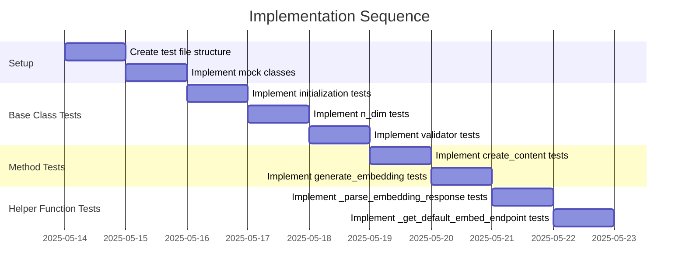

# Implementation Plan: Embedable Protocol Test Suite

## 1. Overview

### 1.1 Component Purpose

This implementation plan outlines the approach for creating a comprehensive test
suite for the `Embedable` protocol in the khive project. The Embedable protocol
defines a standard interface for objects that can be embedded into vector
spaces, which is a fundamental capability for many AI and machine learning
applications.

### 1.2 Design Reference

- Issue #69: Implement test suite for khive/protocols/embedable.py
- Related issues: #65 (Test protocols/types.py), #67 (Test
  protocols/identifiable.py)
- Source file: `src/khive/protocols/embedable.py`

### 1.3 Implementation Approach

The implementation will follow Test-Driven Development (TDD) principles:

1. Write tests that verify the expected behavior of the Embedable protocol
2. Ensure tests cover both normal operation and edge cases
3. Use mocks to isolate tests from external dependencies
4. Achieve >80% test coverage for the module

## 2. Implementation Phases

### 2.1 Phase 1: Test Setup and Basic Functionality

**Description:** Set up the test file structure and implement tests for basic
Embedable class functionality.

**Key Deliverables:**

- Test file structure with necessary imports and fixtures
- Tests for Embedable initialization (default and custom)
- Tests for n_dim property
- Tests for _parse_embedding validator

**Dependencies:**

- Understanding of the Embedable protocol implementation
- Pytest framework

**Estimated Complexity:** Low

### 2.2 Phase 2: Method Testing

**Description:** Implement tests for the core methods of the Embedable class.

**Key Deliverables:**

- Tests for create_content method
- Tests for generate_embedding method (with mocks)

**Dependencies:**

- Phase 1 completion
- Mock implementation for embed_endpoint

**Estimated Complexity:** Medium

### 2.3 Phase 3: Helper Function Testing

**Description:** Implement tests for the helper functions in the embedable
module.

**Key Deliverables:**

- Tests for _parse_embedding_response with various input formats
- Tests for _get_default_embed_endpoint (with mocks)

**Dependencies:**

- Phase 1 completion
- Mock implementation for OpenaiEmbedEndpoint

**Estimated Complexity:** Medium

### 2.4 Phase 4: Edge Cases and Error Handling

**Description:** Implement tests for edge cases and error handling.

**Key Deliverables:**

- Tests for invalid inputs
- Tests for error conditions
- Tests for boundary conditions

**Dependencies:**

- Phase 1, 2, and 3 completion

**Estimated Complexity:** Medium

## 3. Test Strategy

### 3.1 Unit Tests

#### 3.1.1 Test Group: Embedable Base Class

| ID    | Description                               | Fixtures/Mocks | Assertions                                     |
| ----- | ----------------------------------------- | -------------- | ---------------------------------------------- |
| UT-1  | Test default initialization               | None           | content is None, embedding is empty list       |
| UT-2  | Test custom initialization with content   | None           | content matches input, embedding is empty list |
| UT-3  | Test custom initialization with embedding | None           | embedding matches input                        |
| UT-4  | Test n_dim property                       | None           | n_dim equals length of embedding               |
| UT-5  | Test _parse_embedding with None           | None           | Returns empty list                             |
| UT-6  | Test _parse_embedding with valid string   | None           | Returns correct list of floats                 |
| UT-7  | Test _parse_embedding with invalid string | None           | Raises ValueError                              |
| UT-8  | Test _parse_embedding with valid list     | None           | Returns correct list of floats                 |
| UT-9  | Test _parse_embedding with invalid list   | None           | Raises ValueError                              |
| UT-10 | Test _parse_embedding with invalid type   | None           | Raises ValueError                              |

#### 3.1.2 Test Group: Embedable Methods

| ID    | Description                                   | Fixtures/Mocks | Assertions                                        |
| ----- | --------------------------------------------- | -------------- | ------------------------------------------------- |
| UT-11 | Test create_content returns content           | None           | Returns content value                             |
| UT-12 | Test generate_embedding calls endpoint        | MockEndpoint   | Endpoint called with correct parameters           |
| UT-13 | Test generate_embedding sets embedding        | MockEndpoint   | Embedding set to expected value                   |
| UT-14 | Test generate_embedding returns self          | MockEndpoint   | Returns self instance                             |
| UT-15 | Test generate_embedding with default endpoint | MockSettings   | Uses default endpoint when class endpoint is None |

#### 3.1.3 Test Group: Helper Functions

| ID    | Description                                                 | Fixtures/Mocks | Assertions                                     |
| ----- | ----------------------------------------------------------- | -------------- | ---------------------------------------------- |
| UT-16 | Test _parse_embedding_response with BaseModel               | MockBaseModel  | Returns correct embedding                      |
| UT-17 | Test _parse_embedding_response with list of floats          | None           | Returns same list                              |
| UT-18 | Test _parse_embedding_response with list containing dict    | None           | Returns extracted embedding                    |
| UT-19 | Test _parse_embedding_response with dict (data format)      | None           | Returns extracted embedding                    |
| UT-20 | Test _parse_embedding_response with dict (embedding format) | None           | Returns extracted embedding                    |
| UT-21 | Test _get_default_embed_endpoint with openai                | MockSettings   | Returns OpenaiEmbedEndpoint with correct model |
| UT-22 | Test _get_default_embed_endpoint with unsupported provider  | MockSettings   | Raises ValueError                              |

### 3.2 Integration Tests

Not applicable for this protocol test suite as we're focusing on unit testing
the protocol itself.

### 3.3 Mock and Stub Requirements

| Dependency          | Mock/Stub Type | Key Behaviors to Mock                               |
| ------------------- | -------------- | --------------------------------------------------- |
| Endpoint            | Mock           | call method that returns embedding data             |
| OpenaiEmbedEndpoint | Mock           | Constructor that accepts model parameter            |
| settings            | Mock           | DEFAULT_EMBEDDING_PROVIDER, DEFAULT_EMBEDDING_MODEL |
| BaseModel           | Mock           | data attribute with embedding attribute             |

## 4. Implementation Tasks

### 4.1 Test Setup

| ID  | Task                       | Description                                               | Dependencies | Priority | Complexity |
| --- | -------------------------- | --------------------------------------------------------- | ------------ | -------- | ---------- |
| T-1 | Create test file structure | Set up test file with imports and basic structure         | None         | High     | Low        |
| T-2 | Implement mock classes     | Create mock classes for Endpoint, BaseModel, and settings | None         | High     | Low        |

### 4.2 Base Class Tests

| ID  | Task                           | Description                            | Dependencies | Priority | Complexity |
| --- | ------------------------------ | -------------------------------------- | ------------ | -------- | ---------- |
| T-3 | Implement initialization tests | Test default and custom initialization | T-1          | High     | Low        |
| T-4 | Implement n_dim tests          | Test n_dim property                    | T-1          | High     | Low        |
| T-5 | Implement validator tests      | Test _parse_embedding validator        | T-1          | High     | Medium     |

### 4.3 Method Tests

| ID  | Task                               | Description                    | Dependencies | Priority | Complexity |
| --- | ---------------------------------- | ------------------------------ | ------------ | -------- | ---------- |
| T-6 | Implement create_content tests     | Test create_content method     | T-1          | High     | Low        |
| T-7 | Implement generate_embedding tests | Test generate_embedding method | T-1, T-2     | High     | Medium     |

### 4.4 Helper Function Tests

| ID  | Task                                        | Description                     | Dependencies | Priority | Complexity |
| --- | ------------------------------------------- | ------------------------------- | ------------ | -------- | ---------- |
| T-8 | Implement _parse_embedding_response tests   | Test with various input formats | T-1, T-2     | High     | Medium     |
| T-9 | Implement _get_default_embed_endpoint tests | Test default endpoint creation  | T-1, T-2     | High     | Medium     |

## 5. Implementation Sequence



## 6. Acceptance Criteria

### 6.1 Component Level

| ID   | Criterion                                          | Validation Method |
| ---- | -------------------------------------------------- | ----------------- |
| AC-1 | All tests pass successfully                        | Pytest execution  |
| AC-2 | Test coverage exceeds 80% for the module           | Coverage report   |
| AC-3 | Tests include proper assertions and error handling | Code review       |
| AC-4 | Tests are isolated from external dependencies      | Code review       |

## 7. Test Implementation Plan

### 7.1 Test Implementation Sequence

1. Set up test file structure and imports
2. Implement mock classes for external dependencies
3. Implement tests for Embedable base class functionality
4. Implement tests for Embedable methods
5. Implement tests for helper functions
6. Run tests and verify coverage

### 7.2 Test Code Examples

#### Base Class Test Example

```python
def test_embedable_default_initialization():
    """Test that Embedable initializes with default values."""
    obj = Embedable()
    assert obj.content is None
    assert obj.embedding == []
    assert obj.n_dim == 0
```

#### Method Test Example

```python
async def test_generate_embedding():
    """Test that generate_embedding calls endpoint and sets embedding."""
    # Arrange
    mock_endpoint = MockEndpoint(return_value=[0.1, 0.2, 0.3])

    class TestEmbedable(Embedable):
        embed_endpoint = mock_endpoint

    obj = TestEmbedable(content="test content")

    # Act
    result = await obj.generate_embedding()

    # Assert
    assert result is obj  # Returns self
    assert obj.embedding == [0.1, 0.2, 0.3]
    mock_endpoint.assert_called_once_with({"input": "test content"})
```

#### Helper Function Test Example

```python
def test_parse_embedding_response_with_basemodel():
    """Test _parse_embedding_response with a BaseModel input."""
    # Arrange
    class EmbeddingData:
        embedding = [0.1, 0.2, 0.3]

    class MockResponse(BaseModel):
        data: list = [EmbeddingData()]

    # Act
    result = _parse_embedding_response(MockResponse())

    # Assert
    assert result == [0.1, 0.2, 0.3]
```

## 8. Implementation Risks and Mitigations

| Risk                                | Impact | Likelihood | Mitigation                                                                                                  |
| ----------------------------------- | ------ | ---------- | ----------------------------------------------------------------------------------------------------------- |
| Difficulty mocking async behavior   | Medium | Medium     | Use pytest-asyncio for testing async functions, create simple mock classes that mimic the expected behavior |
| Changes to Embedable implementation | High   | Low        | Design tests to be resilient to implementation changes, focus on testing the interface                      |
| Complex embedding response formats  | Medium | Medium     | Test with a variety of response formats to ensure robustness                                                |

## 9. Dependencies and Environment

### 9.1 External Libraries

| Library        | Version | Purpose                               |
| -------------- | ------- | ------------------------------------- |
| pytest         | ^7.0.0  | Testing framework                     |
| pytest-asyncio | ^0.21.0 | Support for testing async functions   |
| pytest-cov     | ^4.1.0  | Test coverage reporting               |
| freezegun      | ^1.2.0  | Time freezing for deterministic tests |

### 9.2 Environment Setup

```bash
# Ensure virtual environment is activated
# Install test dependencies
uv sync --extra test

# Run tests with coverage
uv run pytest tests/protocols/test_embedable.py --cov=khive.protocols.embedable
```

## 10. Additional Resources

### 10.1 Reference Implementation

- Existing protocol tests: `tests/protocols/test_identifiable.py`,
  `tests/protocols/test_temporal.py`, `tests/protocols/test_types.py`

### 10.2 Relevant Documentation

- [Pytest Documentation](https://docs.pytest.org/)
- [Pytest-asyncio Documentation](https://pytest-asyncio.readthedocs.io/)

### 10.3 Design Patterns

- Arrange-Act-Assert pattern for test structure
- Mock objects for isolating tests from external dependencies
- Parameterized tests for testing multiple input variations
