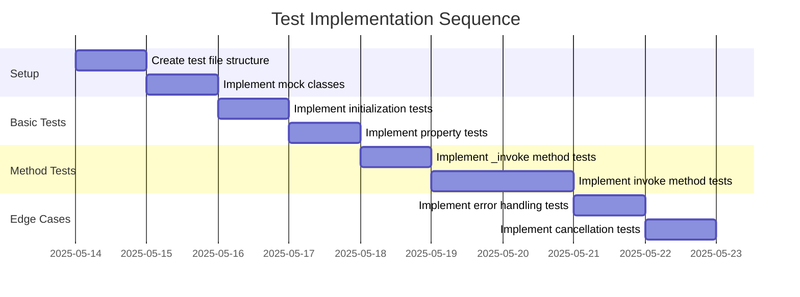

# Implementation Plan: Invokable Protocol Test Suite

## 1. Overview

### 1.1 Component Purpose

The Invokable protocol (`khive.protocols.invokable.Invokable`) is a core
protocol in the khive framework that extends the Temporal protocol. It provides
functionality for objects that can be invoked with a request, execute some
operation, and track the execution status and results. This test suite will
verify the correct behavior of the Invokable protocol implementation.

### 1.2 Design Reference

This implementation is based on:

- Issue #70: Implement test suite for khive/protocols/invokable.py
- Existing implementation in `src/khive/protocols/invokable.py`
- Related test implementations for other protocols, particularly
  `test_temporal.py` since Invokable extends Temporal

### 1.3 Implementation Approach

We will follow a Test-Driven Development (TDD) approach:

1. Create test cases based on the protocol's expected behavior
2. Implement mock classes to simulate different execution scenarios
3. Use pytest-asyncio for testing asynchronous behavior
4. Ensure >80% test coverage for the module
5. Document test purpose with clear docstrings

## 2. Implementation Phases

### 2.1 Phase 1: Basic Test Structure and Mock Classes

**Key Deliverables:**

- Test file structure with imports and mock classes
- Basic test cases for initialization and property behavior

**Dependencies:**

- Existing Invokable protocol implementation
- Understanding of Temporal protocol and its test suite

**Estimated Complexity:** Low

### 2.2 Phase 2: Core Method Tests

**Key Deliverables:**

- Tests for _invoke method
- Tests for invoke method with different execution scenarios
- Tests for status transitions

**Dependencies:**

- Mock classes from Phase 1
- Understanding of async execution flow

**Estimated Complexity:** Medium

## 3. Test Strategy

### 3.1 Unit Tests

#### 3.1.1 Test Group: Initialization and Properties

| ID   | Description                                               | Fixtures/Mocks | Assertions                                                |
| ---- | --------------------------------------------------------- | -------------- | --------------------------------------------------------- |
| UT-1 | Test default initialization of Invokable                  | None           | Default values are correctly set                          |
| UT-2 | Test custom initialization of Invokable                   | None           | Custom values are correctly set                           |
| UT-3 | Test has_invoked property with different execution states | None           | Property returns correct boolean based on execution state |

#### 3.1.2 Test Group: _invoke Method

| ID   | Description                                           | Fixtures/Mocks  | Assertions                                                |
| ---- | ----------------------------------------------------- | --------------- | --------------------------------------------------------- |
| UT-4 | Test _invoke with valid function                      | `mock_function` | Function is called with correct args and returns expected |
| UT-5 | Test _invoke with None function raises ValueError     | None            | ValueError is raised with correct message                 |
| UT-6 | Test _invoke with sync function is properly converted | `mock_sync_fn`  | Function is properly converted to async and called        |
| UT-7 | Test _invoke with async function is called directly   | `mock_async_fn` | Function is called directly without conversion            |

#### 3.1.3 Test Group: invoke Method

| ID    | Description                            | Fixtures/Mocks   | Assertions                                                |
| ----- | -------------------------------------- | ---------------- | --------------------------------------------------------- |
| UT-8  | Test successful execution              | `mock_function`  | Status is COMPLETED, response is set, duration is tracked |
| UT-9  | Test failed execution                  | `mock_error_fn`  | Status is FAILED, error is set, duration is tracked       |
| UT-10 | Test cancelled execution               | `mock_cancel_fn` | CancelledError is re-raised, no status change             |
| UT-11 | Test timestamp is updated after invoke | `mock_function`  | updated_at timestamp is changed                           |

### 3.2 Integration Tests

Not applicable for this protocol test suite as it's focused on unit testing the
protocol behavior.

### 3.3 Mock and Stub Requirements

| Dependency      | Mock/Stub Type | Key Behaviors to Mock                               |
| --------------- | -------------- | --------------------------------------------------- |
| Invoke Function | Mock           | Successful execution, error scenarios, cancellation |
| Event Loop      | Mock           | Time tracking for duration calculation              |

## 4. Implementation Tasks

### 4.1 Test Setup

| ID  | Task                       | Description                                           | Dependencies | Priority | Complexity |
| --- | -------------------------- | ----------------------------------------------------- | ------------ | -------- | ---------- |
| T-1 | Create test file structure | Set up the test file with imports and basic structure | None         | High     | Low        |
| T-2 | Implement mock classes     | Create mock classes for testing different scenarios   | None         | High     | Low        |

### 4.2 Basic Tests

| ID  | Task                           | Description                                         | Dependencies | Priority | Complexity |
| --- | ------------------------------ | --------------------------------------------------- | ------------ | -------- | ---------- |
| T-3 | Implement initialization tests | Test default and custom initialization of Invokable | T-1, T-2     | High     | Low        |
| T-4 | Implement property tests       | Test has_invoked property behavior                  | T-1, T-2     | High     | Low        |

### 4.3 Method Tests

| ID  | Task                           | Description                                                        | Dependencies | Priority | Complexity |
| --- | ------------------------------ | ------------------------------------------------------------------ | ------------ | -------- | ---------- |
| T-5 | Implement _invoke method tests | Test the _invoke method with different scenarios                   | T-1, T-2     | High     | Medium     |
| T-6 | Implement invoke method tests  | Test the invoke method with success, failure, and cancel scenarios | T-1, T-2     | High     | Medium     |

### 4.4 Edge Cases and Error Handling

| ID  | Task                           | Description                                 | Dependencies | Priority | Complexity |
| --- | ------------------------------ | ------------------------------------------- | ------------ | -------- | ---------- |
| T-7 | Implement error handling tests | Test error handling in invoke method        | T-6          | Medium   | Medium     |
| T-8 | Implement cancellation tests   | Test cancellation handling in invoke method | T-6          | Medium   | Medium     |

## 5. Implementation Sequence



## 6. Acceptance Criteria

### 6.1 Test Coverage

| ID   | Criterion                                               | Validation Method           |
| ---- | ------------------------------------------------------- | --------------------------- |
| AC-1 | Test coverage for invokable.py is >80%                  | Coverage report from pytest |
| AC-2 | All public methods and properties are tested            | Manual review of test cases |
| AC-3 | All execution paths (success, error, cancel) are tested | Review of test cases        |

### 6.2 Test Quality

| ID   | Criterion                                             | Validation Method              |
| ---- | ----------------------------------------------------- | ------------------------------ |
| AC-4 | Tests have clear docstrings explaining purpose        | Manual review of test code     |
| AC-5 | Tests use appropriate fixtures and mocks              | Manual review of test code     |
| AC-6 | Tests follow project testing patterns and conventions | Comparison with existing tests |

## 7. Test Implementation Plan

### 7.1 Test Implementation Sequence

1. Set up test file structure and import necessary modules
2. Implement mock classes for testing
3. Implement basic initialization and property tests
4. Implement _invoke method tests
5. Implement invoke method tests for success, failure, and cancellation
   scenarios
6. Implement edge case and error handling tests
7. Verify test coverage and add additional tests if needed

### 7.2 Test Code Examples

#### Mock Classes Example

```python
class MockResponse:
    """Mock response for testing."""
    value: str = "test_response"

class SuccessInvokable(Invokable):
    """Mock Invokable implementation that succeeds."""

    def __init__(self, **kwargs):
        super().__init__(**kwargs)
        self._invoke_function = self._success_fn

    async def _success_fn(self, *args, **kwargs):
        return MockResponse()

class FailingInvokable(Invokable):
    """Mock Invokable implementation that fails."""

    def __init__(self, **kwargs):
        super().__init__(**kwargs)
        self._invoke_function = self._failing_fn

    async def _failing_fn(self, *args, **kwargs):
        raise ValueError("Test error")
```

#### Async Test Example

```python
@pytest.mark.asyncio
async def test_invoke_successful_execution():
    """Test that invoke method handles successful execution correctly."""
    # Arrange
    invokable = SuccessInvokable()

    # Act
    await invokable.invoke()

    # Assert
    assert invokable.execution.status == ExecutionStatus.COMPLETED
    assert invokable.execution.error is None
    assert isinstance(invokable.execution.duration, float)
    assert invokable.execution.duration > 0
    assert invokable.response_obj is not None
    assert invokable.response_obj.value == "test_response"
```

## 8. Implementation Risks and Mitigations

| Risk                                       | Impact | Likelihood | Mitigation                                                                      |
| ------------------------------------------ | ------ | ---------- | ------------------------------------------------------------------------------- |
| Async testing complexity                   | Medium | Medium     | Use pytest-asyncio and follow patterns from existing async tests                |
| Mocking event loop time for duration tests | Medium | Low        | Use freezegun or monkeypatch to control time behavior                           |
| Cancellation testing complexity            | High   | Medium     | Create specific test fixtures that can trigger cancellation in a controlled way |

## 9. Dependencies and Environment

### 9.1 External Libraries

| Library        | Version | Purpose                               |
| -------------- | ------- | ------------------------------------- |
| pytest         | ^7.0.0  | Testing framework                     |
| pytest-asyncio | ^0.21.0 | Async testing support                 |
| freezegun      | ^1.2.0  | Time freezing for deterministic tests |
| pydantic       | ^2.0.0  | Data validation and models            |

### 9.2 Environment Setup

```bash
# Ensure development environment is set up
uv sync

# Run the tests
uv run pytest tests/protocols/test_invokable.py -v

# Run with coverage
uv run pytest tests/protocols/test_invokable.py --cov=khive.protocols.invokable
```

## 10. Additional Resources

### 10.1 Reference Implementation

- Existing test implementations:
  - `tests/protocols/test_temporal.py`
  - `tests/protocols/test_embedable.py`
  - `tests/protocols/test_identifiable.py`

### 10.2 Relevant Documentation

- [pytest-asyncio documentation](https://pytest-asyncio.readthedocs.io/)
- [Python asyncio documentation](https://docs.python.org/3/library/asyncio.html)

### 10.3 Design Patterns

- Arrange-Act-Assert pattern for test structure
- Mock objects for simulating different execution scenarios
- Factory pattern for creating test fixtures
