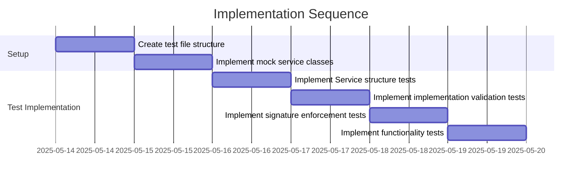

# Implementation Plan: Service Protocol Test Suite

## 1. Overview

### 1.1 Component Purpose

The Service protocol is a fundamental abstract base class in the khive system
that defines the contract for all service implementations. This test suite will
verify that the Service protocol correctly enforces its contract and that
implementations must adhere to the required interface.

### 1.2 Design Reference

This implementation is based on Issue #71 which requires creating a test suite
for the Service protocol defined in `src/khive/protocols/service.py`. The
implementation should follow the patterns established in other protocol test
suites like `test_invokable.py` and `test_embedable.py`.

### 1.3 Implementation Approach

The implementation will follow Test-Driven Development (TDD) principles:

1. Write failing tests that verify the Service protocol's contract
2. Implement mock classes that both correctly implement and incorrectly
   implement the protocol
3. Verify that the protocol correctly enforces its contract
4. Ensure >80% test coverage for the module

## 2. Implementation Phases

### 2.1 Phase 1: Test Setup and Basic Verification

**Key Deliverables:**

- Test fixtures and mock implementations
- Tests for basic Service class properties

**Dependencies:**

- Service protocol implementation in `src/khive/protocols/service.py`

**Estimated Complexity:** Low

### 2.2 Phase 2: Contract Enforcement Testing

**Key Deliverables:**

- Tests that verify the Service protocol enforces its contract
- Tests for handle_request method signature enforcement

**Dependencies:**

- Phase 1 completion

**Estimated Complexity:** Medium

## 3. Test Strategy

### 3.1 Unit Tests

#### 3.1.1 Test Group: Service Protocol Structure

| ID   | Description                                    | Fixtures/Mocks | Assertions                                      |
| ---- | ---------------------------------------------- | -------------- | ----------------------------------------------- |
| UT-1 | Test that Service is an abstract base class    | None           | Cannot instantiate Service directly             |
| UT-2 | Test that handle_request is an abstract method | None           | Method is marked with @abstractmethod decorator |

#### 3.1.2 Test Group: Service Implementation Validation

| ID   | Description                                                      | Fixtures/Mocks               | Assertions                                                |
| ---- | ---------------------------------------------------------------- | ---------------------------- | --------------------------------------------------------- |
| UT-3 | Test that concrete implementations must implement handle_request | ValidService, InvalidService | ValidService can be instantiated, InvalidService cannot   |
| UT-4 | Test that handle_request signature is enforced                   | Various mock implementations | Implementations with incorrect signatures raise TypeError |

#### 3.1.3 Test Group: Service Functionality

| ID   | Description                                                | Fixtures/Mocks | Assertions                                       |
| ---- | ---------------------------------------------------------- | -------------- | ------------------------------------------------ |
| UT-5 | Test that handle_request can be called with correct params | ValidService   | Method can be called with request and ctx params |
| UT-6 | Test that handle_request works with default ctx parameter  | ValidService   | Method can be called with only request param     |

### 3.2 Mock and Stub Requirements

| Dependency | Mock/Stub Type | Key Behaviors to Mock                                 |
| ---------- | -------------- | ----------------------------------------------------- |
| Service    | Mock           | Valid and invalid implementations of Service protocol |

## 4. Implementation Tasks

### 4.1 Test Setup

| ID  | Task                           | Description                                                | Dependencies | Priority | Complexity |
| --- | ------------------------------ | ---------------------------------------------------------- | ------------ | -------- | ---------- |
| T-1 | Create test file structure     | Set up the basic test file with imports and docstrings     | None         | High     | Low        |
| T-2 | Implement mock service classes | Create valid and invalid Service implementations for tests | T-1          | High     | Low        |

### 4.2 Test Implementation

| ID  | Task                                      | Description                                                | Dependencies | Priority | Complexity |
| --- | ----------------------------------------- | ---------------------------------------------------------- | ------------ | -------- | ---------- |
| T-3 | Implement Service structure tests         | Test that Service is ABC and handle_request is abstract    | T-1, T-2     | High     | Low        |
| T-4 | Implement implementation validation tests | Test that concrete classes must implement handle_request   | T-1, T-2     | High     | Medium     |
| T-5 | Implement signature enforcement tests     | Test that handle_request signature is properly enforced    | T-1, T-2     | High     | Medium     |
| T-6 | Implement functionality tests             | Test that handle_request can be called with correct params | T-1, T-2     | Medium   | Low        |

## 5. Implementation Sequence



## 6. Acceptance Criteria

### 6.1 Component Level

| ID   | Criterion                                                 | Validation Method               |
| ---- | --------------------------------------------------------- | ------------------------------- |
| AC-1 | All tests pass successfully                               | Run pytest on the test file     |
| AC-2 | Test coverage is >80% for the Service protocol            | Run pytest with coverage report |
| AC-3 | Tests verify all required aspects of the Service protocol | Manual review of test cases     |

## 7. Test Implementation Plan

### 7.1 Test Implementation Sequence

1. Implement basic test structure and imports
2. Implement mock Service implementations (valid and invalid)
3. Implement tests for Service being an abstract base class
4. Implement tests for handle_request being an abstract method
5. Implement tests for concrete implementations requiring handle_request
6. Implement tests for handle_request signature enforcement
7. Implement tests for handle_request functionality

### 7.2 Test Code Examples

#### Test for Abstract Base Class

```python
def test_service_is_abstract_base_class():
    """Test that Service is an abstract base class and cannot be instantiated directly."""
    with pytest.raises(TypeError, match="Can't instantiate abstract class Service"):
        Service()
```

#### Test for Valid Implementation

```python
class ValidService(Service):
    """Valid implementation of Service protocol."""

    async def handle_request(self, request, ctx=None):
        """Handle a request with the correct signature."""
        return {"status": "success", "data": request}

@pytest.mark.asyncio
async def test_valid_service_implementation():
    """Test that a valid Service implementation can be instantiated and used."""
    service = ValidService()
    result = await service.handle_request({"query": "test"})
    assert result["status"] == "success"
    assert result["data"] == {"query": "test"}
```

## 8. Implementation Risks and Mitigations

| Risk                                       | Impact | Likelihood | Mitigation                                                                          |
| ------------------------------------------ | ------ | ---------- | ----------------------------------------------------------------------------------- |
| Incomplete test coverage                   | Medium | Low        | Use pytest-cov to verify coverage and ensure all aspects of the protocol are tested |
| Incorrect signature enforcement testing    | High   | Medium     | Carefully design test cases to cover all signature variations and edge cases        |
| Missing edge cases in protocol enforcement | Medium | Medium     | Review other protocol test suites to ensure consistent testing approach             |

## 9. Dependencies and Environment

### 9.1 External Libraries

| Library        | Version | Purpose                             |
| -------------- | ------- | ----------------------------------- |
| pytest         | ^7.0.0  | Test framework                      |
| pytest-asyncio | ^0.21.0 | Support for testing async functions |
| pytest-cov     | ^4.1.0  | Test coverage reporting             |

### 9.2 Environment Setup

```bash
# Ensure the virtual environment is activated
# Install dependencies
uv sync

# Run the tests
uv run pytest tests/protocols/test_service.py -v
```

## 10. Additional Resources

### 10.1 Reference Implementation

- `tests/protocols/test_invokable.py`
- `tests/protocols/test_embedable.py`

### 10.2 Relevant Documentation

- Python documentation on Abstract Base Classes:
  https://docs.python.org/3/library/abc.html
- pytest-asyncio documentation: https://pytest-asyncio.readthedocs.io/

### 10.3 Design Patterns

- Abstract Base Class pattern
- Protocol pattern
