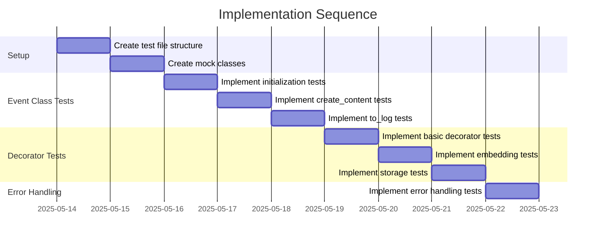

# Implementation Plan: Event Protocol Test Suite

## 1. Overview

### 1.1 Component Purpose

The Event protocol is a core component of the khive system that integrates
multiple protocols (Identifiable, Embedable, and Invokable) to create a unified
event tracking and processing system. This test suite will verify the
functionality of the Event class and its associated decorator (`as_event`),
ensuring proper integration with other protocols and correct behavior in various
scenarios.

### 1.2 Design Reference

This implementation is based on:

- Issue #72: Implement test suite for khive/protocols/event.py
- Existing protocol tests for Identifiable (#67), Embedable (#69), and Invokable
  (#70)
- The Event protocol implementation in `src/khive/protocols/event.py`

### 1.3 Implementation Approach

We will follow a Test-Driven Development (TDD) approach with the following
principles:

- Create comprehensive unit tests for all Event protocol functionality
- Achieve >80% test coverage for the module
- Create mock classes to isolate testing from external dependencies
- Test both normal operation and edge cases/error handling
- Ensure proper integration with the other protocols that Event inherits from

## 2. Implementation Phases

### 2.1 Phase 1: Setup and Basic Tests

**Key Deliverables:**

- Test file structure and imports
- Mock classes for testing (MockAdapter, mock_embed_function, MockRequest)
- Basic Event class initialization tests
- Tests for inheritance from other protocols

**Dependencies:**

- Existing protocol test implementations (Identifiable, Embedable, Invokable)
- Event protocol implementation

**Estimated Complexity:** Medium

### 2.2 Phase 2: Core Method Tests

**Key Deliverables:**

- Tests for `create_content` method
- Tests for `to_log` method with various parameters
- Tests for hash_content functionality

**Dependencies:**

- Phase 1 completion
- Understanding of Log model structure

**Estimated Complexity:** Medium

### 2.3 Phase 3: Decorator Tests

**Key Deliverables:**

- Tests for `as_event` decorator with default parameters
- Tests for `as_event` decorator with custom parameters
- Tests for embedding functionality within the decorator
- Tests for storage adapter integration

**Dependencies:**

- Phase 1 and 2 completion
- Understanding of AsyncAdapter functionality

**Estimated Complexity:** High

### 2.4 Phase 4: Edge Cases and Error Handling

**Key Deliverables:**

- Tests for error handling in the decorator
- Tests for edge cases (missing parameters, invalid inputs)
- Tests for cancellation and exception handling

**Dependencies:**

- Phase 1, 2, and 3 completion

**Estimated Complexity:** Medium

## 3. Test Strategy

### 3.1 Unit Tests

#### 3.1.1 Test Group: Event Initialization and Inheritance

| ID   | Description                                                     | Fixtures/Mocks | Assertions                                    |
| ---- | --------------------------------------------------------------- | -------------- | --------------------------------------------- |
| UT-1 | Test Event initialization with required parameters              | None           | Attributes set correctly                      |
| UT-2 | Test Event inherits from Identifiable, Embedable, and Invokable | None           | Instance checks pass for all parent protocols |
| UT-3 | Test Event initialization with default values                   | None           | Default values set correctly                  |

#### 3.1.2 Test Group: Event Methods

| ID   | Description                                         | Fixtures/Mocks | Assertions                       |
| ---- | --------------------------------------------------- | -------------- | -------------------------------- |
| UT-4 | Test create_content method with existing content    | None           | Returns existing content         |
| UT-5 | Test create_content method with no existing content | None           | Creates and returns JSON content |
| UT-6 | Test to_log method with default parameters          | None           | Returns Log with correct fields  |
| UT-7 | Test to_log method with custom event_type           | None           | Log has custom event_type        |
| UT-8 | Test to_log method with hash_content=True           | None           | Log has sha256 hash              |

#### 3.1.3 Test Group: as_event Decorator

| ID    | Description                                     | Fixtures/Mocks      | Assertions                              |
| ----- | ----------------------------------------------- | ------------------- | --------------------------------------- |
| UT-9  | Test as_event decorator with default parameters | mock_adapter        | Event created and invoked correctly     |
| UT-10 | Test as_event decorator with custom request_arg | mock_adapter        | Request extracted from correct argument |
| UT-11 | Test as_event decorator with embed_content=True | mock_embed_function | Embedding generated correctly           |
| UT-12 | Test as_event decorator with adapt=True         | mock_adapter        | Event stored via adapter                |
| UT-13 | Test as_event decorator with custom event_type  | mock_adapter        | Event stored with custom event_type     |

#### 3.1.4 Test Group: Error Handling

| ID    | Description                                                 | Fixtures/Mocks | Assertions                             |
| ----- | ----------------------------------------------------------- | -------------- | -------------------------------------- |
| UT-14 | Test as_event decorator with invalid storage adapter        | None           | ValueError raised with correct message |
| UT-15 | Test as_event decorator with function that raises exception | mock_adapter   | Exception handled correctly in Event   |
| UT-16 | Test as_event decorator with cancellation                   | mock_adapter   | CancelledError propagated correctly    |

### 3.2 Integration Tests

#### 3.2.1 Test Group: Event Lifecycle

| ID   | Description                                  | Setup                                              | Assertions                                             |
| ---- | -------------------------------------------- | -------------------------------------------------- | ------------------------------------------------------ |
| IT-1 | Test complete event lifecycle with decorator | Create decorated function with mocked dependencies | Event created, invoked, embedded, and stored correctly |
| IT-2 | Test event lifecycle with class method       | Create class with decorated method                 | Event works correctly with class methods               |

### 3.3 Mock and Stub Requirements

| Dependency         | Mock/Stub Type | Key Behaviors to Mock                        |
| ------------------ | -------------- | -------------------------------------------- |
| AsyncAdapter       | Mock           | to_obj method for storing events             |
| Embedding Function | Mock           | Function that returns embedding vector       |
| Request Object     | Mock           | Object that can be validated to dict         |
| Storage Provider   | Mock           | Configuration for storage provider selection |

## 4. Implementation Tasks

### 4.1 Setup and Structure

| ID  | Task                       | Description                                  | Dependencies | Priority | Complexity |
| --- | -------------------------- | -------------------------------------------- | ------------ | -------- | ---------- |
| T-1 | Create test file structure | Set up test file with imports and docstrings | None         | High     | Low        |
| T-2 | Create mock classes        | Implement mock classes for testing           | None         | High     | Medium     |

### 4.2 Event Class Tests

| ID  | Task                           | Description                                | Dependencies | Priority | Complexity |
| --- | ------------------------------ | ------------------------------------------ | ------------ | -------- | ---------- |
| T-3 | Implement initialization tests | Test Event class initialization            | T-1, T-2     | High     | Low        |
| T-4 | Implement create_content tests | Test create_content method                 | T-3          | High     | Low        |
| T-5 | Implement to_log tests         | Test to_log method with various parameters | T-3          | High     | Medium     |

### 4.3 Decorator Tests

| ID  | Task                            | Description                           | Dependencies  | Priority | Complexity |
| --- | ------------------------------- | ------------------------------------- | ------------- | -------- | ---------- |
| T-6 | Implement basic decorator tests | Test as_event with default parameters | T-1, T-2, T-3 | High     | Medium     |
| T-7 | Implement embedding tests       | Test embedding functionality          | T-6           | Medium   | Medium     |
| T-8 | Implement storage tests         | Test storage adapter integration      | T-6           | Medium   | High       |

### 4.4 Error Handling Tests

| ID  | Task                           | Description                                   | Dependencies  | Priority | Complexity |
| --- | ------------------------------ | --------------------------------------------- | ------------- | -------- | ---------- |
| T-9 | Implement error handling tests | Test error scenarios in decorator and methods | T-6, T-7, T-8 | Medium   | Medium     |

## 5. Implementation Sequence



## 6. Acceptance Criteria

### 6.1 Component Level

| ID   | Criterion                                      | Validation Method |
| ---- | ---------------------------------------------- | ----------------- |
| AC-1 | All tests pass successfully                    | pytest execution  |
| AC-2 | Test coverage exceeds 80% for the Event module | pytest-cov report |
| AC-3 | All edge cases and error scenarios are covered | Code review       |

### 6.2 API Level

| ID   | Criterion                                             | Validation Method |
| ---- | ----------------------------------------------------- | ----------------- |
| AC-4 | Event class correctly integrates all parent protocols | Inheritance tests |
| AC-5 | as_event decorator works with various function types  | Decorator tests   |
| AC-6 | Storage adapter integration works correctly           | Storage tests     |

## 7. Test Implementation Plan

### 7.1 Test Implementation Sequence

1. Implement base test fixtures and mocks
2. Implement Event class initialization tests
3. Implement Event method tests
4. Implement decorator tests with default parameters
5. Implement decorator tests with custom parameters
6. Implement error handling tests

### 7.2 Test Code Examples

#### Unit Test Example

```python
def test_event_initialization():
    """Test that Event initializes with the required parameters."""
    # Arrange
    event_function = lambda x: x
    event_args = [1, 2, 3]
    event_kwargs = {"key": "value"}

    # Act
    event = Event(event_function, event_args, event_kwargs)

    # Assert
    assert event._invoke_function == event_function
    assert event._invoke_args == event_args
    assert event._invoke_kwargs == event_kwargs
    assert isinstance(event, Identifiable)
    assert isinstance(event, Embedable)
    assert isinstance(event, Invokable)
```

#### Decorator Test Example

```python
@pytest.mark.asyncio
async def test_as_event_decorator():
    """Test that as_event decorator creates and returns an Event."""
    # Arrange
    mock_adapter = MockAdapter()

    @as_event(adapt=True, adapter=mock_adapter)
    async def test_function(request):
        return {"result": "success"}

    # Act
    event = await test_function({"input": "test"})

    # Assert
    assert isinstance(event, Event)
    assert event.request == {"input": "test"}
    assert event.execution.status == ExecutionStatus.COMPLETED
    assert event.execution.response == {"result": "success"}
    assert mock_adapter.stored_event is not None
```

## 8. Implementation Risks and Mitigations

| Risk                                        | Impact | Likelihood | Mitigation                                                                     |
| ------------------------------------------- | ------ | ---------- | ------------------------------------------------------------------------------ |
| Complex integration with multiple protocols | High   | Medium     | Break down tests into smaller, focused units; leverage existing protocol tests |
| Async testing complexity                    | Medium | High       | Use pytest-asyncio and proper async fixtures; ensure proper cleanup            |
| Mock complexity for storage adapters        | Medium | Medium     | Create simple, focused mock classes that only implement the required behavior  |

## 9. Dependencies and Environment

### 9.1 External Libraries

| Library        | Version | Purpose                       |
| -------------- | ------- | ----------------------------- |
| pytest         | ^7.0.0  | Test framework                |
| pytest-asyncio | ^0.21.0 | Async test support            |
| pytest-cov     | ^4.1.0  | Coverage reporting            |
| freezegun      | ^1.2.0  | Time manipulation for testing |

### 9.2 Environment Setup

```bash
# Ensure development environment is set up
khive init

# Run tests with coverage
uv run pytest tests/protocols/test_event.py -v --cov=src/khive/protocols/event.py
```

## 10. Additional Resources

### 10.1 Reference Implementation

- Existing protocol tests:
  - `tests/protocols/test_identifiable.py`
  - `tests/protocols/test_embedable.py`
  - `tests/protocols/test_invokable.py`

### 10.2 Relevant Documentation

- Event protocol implementation: `src/khive/protocols/event.py`
- Pydapter documentation for AsyncAdapter

### 10.3 Design Patterns

- Decorator pattern (as_event decorator)
- Protocol inheritance pattern
- Mock objects for testing
