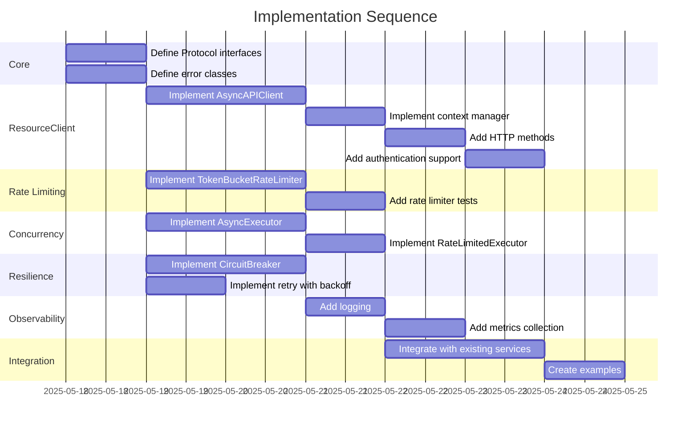

# Implementation Plan: Robust Async API Client

## 1. Overview

### 1.1 Component Purpose

The Robust Async API Client provides a standardized, efficient, and resilient
way to interact with external APIs. It handles connection pooling, session
management, rate limiting, concurrency control, and proper resource cleanup. The
client implements the async context manager protocol for resource management and
provides comprehensive error handling with retry mechanisms and circuit
breakers.

### 1.2 Design Reference

This implementation is based on the approved technical design specification:

- [TDS-80: Layered Resource Control Architecture](.khive/reports/tds/TDS-80.md)
- [Issue #81: API Client: Implement robust async API client with resource management](https://github.com/khive-ai/khive.d/issues/81)

### 1.3 Implementation Approach

The implementation will follow Test-Driven Development (TDD) principles:

1. Write failing tests for each component
2. Implement the minimum code to make tests pass
3. Refactor while maintaining passing tests
4. Achieve >80% test coverage

The implementation will be structured in phases, starting with core interfaces
and base implementations, followed by integration and composition, enhanced
resilience features, and finally observability and testing.

## 2. Implementation Phases

### 2.1 Phase 1: Core Interfaces and Base Implementations

Define the core interfaces (Protocol classes) and implement the base
ResourceClient with proper session management.

**Key Deliverables:**

- Protocol definitions for ResourceClient, Executor, RateLimiter, and Queue
- AsyncAPIClient implementation with proper resource management
- Base error classes for API client exceptions

**Dependencies:**

- httpx for async HTTP requests
- Existing endpoint configuration structure

**Estimated Complexity:** Medium

### 2.2 Phase 2: Rate Limiting and Concurrency Control

Implement the rate limiting and concurrency control components.

**Key Deliverables:**

- TokenBucketRateLimiter implementation
- AsyncExecutor for concurrency control
- RateLimitedExecutor combining rate limiting and concurrency control

**Dependencies:**

- Phase 1 components
- asyncio for asynchronous operations

**Estimated Complexity:** Medium

### 2.3 Phase 3: Enhanced Resilience

Add resilience patterns to handle failures gracefully.

**Key Deliverables:**

- CircuitBreaker implementation
- Retry with exponential backoff functionality
- Integration with existing error handling

**Dependencies:**

- Phase 1 and 2 components
- backoff library for retry mechanisms

**Estimated Complexity:** High

### 2.4 Phase 4: Observability and Integration

Add logging, metrics, and integrate with existing services.

**Key Deliverables:**

- Comprehensive logging throughout the client
- Metrics collection for API calls, rate limiting, etc.
- Integration with existing services

**Dependencies:**

- All previous phases
- Logging framework

**Estimated Complexity:** Medium

## 3. Test Strategy

### 3.1 Unit Tests

#### 3.1.1 Test Group: ResourceClient

| ID   | Description                                                | Fixtures/Mocks | Assertions                                        |
| ---- | ---------------------------------------------------------- | -------------- | ------------------------------------------------- |
| UT-1 | Test that AsyncAPIClient initializes correctly             | None           | Client attributes match expected values           |
| UT-2 | Test that AsyncAPIClient context manager works correctly   | `mock_session` | Session is created and closed appropriately       |
| UT-3 | Test that get/post methods work correctly                  | `mock_session` | Correct methods are called with expected params   |
| UT-4 | Test that client handles errors correctly                  | `mock_session` | Appropriate exceptions are raised and propagated  |
| UT-5 | Test that client properly releases resources on exceptions | `mock_session` | Resources are released even when exceptions occur |

#### 3.1.2 Test Group: RateLimiter

| ID   | Description                                                     | Fixtures/Mocks | Assertions                                   |
| ---- | --------------------------------------------------------------- | -------------- | -------------------------------------------- |
| UT-6 | Test that TokenBucketRateLimiter initializes correctly          | None           | Limiter attributes match expected values     |
| UT-7 | Test that acquire method returns 0 when tokens are available    | `mock_time`    | Return value is 0 when tokens are available  |
| UT-8 | Test that acquire method returns wait time when tokens depleted | `mock_time`    | Return value is correct wait time            |
| UT-9 | Test that execute method applies rate limiting                  | `mock_time`    | Function is executed after appropriate delay |

#### 3.1.3 Test Group: Executor

| ID    | Description                                             | Fixtures/Mocks | Assertions                                      |
| ----- | ------------------------------------------------------- | -------------- | ----------------------------------------------- |
| UT-10 | Test that AsyncExecutor initializes correctly           | None           | Executor attributes match expected values       |
| UT-11 | Test that execute method respects concurrency limits    | None           | Concurrent executions are limited appropriately |
| UT-12 | Test that shutdown method waits for active tasks        | None           | All tasks complete before shutdown returns      |
| UT-13 | Test that shutdown with timeout cancels remaining tasks | None           | Tasks are cancelled after timeout               |

#### 3.1.4 Test Group: CircuitBreaker

| ID    | Description                                                        | Fixtures/Mocks | Assertions                                     |
| ----- | ------------------------------------------------------------------ | -------------- | ---------------------------------------------- |
| UT-14 | Test that CircuitBreaker initializes in closed state               | None           | Initial state is CLOSED                        |
| UT-15 | Test that CircuitBreaker opens after threshold failures            | None           | State changes to OPEN after threshold failures |
| UT-16 | Test that CircuitBreaker rejects calls when open                   | None           | CircuitBreakerOpenError is raised when open    |
| UT-17 | Test that CircuitBreaker transitions to half-open after timeout    | `mock_time`    | State changes to HALF_OPEN after recovery time |
| UT-18 | Test that CircuitBreaker closes after successful call in half-open | None           | State changes to CLOSED after successful call  |

### 3.2 Integration Tests

#### 3.2.1 Test Group: Client Integration

| ID   | Description                                      | Setup                                                  | Assertions                                                         |
| ---- | ------------------------------------------------ | ------------------------------------------------------ | ------------------------------------------------------------------ |
| IT-1 | Test that client works with httpx                | Initialize client with test server                     | Client successfully makes requests and processes responses         |
| IT-2 | Test that client handles server errors correctly | Initialize client with test server that returns errors | Client handles errors appropriately and raises expected exceptions |
| IT-3 | Test that client properly releases resources     | Initialize client and force exceptions                 | Resources are properly released in all scenarios                   |

#### 3.2.2 Test Group: Rate Limiting Integration

| ID   | Description                                  | Setup                                   | Assertions                                                        |
| ---- | -------------------------------------------- | --------------------------------------- | ----------------------------------------------------------------- |
| IT-4 | Test that rate limiting works with real time | Initialize rate limiter with small rate | Requests are properly spaced according to rate limit              |
| IT-5 | Test that rate limiting works with executor  | Initialize rate-limited executor        | Concurrent requests are both rate-limited and concurrency-limited |

#### 3.2.3 Test Group: Resilience Integration

| ID   | Description                                      | Setup                                                          | Assertions                                                          |
| ---- | ------------------------------------------------ | -------------------------------------------------------------- | ------------------------------------------------------------------- |
| IT-6 | Test that circuit breaker works with real client | Initialize client with circuit breaker and failing server      | Circuit opens after threshold failures and rejects subsequent calls |
| IT-7 | Test that retry mechanism works with real client | Initialize client with retry and intermittently failing server | Client retries failed requests and eventually succeeds              |

### 3.3 Mock and Stub Requirements

| Dependency        | Mock/Stub Type | Key Behaviors to Mock                                          |
| ----------------- | -------------- | -------------------------------------------------------------- |
| httpx.AsyncClient | Mock           | Session creation, HTTP methods, response handling, errors      |
| time.monotonic    | Mock           | Time progression for testing rate limiting and circuit breaker |
| asyncio.sleep     | Mock           | Sleep behavior for testing delays without waiting              |
| External API      | Stub           | HTTP responses, errors, rate limit responses                   |

## 4. Implementation Tasks

### 4.1 Core Interfaces

| ID  | Task                       | Description                                                       | Dependencies | Priority | Complexity |
| --- | -------------------------- | ----------------------------------------------------------------- | ------------ | -------- | ---------- |
| T-1 | Define Protocol interfaces | Create Protocol classes for ResourceClient, Executor, RateLimiter | None         | High     | Low        |
| T-2 | Define error classes       | Create exception hierarchy for API client errors                  | None         | High     | Low        |

### 4.2 ResourceClient Implementation

| ID  | Task                       | Description                                           | Dependencies | Priority | Complexity |
| --- | -------------------------- | ----------------------------------------------------- | ------------ | -------- | ---------- |
| T-3 | Implement AsyncAPIClient   | Create base async API client with resource management | T-1, T-2     | High     | Medium     |
| T-4 | Implement context manager  | Add async context manager protocol support            | T-3          | High     | Low        |
| T-5 | Add HTTP methods           | Implement get, post, put, delete methods              | T-3          | High     | Medium     |
| T-6 | Add authentication support | Implement various authentication methods              | T-3          | Medium   | Medium     |

### 4.3 Rate Limiting Implementation

| ID  | Task                             | Description                                  | Dependencies | Priority | Complexity |
| --- | -------------------------------- | -------------------------------------------- | ------------ | -------- | ---------- |
| T-7 | Implement TokenBucketRateLimiter | Create token bucket algorithm implementation | T-1          | High     | Medium     |
| T-8 | Add rate limiter tests           | Create comprehensive tests for rate limiter  | T-7          | High     | Medium     |

### 4.4 Concurrency Control

| ID   | Task                          | Description                                   | Dependencies | Priority | Complexity |
| ---- | ----------------------------- | --------------------------------------------- | ------------ | -------- | ---------- |
| T-9  | Implement AsyncExecutor       | Create executor with concurrency control      | T-1          | High     | Medium     |
| T-10 | Implement RateLimitedExecutor | Combine rate limiting and concurrency control | T-7, T-9     | High     | Medium     |

### 4.5 Resilience Patterns

| ID   | Task                         | Description                                     | Dependencies | Priority | Complexity |
| ---- | ---------------------------- | ----------------------------------------------- | ------------ | -------- | ---------- |
| T-11 | Implement CircuitBreaker     | Create circuit breaker pattern implementation   | T-1          | Medium   | High       |
| T-12 | Implement retry with backoff | Create retry mechanism with exponential backoff | T-1          | Medium   | Medium     |

### 4.6 Observability

| ID   | Task                   | Description                                     | Dependencies | Priority | Complexity |
| ---- | ---------------------- | ----------------------------------------------- | ------------ | -------- | ---------- |
| T-13 | Add logging            | Add comprehensive logging throughout the client | All previous | Low      | Low        |
| T-14 | Add metrics collection | Add metrics for API calls, rate limiting, etc.  | All previous | Low      | Medium     |

### 4.7 Integration

| ID   | Task                             | Description                                   | Dependencies | Priority | Complexity |
| ---- | -------------------------------- | --------------------------------------------- | ------------ | -------- | ---------- |
| T-15 | Integrate with existing services | Integrate client with existing khive services | All previous | Medium   | Medium     |
| T-16 | Create examples                  | Create example usage patterns                 | All previous | Low      | Low        |

## 5. Implementation Sequence



## 6. Acceptance Criteria

### 6.1 Component Level

| ID   | Criterion                                              | Validation Method     |
| ---- | ------------------------------------------------------ | --------------------- |
| AC-1 | The client successfully makes API requests             | Integration test IT-1 |
| AC-2 | The client properly manages resources                  | Integration test IT-3 |
| AC-3 | The client handles errors gracefully                   | Integration test IT-2 |
| AC-4 | The rate limiter correctly limits request rate         | Integration test IT-4 |
| AC-5 | The circuit breaker prevents calls to failing services | Integration test IT-6 |
| AC-6 | The retry mechanism retries failed requests            | Integration test IT-7 |

### 6.2 API Level

| ID   | Criterion                                            | Validation Method              |
| ---- | ---------------------------------------------------- | ------------------------------ |
| AC-7 | The client implements the ResourceClient Protocol    | Unit tests UT-1 through UT-5   |
| AC-8 | The rate limiter implements the RateLimiter Protocol | Unit tests UT-6 through UT-9   |
| AC-9 | The executor implements the Executor Protocol        | Unit tests UT-10 through UT-13 |

## 7. Test Implementation Plan

### 7.1 Test Implementation Sequence

1. Implement base test fixtures and mocks for httpx, time, and asyncio
2. Implement unit tests for ResourceClient
3. Implement unit tests for RateLimiter
4. Implement unit tests for Executor
5. Implement unit tests for CircuitBreaker
6. Implement integration tests for client with httpx
7. Implement integration tests for rate limiting
8. Implement integration tests for resilience patterns

### 7.2 Test Code Examples

#### Unit Test Example for AsyncAPIClient

```python
import pytest
import httpx
from unittest.mock import AsyncMock, patch

from khive.clients.api_client import AsyncAPIClient

@pytest.mark.asyncio
async def test_async_api_client_context_manager():
    # Arrange
    base_url = "https://api.example.com"
    timeout = 10.0

    # Mock the httpx.AsyncClient
    mock_session = AsyncMock(spec=httpx.AsyncClient)

    # Act & Assert
    with patch('httpx.AsyncClient', return_value=mock_session):
        async with AsyncAPIClient(base_url=base_url, timeout=timeout) as client:
            # Assert client was initialized correctly
            assert client.base_url == base_url
            assert client.timeout == timeout

        # Assert session was closed
        mock_session.aclose.assert_called_once()
```

#### Unit Test Example for TokenBucketRateLimiter

```python
import pytest
import time
from unittest.mock import patch

from khive.clients.rate_limiter import TokenBucketRateLimiter

@pytest.mark.asyncio
async def test_token_bucket_rate_limiter_acquire():
    # Arrange
    rate = 10  # 10 tokens per second
    period = 1.0

    # Mock time.monotonic to return controlled values
    with patch('time.monotonic', side_effect=[0.0, 0.1, 0.2]):
        limiter = TokenBucketRateLimiter(rate=rate, period=period)

        # Act & Assert
        # First call should succeed immediately (tokens available)
        wait_time = await limiter.acquire(1.0)
        assert wait_time == 0.0

        # Second call should also succeed (tokens still available)
        wait_time = await limiter.acquire(5.0)
        assert wait_time == 0.0

        # Third call should require waiting (not enough tokens)
        wait_time = await limiter.acquire(5.0)
        assert wait_time > 0.0
        assert wait_time < 0.5  # Should be less than half a second
```

#### Integration Test Example

```python
import pytest
import asyncio
import httpx
from khive.clients.api_client import AsyncAPIClient

@pytest.mark.asyncio
async def test_client_with_httpx_server():
    # Arrange
    async def app(request):
        if request.url.path == "/test":
            return httpx.Response(200, json={"success": True})
        return httpx.Response(404)

    async with httpx.AsyncClient(app=app, base_url="http://testserver") as test_client:
        client = AsyncAPIClient(client=test_client)

        # Act
        response = await client.get("/test")

        # Assert
        assert response == {"success": True}
```

## 8. Implementation Risks and Mitigations

| Risk                                     | Impact | Likelihood | Mitigation                                                                                                 |
| ---------------------------------------- | ------ | ---------- | ---------------------------------------------------------------------------------------------------------- |
| Resource leaks in async context          | High   | Medium     | Implement comprehensive tests for resource cleanup, use try/finally blocks consistently                    |
| Race conditions in concurrent operations | High   | Medium     | Use proper synchronization primitives (locks, semaphores), test with high concurrency                      |
| Excessive memory usage with many clients | Medium | Low        | Implement connection pooling, limit concurrent connections, add monitoring                                 |
| Integration issues with existing code    | Medium | Medium     | Start with thorough review of existing code, create adapter layer if needed                                |
| Performance bottlenecks in rate limiting | Medium | Low        | Profile rate limiting code, optimize token bucket algorithm, consider distributed rate limiting for future |

## 9. Dependencies and Environment

### 9.1 External Libraries

| Library  | Version | Purpose                        |
| -------- | ------- | ------------------------------ |
| httpx    | ^0.24.0 | Async HTTP client              |
| backoff  | ^2.2.1  | Retry mechanisms with backoff  |
| aiocache | ^0.12.0 | Optional caching for responses |
| pydantic | ^2.0.0  | Data validation and models     |

### 9.2 Environment Setup

```bash
# Create virtual environment
python -m venv venv
source venv/bin/activate

# Install dependencies
uv sync

# Run tests
uv run pytest tests/clients/
```

## 10. Additional Resources

### 10.1 Reference Implementation

- Existing `Endpoint` class in `src/khive/connections/endpoint.py`
- TDS-80.md implementation examples

### 10.2 Relevant Documentation

- [httpx Documentation](https://www.python-httpx.org/)
- [asyncio Documentation](https://docs.python.org/3/library/asyncio.html)
- [Circuit Breaker Pattern](https://martinfowler.com/bliki/CircuitBreaker.html)
- [Token Bucket Algorithm](https://en.wikipedia.org/wiki/Token_bucket)

### 10.3 Design Patterns

- **Async Context Manager Pattern**: For proper resource management
- **Circuit Breaker Pattern**: For resilience to external service failures
- **Token Bucket Algorithm**: For rate limiting
- **Composition over Inheritance**: For combining rate limiting and concurrency
  control
