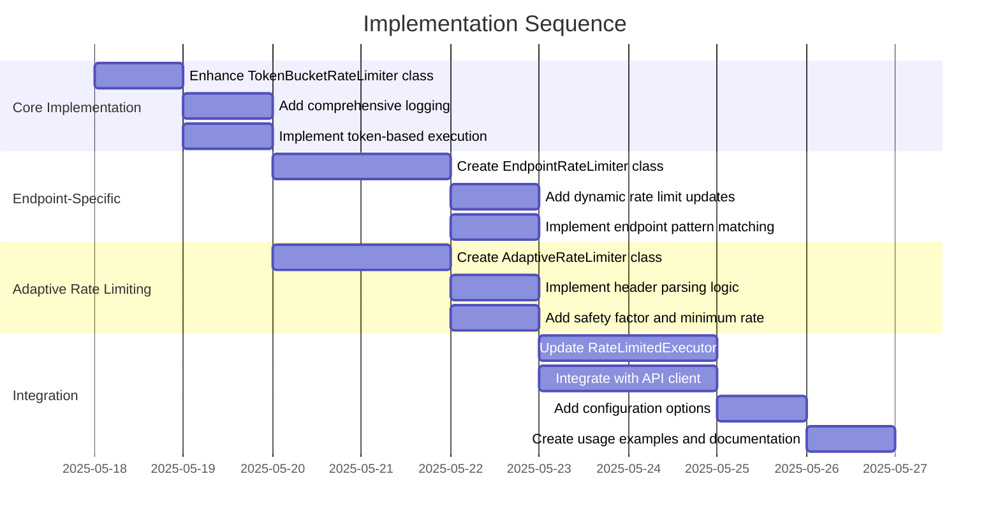

# Implementation Plan: Token Bucket Rate Limiter

## 1. Overview

### 1.1 Component Purpose

The Token Bucket Rate Limiter is a critical component that provides precise
control over API request rates. It implements the token bucket algorithm to
allow controlled bursts of requests while maintaining long-term rate limits.
This component will help prevent overwhelming external services, manage resource
consumption, and ensure compliance with API rate limits.

### 1.2 Design Reference

- Technical Design Specification: TDS-80.md (Layered Resource Control
  Architecture)
- Issue #82: Rate Limiting: Implement token bucket algorithm for precise API
  rate control
- Issue #81: API Client functionality (merged)

### 1.3 Implementation Approach

We will follow a Test-Driven Development (TDD) approach:

1. Write failing tests for each component
2. Implement the minimum code to make tests pass
3. Refactor while maintaining passing tests
4. Integrate with existing API client and executor components

The implementation will be done in phases, starting with the core token bucket
algorithm and expanding to more advanced features like endpoint-specific rate
limiting and adaptive rate limiting.

## 2. Implementation Phases

### 2.1 Phase 1: Core Token Bucket Implementation

Enhance the existing TokenBucketRateLimiter class to fully implement the token
bucket algorithm with proper token tracking and refill logic.

**Key Deliverables:**

- Enhanced TokenBucketRateLimiter class with improved token tracking
- Comprehensive unit tests for token bucket functionality
- Documentation of the token bucket algorithm implementation

**Dependencies:**

- Existing rate_limiter.py file
- Python asyncio library

**Estimated Complexity:** Medium

### 2.2 Phase 2: Endpoint-Specific Rate Limiting

Implement the EndpointRateLimiter class to support per-endpoint rate limits.

**Key Deliverables:**

- EndpointRateLimiter class that manages multiple rate limiters for different
  endpoints
- Methods to update rate limits dynamically
- Unit tests for endpoint-specific rate limiting

**Dependencies:**

- Phase 1: Core Token Bucket Implementation
- API client integration points

**Estimated Complexity:** Medium

### 2.3 Phase 3: Adaptive Rate Limiting

Implement the AdaptiveRateLimiter class that can adjust rate limits based on API
response headers.

**Key Deliverables:**

- AdaptiveRateLimiter class that extends the basic RateLimiter
- Header parsing logic for common rate limit header patterns
- Unit tests for adaptive rate limiting

**Dependencies:**

- Phase 1: Core Token Bucket Implementation
- API client response handling

**Estimated Complexity:** High

### 2.4 Phase 4: Integration with API Client and Executor

Integrate the rate limiting components with the existing API client and
executor.

**Key Deliverables:**

- Updated RateLimitedExecutor class that uses the new rate limiting system
- Integration tests for the full rate limiting system
- Documentation of configuration options and usage patterns

**Dependencies:**

- Phase 1-3 implementations
- Existing API client and executor code

**Estimated Complexity:** Medium

## 3. Test Strategy

### 3.1 Unit Tests

#### 3.1.1 Test Group: TokenBucketRateLimiter

| ID   | Description                                       | Fixtures/Mocks   | Assertions                                                 |
| ---- | ------------------------------------------------- | ---------------- | ---------------------------------------------------------- |
| UT-1 | Test initialization with various parameters       | None             | Properties match expected values                           |
| UT-2 | Test token refill logic with mocked time          | `time.monotonic` | Tokens are refilled at the correct rate                    |
| UT-3 | Test acquire method when tokens are available     | `time.monotonic` | Returns 0.0 wait time, tokens are decremented correctly    |
| UT-4 | Test acquire method when tokens are not available | `time.monotonic` | Returns correct wait time, tokens remain unchanged         |
| UT-5 | Test execute method with immediate execution      | `asyncio.sleep`  | Function is called immediately, result is returned         |
| UT-6 | Test execute method with delayed execution        | `asyncio.sleep`  | Sleep is called with correct wait time, result is returned |

#### 3.1.2 Test Group: EndpointRateLimiter

| ID    | Description                                              | Fixtures/Mocks        | Assertions                                            |
| ----- | -------------------------------------------------------- | --------------------- | ----------------------------------------------------- |
| UT-7  | Test initialization with default parameters              | None                  | Default limiters are created correctly                |
| UT-8  | Test get_limiter method for existing endpoint            | None                  | Returns existing limiter                              |
| UT-9  | Test get_limiter method for new endpoint                 | None                  | Creates and returns new limiter with default settings |
| UT-10 | Test execute method with endpoint-specific rate limiting | `RateLimiter.execute` | Correct limiter is used for execution                 |
| UT-11 | Test update_rate_limit method                            | None                  | Rate limit parameters are updated correctly           |

#### 3.1.3 Test Group: AdaptiveRateLimiter

| ID    | Description                                       | Fixtures/Mocks   | Assertions                                 |
| ----- | ------------------------------------------------- | ---------------- | ------------------------------------------ |
| UT-12 | Test initialization with custom parameters        | None             | Properties match expected values           |
| UT-13 | Test update_from_headers with X-RateLimit headers | `time.monotonic` | Rate is updated correctly based on headers |
| UT-14 | Test update_from_headers with RateLimit headers   | `time.monotonic` | Rate is updated correctly based on headers |
| UT-15 | Test update_from_headers with no relevant headers | None             | Rate remains unchanged                     |
| UT-16 | Test safety factor application                    | None             | New rate is adjusted by safety factor      |

### 3.2 Integration Tests

#### 3.2.1 Test Group: API Client Integration

| ID   | Description                                          | Setup                                            | Assertions                                           |
| ---- | ---------------------------------------------------- | ------------------------------------------------ | ---------------------------------------------------- |
| IT-1 | Test API client with rate limiting                   | Initialize API client with rate limiter          | Requests are rate limited according to configuration |
| IT-2 | Test API client with endpoint-specific rate limiting | Initialize API client with endpoint rate limiter | Different endpoints have different rate limits       |
| IT-3 | Test API client with adaptive rate limiting          | Initialize API client with adaptive rate limiter | Rate limits adjust based on response headers         |

#### 3.2.2 Test Group: Executor Integration

| ID   | Description                                                    | Setup                                      | Assertions                                    |
| ---- | -------------------------------------------------------------- | ------------------------------------------ | --------------------------------------------- |
| IT-4 | Test RateLimitedExecutor with token bucket                     | Initialize executor with rate limiter      | Tasks are executed with rate limiting         |
| IT-5 | Test RateLimitedExecutor with concurrency control              | Initialize executor with concurrency limit | Concurrent tasks are limited correctly        |
| IT-6 | Test RateLimitedExecutor with both rate and concurrency limits | Initialize executor with both limits       | Both rate and concurrency limits are enforced |

### 3.3 Mock and Stub Requirements

| Dependency     | Mock/Stub Type | Key Behaviors to Mock                                      |
| -------------- | -------------- | ---------------------------------------------------------- |
| time.monotonic | Mock           | Return controlled time values for testing time-based logic |
| asyncio.sleep  | Mock           | Verify sleep is called with correct wait times             |
| API client     | Mock           | Simulate API responses with rate limit headers             |
| External API   | Mock           | Simulate responses and rate limit errors                   |

## 4. Implementation Tasks

### 4.1 Core Token Bucket Implementation

| ID  | Task                                 | Description                                                    | Dependencies | Priority | Complexity |
| --- | ------------------------------------ | -------------------------------------------------------------- | ------------ | -------- | ---------- |
| T-1 | Enhance TokenBucketRateLimiter class | Improve the existing implementation with better token tracking | None         | High     | Medium     |
| T-2 | Add comprehensive logging            | Add detailed logging for rate limiting operations              | T-1          | Medium   | Low        |
| T-3 | Implement token-based execution      | Allow specifying token cost for operations                     | T-1          | High     | Medium     |

### 4.2 Endpoint-Specific Rate Limiting

| ID  | Task                                | Description                                        | Dependencies | Priority | Complexity |
| --- | ----------------------------------- | -------------------------------------------------- | ------------ | -------- | ---------- |
| T-4 | Create EndpointRateLimiter class    | Implement class to manage per-endpoint rate limits | T-1          | High     | Medium     |
| T-5 | Add dynamic rate limit updates      | Allow updating rate limits for specific endpoints  | T-4          | Medium   | Medium     |
| T-6 | Implement endpoint pattern matching | Support pattern matching for endpoint grouping     | T-4          | Low      | Medium     |

### 4.3 Adaptive Rate Limiting

| ID  | Task                               | Description                                                   | Dependencies | Priority | Complexity |
| --- | ---------------------------------- | ------------------------------------------------------------- | ------------ | -------- | ---------- |
| T-7 | Create AdaptiveRateLimiter class   | Implement class that adjusts limits based on response headers | T-1          | Medium   | High       |
| T-8 | Implement header parsing logic     | Add support for various rate limit header formats             | T-7          | Medium   | Medium     |
| T-9 | Add safety factor and minimum rate | Implement safety margins to prevent rate limit violations     | T-7          | Medium   | Low        |

### 4.4 Integration

| ID   | Task                                    | Description                                          | Dependencies  | Priority | Complexity |
| ---- | --------------------------------------- | ---------------------------------------------------- | ------------- | -------- | ---------- |
| T-10 | Update RateLimitedExecutor              | Enhance executor to use the new rate limiting system | T-1, T-4, T-7 | High     | Medium     |
| T-11 | Integrate with API client               | Add rate limiting support to API client              | T-1, T-4, T-7 | High     | Medium     |
| T-12 | Add configuration options               | Implement flexible configuration for rate limiting   | T-10, T-11    | Medium   | Low        |
| T-13 | Create usage examples and documentation | Document usage patterns and configuration options    | T-10, T-11    | Medium   | Low        |

## 5. Implementation Sequence



## 6. Acceptance Criteria

### 6.1 Component Level

| ID   | Criterion                                                   | Validation Method                   |
| ---- | ----------------------------------------------------------- | ----------------------------------- |
| AC-1 | TokenBucketRateLimiter correctly limits request rates       | Unit tests UT-1 through UT-6        |
| AC-2 | EndpointRateLimiter provides per-endpoint rate limiting     | Unit tests UT-7 through UT-11       |
| AC-3 | AdaptiveRateLimiter adjusts rates based on response headers | Unit tests UT-12 through UT-16      |
| AC-4 | Rate limiting integrates with API client and executor       | Integration tests IT-1 through IT-6 |

### 6.2 API Level

| ID   | Criterion                                                         | Validation Method                  |
| ---- | ----------------------------------------------------------------- | ---------------------------------- |
| AC-5 | API client respects rate limits for all requests                  | Integration tests IT-1, IT-2, IT-3 |
| AC-6 | RateLimitedExecutor correctly applies rate and concurrency limits | Integration tests IT-4, IT-5, IT-6 |
| AC-7 | Rate limiting configuration is flexible and well-documented       | Documentation review               |

## 7. Test Implementation Plan

### 7.1 Test Implementation Sequence

1. Implement base test fixtures and mocks for time.monotonic and asyncio.sleep
2. Implement unit tests for TokenBucketRateLimiter
3. Implement unit tests for EndpointRateLimiter
4. Implement unit tests for AdaptiveRateLimiter
5. Implement integration tests for API client integration
6. Implement integration tests for executor integration

### 7.2 Test Code Examples

#### Unit Test Example for TokenBucketRateLimiter

```python
import pytest
import asyncio
from unittest.mock import patch, AsyncMock
import time
from khive.clients.rate_limiter import TokenBucketRateLimiter

@pytest.mark.asyncio
async def test_token_bucket_refill():
    """Test that _refill method adds tokens correctly."""
    # Arrange
    rate = 10
    period = 1.0
    limiter = TokenBucketRateLimiter(rate=rate, period=period)
    limiter.tokens = 5  # Start with 5 tokens

    # Set the initial state
    limiter.last_refill = 0.0

    # Mock time.monotonic to return a specific value
    with patch("time.monotonic", return_value=0.5):
        # Act
        await limiter._refill()

        # Assert
        # After 0.5 seconds, should add 0.5 * (10/1.0) = 5 tokens
        assert limiter.tokens == 10.0
```

#### Integration Test Example for RateLimitedExecutor

```python
import pytest
import asyncio
import time
from khive.clients.executor import RateLimitedExecutor
from khive.clients.rate_limiter import TokenBucketRateLimiter

@pytest.mark.asyncio
async def test_rate_limited_executor_integration():
    """Test that RateLimitedExecutor correctly applies rate limiting."""
    # Arrange
    start_time = time.monotonic()
    executor = RateLimitedExecutor(rate=2, period=1.0)  # 2 requests per second

    async def test_operation(i):
        return i * 2

    # Act
    # Execute 5 operations that should be rate limited
    results = await asyncio.gather(*[
        executor.execute(test_operation, i) for i in range(5)
    ])

    end_time = time.monotonic()

    # Assert
    # Should take at least 2 seconds to execute 5 operations at 2 per second
    assert end_time - start_time >= 2.0
    assert results == [0, 2, 4, 6, 8]
```

## 8. Implementation Risks and Mitigations

| Risk                                          | Impact | Likelihood | Mitigation                                                                           |
| --------------------------------------------- | ------ | ---------- | ------------------------------------------------------------------------------------ |
| Time-based logic is difficult to test         | High   | High       | Use dependency injection for time functions, mock time.monotonic in tests            |
| Race conditions in concurrent rate limiting   | High   | Medium     | Use proper locking mechanisms, comprehensive tests with concurrent access            |
| Integration with existing code may be complex | Medium | Medium     | Maintain backward compatibility, incremental integration, thorough integration tests |
| Performance overhead of rate limiting         | Medium | Low        | Optimize token bucket algorithm, benchmark performance, avoid unnecessary locking    |

## 9. Dependencies and Environment

### 9.1 External Libraries

| Library        | Version | Purpose                             |
| -------------- | ------- | ----------------------------------- |
| asyncio        | stdlib  | Asynchronous I/O, coroutines, tasks |
| httpx          | ^0.24.0 | HTTP client for API requests        |
| pytest         | ^7.3.1  | Testing framework                   |
| pytest-asyncio | ^0.21.0 | Async testing support               |

### 9.2 Environment Setup

```bash
# Create virtual environment
python -m venv venv
source venv/bin/activate

# Install dependencies
pip install -r requirements.txt

# Run tests
pytest tests/clients/test_rate_limiter.py -v
```

## 10. Additional Resources

### 10.1 Reference Implementation

- Existing TokenBucketRateLimiter in src/khive/clients/rate_limiter.py
- RateLimitedExecutor in src/khive/clients/executor.py

### 10.2 Relevant Documentation

- [Token Bucket Algorithm](https://en.wikipedia.org/wiki/Token_bucket)
- [Asyncio Documentation](https://docs.python.org/3/library/asyncio.html)
- [Rate Limiting Best Practices](https://cloud.google.com/architecture/rate-limiting-strategies-techniques)

### 10.3 Design Patterns

- Decorator Pattern: For applying rate limiting to existing functions
- Strategy Pattern: For different rate limiting strategies
- Adapter Pattern: For integrating with different API clients
