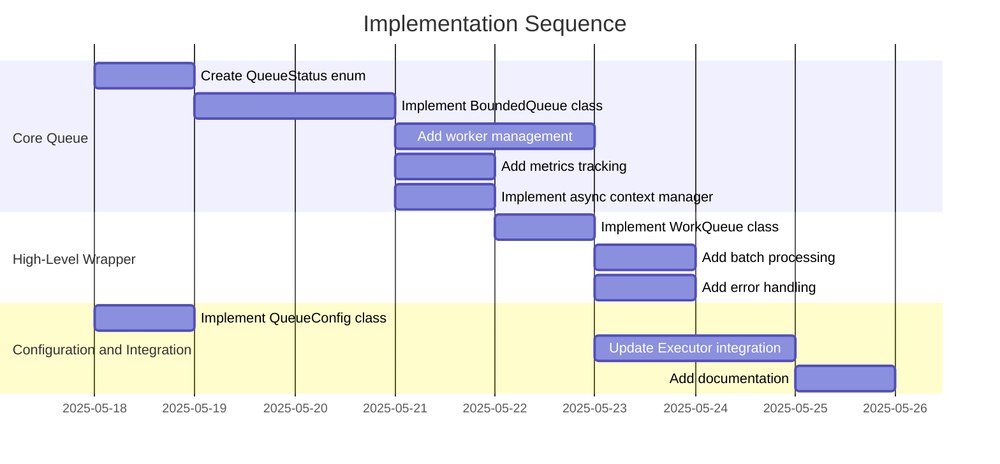

# Implementation Plan: Bounded Async Queue with Backpressure

## 1. Overview

### 1.1 Component Purpose

The bounded async queue with backpressure is a critical component for managing
API requests in the khive resource control framework. It provides a mechanism
to:

- Limit the number of concurrent API requests to prevent overwhelming external
  services
- Implement backpressure when the queue is full to prevent memory exhaustion
- Manage worker tasks that process queue items
- Provide clear lifecycle management (starting, processing, stopping)
- Handle errors gracefully without crashing the system

### 1.2 Design Reference

This implementation is based on:

- Technical Design Specification: TDS-80 (Layered Resource Control Architecture)
- Issue #83: Queue: Implement bounded async queue with backpressure for API
  requests

### 1.3 Implementation Approach

We will follow a Test-Driven Development (TDD) approach:

1. Create test cases for the queue functionality
2. Implement the queue classes to satisfy the tests
3. Integrate with the existing executor framework
4. Refactor and optimize as needed

The implementation will consist of two main classes:

- `BoundedQueue`: Core implementation with backpressure and worker management
- `WorkQueue`: Higher-level wrapper with additional functionality

## 2. Implementation Phases

### 2.1 Phase 1: Core Queue Implementation

Implementation of the core `BoundedQueue` class with backpressure support.

**Key Deliverables:**

- `BoundedQueue` class with async context manager support
- Queue status tracking and metrics
- Backpressure mechanism for queue overflow
- Worker management functionality

**Dependencies:**

- Python 3.10+ asyncio
- Existing Protocol definitions in `protocols.py`

**Estimated Complexity:** Medium

### 2.2 Phase 2: High-Level Queue Wrapper

Implementation of the `WorkQueue` class that wraps the `BoundedQueue` with
additional functionality.

**Key Deliverables:**

- `WorkQueue` class with simplified API
- Batch processing functionality
- Integration with executor framework

**Dependencies:**

- Completed `BoundedQueue` implementation
- Existing executor framework

**Estimated Complexity:** Low

### 2.3 Phase 3: Configuration and Integration

Implementation of configuration options and integration with the existing
codebase.

**Key Deliverables:**

- `QueueConfig` class with validation
- Integration with the `Executor` class
- Documentation updates

**Dependencies:**

- Completed `BoundedQueue` and `WorkQueue` implementations
- Existing executor framework

**Estimated Complexity:** Low

## 3. Test Strategy

### 3.1 Unit Tests

#### 3.1.1 Test Group: BoundedQueue Initialization and Properties

| ID   | Description                                                    | Fixtures/Mocks | Assertions                               |
| ---- | -------------------------------------------------------------- | -------------- | ---------------------------------------- |
| UT-1 | Test that BoundedQueue initializes with correct default values | None           | Queue properties match expected values   |
| UT-2 | Test that BoundedQueue validates maxsize parameter             | None           | ValueError raised for invalid maxsize    |
| UT-3 | Test that queue status and metrics are correctly initialized   | None           | Status is IDLE, metrics show zero counts |

#### 3.1.2 Test Group: BoundedQueue Operations

| ID   | Description                                                  | Fixtures/Mocks | Assertions                                                                 |
| ---- | ------------------------------------------------------------ | -------------- | -------------------------------------------------------------------------- |
| UT-4 | Test that put method adds items to the queue                 | None           | Queue size increases, put returns True                                     |
| UT-5 | Test that put method applies backpressure when queue is full | None           | put returns False when queue is full, backpressure_events metric increases |
| UT-6 | Test that get method retrieves items from the queue          | None           | Retrieved item matches expected value                                      |
| UT-7 | Test that task_done method marks tasks as completed          | None           | processed metric increases                                                 |
| UT-8 | Test that join method waits for all items to be processed    | None           | join completes after all items are processed                               |

#### 3.1.3 Test Group: BoundedQueue Lifecycle

| ID    | Description                                                    | Fixtures/Mocks | Assertions                                                      |
| ----- | -------------------------------------------------------------- | -------------- | --------------------------------------------------------------- |
| UT-9  | Test that start method changes queue status to PROCESSING      | None           | Queue status changes to PROCESSING                              |
| UT-10 | Test that stop method changes queue status to STOPPED          | None           | Queue status changes to STOPPED                                 |
| UT-11 | Test that operations raise errors when queue is not PROCESSING | None           | RuntimeError raised for operations when queue is not PROCESSING |

#### 3.1.4 Test Group: BoundedQueue Worker Management

| ID    | Description                                                     | Fixtures/Mocks | Assertions                                    |
| ----- | --------------------------------------------------------------- | -------------- | --------------------------------------------- |
| UT-12 | Test that start_workers creates the specified number of workers | None           | worker_count matches num_workers              |
| UT-13 | Test that workers process items from the queue                  | None           | All items are processed                       |
| UT-14 | Test that workers handle errors gracefully                      | None           | errors metric increases, processing continues |
| UT-15 | Test that stop_workers cancels all worker tasks                 | None           | worker_count becomes zero                     |

#### 3.1.5 Test Group: WorkQueue Functionality

| ID    | Description                                                   | Fixtures/Mocks    | Assertions                                                |
| ----- | ------------------------------------------------------------- | ----------------- | --------------------------------------------------------- |
| UT-16 | Test that WorkQueue initializes with correct parameters       | None              | WorkQueue properties match expected values                |
| UT-17 | Test that WorkQueue delegates operations to BoundedQueue      | Mock BoundedQueue | WorkQueue methods call corresponding BoundedQueue methods |
| UT-18 | Test that batch_process handles a list of items               | None              | All items are processed                                   |
| UT-19 | Test that WorkQueue implements async context manager protocol | None              | start and stop methods are called                         |

#### 3.1.6 Test Group: QueueConfig Validation

| ID    | Description                                           | Fixtures/Mocks | Assertions                                          |
| ----- | ----------------------------------------------------- | -------------- | --------------------------------------------------- |
| UT-20 | Test that QueueConfig validates queue_capacity        | None           | ValueError raised for invalid queue_capacity        |
| UT-21 | Test that QueueConfig validates capacity_refresh_time | None           | ValueError raised for invalid capacity_refresh_time |
| UT-22 | Test that QueueConfig validates concurrency_limit     | None           | ValueError raised for invalid concurrency_limit     |

### 3.2 Integration Tests

#### 3.2.1 Test Group: Integration with Executor

| ID   | Description                                           | Setup                                         | Assertions                                                  |
| ---- | ----------------------------------------------------- | --------------------------------------------- | ----------------------------------------------------------- |
| IT-1 | Test that Executor uses WorkQueue for task management | Initialize Executor with QueueConfig          | Executor correctly processes tasks using the queue          |
| IT-2 | Test that Executor handles queue backpressure         | Initialize Executor with small queue capacity | Executor handles backpressure gracefully                    |
| IT-3 | Test that Executor properly cleans up queue resources | Initialize Executor with WorkQueue            | Queue resources are properly cleaned up when Executor exits |

### 3.3 Mock and Stub Requirements

| Dependency     | Mock/Stub Type | Key Behaviors to Mock                              |
| -------------- | -------------- | -------------------------------------------------- |
| asyncio.Queue  | Stub           | Basic queue operations (put, get, task_done, join) |
| asyncio.Task   | Mock           | Task creation, cancellation, and completion        |
| asyncio.Lock   | Stub           | Lock acquisition and release                       |
| asyncio.Event  | Stub           | Event setting, clearing, and waiting               |
| logging.Logger | Mock           | Logging method calls                               |

## 4. Implementation Tasks

### 4.1 Core Queue Implementation

| ID  | Task                            | Description                                                  | Dependencies | Priority | Complexity |
| --- | ------------------------------- | ------------------------------------------------------------ | ------------ | -------- | ---------- |
| T-1 | Create QueueStatus enum         | Define enum for queue status states                          | None         | High     | Low        |
| T-2 | Implement BoundedQueue class    | Create the core queue implementation with backpressure       | T-1          | High     | Medium     |
| T-3 | Add worker management           | Implement worker creation, execution, and cleanup            | T-2          | High     | Medium     |
| T-4 | Add metrics tracking            | Implement metrics collection for queue operations            | T-2          | Medium   | Low        |
| T-5 | Implement async context manager | Add **aenter** and **aexit** methods for resource management | T-2          | High     | Low        |

### 4.2 High-Level Queue Wrapper

| ID  | Task                      | Description                                | Dependencies | Priority | Complexity |
| --- | ------------------------- | ------------------------------------------ | ------------ | -------- | ---------- |
| T-6 | Implement WorkQueue class | Create high-level wrapper for BoundedQueue | T-5          | High     | Low        |
| T-7 | Add batch processing      | Implement batch_process method             | T-6          | Medium   | Low        |
| T-8 | Add error handling        | Implement comprehensive error handling     | T-6          | Medium   | Low        |

### 4.3 Configuration and Integration

| ID   | Task                        | Description                                | Dependencies | Priority | Complexity |
| ---- | --------------------------- | ------------------------------------------ | ------------ | -------- | ---------- |
| T-9  | Implement QueueConfig class | Create configuration class with validation | None         | High     | Low        |
| T-10 | Update Executor integration | Integrate queue with Executor class        | T-6, T-9     | High     | Medium     |
| T-11 | Add documentation           | Update docstrings and documentation        | T-10         | Medium   | Low        |

## 5. Implementation Sequence



## 6. Acceptance Criteria

### 6.1 Component Level

| ID   | Criterion                                    | Validation Method                  |
| ---- | -------------------------------------------- | ---------------------------------- |
| AC-1 | The queue successfully enforces size limits  | Unit tests UT-4, UT-5              |
| AC-2 | The queue implements backpressure when full  | Unit test UT-5                     |
| AC-3 | The queue properly manages worker tasks      | Unit tests UT-12, UT-13, UT-15     |
| AC-4 | The queue handles errors gracefully          | Unit test UT-14                    |
| AC-5 | The queue provides accurate metrics          | Unit tests UT-3, UT-5, UT-7, UT-14 |
| AC-6 | The queue integrates with the Executor class | Integration test IT-1              |
| AC-7 | The queue properly cleans up resources       | Integration test IT-3              |

### 6.2 API Level

| ID    | Criterion                                                  | Validation Method    |
| ----- | ---------------------------------------------------------- | -------------------- |
| AC-8  | The queue API follows the Protocol defined in protocols.py | Static type checking |
| AC-9  | The queue API is consistent with existing components       | Code review          |
| AC-10 | The queue API is well-documented                           | Documentation review |

## 7. Test Implementation Plan

### 7.1 Test Implementation Sequence

1. Implement test fixtures for queue testing
2. Implement unit tests for BoundedQueue initialization and properties
3. Implement unit tests for BoundedQueue operations
4. Implement unit tests for BoundedQueue lifecycle
5. Implement unit tests for BoundedQueue worker management
6. Implement unit tests for WorkQueue functionality
7. Implement unit tests for QueueConfig validation
8. Implement integration tests with Executor

### 7.2 Test Code Examples

#### Unit Test Example for BoundedQueue

```python
import pytest
import asyncio
from khive.clients.queue import BoundedQueue, QueueStatus

@pytest.mark.asyncio
async def test_bounded_queue_initialization():
    # Arrange & Act
    queue = BoundedQueue(maxsize=10)

    # Assert
    assert queue.maxsize == 10
    assert queue.status == QueueStatus.IDLE
    assert queue.size == 0
    assert queue.is_empty
    assert not queue.is_full
    assert queue.metrics["enqueued"] == 0
    assert queue.metrics["processed"] == 0
    assert queue.metrics["errors"] == 0
    assert queue.metrics["backpressure_events"] == 0
```

#### Unit Test Example for Backpressure

```python
@pytest.mark.asyncio
async def test_bounded_queue_backpressure():
    # Arrange
    queue = BoundedQueue(maxsize=1, timeout=0.01)
    await queue.start()

    # Act & Assert
    # First put should succeed
    assert await queue.put("item1")
    assert queue.size == 1
    assert queue.is_full

    # Second put should fail (backpressure)
    assert not await queue.put("item2")
    assert queue.metrics["backpressure_events"] == 1

    # Cleanup
    await queue.stop()
```

#### Integration Test Example with Executor

```python
@pytest.mark.asyncio
async def test_executor_with_queue():
    # Arrange
    queue_config = QueueConfig(queue_capacity=5, concurrency_limit=2)
    executor = Executor(event_type=MockEvent, queue_config=queue_config)

    # Act
    events = []
    async with executor:
        for i in range(10):
            event = MockEvent(f"value{i}")
            events.append(event)
            executor.append(event)

        # Process all events
        await executor.forward()

        # Wait for completion
        while not executor.is_all_processed:
            await asyncio.sleep(0.1)

    # Assert
    for event in events:
        assert event.execution.status == ExecutionStatus.COMPLETED
```

## 8. Implementation Risks and Mitigations

| Risk                                      | Impact | Likelihood | Mitigation                                                                                                   |
| ----------------------------------------- | ------ | ---------- | ------------------------------------------------------------------------------------------------------------ |
| Race conditions in async code             | High   | Medium     | Use proper synchronization primitives (locks, events), comprehensive testing with different timing scenarios |
| Memory leaks from uncancelled tasks       | High   | Medium     | Ensure proper task cleanup in **aexit** methods, add explicit cancellation in stop methods                   |
| Integration issues with existing Executor | Medium | Medium     | Thorough integration testing, maintain backward compatibility with existing interfaces                       |
| Performance bottlenecks with large queues | Medium | Low        | Performance testing with realistic workloads, optimize critical paths                                        |

## 9. Dependencies and Environment

### 9.1 External Libraries

| Library        | Version | Purpose                               |
| -------------- | ------- | ------------------------------------- |
| Python         | ^3.10   | Language runtime with asyncio support |
| pytest         | ^7.0.0  | Testing framework                     |
| pytest-asyncio | ^0.20.0 | Async testing support                 |

### 9.2 Environment Setup

```bash
# Create virtual environment
python -m venv venv
source venv/bin/activate

# Install dependencies
uv sync

# Run tests
uv run pytest tests/clients/test_queue.py
```

## 10. Additional Resources

### 10.1 Reference Implementation

The implementation will follow patterns established in:

- `src/khive/clients/executor.py`
- `src/khive/clients/rate_limiter.py`

### 10.2 Relevant Documentation

- [Python asyncio Queue documentation](https://docs.python.org/3/library/asyncio-queue.html)
- [Python asyncio Task documentation](https://docs.python.org/3/library/asyncio-task.html)

### 10.3 Design Patterns

- **Producer-Consumer Pattern**: The queue implements this pattern for managing
  work items
- **Backpressure Pattern**: The queue implements backpressure to handle overflow
- **Context Manager Pattern**: The queue implements the async context manager
  protocol for resource management
