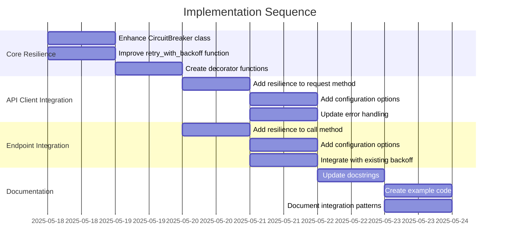

# Implementation Plan: Circuit Breaker and Retry Patterns

## 1. Overview

### 1.1 Component Purpose

Implement robust error handling patterns for the async resource control system,
focusing on circuit breakers, retries with exponential backoff, and graceful
degradation. These patterns will enhance the resilience of API operations,
prevent cascading failures, and improve the overall reliability of the system.

### 1.2 Design Reference

- Technical Design Specification: [TDS-80.md](/.khive/reports/tds/TDS-80.md)
- Issue #84: Implement circuit breaker and retry patterns for resilient API
  operations
- Issue #81 (merged): API Client implementation with resource management

### 1.3 Implementation Approach

We will follow a Test-Driven Development (TDD) approach:

1. Write failing tests for each component
2. Implement the minimum code to make tests pass
3. Refactor for clean, maintainable code
4. Ensure >80% test coverage

The implementation will build upon the existing API client functionality from
Issue #81, enhancing it with resilience patterns that integrate with both the
API client and the Endpoint class.

## 2. Implementation Phases

### 2.1 Phase 1: Core Resilience Patterns

Enhance the existing resilience.py module with improved circuit breaker and
retry patterns.

**Key Deliverables:**

- Enhanced CircuitBreaker class with better state management and metrics
- Improved retry_with_backoff function with more configuration options
- Decorator functions for easy application of resilience patterns

**Dependencies:**

- Existing resilience.py module
- API client implementation from Issue #81

**Estimated Complexity:** Medium

### 2.2 Phase 2: Integration with API Client

Integrate the resilience patterns with the AsyncAPIClient class.

**Key Deliverables:**

- Resilient request method for AsyncAPIClient
- Configuration options for circuit breaker and retry behavior
- Integration with error handling in API client

**Dependencies:**

- Phase 1 completion
- AsyncAPIClient from Issue #81

**Estimated Complexity:** Medium

### 2.3 Phase 3: Integration with Endpoint Class

Integrate the resilience patterns with the Endpoint class.

**Key Deliverables:**

- Resilient call method for Endpoint
- Configuration options for circuit breaker and retry behavior in Endpoint
- Integration with existing backoff implementation in Endpoint

**Dependencies:**

- Phase 1 completion
- Endpoint class implementation

**Estimated Complexity:** Medium

### 2.4 Phase 4: Documentation and Examples

Add documentation and examples for using the resilience patterns.

**Key Deliverables:**

- Updated docstrings with examples
- Example code for using circuit breaker and retry patterns
- Integration examples with API client and Endpoint

**Dependencies:**

- Phases 1-3 completion

**Estimated Complexity:** Low

## 3. Test Strategy

### 3.1 Unit Tests

#### 3.1.1 Test Group: CircuitBreaker

| ID   | Description                                                    | Fixtures/Mocks | Assertions                                                |
| ---- | -------------------------------------------------------------- | -------------- | --------------------------------------------------------- |
| UT-1 | Test circuit breaker initialization with default parameters    | None           | State is CLOSED, counters initialized                     |
| UT-2 | Test circuit breaker state transition from CLOSED to OPEN      | Mock function  | State changes after failure threshold, rejects requests   |
| UT-3 | Test circuit breaker state transition from OPEN to HALF_OPEN   | Mock function  | State changes after recovery time                         |
| UT-4 | Test circuit breaker state transition from HALF_OPEN to CLOSED | Mock function  | State changes after successful execution                  |
| UT-5 | Test circuit breaker state transition from HALF_OPEN to OPEN   | Mock function  | State changes after failure in HALF_OPEN state            |
| UT-6 | Test circuit breaker with excluded exceptions                  | Mock function  | Excluded exceptions don't count toward failure threshold  |
| UT-7 | Test circuit breaker metrics tracking                          | Mock function  | Metrics correctly track success, failure, rejection count |

#### 3.1.2 Test Group: Retry with Backoff

| ID    | Description                                         | Fixtures/Mocks | Assertions                                               |
| ----- | --------------------------------------------------- | -------------- | -------------------------------------------------------- |
| UT-8  | Test retry with successful execution after failures | Mock function  | Function retried correct number of times, returns result |
| UT-9  | Test retry with max retries exceeded                | Mock function  | Function retried max times, raises last exception        |
| UT-10 | Test retry with excluded exceptions                 | Mock function  | Excluded exceptions not retried, raised immediately      |
| UT-11 | Test retry backoff timing                           | Mock time      | Backoff delays follow expected pattern                   |
| UT-12 | Test retry with jitter                              | Mock time      | Delays include jitter within expected range              |
| UT-13 | Test retry decorator                                | Mock function  | Decorator correctly applies retry behavior               |

#### 3.1.3 Test Group: API Client Integration

| ID    | Description                            | Fixtures/Mocks | Assertions                                  |
| ----- | -------------------------------------- | -------------- | ------------------------------------------- |
| UT-14 | Test API client with circuit breaker   | Mock client    | Circuit breaker applied to API requests     |
| UT-15 | Test API client with retry             | Mock client    | Retry applied to API requests               |
| UT-16 | Test API client with combined patterns | Mock client    | Both patterns applied correctly in sequence |

#### 3.1.4 Test Group: Endpoint Integration

| ID    | Description                          | Fixtures/Mocks | Assertions                                  |
| ----- | ------------------------------------ | -------------- | ------------------------------------------- |
| UT-17 | Test Endpoint with circuit breaker   | Mock endpoint  | Circuit breaker applied to endpoint calls   |
| UT-18 | Test Endpoint with retry             | Mock endpoint  | Retry applied to endpoint calls             |
| UT-19 | Test Endpoint with combined patterns | Mock endpoint  | Both patterns applied correctly in sequence |

### 3.2 Integration Tests

#### 3.2.1 Test Group: End-to-End Resilience

| ID   | Description                                                     | Setup                               | Assertions                                               |
| ---- | --------------------------------------------------------------- | ----------------------------------- | -------------------------------------------------------- |
| IT-1 | Test API client with real HTTP server that fails intermittently | HTTP server with failure simulation | Client handles failures with retry and circuit breaker   |
| IT-2 | Test Endpoint with real HTTP server that fails intermittently   | HTTP server with failure simulation | Endpoint handles failures with retry and circuit breaker |
| IT-3 | Test resource cleanup during failures                           | HTTP server with failure simulation | Resources properly cleaned up even during failures       |

### 3.3 Mock and Stub Requirements

| Dependency     | Mock/Stub Type | Key Behaviors to Mock                           |
| -------------- | -------------- | ----------------------------------------------- |
| HTTP Server    | Mock           | Success, failure, timeout, rate limit responses |
| Time functions | Mock           | Control time for testing recovery periods       |
| AsyncClient    | Mock           | HTTP request/response behavior                  |

## 4. Implementation Tasks

### 4.1 Core Resilience Patterns

| ID  | Task                                | Description                                                      | Dependencies | Priority | Complexity |
| --- | ----------------------------------- | ---------------------------------------------------------------- | ------------ | -------- | ---------- |
| T-1 | Enhance CircuitBreaker class        | Add metrics, better state management, excluded exceptions        | None         | High     | Medium     |
| T-2 | Improve retry_with_backoff function | Add more configuration options, better error handling            | None         | High     | Medium     |
| T-3 | Create decorator functions          | Implement decorators for easy application of resilience patterns | T-1, T-2     | Medium   | Low        |

### 4.2 API Client Integration

| ID  | Task                             | Description                                                   | Dependencies  | Priority | Complexity |
| --- | -------------------------------- | ------------------------------------------------------------- | ------------- | -------- | ---------- |
| T-4 | Add resilience to request method | Integrate circuit breaker and retry with API client request   | T-1, T-2, T-3 | High     | Medium     |
| T-5 | Add configuration options        | Add options for configuring resilience behavior in API client | T-4           | Medium   | Low        |
| T-6 | Update error handling            | Ensure proper error propagation and resource cleanup          | T-4           | High     | Medium     |

### 4.3 Endpoint Integration

| ID  | Task                            | Description                                                   | Dependencies  | Priority | Complexity |
| --- | ------------------------------- | ------------------------------------------------------------- | ------------- | -------- | ---------- |
| T-7 | Add resilience to call method   | Integrate circuit breaker and retry with Endpoint call method | T-1, T-2, T-3 | High     | Medium     |
| T-8 | Add configuration options       | Add options for configuring resilience behavior in Endpoint   | T-7           | Medium   | Low        |
| T-9 | Integrate with existing backoff | Ensure compatibility with existing backoff in Endpoint        | T-7           | High     | Medium     |

### 4.4 Documentation and Examples

| ID   | Task                          | Description                                         | Dependencies | Priority | Complexity |
| ---- | ----------------------------- | --------------------------------------------------- | ------------ | -------- | ---------- |
| T-10 | Update docstrings             | Add comprehensive docstrings with examples          | T-1 to T-9   | Medium   | Low        |
| T-11 | Create example code           | Add example code for using resilience patterns      | T-1 to T-9   | Low      | Low        |
| T-12 | Document integration patterns | Document how to integrate with different components | T-1 to T-9   | Medium   | Low        |

## 5. Implementation Sequence



## 6. Acceptance Criteria

### 6.1 Component Level

| ID   | Criterion                                                           | Validation Method              |
| ---- | ------------------------------------------------------------------- | ------------------------------ |
| AC-1 | Circuit breaker prevents cascading failures during service outages  | Integration tests IT-1, IT-2   |
| AC-2 | Retry mechanism handles transient failures with exponential backoff | Integration tests IT-1, IT-2   |
| AC-3 | Resources are properly cleaned up even during failures              | Integration test IT-3          |
| AC-4 | Resilience patterns can be easily applied to different components   | Unit tests UT-13, UT-14, UT-17 |
| AC-5 | Test coverage exceeds 80% for all new code                          | Coverage report                |

### 6.2 API Level

| ID   | Criterion                                                   | Validation Method            |
| ---- | ----------------------------------------------------------- | ---------------------------- |
| AC-6 | API client handles rate limiting with appropriate backoff   | Unit test UT-15              |
| AC-7 | API client prevents overwhelming failing services           | Unit test UT-14              |
| AC-8 | Endpoint handles service failures gracefully                | Unit tests UT-17, UT-18      |
| AC-9 | Configuration options allow customizing resilience behavior | Unit tests UT-5, UT-8, UT-16 |

## 7. Test Implementation Plan

### 7.1 Test Implementation Sequence

1. Implement base test fixtures and mocks for HTTP server, time functions
2. Implement unit tests for CircuitBreaker class
3. Implement unit tests for retry_with_backoff function
4. Implement unit tests for decorator functions
5. Implement unit tests for API client integration
6. Implement unit tests for Endpoint integration
7. Implement integration tests for end-to-end resilience

### 7.2 Test Code Examples

#### Unit Test Example for CircuitBreaker

```python
import pytest
import asyncio
from unittest.mock import AsyncMock, patch
import time

from khive.clients.resilience import CircuitBreaker, CircuitState
from khive.clients.errors import CircuitBreakerOpenError

@pytest.mark.asyncio
async def test_circuit_breaker_state_transition_to_open():
    # Arrange
    cb = CircuitBreaker(failure_threshold=2)
    mock_func = AsyncMock(side_effect=ValueError("Test error"))

    # Act & Assert
    # First failure - circuit stays closed
    with pytest.raises(ValueError):
        await cb.execute(mock_func)
    assert cb.state == CircuitState.CLOSED

    # Second failure - circuit opens
    with pytest.raises(ValueError):
        await cb.execute(mock_func)
    assert cb.state == CircuitState.OPEN

    # Call when circuit is open - raises CircuitBreakerOpenError
    with pytest.raises(CircuitBreakerOpenError):
        await cb.execute(mock_func)
```

#### Unit Test Example for Retry

```python
@pytest.mark.asyncio
async def test_retry_with_backoff_success_after_failures():
    # Arrange
    call_count = 0

    async def test_func():
        nonlocal call_count
        call_count += 1
        if call_count < 3:
            raise ConnectionError("Test connection error")
        return "success"

    # Act
    result = await retry_with_backoff(
        test_func,
        retry_exceptions=(ConnectionError,),
        max_retries=3,
        base_delay=0.01
    )

    # Assert
    assert result == "success"
    assert call_count == 3
```

#### Integration Test Example

```python
@pytest.mark.asyncio
async def test_api_client_with_failing_server(failing_http_server):
    # Arrange
    base_url = failing_http_server.url
    client = AsyncAPIClient(
        base_url=base_url,
        timeout=0.5,
        circuit_breaker=CircuitBreaker(failure_threshold=3),
        retry_config=RetryConfig(max_retries=2)
    )

    # Act & Assert
    # First few calls should retry but eventually succeed
    result = await client.get("/success-after-retry")
    assert result["status"] == "success"

    # Calls to consistently failing endpoint should eventually open circuit
    for _ in range(4):
        try:
            await client.get("/always-fail")
        except Exception:
            pass

    # Circuit should be open now
    with pytest.raises(CircuitBreakerOpenError):
        await client.get("/always-fail")
```

## 8. Implementation Risks and Mitigations

| Risk                                          | Impact | Likelihood | Mitigation                                                                                       |
| --------------------------------------------- | ------ | ---------- | ------------------------------------------------------------------------------------------------ |
| Integration with existing backoff in Endpoint | High   | Medium     | Carefully analyze existing implementation, add comprehensive tests for integration               |
| Resource leaks during failures                | High   | Low        | Ensure proper cleanup in finally blocks, add specific tests for resource cleanup during failures |
| Performance impact of resilience patterns     | Medium | Medium     | Optimize implementation, add performance tests, make patterns configurable                       |
| Compatibility with different error types      | Medium | Medium     | Design for flexibility with configurable exception types, test with various error scenarios      |
| Complexity of combined resilience patterns    | Medium | Medium     | Create clear documentation, provide simple decorator interfaces, add examples                    |

## 9. Dependencies and Environment

### 9.1 External Libraries

| Library        | Version | Purpose                         |
| -------------- | ------- | ------------------------------- |
| httpx          | ^0.24.0 | HTTP client for API requests    |
| backoff        | ^2.2.1  | Existing backoff implementation |
| pytest         | ^7.3.1  | Testing framework               |
| pytest-asyncio | ^0.21.0 | Async testing support           |

### 9.2 Environment Setup

```bash
# Create virtual environment
python -m venv venv
source venv/bin/activate

# Install dependencies
pip install -r requirements.txt

# Run tests
pytest tests/clients/test_resilience.py -v
```

## 10. Additional Resources

### 10.1 Reference Implementation

- Existing resilience.py module in src/khive/clients/
- AsyncAPIClient implementation from Issue #81
- Endpoint class in src/khive/connections/

### 10.2 Relevant Documentation

- [Circuit Breaker Pattern](https://docs.microsoft.com/en-us/azure/architecture/patterns/circuit-breaker)
- [Retry Pattern](https://docs.microsoft.com/en-us/azure/architecture/patterns/retry)
- [Backoff Library Documentation](https://github.com/litl/backoff)

### 10.3 Design Patterns

- Circuit Breaker Pattern
- Retry Pattern with Exponential Backoff
- Decorator Pattern for applying resilience behaviors
