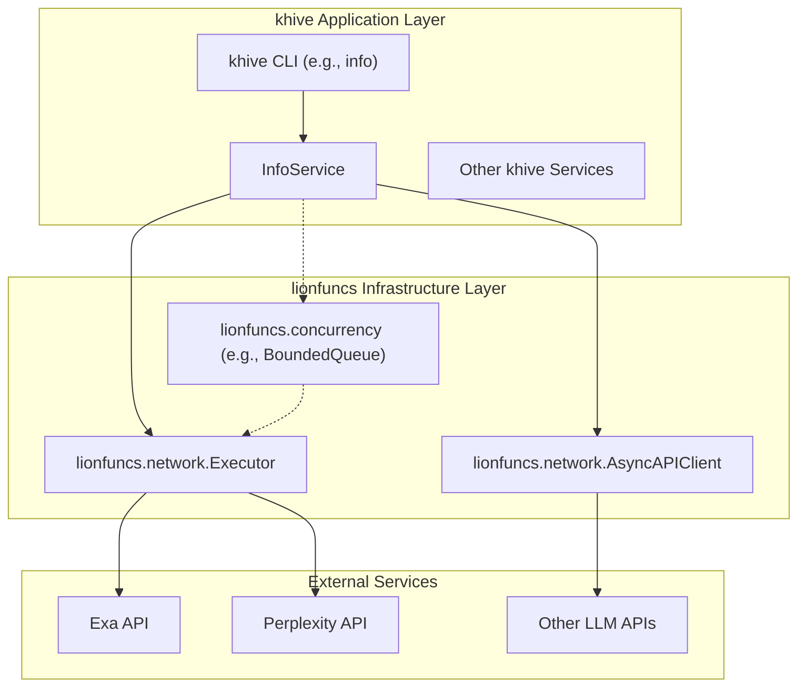
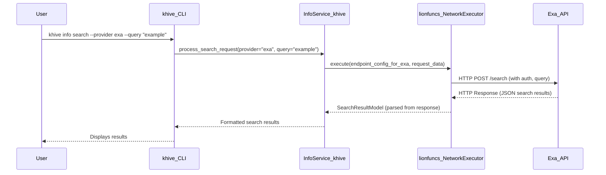

# Guidance

**Purpose**\
Lay out an **implementation-ready** blueprint for migrating `khive`'s external
API connectivity layer to utilize the `lionfuncs` package. This includes
detailing data models, API interaction changes (internal), data flows, error
handling, and testing strategies.

**When to Use**

- After the Research phase (Issue #100 context and `lionfuncs` direction
  provided).
- Before the Implementation Plan for this migration.

**Best Practices**

- Keep the design as **complete** as possible so coders can proceed with minimal
  guesswork.
- Emphasize changes to existing functionalities and potential integration
  challenges.
- Use diagrams (Mermaid) for clarity on new architectural interactions.

---

# Technical Design Specification: Migration to lionfuncs for External API Connectivity (Issue #100)

## 1. Overview

### 1.1 Purpose

This document outlines the technical design for refactoring `khive` to delegate
all its external API communication and related concurrency management to a new
external package, `lionfuncs`. The goal is to simplify `khive` into an
application layer by removing its bespoke infrastructure for network
connections, rate limiting, and resilience, and instead leveraging the
specialized capabilities of `lionfuncs`.

### 1.2 Scope

**In Scope:**

- Analysis of `lionfuncs` capabilities relevant to network operations and
  concurrency (based on provided documentation titles: "Network Executor Usage
  Guide," "Network Client Guide," "Async Operations Guide,"
  "lionfuncs.concurrency").
- Identification of all `khive` components (primarily within
  `src/khive/clients/` and `src/khive/connections/`) to be removed or
  significantly refactored.
- Design of the integration strategy, detailing how `khive` services (e.g.,
  `InfoService` in `src/khive/services/info/info_service.py`) will use
  `lionfuncs`.
- A step-by-step migration plan, including dependency management and code
  refactoring.
- Impact assessment on the existing testing suite and a strategy for adapting
  tests.

**Out of Scope:**

- The actual implementation of the code changes.
- Detailed design of `lionfuncs` itself (this TDS assumes `lionfuncs` is a
  provided, functional library).
- Changes to `khive`'s core business logic unrelated to external API
  communication.

### 1.3 Background

This migration is driven by **Issue #100: "Architectural Refactor: Align
Clients, Executor, Queue with New Design Philosophy"** and a subsequent
strategic direction to utilize the `lionfuncs` package for external API
interactions. `khive` will transition from managing its own network
infrastructure to becoming an application layer that consumes `lionfuncs`.

Key `lionfuncs` documentation to be referenced (conceptually, based on titles):

- `lionfuncs` Network Executor Usage Guide
- `lionfuncs` Network Client Guide
- `lionfuncs` Async Operations Guide
- `lionfuncs.concurrency` module documentation

### 1.4 Design Goals

- **Decoupling:** Completely decouple `khive` from low-level network connection
  and concurrency management by abstracting it to `lionfuncs`.
- **Simplification:** Reduce complexity within the `khive` codebase by removing
  redundant infrastructure.
- **Standardization:** Utilize `lionfuncs` as the standard way for all external
  API calls.
- **Maintainability:** Improve the maintainability of `khive` by relying on a
  dedicated, external library for connection concerns.
- **Functionality Preservation:** Ensure all existing `khive` functionalities
  relying on external APIs (e.g., `khive info search`, `khive info consult`)
  continue to work seamlessly post-migration.
- **Testability:** Ensure the new architecture remains testable, with clear
  strategies for mocking `lionfuncs` interactions.

### 1.5 Key Constraints

- `khive` must use `lionfuncs` for all external API calls; direct use of
  libraries like `httpx` for this purpose within `khive` should be eliminated.
- The existing external-facing CLI and service interfaces of `khive` should
  remain unchanged for users where possible.
- The migration must be thorough, removing all superseded `khive` components.

## 2. Architecture

### 2.1 Component Diagram

The new architecture will feature `khive` as an application layer interacting
with `lionfuncs` for external communication.



_Diagram illustrates `InfoService` utilizing `lionfuncs` components
(`NetworkExecutor`, `AsyncAPIClient`) which in turn handle communication with
external APIs. `lionfuncs.concurrency` tools might be used by `InfoService` or
internally by `lionfuncs`'s network components._

### 2.2 Dependencies

- **Primary New Dependency:** `lionfuncs` (Python package).
- **Indirect Dependencies:** `khive` will indirectly depend on the libraries
  used by `lionfuncs` for its operations (e.g., an HTTP client like `httpx` or
  `aiohttp` within `lionfuncs`).
- **Internal `khive` Dependencies:** Services like `InfoService` will now depend
  on `lionfuncs` client interfaces instead of the old `khive.clients` and
  `khive.connections` modules.

### 2.3 Data Flow

Example: `khive info search --provider exa --query "example"`



## 3. Interface Definitions

### 3.1 API Endpoints (khive CLI - Unchanged for User)

The user-facing CLI commands (e.g., `khive info search`, `khive info consult`)
will retain their existing signatures. The changes are internal to their
implementation.

### 3.2 Internal Interfaces (`khive` services to `lionfuncs`)

`khive` services will interact with `lionfuncs` through its defined Python API.

**Example: `InfoService` using `lionfuncs` (Conceptual)**

```python
# Conceptual representation within InfoService
from lionfuncs.network import NetworkExecutor, EndpointConfig # Hypothetical imports
from lionfuncs.models import RequestModel, ResponseModel # Hypothetical imports

class InfoService:
    def __init__(self, lionfuncs_executor: NetworkExecutor):
        self._executor = lionfuncs_executor
        # Configuration for Exa, Perplexity, etc., would be prepared here
        # or passed to lionfuncs.EndpointConfig instances.

    async def search_exa(self, query: str) -> ResponseModel:
        exa_endpoint_config = EndpointConfig(
            base_url="https://api.exa.ai",
            # ... other Exa specific configs like auth, method, path
        )
        request_data = RequestModel(payload={"query": query}) # Simplified
        # (pplx: lionfuncs-Network-Executor-Usage-Guide)
        response = await self._executor.execute(
            endpoint_config=exa_endpoint_config,
            request_data=request_data
        )
        return response # Assuming response is a parsed model

    async def consult_llm(self, model_id: str, prompt: str) -> ResponseModel:
        # (pplx: lionfuncs-Network-Client-Guide)
        # Similar pattern using an AsyncAPIClient or the NetworkExecutor
        # with appropriate EndpointConfig for the LLM.
        pass
```

This implies `lionfuncs` will provide mechanisms for configuring endpoints,
authentication, request bodies, and will return parsed response models or handle
raw responses.

## 4. Data Models

### 4.1 API Models (`khive` CLI - Unchanged for User)

Input and output structures for `khive` CLI commands are expected to remain
consistent to avoid breaking changes for users.

### 4.2 Domain Models (`khive`)

Models within `khive` services (e.g., representing search results or LLM
responses) might need adaptation if `lionfuncs` returns data structured
differently than the previous internal clients. The goal is to map `lionfuncs`
responses to `khive`'s existing or slightly modified domain models.

### 4.3 Database Schema (`khive`)

This migration is not expected to directly impact `khive`'s database schema, as
it primarily concerns external API interactions.

## 5. Behavior

### 5.1 Core Workflows (using `lionfuncs`)

**Workflow: `khive info search`**

1. `khive` CLI parses the command and arguments.
2. Invokes `InfoService.search(provider, query, options)`.
3. `InfoService` determines the target external API (e.g., Exa, Perplexity).
4. `InfoService` prepares a `lionfuncs.EndpointConfig` and
   `lionfuncs.RequestModel` (or similar) specific to the provider. This includes
   API keys, URLs, and request payloads.
5. `InfoService` calls the appropriate `lionfuncs` method (e.g.,
   `lionfuncs.NetworkExecutor.execute()`). (pplx:
   lionfuncs-Network-Executor-Usage-Guide)
6. `lionfuncs` handles the HTTP request, including authentication, rate limiting
   (if provided by `lionfuncs`), retries (if provided), and concurrency
   management. (pplx: lionfuncs.concurrency)
7. `lionfuncs` returns a response (e.g., `lionfuncs.ResponseModel`) to
   `InfoService`.
8. `InfoService` processes the response, maps it to `khive` domain models, and
   returns it to the CLI.
9. CLI formats and displays the result.

**Workflow: `khive info consult`** Similar to search, but targets LLM APIs.
`InfoService` would use `lionfuncs` (perhaps an `AsyncAPIClient` or the
`NetworkExecutor`) to send prompts to specified models and receive responses.
(pplx: lionfuncs-Network-Client-Guide)

### 5.2 Error Handling

- `lionfuncs` is expected to raise specific exceptions for network errors, API
  errors (e.g., 4xx, 5xx status codes), timeouts, etc.
- `khive`'s `InfoService` and other refactored components must catch these
  `lionfuncs` exceptions.
- These exceptions will be mapped to `khive`'s existing error hierarchy (e.g.,
  `APIError`, `ConnectionTimeoutError` in `src/khive/clients/errors.py`, which
  might be preserved or adapted) or new, more specific errors if necessary.
- User-facing error messages from the CLI should remain informative and
  consistent.

### 5.3 Security Considerations

- **API Key Management:** `khive` will still be responsible for securely storing
  and retrieving API keys for external services. These keys will now be passed
  to `lionfuncs` during the configuration of its clients or endpoint objects.
  The mechanism within `khive` for loading these keys (e.g., from environment
  variables, config files) will remain.
- **Data in Transit:** Assumed that `lionfuncs` uses HTTPS for all external API
  calls, ensuring data encryption in transit.
- **Input Sanitization:** `khive` remains responsible for sanitizing user inputs
  before passing them to `lionfuncs` to prevent injection-style attacks if
  payloads are constructed dynamically.

## 6. External Interactions (now via `lionfuncs`)

### 6.1 Dependencies on Other Services

All direct dependencies of `khive` on external APIs (Exa, Perplexity, OpenAI,
Anthropic, etc.) will now be indirect, mediated entirely by `lionfuncs`.

### 6.2 External API Integrations

The logic for constructing API requests, handling authentication, and parsing
responses for each specific external service will be encapsulated within
`lionfuncs` configurations or adapters used by `InfoService`.

**Conceptual `InfoService` interaction:**

```python
# In InfoService
# (pplx: lionfuncs-Network-Client-Guide)
# (pplx: lionfuncs-Network-Executor-Usage-Guide)
async def _call_external_api(self, service_name: str, request_details: dict):
    # 1. Select/construct lionfuncs.EndpointConfig based on service_name
    # 2. Prepare lionfuncs.RequestModel from request_details
    # 3. Use self._lionfuncs_executor.execute(endpoint_config, request_model)
    # 4. Process lionfuncs.ResponseModel
    pass
```

## 7. Performance Considerations

### 7.1 Expected Load

The expected load on `khive` services remains unchanged.

### 7.2 Scalability Approach

The scalability of handling concurrent external API calls will now largely
depend on `lionfuncs`'s architecture (e.g., its use of async operations,
connection pooling, and concurrency primitives like `BoundedQueue`). (pplx:
lionfuncs-Async-Operations-Guide, pplx: lionfuncs.concurrency) `khive` must
efficiently utilize these `lionfuncs` features.

### 7.3 Optimizations

- Code simplification within `khive` may lead to minor performance improvements
  due to reduced overhead.
- Overall performance for external calls will be dictated by `lionfuncs`'s
  efficiency.

### 7.4 Caching Strategy

- If `khive` currently implements caching for external API responses, this logic
  will need to be reviewed.
- **Option 1:** Retain caching in `khive` services, caching the results obtained
  from `lionfuncs`.
- **Option 2:** If `lionfuncs` provides its own caching mechanisms, `khive`
  might leverage that. This is preferred if `lionfuncs` caching is robust.
- The decision will depend on `lionfuncs`'s features and the complexity of
  adapting `khive`'s existing caching.

## 8. Observability

### 8.1 Logging

- `khive` services will continue to log their operations.
- It's crucial that `lionfuncs` provides adequate logging for its operations
  (request/response summaries, errors).
- `khive` should configure `lionfuncs` logging (if possible) to integrate with
  `khive`'s logging system (format, level, handlers) to provide a unified view
  of a request's lifecycle.
- Correlation IDs should be passed from `khive` to `lionfuncs` (if supported) to
  trace requests across service boundaries.

### 8.2 Metrics

- `khive` should continue to expose metrics for its service endpoints.
- If `lionfuncs` exposes metrics (e.g., external call latency, error counts per
  endpoint, queue lengths from `lionfuncs.concurrency`), `khive` should
  integrate or re-expose these to provide a complete operational picture.

### 8.3 Tracing

- If `khive` uses distributed tracing, `lionfuncs` must support context
  propagation for trace IDs.
- Instrumentation within `lionfuncs` calls from `khive` will be necessary to
  include `lionfuncs` operations in `khive`'s traces.

## 9. Testing Strategy

### 9.1 Unit Testing

- Unit tests for `khive` services (e.g., `TestInfoService`) will need to be
  updated.
- Instead of mocking `khive.clients.ApiClient` or specific connection objects,
  tests will now mock the interfaces of `lionfuncs` components (e.g.,
  `MockLionfuncsNetworkExecutor`, `MockLionfuncsAsyncAPIClient`).
- Focus on testing `khive`'s logic for preparing requests for `lionfuncs`,
  handling responses from `lionfuncs`, and error mapping.

### 9.2 Integration Testing

- **Current State:** Integration tests likely exist that make real calls to
  external APIs through `khive`'s old infrastructure.
- **Post-Migration:** These tests are critical for verifying the migration.
  - They should be updated to run against `khive` services that now use
    `lionfuncs` internally.
  - The goal is to confirm that `khive` can still successfully communicate with
    external services via `lionfuncs`.
  - This might involve:
    - Allowing passthrough to actual external APIs in a controlled (e.g.,
      sandboxed or rate-limited) test environment.
    - Using a mocking/proxy layer at the boundary of `lionfuncs` if `lionfuncs`
      itself supports such test harnesses.
    - Verifying that `khive info search` and `khive info consult` still return
      expected (or correctly formatted error) results.

### 9.3 Performance Testing

- If performance benchmarks exist for operations involving external calls, they
  should be re-run after migration to compare `khive`+`lionfuncs` performance
  against the old infrastructure.

## 10. Deployment and Configuration

### 10.1 Deployment Requirements

- `lionfuncs` must be added as a runtime dependency to `khive`'s
  `pyproject.toml`.
- Ensure the `lionfuncs` package is installed in all deployment environments.

### 10.2 Configuration Parameters

- **Removal:** Configuration parameters related to `khive`'s old
  client/connection infrastructure (e.g., specific timeout settings, retry
  strategies if now handled by `lionfuncs`, old endpoint URLs if `lionfuncs`
  manages them differently) should be removed.
- **Addition/Modification:**
  - `khive` may need new configuration parameters for initializing/configuring
    `lionfuncs` components if not handled by `lionfuncs` itself (e.g., global
    settings for `lionfuncs.NetworkExecutor`).
  - API keys for external services will still be configured in `khive` but will
    be passed to `lionfuncs` components.

**Example (Conceptual `khive` config change):**

```diff
 # Old khive config (e.g., in a .env or settings file)
 - KHIVE_CLIENT_TIMEOUT=30
 - KHIVE_CLIENT_MAX_RETRIES=3
 - EXA_API_ENDPOINT="https://api.exa.ai/search"

 # New/Retained khive config
   EXA_API_KEY="your_exa_key" # Still needed by khive to pass to lionfuncs
 # Potentially:
 # LIONFUNCS_GLOBAL_TIMEOUT=25 # If lionfuncs allows such global settings
```

## 11. Migration Plan

1. **Phase 1: Setup and Initial `InfoService` Refactoring** a. **Add `lionfuncs`
   Dependency:** i. Add `lionfuncs` to `khive`'s `pyproject.toml`. ii. Run
   `uv pip install lionfuncs` (or `uv sync` if `lionfuncs` is added to
   `pyproject.toml`). b. **Understand `lionfuncs` API:** Thoroughly review
   `lionfuncs` documentation ("Network Executor Usage Guide," "Network Client
   Guide," "Async Operations Guide," "lionfuncs.concurrency") to understand its
   API, configuration, and error handling. (pplx: all-lionfuncs-docs) c.
   **Refactor `InfoService` (Core Logic):** i. Modify
   `src/khive/services/info/info_service.py` to use `lionfuncs` for one provider
   (e.g., Exa). ii. Instantiate and configure the relevant `lionfuncs`
   client/executor. iii. Adapt request creation, response handling, and error
   mapping for this provider. d. **Update Unit Tests:** Adapt unit tests for the
   refactored part of `InfoService`, mocking `lionfuncs`.

2. **Phase 2: Complete `InfoService` and CLI Refactoring** a. **Refactor
   `InfoService` (Remaining Providers):** Extend the refactoring to all other
   providers used by `InfoService` (Perplexity, other LLMs). b. **Refactor CLI
   Commands:** Update `src/khive/commands/info.py` and any other CLI command
   implementations that use `InfoService` or the old client infrastructure to
   align with the `InfoService` changes. c. **Update Unit Tests:** Complete unit
   test updates for `InfoService` and CLI commands.

3. **Phase 3: Removal of Old Infrastructure** a. **Identify Redundant Code:**
   Pinpoint all modules, classes, and functions in
   [`src/khive/clients/`](src/khive/clients/:0) (e.g.,
   [`api_client.py`](src/khive/clients/api_client.py:0),
   [`executor.py`](src/khive/clients/executor.py:0),
   [`queue.py`](src/khive/clients/queue.py:0),
   [`rate_limiter.py`](src/khive/clients/rate_limiter.py:0),
   [`resilience.py`](src/khive/clients/resilience.py:0)) and within
   [`src/khive/connections/`](src/khive/connections/:0) (excluding the
   [`src/khive/connections/providers/`](src/khive/connections/providers/:0)
   subdirectory, which will be retained for its Pydantic models serving as
   prompts/manuals). Components like
   [`endpoint_config.py`](src/khive/connections/endpoint_config.py:0),
   [`endpoint.py`](src/khive/connections/endpoint.py:0),
   [`header_factory.py`](src/khive/connections/header_factory.py:0), and
   [`match_endpoint.py`](src/khive/connections/match_endpoint.py:0) should be
   reviewed for removal if their execution-related functionality is fully
   superseded by `lionfuncs`. b. **Systematic Deletion:** Carefully delete the
   identified redundant code. c. **Remove Old Configurations:** Remove any
   configuration parameters that are no longer needed. d. **Clean Up Imports:**
   Remove unused imports throughout the `khive` codebase.

4. **Phase 4: Integration Testing and Documentation** a. **Run/Adapt Integration
   Tests:** Execute and adapt existing integration tests to ensure they pass
   with `khive` using `lionfuncs`. Verify end-to-end functionality for
   `khive info search/consult`. b. **Update Internal Documentation:** Update any
   `khive` internal documentation, READMEs, or developer guides that refer to
   the old connection infrastructure. c. **Code Review and Refinement:** Conduct
   thorough code reviews of all changes.

## 12. Risks and Mitigations

1. **Risk:** `lionfuncs` API or behavior differs significantly from assumptions
   made based on documentation titles.
   - **Mitigation:** Allocate time for a thorough `lionfuncs` API review (Step
     1b of Migration Plan). If major discrepancies are found, reassess the
     migration plan and potentially raise concerns with the `lionfuncs` team or
     @khive-orchestrator.
2. **Risk:** `lionfuncs` lacks critical features previously handled by `khive`'s
   internal infrastructure (e.g., specific rate limiting strategies, complex
   retry logic not covered by `lionfuncs`).
   - **Mitigation:** Identify gaps early during the `lionfuncs` review. Discuss
     with @khive-orchestrator whether these features need to be re-implemented
     in `khive` on top of `lionfuncs`, contributed to `lionfuncs`, or if the
     requirement can be relaxed.
3. **Risk:** Difficulty in mapping `lionfuncs` error types to `khive`'s existing
   error handling, leading to inconsistent error reporting.
   - **Mitigation:** Define a clear mapping strategy during the `InfoService`
     refactoring. Create new `khive` exceptions if necessary. Prioritize clear
     user-facing error messages.
4. **Risk:** Performance degradation after migrating to `lionfuncs`.
   - **Mitigation:** Conduct performance testing (Section 9.3) if benchmarks
     exist. If degradation is observed, profile `khive`+`lionfuncs` interactions
     to identify bottlenecks. Consult `lionfuncs` documentation for performance
     tuning or raise issues if `lionfuncs` appears to be the bottleneck.
5. **Risk:** Integration testing becomes more complex or less reliable due to
   the new abstraction layer.
   - **Mitigation:** Investigate `lionfuncs`'s support for test harnesses or
     mocking. If unavailable, develop robust mocking strategies for `lionfuncs`
     at `khive`'s boundary for reliable integration tests.
6. **Risk:** Incomplete removal of old `khive` infrastructure, leading to dead
   code or unexpected behavior.
   - **Mitigation:** Perform a careful audit of `src/khive/clients/` and
     `src/khive/connections/` during Phase 3 of the migration. Use code analysis
     tools to find unused code if possible.

## 13. Open Questions

- What are the specific error types raised by `lionfuncs`, and what information
  do they carry?
- What are the detailed configuration options for `lionfuncs` components (e.g.,
  `NetworkExecutor`, `AsyncAPIClient`, `BoundedQueue`)? How are API keys and
  authentication tokens passed and managed?
- Does `lionfuncs` offer built-in support for advanced retry strategies (e.g.,
  exponential backoff with jitter, conditional retries) or circuit breakers? If
  so, how are they configured? (pplx: lionfuncs-Async-Operations-Guide)
- Does `lionfuncs` provide mechanisms for request/response caching?
- How does `lionfuncs.concurrency.BoundedQueue` (or similar primitives)
  integrate with its network clients? Is it for outgoing request scheduling, or
  managing concurrent handlers for incoming responses from multiple async calls?
  (pplx: lionfuncs.concurrency)
- What are the logging capabilities of `lionfuncs`? Can log formats and levels
  be configured to align with `khive`'s logging?
- Does `lionfuncs` support context propagation for distributed tracing?

## 14. Appendices

### Appendix A: Alternative Designs

N/A - The direction to use `lionfuncs` is a directive.

### Appendix B: Research References

- Issue #100: "Architectural Refactor: Align Clients, Executor, Queue with New
  Design Philosophy"
- `lionfuncs` Network Executor Usage Guide (Conceptual)
- `lionfuncs` Network Client Guide ( Conceptual)
- `lionfuncs` Async Operations Guide (Conceptual)
- `lionfuncs.concurrency` module documentation (Conceptual)
