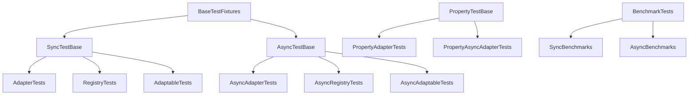
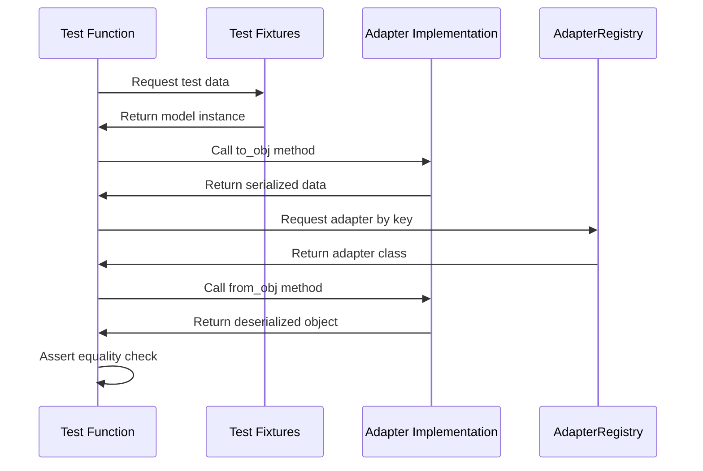

# Technical Design Specification: Core Unit Tests

## 1. Overview

### 1.1 Purpose

This specification outlines the comprehensive testing strategy for pydapter's
core interfaces, focusing on protocol conformance, adapter registration, and
data conversion functionality across both synchronous and asynchronous variants.

### 1.2 Scope

The scope includes:

- Protocol compliance testing for `Adapter` and `AsyncAdapter`
- Registry pattern validation (`AdapterRegistry` and `AsyncAdapterRegistry`)
- Adaptable mixin functionality (`Adaptable` and `AsyncAdaptable`)
- Property-based testing for extensive edge case coverage
- Performance benchmarking for adapter operations

Out of scope:

- End-to-end application testing
- External system integration testing (will be addressed in separate
  specifications)

### 1.3 Background

The research report (RR-15.md, PR #22) identified the need for a structured
testing approach to ensure the core adapter pattern implementation remains
reliable and robust. The report highlighted property-based testing as
particularly valuable for validating protocol conformance and data
transformations.

### 1.4 Design Goals

1. Ensure reliable testing of both synchronous and asynchronous adapter patterns
2. Maximize test coverage of edge cases and error conditions
3. Create a maintainable and extensible test structure that scales with new
   adapters
4. Implement performance benchmarking to identify bottlenecks
5. Provide clear fixtures and utilities to simplify test creation

### 1.5 Key Constraints

1. Test suite execution time must remain reasonable as more adapters are added
2. Container-based tests must have appropriate fallbacks in CI environments
3. Asynchronous testing must avoid flaky test issues
4. Property-based tests must be configurable for development vs. CI environments

## 2. Architecture

### 2.1 Component Diagram



### 2.2 Dependencies

1. **Testing frameworks**:
   - pytest (>=7.0.0)
   - pytest-cov (>=4.0.0)
   - pytest-asyncio (>=0.21.0)
   - pytest-benchmark (>=4.0.0)

2. **Property-based testing**:
   - hypothesis (>=6.82.0)

3. **Integration testing**:
   - testcontainers (>=3.7.0)

4. **Mocking**:
   - unittest.mock (standard library)

### 2.3 Data Flow



## 3. Interface Definitions

### 3.1 Test Base Classes

#### `AdapterTestBase`

```python
class AdapterTestBase:
    """Base class for all adapter tests."""

    @pytest.fixture
    def sample_data(self):
        """Return sample data for testing."""
        raise NotImplementedError

    def test_adapter_protocol_compliance(self, adapter_cls):
        """Verify adapter implements the Adapter protocol."""
        assert isinstance(adapter_cls, Adapter)
        assert hasattr(adapter_cls, "obj_key")
        assert isinstance(adapter_cls.obj_key, str)

    def test_adapter_round_trip(self, sample_data, adapter_cls):
        """Test round-trip conversion through the adapter."""
        raise NotImplementedError
```

#### `AsyncAdapterTestBase`

```python
class AsyncAdapterTestBase:
    """Base class for all async adapter tests."""

    @pytest.fixture
    def sample_data(self):
        """Return sample data for testing."""
        raise NotImplementedError

    def test_adapter_protocol_compliance(self, adapter_cls):
        """Verify adapter implements the AsyncAdapter protocol."""
        assert isinstance(adapter_cls, AsyncAdapter)
        assert hasattr(adapter_cls, "obj_key")
        assert isinstance(adapter_cls.obj_key, str)

    @pytest.mark.asyncio
    async def test_adapter_round_trip(self, sample_data, adapter_cls):
        """Test round-trip conversion through the async adapter."""
        raise NotImplementedError
```

### 3.2 Property-Test Base

```python
class PropertyTestBase:
    """Base class for property-based tests."""

    def make_model_strategy(self):
        """Create a Hypothesis strategy for generating test models."""
        from hypothesis import strategies as st
        from pydantic import BaseModel

        return st.builds(
            self.model_factory,
            id=st.integers(),
            name=st.text(min_size=1, max_size=50),
            value=st.floats(allow_nan=False, allow_infinity=False)
        )

    def setup_hypothesis_profiles(self):
        """Set up different Hypothesis profiles for testing."""
        from hypothesis import settings, Verbosity, Phase

        # CI profile - more examples, no deadline
        settings.register_profile(
            "ci",
            max_examples=100,
            deadline=None
        )

        # Dev profile - fewer examples, verbose output, no deadline
        settings.register_profile(
            "dev",
            max_examples=10,
            verbosity=Verbosity.verbose,
            phases=[Phase.generate, Phase.target],
            deadline=None
        )
```

### 3.3 Testing Utilities

```python
def validate_schema(adapter_cls, expected_schema):
    """Validate that an adapter's schema matches the expected schema."""
    actual_schema = adapter_cls.get_schema()
    assert actual_schema == expected_schema

def check_error_handling(func, error_inputs, expected_exception):
    """Test that a function raises the expected exception for specific inputs."""
    for error_input in error_inputs:
        with pytest.raises(expected_exception):
            func(error_input)
```

## 4. Data Models

### 4.1 Test Models

```python
class SampleModel(Adaptable, BaseModel):
    """Sample model for sync testing."""
    id: int
    name: str
    value: float

class AsyncSampleModel(AsyncAdaptable, BaseModel):
    """Sample model for async testing."""
    id: int
    name: str
    value: float
    embedding: list[float] = [0.1, 0.2, 0.3, 0.4, 0.5]  # For vector DBs
```

### 4.2 Test Data Fixtures

```python
@pytest.fixture
def model_factory():
    """Factory for creating test models with adapters registered."""
    from pydantic import BaseModel

    def create_model(**kw):
        class TestModel(Adaptable, BaseModel):
            id: int
            name: str
            value: float

        # Register standard adapters
        TestModel.register_adapter(JsonAdapter)
        TestModel.register_adapter(CsvAdapter)
        TestModel.register_adapter(TomlAdapter)

        return TestModel(**kw)

    return create_model

@pytest.fixture
def async_model_factory():
    """Factory for creating async test models with adapters registered."""
    from pydantic import BaseModel

    def create_model(**kw):
        class AsyncTestModel(AsyncAdaptable, BaseModel):
            id: int
            name: str
            value: float
            embedding: list[float] = [0.1, 0.2, 0.3, 0.4, 0.5]

        # Register async adapters
        AsyncTestModel.register_async_adapter(AsyncPostgresAdapter)
        AsyncTestModel.register_async_adapter(AsyncMongoAdapter)
        AsyncTestModel.register_async_adapter(AsyncQdrantAdapter)

        return AsyncTestModel(**kw)

    return create_model
```

### 4.3 Error Models

```python
@pytest.fixture
def invalid_adapters():
    """Collection of invalid adapter implementations for testing error handling."""

    class MissingKeyAdapter:
        """Adapter missing the required obj_key attribute."""

        @classmethod
        def from_obj(cls, subj_cls, obj, /, *, many=False, **kw):
            return subj_cls()

        @classmethod
        def to_obj(cls, subj, /, *, many=False, **kw):
            return {}

    class MissingMethodAdapter:
        """Adapter missing required methods."""
        obj_key = "invalid"

        # Missing from_obj and to_obj methods

    class InvalidReturnAdapter:
        """Adapter with invalid return types."""
        obj_key = "invalid_return"

        @classmethod
        def from_obj(cls, subj_cls, obj, /, *, many=False, **kw):
            return None  # Invalid return type

        @classmethod
        def to_obj(cls, subj, /, *, many=False, **kw):
            return None  # Invalid return type

    return {
        "missing_key": MissingKeyAdapter,
        "missing_method": MissingMethodAdapter,
        "invalid_return": InvalidReturnAdapter,
    }
```

## 5. Behavior

### 5.1 Core Workflows

#### Protocol Compliance Testing

1. Verify that concrete adapter classes correctly implement the `Adapter` or
   `AsyncAdapter` protocol
2. Check that required attributes and methods are present
3. Test that methods accept the correct parameters and return the expected types

#### Registry Testing

1. Test registration of adapters in the registry
2. Verify retrieval of adapters by key
3. Test error handling for missing or invalid adapters
4. Validate registry behavior with multiple adapters

#### Adaptable Mixin Testing

1. Test registration of adapters via the mixin
2. Verify round-trip conversion via the mixin methods
3. Test error handling for invalid conversions
4. Validate behavior with multiple registered adapters

### 5.2 Error Handling

Error handling tests will cover:

1. Invalid adapter registrations (missing attributes/methods)
2. Retrieval of unregistered adapters
3. Invalid input data to adapters
4. Conversion failures
5. Concurrency issues with async adapters

```python
def test_adapter_registry_error_handling(invalid_adapters):
    """Test error handling in AdapterRegistry."""
    registry = AdapterRegistry()

    # Test invalid adapter (missing obj_key)
    with pytest.raises(AttributeError, match="Adapter must define 'obj_key'"):
        registry.register(invalid_adapters["missing_key"])

    # Test retrieval of unregistered adapter
    with pytest.raises(KeyError, match="No adapter registered for 'nonexistent'"):
        registry.get("nonexistent")
```

### 5.3 Security Considerations

1. Test handling of malformed input data that could lead to security issues
2. Validate that adapters properly sanitize inputs and outputs
3. Test error handling for access control issues in external systems
4. Verify proper validation of configuration parameters

## 6. External Interactions

### 6.1 Dependencies on Other Components

The test suite depends on:

1. Pydapter core components (`Adapter`, `AdapterRegistry`, `Adaptable`)
2. Pydapter async components (`AsyncAdapter`, `AsyncAdapterRegistry`,
   `AsyncAdaptable`)
3. Concrete adapter implementations (JSON, CSV, TOML, etc.)
4. External databases for async adapter tests (Postgres, MongoDB, Qdrant)

### 6.2 External System Mocks

For database-dependent testing, the design includes:

1. Container-based database fixtures for realistic testing
2. Mock implementations for faster testing when containers are not available
3. Configurable skipping of container tests in resource-constrained environments

```python
@pytest.fixture(scope="session")
def mock_postgres():
    """Mock PostgreSQL interface for testing when containers are unavailable."""
    from unittest.mock import AsyncMock

    mock = AsyncMock()
    mock.connect = AsyncMock()
    mock.execute = AsyncMock(return_value=[{"id": 1, "name": "test", "value": 42.5}])
    return mock

@pytest.fixture(scope="session")
def postgres_fixture(request):
    """Provides either a real PostgreSQL container or a mock based on availability."""
    try:
        from testcontainers.postgres import PostgresContainer
        container = PostgresContainer("postgres:16-alpine")
        container.start()
        yield container.get_connection_url().replace("postgresql://", "postgresql+asyncpg://")
        container.stop()
    except Exception:
        # Fall back to mock if container can't be started
        yield mock_postgres()
```

## 7. Performance Considerations

### 7.1 Expected Load

The test suite will include:

1. Around 50-100 standard unit tests
2. 10-20 property-based tests (each running multiple examples)
3. 5-10 container-based integration tests
4. 5-10 benchmark tests

### 7.2 Scalability Approach

To ensure the test suite remains performant as more adapters are added:

1. Use parameterized tests to avoid test code duplication
2. Leverage session-scoped fixtures for expensive setup
3. Skip resource-intensive tests in development environments

### 7.3 Optimizations

1. Use hypothesis profiles to limit the number of examples in development
2. Provide options to skip slow tests during development
3. Run container tests in parallel where possible

### 7.4 Caching Strategy

1. Use session-scoped fixtures for database containers
2. Cache test models and adapters at the module level
3. Leverage pytest's caching mechanisms for slow test results

## 8. Observability

### 8.1 Logging

The test suite will log:

1. Test setup and teardown activities
2. Container startup and configuration
3. Test failures with detailed context

### 8.2 Metrics

Benchmark tests will track:

1. Serialization and deserialization performance
2. Registry lookup performance
3. Performance comparison across adapter implementations

### 8.3 Tracing

For async tests, tracing will be implemented to:

1. Track async operations and their execution time
2. Identify potential deadlocks or race conditions
3. Monitor resource usage during tests

## 9. Testing Strategy

### 9.1 Unit Testing

Unit tests will focus on:

1. Protocol compliance for all adapter implementations
2. Registry functionality
3. Adaptable mixin behavior
4. Individual adapter methods

### 9.2 Property-Based Testing

Property-based tests will verify:

1. Round-trip conversion (serialize → deserialize → compare)
2. Handling of edge cases (empty values, extreme values)
3. Consistency across adapter implementations
4. Error handling for invalid inputs

### 9.3 Performance Testing

Performance tests will:

1. Benchmark serialization and deserialization operations
2. Compare performance across adapter implementations
3. Track performance changes over time
4. Identify bottlenecks in the adapter stack

## 10. Deployment and Configuration

### 10.1 Test Configuration

The test suite will use pytest configuration in `pyproject.toml`:

```toml
[tool.pytest.ini_options]
testpaths = ["tests"]
markers = [
    "unit: mark unit tests",
    "property: mark property-based tests",
    "integration: mark integration tests",
    "benchmark: mark benchmark tests",
    "async: mark async tests"
]
addopts = "-ra --cov=pydapter --cov-report=term-missing"
```

### 10.2 Environment Variables

```
SKIP_CONTAINERS=1       # Skip container-based tests
HYPOTHESIS_PROFILE=dev  # Use development profile for property tests
```

## 11. Open Questions

1. Should we implement custom protocol validators or rely on runtime_checkable?
2. How should we handle skipping of specific async adapter tests in CI
   environments?
3. Should we create a separate test directory structure for different test
   types?
4. How granular should the test markers be for running specific test subsets?

## 12. Risks & Mitigations

| Risk                                        | Mitigation                                                                                       |
| ------------------------------------------- | ------------------------------------------------------------------------------------------------ |
| Container startup failures in CI            | Implement fallback mocking when containers unavailable with `@pytest.mark.skipif`                |
| Flaky async tests                           | Add retries for integration tests and use event loop isolation in pytest-asyncio (pplx:53ee45a2) |
| Performance degradation from property tests | Use `--hypothesis-profile=dev` for faster runs during development (pplx:bbefd11c)                |
| Test maintenance burden                     | Create base classes and utilities to reduce code duplication (pplx:c9986b53)                     |
| Protocol validation failures                | Use explicit runtime protocol checks in dedicated test functions                                 |

## 13. Appendices

### Appendix A: Alternative Designs

An alternative approach would be to focus solely on unit tests with extensive
mocking, which would be faster but less comprehensive. This approach might be
preferred during rapid development cycles but would miss important edge cases
that property-based testing can uncover.

Another alternative would be to use a more behavior-driven approach with tools
like pytest-bdd, but this adds complexity that may not be warranted for this
type of testing.

### Appendix B: Research References

1. [pytest-asyncio Documentation - Advanced Async Testing Patterns](https://www.b-list.org/weblog/2023/dec/18/async-python-tests/)
   (pplx:53ee45a2)
2. [Property-Based Testing in Python with Hypothesis](https://semaphoreci.com/blog/property-based-testing-python-hypothesis-pytest)
   (pplx:bbefd11c)
3. [Protocol Conformance Testing Best Practices](https://realpython.com/pytest-python-testing/)
   (pplx:c9986b53)

### Appendix C: Implementation Examples

#### Example Property-Based Test

```python
from hypothesis import given, strategies as st

@given(
    id=st.integers(),
    name=st.text(min_size=1, max_size=50),
    value=st.floats(allow_nan=False, allow_infinity=False)
)
def test_json_adapter_roundtrip(id, name, value, model_factory):
    """Test that objects can be round-tripped through the JsonAdapter."""
    model = model_factory(id=id, name=name, value=value)
    serialized = model.adapt_to(obj_key="json")
    deserialized = model.__class__.adapt_from(serialized, obj_key="json")
    assert deserialized == model
```

#### Example Async Test with Container

```python
@pytest.mark.asyncio
@pytest.mark.integration
async def test_async_postgres_adapter(async_model_factory, postgres_fixture):
    """Test AsyncPostgresAdapter with actual PostgreSQL database."""
    model = async_model_factory(id=1, name="test", value=42.5)

    # Store in database
    await model.adapt_to_async(
        obj_key="async_pg",
        dsn=postgres_fixture,
        table="test_table"
    )

    # Retrieve from database
    retrieved = await model.__class__.adapt_from_async(
        {"dsn": postgres_fixture, "table": "test_table", "selectors": {"id": 1}},
        obj_key="async_pg"
    )

    assert retrieved == model
```
