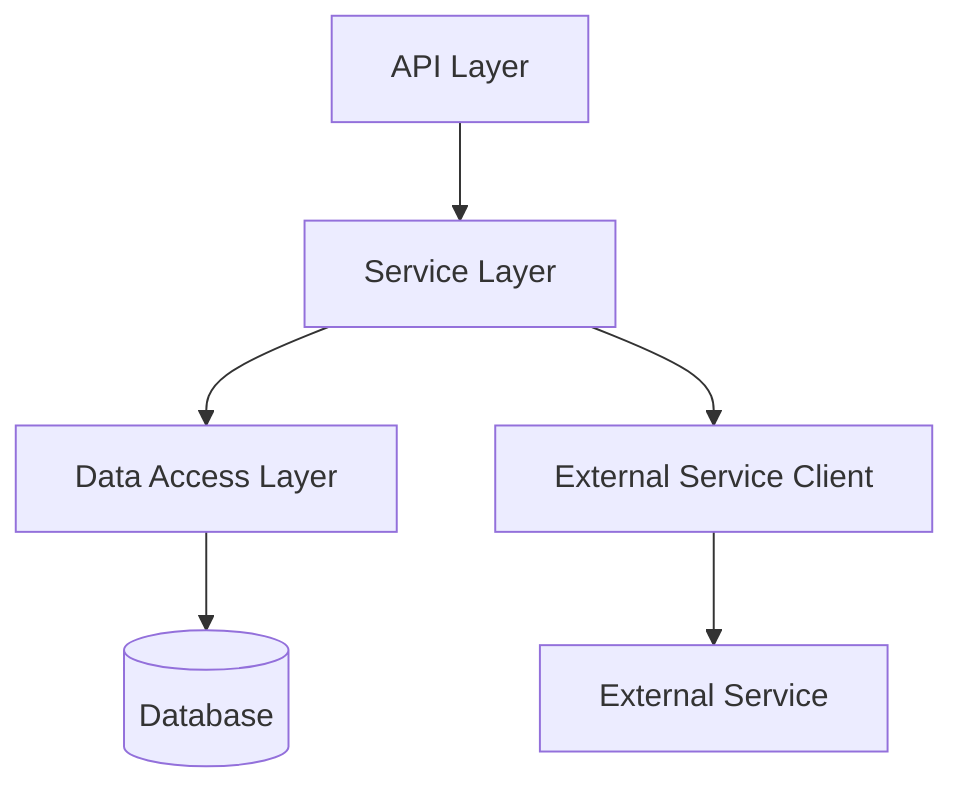
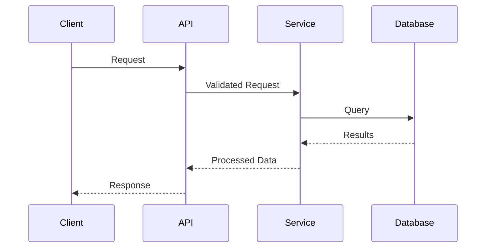

# Guidance

**Purpose**\
Lay out an **implementation-ready** blueprint for a microservice or feature:
data models, APIs, flows, error handling, security, etc.

**When to Use**

- After the Research is done, to guide the Implementer.
- Before Implementation Plan or simultaneously with it.

**Best Practices**

- Keep the design as **complete** as possible so coders can proceed with minimal
  guesswork.
- Emphasize any performance or security corners.
- Use diagrams (Mermaid) for clarity.

---

# Technical Design Specification: [Component Name]

## 1. Overview

### 1.1 Purpose

_Short statement of the component's purpose._

### 1.2 Scope

_Boundaries—what is included, what is not._

### 1.3 Background

_Cite any relevant research or constraints._

### 1.4 Design Goals

_List the main objectives (e.g., reliability, minimal latency)._

### 1.5 Key Constraints

_Security or performance constraints from the project._

## 2. Architecture

### 2.1 Component Diagram



### 2.2 Dependencies

_Internal or external services, libraries._

### 2.3 Data Flow



## 3. Interface Definitions

### 3.1 API Endpoints

#### `[Method] /path/to/resource`

**Purpose:**\
**Request Model:**\
**Response Model:**\
**Error Responses:**

### 3.2 Internal Interfaces

_Classes, methods, or modules inside the Service layer._

## 4. Data Models

### 4.1 API Models

```python
class EntityModel(BaseModel):
    id: str
    name: str
    created_at: datetime
    updated_at: Optional[datetime] = None
    status: StatusEnum
```

### 4.2 Domain Models

_Essential business objects in Python classes or data classes._

### 4.3 Database Schema

```sql
CREATE TABLE entities (
    id VARCHAR(36) PRIMARY KEY,
    ...
);
```

## 5. Behavior

### 5.1 Core Workflows

```mermaid
sequenceDiagram
    ...
```

### 5.2 Error Handling

_Errors, exceptions, domain-specific custom errors, etc._

### 5.3 Security Considerations

_Auth, encryption, data sanitization, etc._

## 6. External Interactions

### 6.1 Dependencies on Other Services

_If it calls other microservices in khive or external providers (Exa,
Perplexity)._

### 6.2 External API Integrations

```python
class ExternalServiceClient:
    ...
```

## 7. Performance Considerations

### 7.1 Expected Load

### 7.2 Scalability Approach

### 7.3 Optimizations

### 7.4 Caching Strategy

## 8. Observability

### 8.1 Logging

### 8.2 Metrics

### 8.3 Tracing

## 9. Testing Strategy

### 9.1 Unit Testing

### 9.2 Integration Testing

### 9.3 Performance Testing

## 10. Deployment and Configuration

### 10.1 Deployment Requirements

### 10.2 Configuration Parameters

```json
{
  "PORT": 8080,
  "DATABASE_URL": "postgres://..."
}
```

## 11. Open Questions

_List any unresolved design points for Orchestrator or team decisions._

## 12. Appendices

### Appendix A: Alternative Designs

### Appendix B: Research References
