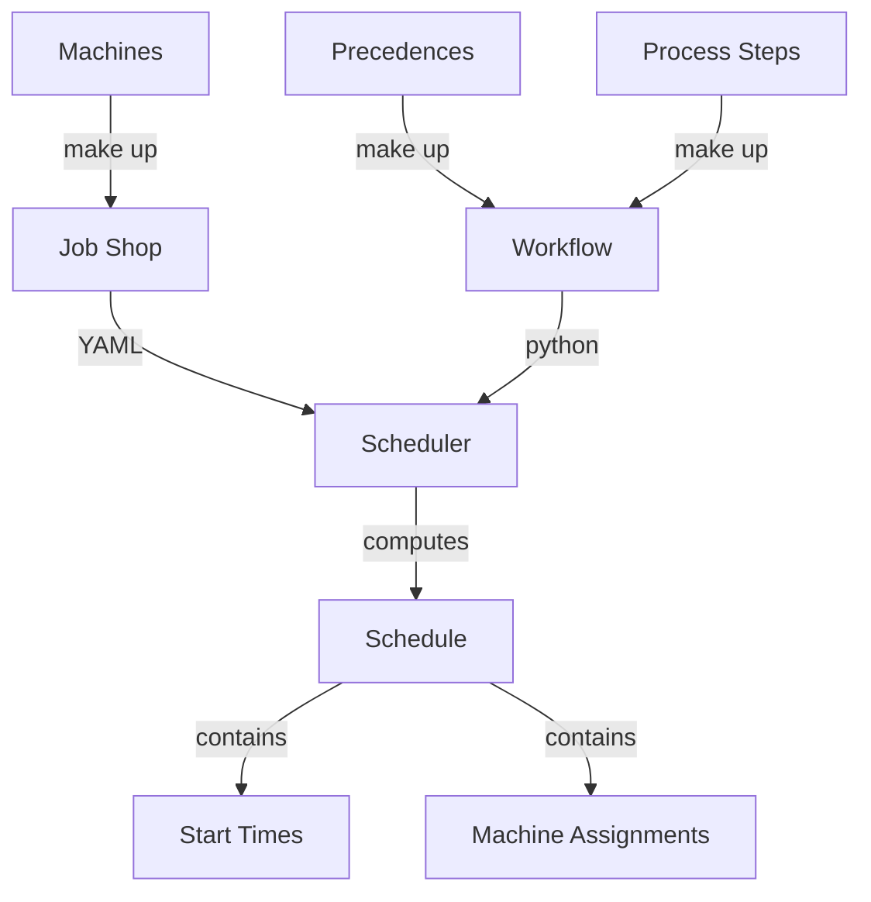
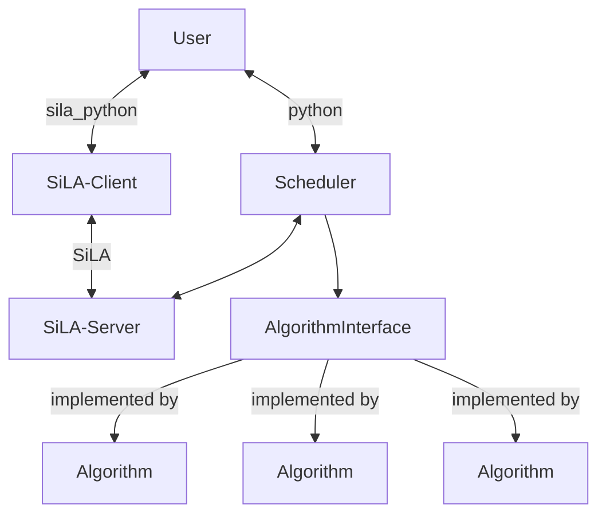

# PythonLab Scheduler

Generic Scheduler for Lab Automation Processes. 'Scheduling' in this sense means
taking a workflow description and a descriptions of a lab(also called job shop) and assigning timestamps and machines to the steps of the workflow in an intelligent way.

In other words: It solves a generalization of the
[Job Shop Scheduling Problem(JSSP)](https://en.wikipedia.org/wiki/Job-shop_scheduling).
The main generalizations are

-   Jobs can have several operations on the same machine
-   There might be several machines of a kind
-   Time-constraints between Operations (soft and hard)
-   Machines can have capacities to do several operations in parallel
-   Jobs can intersect(i.e. operations can have precedence constraints to other jobs operations)

More precise information on this can be found [here](docs/architecture/problem_definition.md)

## Installation

    pip install labscheduler --index-url https://gitlab.com/api/v4/projects/25166382/packages/pypi/simple

## Scheduling Framework Overview

The framework is designed to be very generic:
The core scheduling algorithm can be exchanged by any scheduling concept that shall be developed, tested or used in a real world application.
The scheduler itself can be used via python import or as a micro service via SiLA.
More information in the framework can be found [here](docs/architecture/framework.md).

## Usage

For help in the console type

    labscheduler --help

The scheduler can be accessed via standard python import or run on a SiLA-server and accessed via a SiLA-client.
Examples can be found [here](docs/usage.rst):

## Development

    git clone gitlab.com/opensourcelab/labscheduler

    # create a virtual environment and activate it then run

    pip install -e .[dev]

    # run unittests

    invoke test   # use the invoke environment to manage development

    # commit changes: please install pre-commit hooks
    pre-commit install

## Documentation

The Documentation can be found here: [https://opensourcelab.gitlab.io/labscheduler](https://opensourcelab.gitlab.io/labscheduler)

## Credits

This package was created with [Cookiecutter](https://github.com/audreyr/cookiecutter)
and the [gitlab.com/opensourcelab/software-dev/cookiecutter-pypackage](https://gitlab.com/opensourcelab/software-dev/cookiecutter-pypackage) project template.
