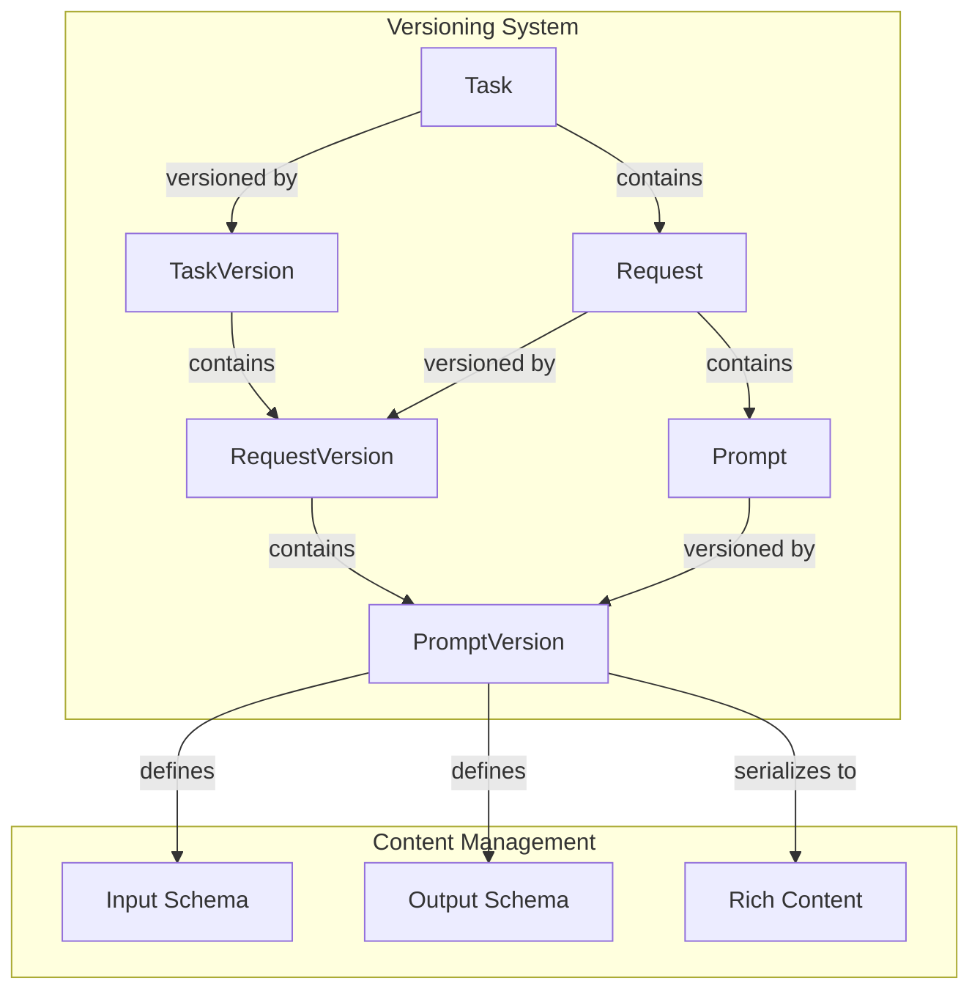

## Stack

### UI

- NextJS 14
- Drizzle
- Vercel
- Neon (postgres)

### SDK and log ingest

- Python 3.10+ 
- Pydantic 2.9+
- Modal
- Neon (postgres)

## Overview

This system is a content management system (CMS) designed for building AI applications. It aims to:

- **Support versioning** as a first-class citizen.
- Enable domain experts to iterate on content for prompts.
- Allow domain experts to manage examples.
- Provide strong typing for engineers to implement and experiment with changes in AI systems.

AI systems supported by this CMS include multi-modal content, multi-turn conversations, iterative development and refinement on tasks, and combining these elements into prompt chains and dynamic agent workflows.

---

## Current State

### Entities

1. **Task**
1.  A semantic grouping to manage blue-green deploys and components. For example:
    - A single LLM inference.
    - All prompts and examples needed to run an agent.
1. Versioning at the task level ensures consistency and reproducibility across multi-step inferences in distributed systems.
1. **Request**
1.  Represents the collection of content sent to an LLM for a single inference. Examples include:
    - A user prompt.
    - A system + user prompt.
    - Complex interactions like a user → system → assistant → user multi-turn sequence.
1. **Key Attribute**: `is_active`
1.  Toggling `is_active` generates new versions, helping teams manage which requests are part of a deployable task.
1. **Prompt**
1.  Represents an element of a request, such as a system prompt or the start of a user block. Prompts are:
    - Built from serialized TipTap editor docs for rich text and multi-modal content.
    - Encapsulate schemas.
1. **Input and Output Schemas**:
    - Input schemas are inferred from variables across all prompts in a request version.
    - Output schemas enable structured generation or tool use tasks.
1. Schemas are designed to support code generation (e.g., Pydantic, Zod) for easy integration into developer systems.

### Key Features

- Prompts with roles (`user`, `assistant`, `system`) are unstructured templates defined in TipTap.
- Prompts with role `schema` are structured for generation and managed through a property editor.
- When a new request is created, an input prompt is automatically created.

### Current Limitations

- Users can currently publish changes to prompts. This triggers:
    - Creation of a new task.
    - Updates to all requests and prompts within the task to ensure versioning.
- **Examples are not yet supported** but will be implemented soon.

---

# Request-Task-Prompt Versioning System

## Overview

This system ensures robust versioning for tasks, requests, and prompts, maintaining historical integrity. Changes to any entity trigger new versions across the associated task's scope, preserving a consistent point-in-time history.

---

## Entities

- **Task**: A collection of requests.
- **Request**: A collection of prompts.
- **Prompt**: Contains rich content that can be serialized.

---

## Versioning

### Key Principles

1. **Immutability**: Once created, historical versions remain unchanged.
1. **Consistency**: Changing a version at any level (task, request, prompt) cascades to create new versions for all associated entities.
1. **Point-in-Time Queries**: Each versioned entity can be queried consistently based on its version.

### Version Creation Scenarios

1. **Creating a New Prompt**:
    - **First RequestVersion within a Task**:
        - Creates the first `TaskVersion`.
        - Creates a new `RequestVersion` and associated `PromptVersion`.
    - **Existing TaskVersion**:
        - Creates a new `TaskVersion`.
        - New `RequestVersions` and `PromptVersions` are created for all relevant entities.
1. **Creating a New Prompt in an Existing Versioned Request**:
    - Creates a new `RequestVersion` for the edited request.
    - Creates a new `TaskVersion`.
    - Propagates changes by creating new `RequestVersions` and `PromptVersions` for all other requests in the task.
1. **Updating an Existing Prompt**:
    - Triggers creation of a new `RequestVersion` and `TaskVersion`.
    - Propagates changes to maintain consistency across all associated entities.

---

## Serialization

Serialization is crucial for converting rich prompt content into formats suitable for various LLM systems.

### Registered Serializers

- **Text Blocks**: Serialized to markdown, maintaining formatting.
- **Image Blocks**: Utilize metadata (file key, options).
- **Variable Blocks**: Reserved space for runtime content injection, including types and defaults.

### Upcoming Serializers

- **Chat/Conversation Blocks**: To manage interactive content.

---

This structure provides a clear, well-organized overview of your CMS while making the details easily digestible for readers.

