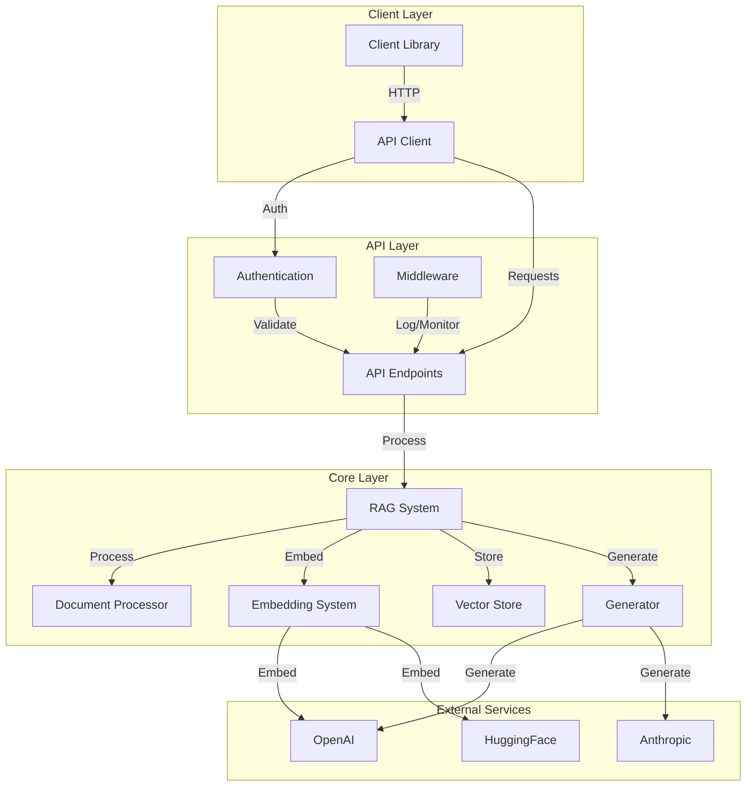
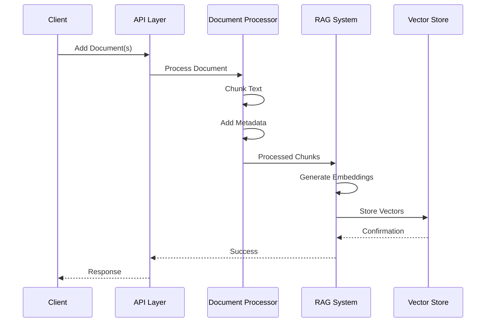
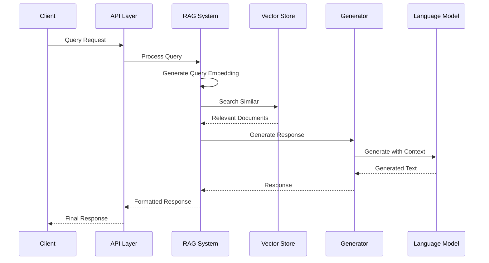
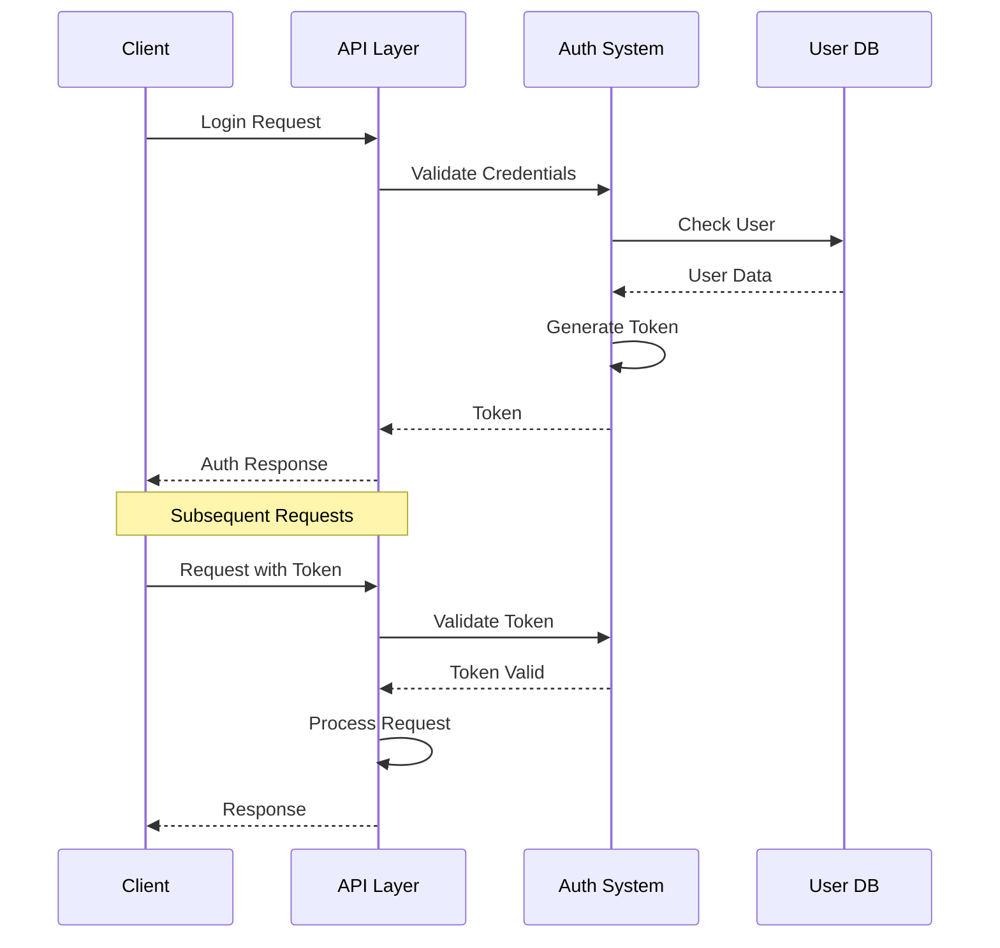
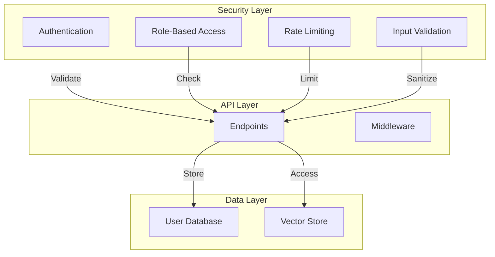
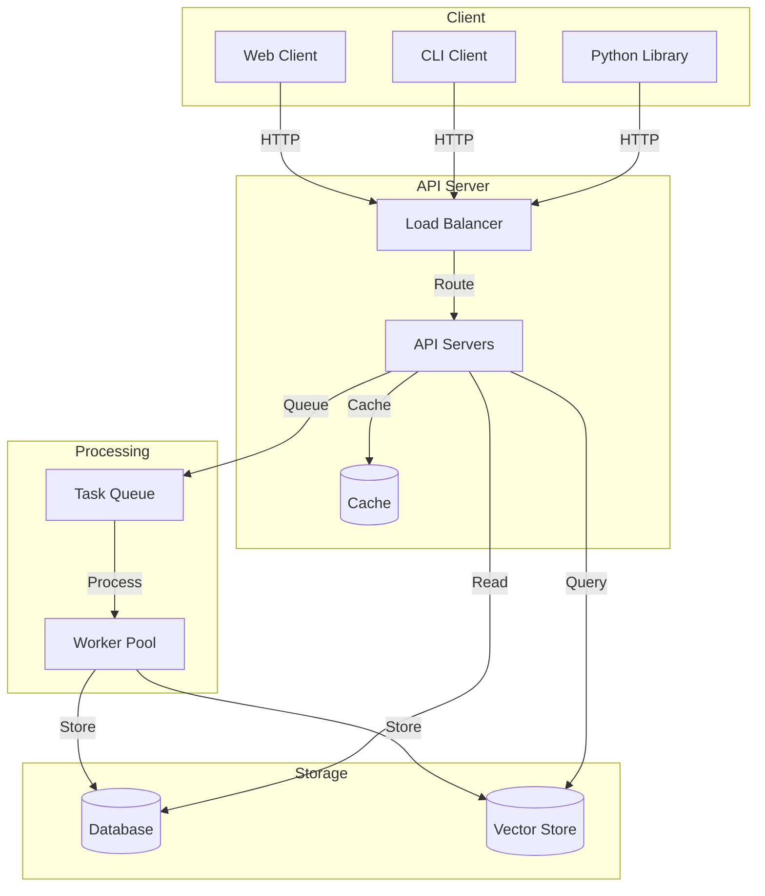

# MultiMind RAG System Architecture

## System Overview

The MultiMind RAG system is built with a modular architecture that separates concerns and allows for easy extension. The system consists of several key components that work together to provide a complete RAG solution.

## Architecture Diagram

## Component Flow

### 1. Document Processing Flow

### 2. Query and Generation Flow

### 3. Authentication Flow

## Component Details

### 1. Client Layer
- **Client Library**
  - Async Python client
  - Type-safe interfaces
  - Error handling
  - Authentication management
- **API Client**
  - HTTP request handling
  - Response parsing
  - Connection management

### 2. API Layer
- **Authentication**
  - JWT validation
  - API key management
  - Scope checking
  - User management
- **Endpoints**
  - Document management
  - Query and generation
  - Model management
  - Health monitoring
- **Middleware**
  - Request logging
  - Error handling
  - Rate limiting
  - CORS management

### 3. Core Layer
- **RAG System**
  - Document processing
  - Embedding management
  - Vector storage
  - Response generation
- **Document Processor**
  - Text chunking
  - Metadata management
  - Format handling
- **Embedding System**
  - Model management
  - Batch processing
  - Caching
- **Vector Store**
  - Similarity search
  - Document storage
  - Metadata indexing
- **Generator**
  - Context management
  - Model integration
  - Response formatting

### 4. External Services
- **OpenAI**
  - Embedding models
  - Generation models
- **Anthropic**
  - Generation models
- **HuggingFace**
  - Embedding models
  - Custom models

## Data Flow

### 1. Document Ingestion
1. Client sends document(s)
2. API validates request
3. Document processor chunks text
4. Embeddings generated
5. Vectors stored
6. Response returned

### 2. Query Processing
1. Client sends query
2. API validates request
3. Query embedded
4. Similar documents retrieved
5. Context prepared
6. Response generated
7. Result returned

### 3. Model Management
1. Client requests model switch
2. API validates request
3. Model initialized
4. System updated
5. Confirmation returned

## Security Architecture

## Deployment Architecture

## Performance Considerations

1. **Caching Strategy**
   - Embedding cache
   - Query result cache
   - Model response cache
   - User session cache

2. **Scaling Strategy**
   - Horizontal scaling of API servers
   - Worker pool for processing
   - Distributed vector store
   - Load balancing

3. **Resource Management**
   - Connection pooling
   - Memory management
   - Batch processing
   - Async operations

## Monitoring and Logging

1. **Metrics**
   - Request latency
   - Processing time
   - Cache hit rates
   - Error rates
   - Resource usage

2. **Logging**
   - Request logs
   - Error logs
   - Access logs
   - Performance logs

3. **Alerts**
   - Error thresholds
   - Performance degradation
   - Resource exhaustion
   - Security events 