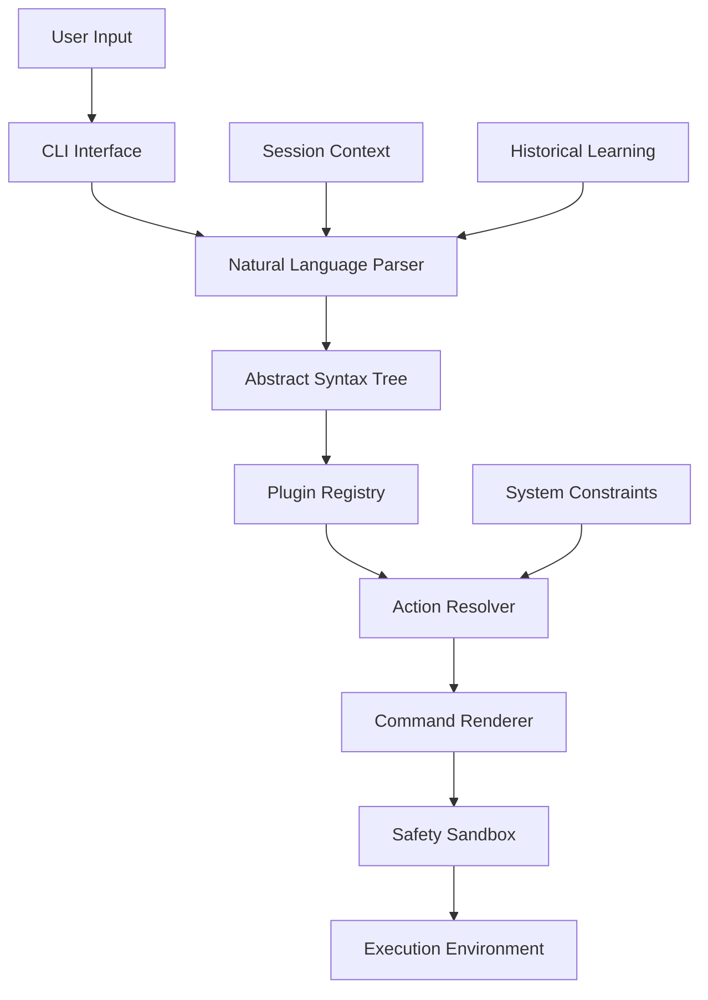
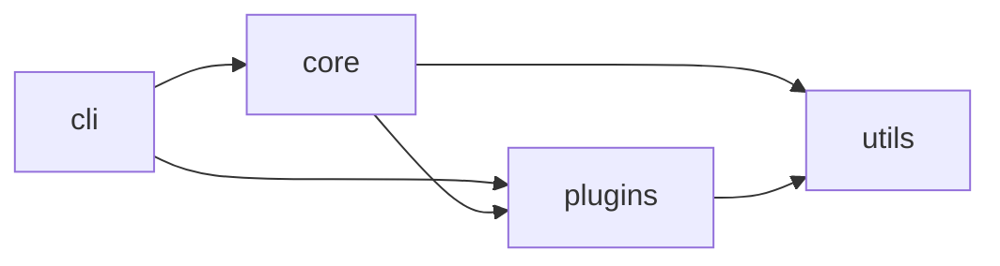
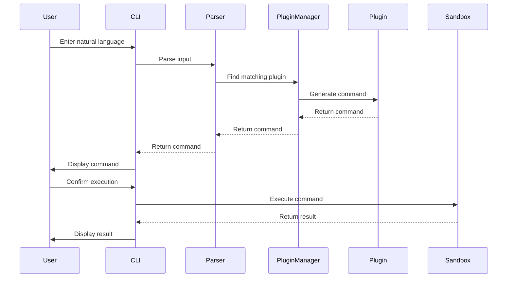

# PlainSpeak Core

This directory contains the core modules of the PlainSpeak project, which transforms natural language into precise computer operations.

## Architecture Overview

## Core Components

- **__init__.py**: Package initialization and version information
- **cli/**: Command-line interface implementation
- **core/**: Core functionality modules
  - **llm/**: Language model interfaces (local and remote)
  - **parser.py**: Natural language parsing
  - **session.py**: Session management
  - **sandbox.py**: Safety sandbox for command execution
  - **commander.py**: Command execution
- **plugins/**: Plugin system and built-in plugins
- **prompts/**: System prompts for LLM interactions
- **utils/**: Utility functions

## Module Relationships

## Data Flow

## Key Concepts

1. **Natural Language Understanding**: Transforms user input into structured commands
2. **Plugin Architecture**: Extensible system for domain-specific functionality
3. **Safety Sandbox**: Ensures commands are safe before execution
4. **Session Context**: Maintains state across interactions
5. **Historical Learning**: Improves over time based on usage patterns
