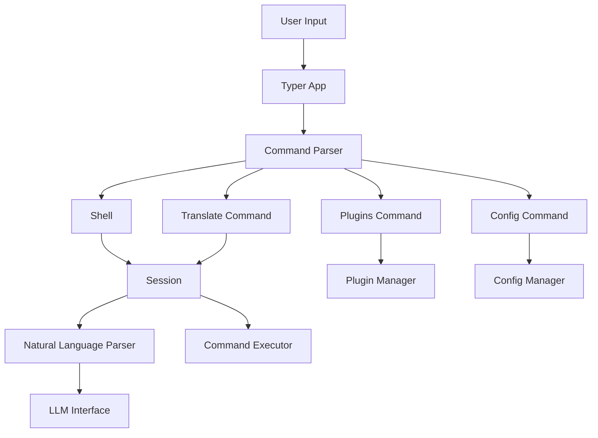
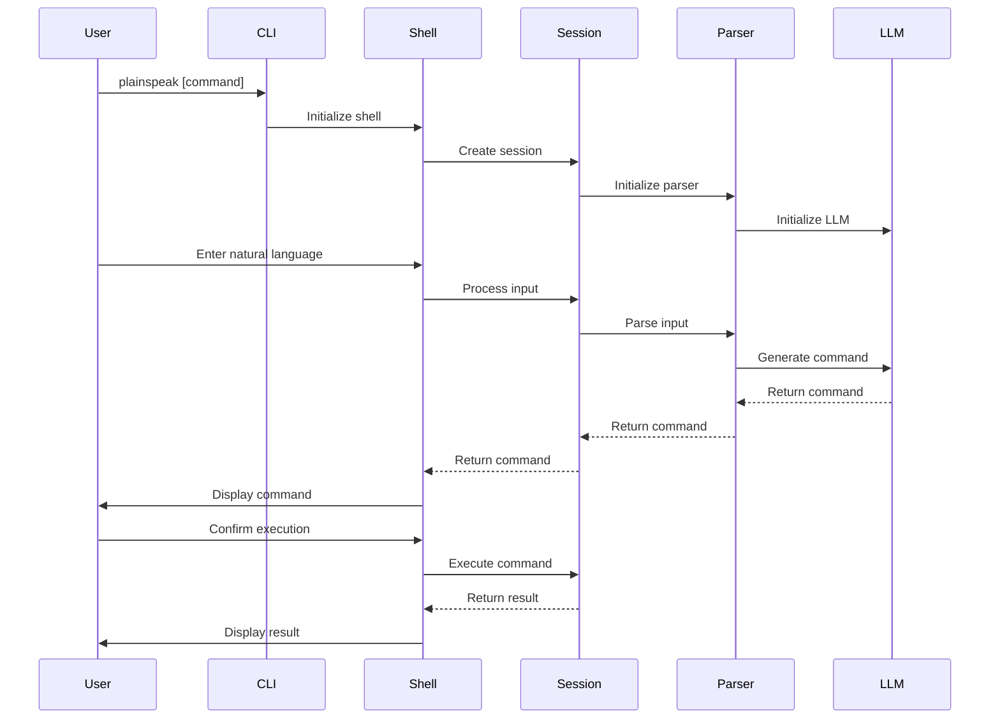
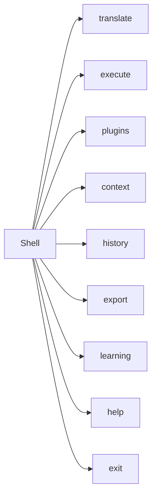
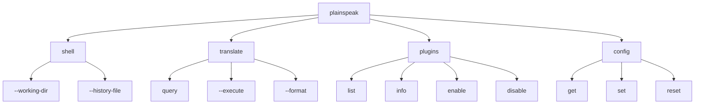
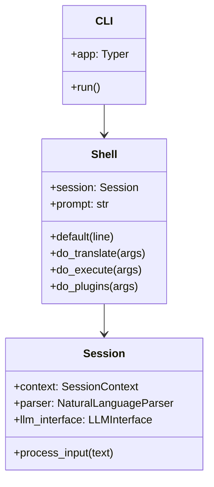

# PlainSpeak CLI Module

This directory contains the Command Line Interface (CLI) implementation for PlainSpeak, providing both a command-line interface for one-off command generation and an interactive REPL mode for continuous command translation.

## Architecture Overview

## Core Components

- **__init__.py**: Main CLI entry point and Typer app configuration
- **shell.py**: Interactive shell implementation using cmd2
- **translate_cmd.py**: Command for translating natural language to shell commands
- **plugins_cmd.py**: Command for managing plugins
- **config_cmd.py**: Command for managing configuration
- **parser.py**: Command-line argument parsing
- **utils.py**: Utility functions for the CLI
- **handlers/**: Command handlers for specific functionality

## Command Flow

## Shell Commands

The interactive shell provides several built-in commands:

## Command-Line Arguments

## Integration with Core Components

The CLI module integrates with the core components of PlainSpeak:

