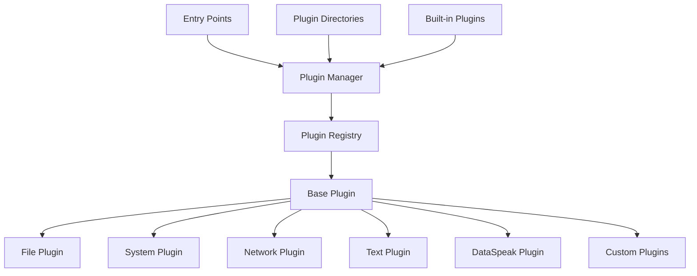
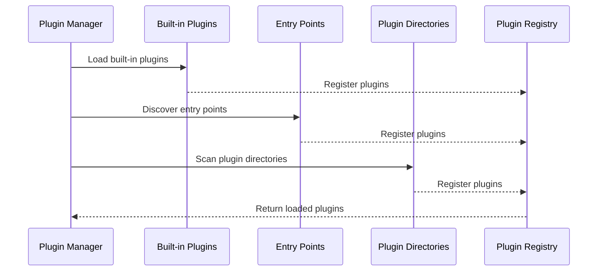

# PlainSpeak Plugins

This directory contains the plugin system and built-in plugins for PlainSpeak.

## Plugin System

The plugin system allows PlainSpeak to be extended with new functionality. Plugins provide verbs that can be used in natural language commands, and they generate the corresponding shell commands.

### Plugin Architecture



The plugin system consists of the following components:

- `base.py`: Defines the base `Plugin` class and `PluginRegistry` class.
- `manager.py`: Provides the `PluginManager` class for loading and using plugins.
- `schemas.py`: Pydantic schemas for plugin configuration validation.
- Individual plugin modules (e.g., `file.py`, `system.py`, etc.).

### Plugin Loading Process



### Creating a Plugin

To create a new plugin, you need to:

1. Create a new Python module in the `plugins` directory.
2. Define a class that inherits from `Plugin`.
3. Implement the required methods: `get_verbs()` and `generate_command()`.
4. Register the plugin with the `registry`.

Example:

```python
from .base import Plugin, registry

class MyPlugin(Plugin):
    def __init__(self):
        super().__init__("my-plugin", "My custom plugin")

    def get_verbs(self):
        return ["my-verb", "another-verb"]

    def generate_command(self, verb, args):
        if verb == "my-verb":
            return f"echo 'My verb with args: {args}'"
        elif verb == "another-verb":
            return f"echo 'Another verb with args: {args}'"
        return f"echo 'Unknown verb: {verb}'"

# Register the plugin
my_plugin = MyPlugin()
registry.register(my_plugin)
```

### YAML Plugins

You can also create plugins using YAML files. The `YAMLPlugin` class in `base.py` allows you to define plugins using a YAML configuration file.

Example YAML plugin:

```yaml
name: my-yaml-plugin
description: My YAML-based plugin
verbs:
  - yaml-verb
  - another-yaml-verb
commands:
  yaml-verb:
    template: "echo 'YAML verb with {{ arg }}'"
    description: A verb defined in YAML
    examples:
      - "yaml-verb with some argument"
  another-yaml-verb:
    template: "echo 'Another YAML verb'"
    description: Another verb defined in YAML
    examples:
      - "another-yaml-verb"
```

## Built-in Plugins

PlainSpeak comes with several built-in plugins:

- **File Plugin**: File operations like listing, copying, moving, etc.
- **System Plugin**: System operations like checking processes, disk usage, etc.
- **Network Plugin**: Network operations like ping, curl, wget, etc.
- **Text Plugin**: Text operations like grep, sed, awk, etc.

### File Plugin

The File Plugin provides verbs for file operations:

- `list`, `ls`, `dir`: List files in a directory
- `find`, `search`: Find files matching a pattern
- `copy`, `cp`: Copy files
- `move`, `mv`: Move files
- `delete`, `rm`, `remove`: Delete files
- `read`, `cat`: Read file content
- `create`, `touch`: Create a new file
- `zip`, `compress`: Compress files
- `unzip`, `extract`: Extract compressed files

### System Plugin

The System Plugin provides verbs for system operations:

- `ps`, `processes`: List processes
- `kill`, `terminate`: Kill a process
- `df`, `disk`: Check disk usage
- `du`, `size`: Check directory size
- `free`, `memory`: Check memory usage
- `top`, `monitor`: Monitor system resources
- `uname`, `system`: Show system information
- `date`, `time`: Show or set date and time
- `uptime`: Show system uptime
- `hostname`: Show or set hostname

### Network Plugin

The Network Plugin provides verbs for network operations:

- `ping`, `check`: Check network connectivity
- `curl`, `http`, `request`: Make HTTP requests
- `wget`, `download`: Download files
- `ifconfig`, `ip`, `interfaces`: Show network interfaces
- `netstat`, `connections`: Show network connections
- `ssh`, `connect`: Connect to remote servers
- `scp`, `secure-copy`: Copy files to/from remote servers
- `nslookup`, `dig`, `dns`: DNS lookup
- `traceroute`, `trace`: Trace network path

### Text Plugin

The Text Plugin provides verbs for text operations:

- `grep`, `search`, `find-text`: Search for patterns in text
- `sed`, `replace`: Stream editor for filtering and transforming text
- `awk`, `process`: Pattern scanning and processing language
- `sort`: Sort lines of text
- `uniq`, `unique`: Report or omit repeated lines
- `wc`, `count`: Count lines, words, and characters
- `head`, `top`: Output the first part of files
- `tail`, `bottom`: Output the last part of files
- `cut`: Remove sections from each line of files
- `tr`, `translate`: Translate or delete characters
