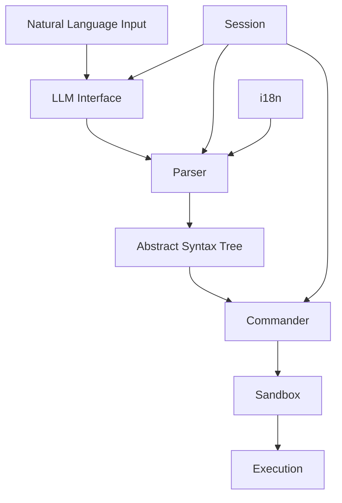
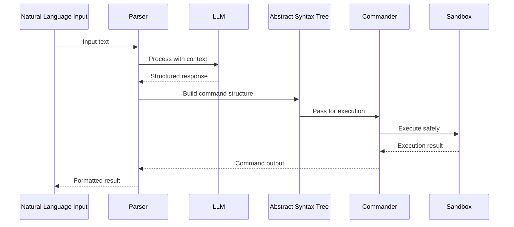
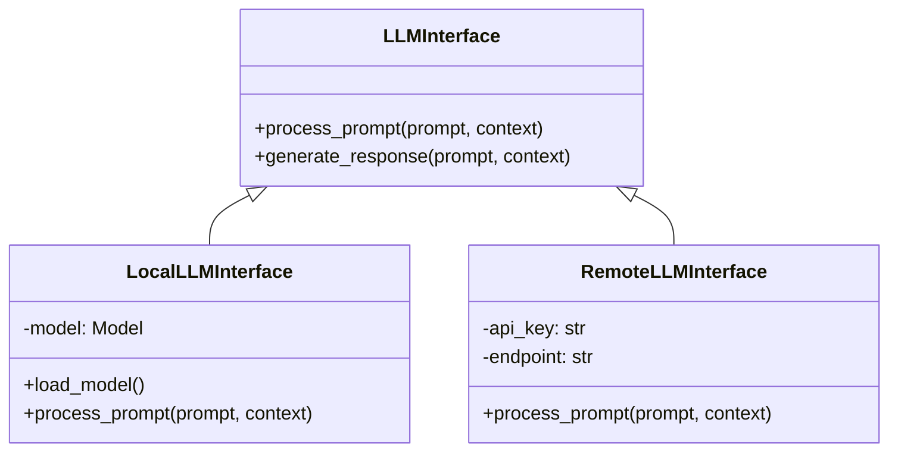
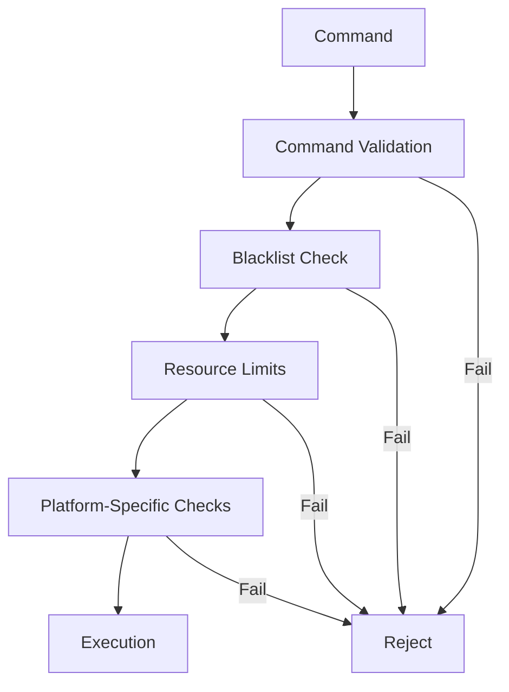
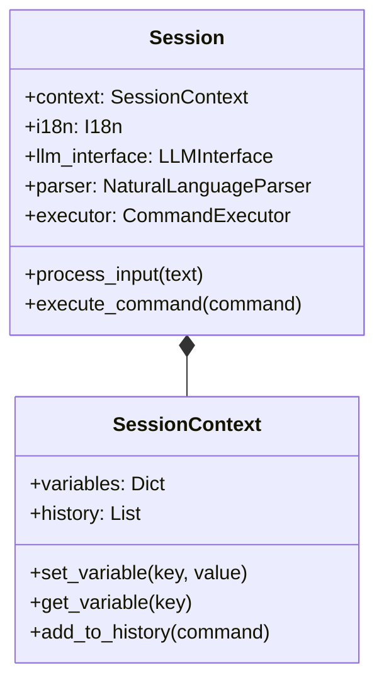

# PlainSpeak Core Module

This directory contains the core functionality of PlainSpeak, responsible for natural language processing, command generation, and execution.

## Architecture Overview

## Core Components

- **llm/**: Language model interfaces
  - **base.py**: Base LLM interface class
  - **local.py**: Local LLM implementation
  - **remote.py**: Remote API LLM implementation
- **parser.py**: Parses natural language into structured commands
- **session.py**: Manages user sessions and state
- **sandbox.py**: Provides a safety layer for command execution
- **commander.py**: Handles command execution
- **i18n.py**: Internationalization support

## Data Flow

## LLM Interface

The LLM interface provides a unified way to interact with language models, whether they are running locally or remotely.

## Sandbox Security

The sandbox provides a secure environment for executing commands, with multiple layers of protection:

## Session Management

The session maintains state across interactions, providing context for command generation:

