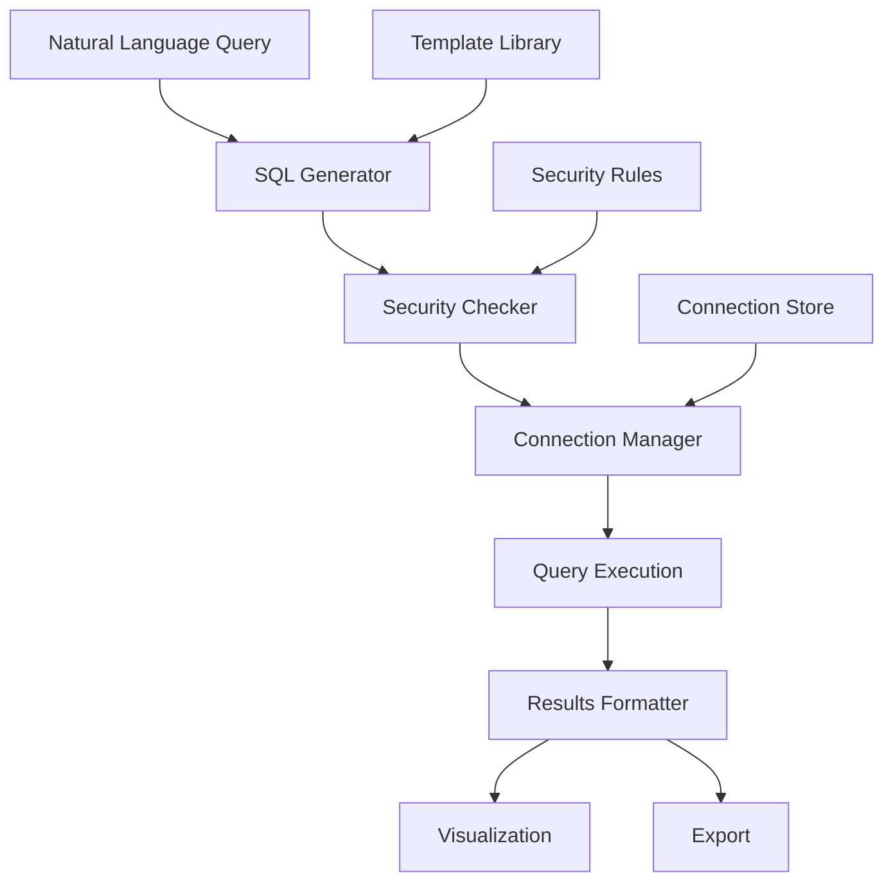
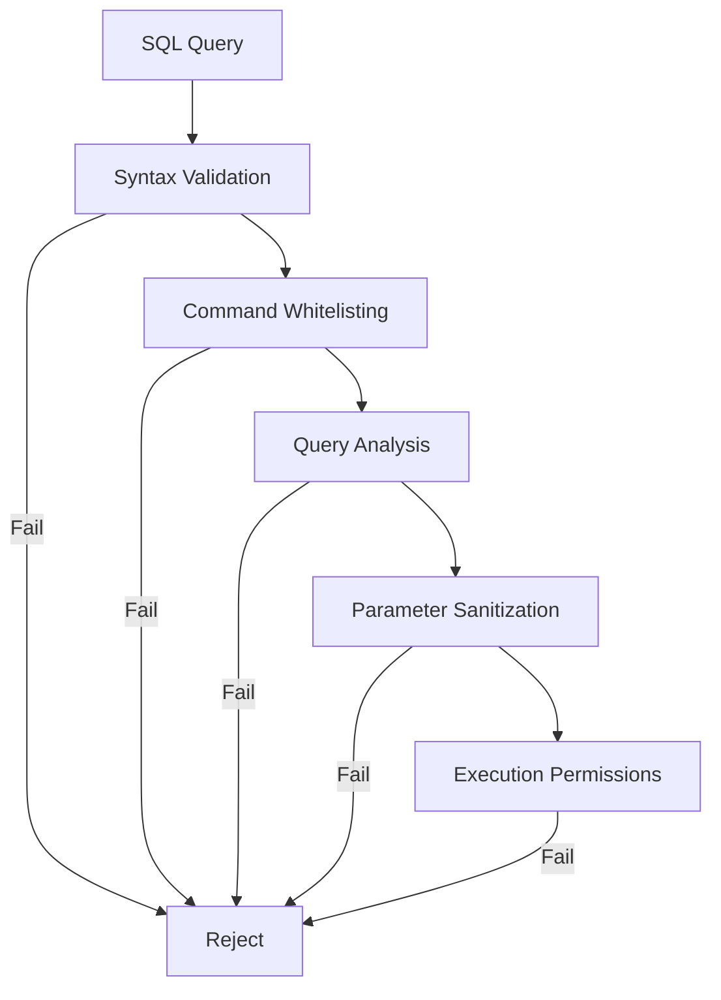
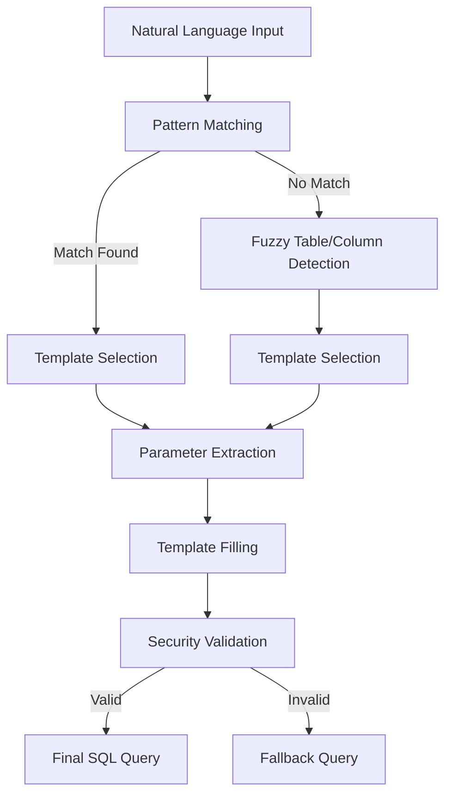

# DataSpeak Plugin

The DataSpeak plugin is a powerful extension for PlainSpeak that transforms natural language queries into SQL, providing a seamless natural language interface to data analysis.

## Architecture Overview



## Overview

DataSpeak enables users to query and visualize data using everyday language without needing to write SQL code. It provides:

- Natural language to SQL translation
- Data visualization capabilities
- Secure query execution
- Multiple export formats for results

## Modules

### Security Module (`security.py`)

The security module implements multiple layers of defense for SQL queries:

- SQL syntax validation
- Command whitelisting
- Query analysis for potentially dangerous operations
- Parameter sanitization



#### Security Levels

DataSpeak supports multiple security levels:

- **LOW**: Allows most operations with minimal checking
- **MEDIUM**: Blocks unsafe operations, allows modifications within constraints
- **HIGH**: Read-only mode, no modifications allowed
- **PARANOID**: Strict whitelist, parameter binding, full validation

#### Key Components

- `SQLSecurityChecker`: Main class for validating and sanitizing SQL queries
- `SecurityLevel`: Enum defining different security levels
- `is_safe_query()`: Helper function to quickly check query safety
- `sanitize_and_check_query()`: Sanitizes and validates a query in one step

### Visualization Module (`visualization.py`)

The visualization module provides interactive and static data visualization capabilities:

- Automatic detection of appropriate visualization types
- Support for various chart types (bar, line, scatter, pie, etc.)
- Interactive visualizations using Plotly (when available)
- Static visualizations using various plotting libraries (fallback)

#### Key Features

- Automatic visualization type detection based on data characteristics
- Support for both interactive and static visualizations
- HTML output for compatibility across platforms
- Multiple chart types including:
  - Bar charts
  - Line charts
  - Scatter plots
  - Pie charts
  - Histograms
  - Heat maps
  - Box plots
  - And more

#### Main Components

- `DataVisualizer`: Core class for creating and displaying visualizations
- `visualize_data()`: Helper function for quick visualization of data
- Fallback mechanisms when visualization libraries are not available

### Export Module (`export.py`)

The export module enables exporting query results in various formats:

- CSV (Comma-Separated Values)
- JSON (JavaScript Object Notation)
- Excel (.xlsx)
- Parquet (columnar storage format)
- HTML (for web display)
- Markdown (for documentation)
- LaTeX (for academic papers)

#### Key Features

- Support for multiple export formats
- Graceful fallbacks when optional dependencies are missing
- Batch export to multiple formats
- Customizable export options

#### Main Components

- `DataExporter`: Core class for handling exports
- `export_data()`: Helper function for quick exports
- Format-specific export methods with appropriate options

### SQL Generation Module (`sql_generator.py`)

The SQL generation module provides natural language parsing for SQL generation:

- Template-based query generation
- Pattern matching for common query types
- Context-aware query generation based on available tables and columns
- Security integration with parameterized queries



#### Key Components

- `SQLGenerator`: Core class for generating SQL from natural language
- `QueryTemplate`: Class representing SQL templates with parameter placeholders
- `generate_sql_from_text()`: Helper function for quick query generation

### Database Connection Module (`connection.py`)

The connection module manages database connections and credential handling:

- Support for multiple database types
- Secure credential storage
- Connection pooling and reuse
- Transaction management

#### Key Components

- `DatabaseConnection`: Main class for managing database connections
- `CredentialManager`: Handles secure storage of database credentials
- `execute_query()`: Helper function for quick query execution

## Usage Examples

### Connecting to a Database

```python
# Connect to a SQLite database
plainspeak connect sales_db sqlite '{"database_path": "/path/to/sales.db"}' true

# Connect to in-memory SQLite
plainspeak connect temp_db sqlite_memory '{}' false

# Connect to a directory of CSV files
plainspeak connect csv_data csv '{"data_directory": "/path/to/csv_files", "preload_files": true}' true
```

### Basic Querying

```python
# Simple query with natural language
plainspeak query "Show me all customers from New York" customer_db

# Count query
plainspeak query "How many products cost more than $100?" products_db

# Filtering with conditions
plainspeak query "Find all sales transactions from last month with total over $500" sales_db

# Aggregation query
plainspeak query "What's the average order value by customer region?" orders_db

# Limit results and specify format
plainspeak query "Show me the top 10 bestselling products" sales_db json
```

### Advanced Querying

```python
# Group by query
plainspeak query "Group orders by customer type and show the count" orders_db

# Joining tables implicitly
plainspeak query "Show me customer names and their total purchase amounts" customer_db

# Time-based filtering
plainspeak query "Find all orders placed between January and March 2024" orders_db

# Pattern matching
plainspeak query "Find all customers whose name contains 'Smith'" customer_db

# Sorting results
plainspeak query "Show me products ordered by price from highest to lowest" products_db
```

### Data Visualization

```python
# Create a bar chart
plainspeak visualize "Compare sales by region for each quarter" sales_db bar "Regional Sales Comparison"

# Create a line chart for time-series data
plainspeak visualize "Show monthly sales trends over the past year" sales_db line "Monthly Sales Trends"

# Create a pie chart for categorical data
plainspeak visualize "Show market share by product category" products_db pie "Product Category Market Share"

# Create a scatter plot to explore correlations
plainspeak visualize "Plot product price vs. sales volume" products_db scatter "Price-Volume Correlation"

# Let DataSpeak auto-detect the best visualization type
plainspeak visualize "Show the distribution of customer spending" customers_db auto "Customer Spending Distribution"
```

### Exporting Data

```python
# Export to CSV
plainspeak export "List all active customers" customers_db csv "active_customers.csv"

# Export to Excel with formatting
plainspeak export "Monthly sales summary by product" sales_db excel "monthly_sales.xlsx"

# Export to JSON
plainspeak export "Get complete inventory with stock levels" inventory_db json "inventory.json"

# Export to Markdown table for documentation
plainspeak export "Top 5 salespeople this quarter" employees_db markdown "top_performers.md"

# Export to Parquet for data engineering pipelines
plainspeak export "Complete transaction history" transactions_db parquet "transactions.parquet"
```

### Database Management

```python
# List available tables
plainspeak list-tables sales_db

# Show table schema
plainspeak describe-table customers_db customers

# Explain a query
plainspeak explain-sql "Show me top customers by lifetime value" customers_db
```

## Configuration

DataSpeak can be configured through PlainSpeak's configuration system:

```yaml
# Example configuration in plainspeak_config.yaml
plugins:
  dataspeak:
    # Default security level (LOW, MEDIUM, HIGH, PARANOID)
    security_level: HIGH

    # Visualization preferences
    visualization:
      default_type: auto
      output_directory: ~/plainspeak_visualizations

    # Export preferences
    export:
      default_format: csv
      output_directory: ~/plainspeak_exports

    # Database preferences
    database:
      connection_timeout: 30
      max_connections: 5
```

## Developer API

For developers who want to integrate DataSpeak directly into their Python code:

```python
from plainspeak.plugins.dataspeak.sql_generator import generate_sql_from_text
from plainspeak.plugins.dataspeak.connection import execute_query
from plainspeak.plugins.dataspeak.visualization import visualize_data
from plainspeak.plugins.dataspeak.export import export_data

# Generate SQL from natural language
sql, params = generate_sql_from_text(
    "Show me sales by region for 2023",
    available_tables=["sales", "regions", "products"],
    available_columns={"sales": ["region_id", "amount", "date"]}
)

# Execute a query
results = execute_query("my_database", sql, params)

# Visualize the results
viz_path, viz_type = visualize_data(results, viz_type="bar", title="Sales by Region")

# Export the results
export_path = export_data(results, format="excel", filename="sales_by_region.xlsx")
```

## Dependencies

- **Required**:
  - pandas (for data manipulation)
  - SQLite (embedded database)

- **Optional**:
  - Enhanced SQL parsing libraries
  - Visualization libraries for data plotting
  - Plotly (for interactive visualizations)
  - Excel export utilities
  - Advanced data format libraries
  - tabulate (for pretty text tables)

## Integration with Other Plugins

DataSpeak works seamlessly with other PlainSpeak plugins:

- **File Plugin**: Load data from files
- **System Plugin**: Access system information as data
- **Network Plugin**: Download datasets from URLs

## Future Development

Planned enhancements for DataSpeak include:

- Support for additional database backends (PostgreSQL, MySQL, etc.)
- Machine learning integration for predictive analytics
- Natural language generation for explaining query results
- Enhanced visualization options and customizations
