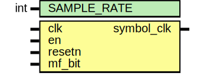

# Entity: clock_recovery 
- **File**: clock_recovery.sv

## Diagram

## Description

This file generated by [rtl-generator](https://github.com/burnettlab/rtl-generator.git), written by Brandon Hippe

## Generator Arguments

|   Argument   | Value |
| :----------: | :---: |
| mf_clock_rec |  True |

## Generics

| Generic name | Type | Value | Description |
| ------------ | ---- | ----- | ----------- |
| SAMPLE_RATE  | int  | 16    |             |

## Ports

| Port name  | Direction | Type | Description |
| ---------- | --------- | ---- | ----------- |
| clk        | input     |      |             |
| en         | input     |      |             |
| resetn     | input     |      |             |
| mf_bit     | input     |      |             |
| symbol_clk | output    |      |             |

## Signals

| Name           | Type                           | Description |
| -------------- | ------------------------------ | ----------- |
| sample_counter | logic [clog2(SAMPLE_RATE-1):0] |             |
| p_mf_bit       | logic                          |             |

## Constants

| Name            | Type | Value | Description |
| --------------- | ---- | ----- | ----------- |
| PIPELINE_STAGES |      | 1     |             |

## Processes
- unnamed: ( @(posedge clk or negedge resetn) )
  - **Type:** always_ff
