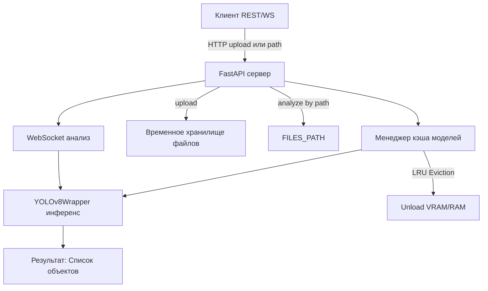

# SensoryLAB Async Microservice Detector

## 📷 Асинхронный сервис для обнаружения объектов на изображениях и видео (YOLOv8)

---

## Описание

**Async Microservice Detector** — это продвинутый backend-сервис, реализующий асинхронный REST и WebSocket API для инференса изображений и видео с помощью моделей семейства YOLOv8. Сервис поддерживает:

- **Обработку изображений и видео** через HTTP upload или по безопасному серверному пути (из смонтированных директорий).
- **Потоковый анализ** видеокадров через WebSocket.
- **Горячую смену и кэширование моделей**.
- **Безопасную работу с файловой системой** (path traversal protection).
- **Масштабируемый деплой в Docker**.

---

## 🏗️ Архитектурные особенности

- **FastAPI** — быстрый асинхронный backend с автогенерацией OpenAPI и Swagger UI.
- **YOLOv8 (Ultralytics)** — быстрая и точная детекция объектов.
- **Микросервисная архитектура** — легко интегрируется в пайплайны, поддерживает контейнеризацию.
- **Модель кэшируется** в VRAM/RAM, автоматическая выгрузка по таймауту.
- **Безопасный доступ к данным** — анализ только в пределах смонтированных директорий.
- **Расширяемость** — легко добавлять новые модели и backend-детекторы.

#### Архитектура сервиса



## 🚀 Быстрый старт

### 1. Клонирование и подготовка
```bash
git clone http://10.10.0.20:3000/m.chui/Yolo.git
cd Yolo
```
### 2. Запуск через Docker Compose
# Отредактируйте .env при необходимости (см. ниже)
```bash
docker-compose up --build
```
### 3. Переменные окружения

| Переменная | Описание | Пример |
| --------------------- | ------------------------------------------------------- | -------------------------- |
| `FILES_PATH` | Абсолютный путь до разрешённой директории с данными | `/mnt/nfs/servers` |
| `WEIGHTS_DIR` | Каталог с YOLO весами внутри контейнера | `/app/weights` |
| `DEFAULT_MODEL_NAME` | Имя модели по умолчанию (без .pt) | `yolov8s` |
| `MODEL_CACHE_TIMEOUT_SEC` | Таймаут простоя модели в кэше (сек) | `600` |

**Пример docker-compose.yaml:**
```yaml
version: '3.8'
services:
  yolo:
    build: .
    ports:
      - "8000:8000"
    environment:
      - FILES_PATH=/data
      - WEIGHTS_DIR=/app/weights
      - DEFAULT_MODEL_NAME=yolov8s
      - MODEL_CACHE_TIMEOUT_SEC=600
    volumes:
      - /mnt/nfs/servers:/data:ro   # Маунт хранилища только для чтения
      - ./src/sensory_detector/weights:/app/weights
```

## 🧑‍💻 Использование API

### Swagger/OpenAPI

После запуска доступен интерактивный Swagger UI:  
[http://localhost:8000/docs](http://localhost:8000/docs)

### Основные эндпоинты

#### 1. Анализ изображения (upload)
```bash
curl -X POST "http://localhost:8000/api/analyze/auto" \
  -F "file=@test.jpg" \
  -F "model_name=yolov8s"

#### 2. Анализ видео (upload)
curl -X POST "http://localhost:8000/api/analyze/auto" \
  -F "file=@test.avi" \
  -F "model_name=yolov8s"
#### 3. Анализ по серверному пути
curl -X POST "http://localhost:8000/api/analyze/auto" \
  -F "path=/data/test.jpg" \
  -F "model_name=yolov8s"
```
#### 4. WebSocket для потокового анализа

```python
import websockets, cv2, numpy as np, asyncio, json

async def ws_demo():
    uri = "ws://localhost:8000/ws/analyze?model_name=yolov8s"
    img = np.zeros((128, 128, 3), np.uint8)
    _, jpg = cv2.imencode(".jpg", img)
    async with websockets.connect(uri) as ws:
        await ws.send(jpg.tobytes())
        resp = await ws.recv()
        print(json.loads(resp))

asyncio.run(ws_demo())
```

## 📦 Формат ответа
```json
{
  "model_name": "yolov8s",
  "detections": [
    {
      "index": 0,
      "timestamp": 0.0,
      "detections": [
        {
          "index": 0,
          "object_name": "person",
          "confidence": 0.93,
          "bounding_box": {
            "x1": 34.3, "y1": 41.2, "x2": 100.2, "y2": 200.8
          }
        }
      ]
    }
  ]
}
```

## 🔒 Безопасность

- **Path Traversal Protection** — сервис анализирует только файлы, находящиеся в `FILES_PATH`.
- **Upload Validation** — анализируется MIME-тип, поддерживаются только изображения/видео.
- **Разграничение доступа к данным** — используйте Docker volume с read-only доступом для данных.

---

## ⚙️ Лучшие практики деплоя

- **GPU**: Для ускорения инференса используйте nvidia-docker (`--gpus=all`).
- **Масштабирование**: Разворачивайте несколько инстансов за reverse proxy (например, nginx или traefik).
- **Мониторинг**: Логи доступны через stdout/stderr контейнера. Добавьте Prometheus/Grafana для мониторинга нагрузки.
- **Обновление моделей**: Просто добавьте новый `.pt` в `WEIGHTS_DIR` и вызовите `/api/available_models`.

---

## 🛠️ Разработка и тесты

### Запуск тестов
# Предварительно запустите сервис
pytest tests/
### Локальный запуск без Docker

Установите зависимости:
```bash
pip install -r requirements.txt
```
Запуск dev-сервера:
```bash
uvicorn main:app --reload --host 0.0.0.0 --port 8000
```
---

## 📝 Контрибьютинг

- Пишите код с typing и docstring.
- Соблюдайте PEP8.
- Оформляйте pull requests с примерами использования.
- Документируйте все публичные API.

---

## 📚 Документация

- Swagger UI: http://localhost:8000/docs
- OpenAPI: http://localhost:8000/openapi.json

---

## 🤝 Благодарности

- [Ultralytics YOLOv8](https://github.com/ultralytics/ultralytics)
- [FastAPI](https://fastapi.tiangolo.com/)
- [pyAV](https://github.com/PyAV-Org/PyAV)

---

**Вопросы и поддержка:**  
Создайте issue или пишите на team@example.com

---

**© 2025, SensoryLAB Team**
