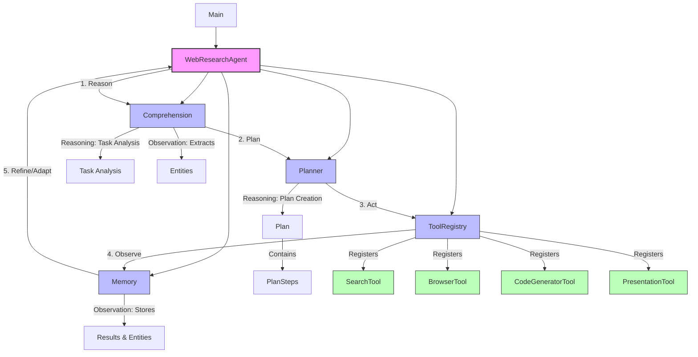

# Web Research Agent

A research implementation of the ReAct (Reasoning + Acting) paradigm applied to web research tasks. This agent demonstrates how a sequential reasoning and action approach can effectively tackle complex information-seeking tasks by breaking them down into structured plans and executing them step-by-step.

> **Research Focus**: This project primarily explores reasoning and planning in ML systems, specifically through the implementation of the ReAct scaffolding as described in ["ReAct: Synergizing Reasoning and Acting in Language Models"](https://arxiv.org/abs/2210.03629) (Yao et al., 2022).

## Features

- **Reasoning-Based Planning**: Creates detailed step-by-step plans for research tasks
- **Entity Recognition**: Identifies people, organizations, roles, and other entities from text
- **Adaptive Search Refinement**: Modifies queries based on discovered information
- **Information Synthesis**: Combines information from multiple sources
- **Multi-Criteria Task Handling**: Processes complex queries with multiple conditions research tasks
- **Structured Output**: Organize findings into well-formatted reports
- **Code Generation**: Write code when required for data processing tasks

## Architecture & ReAct Implementation

This project implements the ReAct paradigm with the following components:



The diagram illustrates how the agent implements the ReAct paradigm:
- **Reasoning**: Task analysis and plan creation
- **Acting**: Tool execution (search, browse, code generation)
- **Observation**: Entity extraction and result processing
- **Iteration**: Using observations to refine subsequent actions

## Installation

### Prerequisites

- Python 3.9 or higher
- pip (Python package installer)

### Setup

1. Clone the repository:
   ```bash
   git clone https://github.com/yourusername/web_research_agent.git
   cd web_research_agent
   ```

2. Create a virtual environment:
   ```bash
   python -m venv venv
   source venv/bin/activate  # On Windows: venv\Scripts\activate
   ```

3. Install dependencies:
   ```bash
   pip install -r requirements.txt
   ```

## Research Environment Setup

The research implementation requires the following external services:

1. **Gemini API**: Provides the language model capabilities for reasoning components
2. **Serper API**: Delivers search results for information gathering

### Setting up API keys

#### Option 1: .env file (Recommended for research)

Create a `.env` file in the project root:

```bash
GEMINI_API_KEY=your_gemini_api_key
SERPER_API_KEY=your_serper_api_key
```

#### Option 2: Environment Variables

```bash
export GEMINI_API_KEY=your_gemini_api_key
export SERPER_API_KEY=your_serper_api_key
```

#### Option 3: Programmatic Configuration

```python
from config.config_manager import init_config

config = init_config()
config.update('gemini_api_key', 'your_gemini_api_key')
config.update('serper_api_key', 'your_serper_api_key')
```

### Experimental Parameters

These parameters can be modified to explore different research questions about the system's behavior:

| Parameter | Environment Variable | Description | Default |
|-----------|---------------------|-------------|---------|
| gemini_api_key | GEMINI_API_KEY | API key for Gemini LLM | - |
| serper_api_key | SERPER_API_KEY | API key for Serper.dev search | - |
| log_level | LOG_LEVEL | Detail level of research logs | INFO |
| max_search_results | MAX_SEARCH_RESULTS | Number of search results to process | 5 |
| memory_limit | MEMORY_LIMIT | Working memory capacity | 100 |
| output_format | OUTPUT_FORMAT | Results format (markdown, text, html) | markdown |
| timeout | REQUEST_TIMEOUT | Web request timeout (seconds) | 30 |

## Usage

### Basic Usage

1. Create a text file with research tasks:
   ```
   # tasks.txt
   Find the name of the COO of the organization that mediated talks between US and Chinese AI companies in Geneva in 2023.
   
   By what percentage did Volkswagen reduce their Scope 1 and Scope 2 greenhouse gas emissions in 2023 compared to 2021?
   
   Compile a list of companies satisfying the following criteria:
       They are based in the EU
       They operate within the motor vehicle sector
       Their greenhouse gas emissions are available for 2021-2023
   ```

   Note: Empty lines between tasks help the parser distinguish between separate tasks and multi-criteria tasks.

2. Run the research process:
   ```bash
   python main.py tasks.txt
   ```

3. Results will be saved to the `results/` directory as Markdown files.

### Command Line Options

```bash
python main.py tasks.txt --output custom_output_dir
```

| Option | Description | Default |
|--------|-------------|---------|
| task_file | Path to text file containing tasks | (required) |
| --output | Directory to store results | results/ |

## Project Structure & ReAct Components

The project structure maps closely to the ReAct paradigm components:

- **agent/**: Core reasoning and coordination components
  - **agent.py**: Main controller implementing the ReAct loop
  - **comprehension.py**: Reasoning about tasks and extracting entities
  - **memory.py**: Short-term memory for tracking observations
  - **planner.py**: ReAct reasoning for plan creation
  
- **tools/**: Action components
  - **search.py**: Information retrieval
  - **browser.py**: Content extraction
  - **code_generator.py**: Data analysis and processing
  - **presentation_tool.py**: Result formatting
  - **tool_registry.py**: Tool management system

- **utils/**: Supporting functions
  - **console_ui.py**: Interface components
  - **formatters.py**: Output structuring
  - **task_parser.py**: Multi-criteria task parsing
  - **criteria_filter.py**: Multi-criteria verification
  - **logger.py**: Execution tracking

- **config/**: Research environment configuration
  
- **main.py**: Entry point and experiment runner

## Advanced Research Features

### Multi-Criteria Task Handling

The agent can process complex research tasks with multiple criteria. For example:

```
Compile a list of companies satisfying the following criteria:
    They are based in the EU
    They operate within the motor vehicle sector
    Their greenhouse gas emissions are available for 2021-2023
    They earned more than €1B in revenue in 2023
```

The agent parses these as a single unified task, creates targeted search steps for different criteria, and uses verification steps to ensure all criteria are addressed.

### Entity Extraction & Relationship Mapping

The agent extracts relevant entities from text and builds relationships between them:

- **People**: Names of individuals
- **Organizations**: Companies, agencies, groups
- **Roles**: Job titles and positions
- **Locations**: Physical places
- **Dates**: Temporal references

This enables more sophisticated reasoning about the information gathered.

### ReAct-Based Error Recovery

Following the ReAct paradigm, the agent can recover from failures by reasoning about errors and attempting alternative approaches. For example, when encountering anti-scraping measures, it can:

1. Recognize the blocking (observation)
2. Reason about alternative approaches
3. Fall back to using search snippets as an alternative data source

### Custom Output Formats

You can customize the output format by setting the `output_format` configuration:

```python
from config.config_manager import init_config

config = init_config()
config.update('output_format', 'html')  # Options: markdown, json, html
```

## Experimental Notes & Limitations

As a research implementation, this project has certain experimental limitations:

### Current Limitations

1. **Web Access Constraints**: The research agent may encounter sites with anti-scraping measures, resulting in incomplete data collection.
2. **Reasoning Boundaries**: Complex, ambiguous, or poorly defined tasks may lead to suboptimal planning.
3. **Query Formulation**: The system sometimes generates suboptimal search queries for highly specialized domains.
4. **Resource Requirements**: Processing complex multi-criteria tasks can be computationally intensive.

### Experimental Logs

Detailed logs of the reasoning and acting processes are stored in the `logs/` directory, providing insights into:
- Task analysis reasoning
- Plan generation processes
- Tool selection decisions
- Error recovery mechanisms

These logs are valuable for understanding the ReAct process and identifying potential improvements.

## Contributing

Contributions are welcome! Please feel free to submit a Pull Request. Check out the [CONTRIBUTING.md](CONTRIBUTING.md) file for more details.

## Research Background

This project implements the ReAct (Reasoning + Acting) paradigm as described in the paper ["ReAct: Synergizing Reasoning and Acting in Language Models"](https://arxiv.org/abs/2210.03629) by Yao et al. (2022). ReAct is a framework that combines reasoning and acting in language models to solve complex tasks.

### ReAct Paradigm Overview

The ReAct paradigm consists of four core components:
1. **Reasoning**: Breaking down complex tasks and planning solutions
2. **Acting**: Taking actions based on reasoning
3. **Observation**: Processing the results of actions
4. **Iteration**: Using observations to inform subsequent reasoning and actions

### Implementation Details

This agent demonstrates the ReAct principles through:

- **Task Analysis**: Using language models to understand complex requirements
- **Plan Generation**: Creating structured step-by-step plans for research tasks
- **Tool Selection**: Choosing appropriate tools based on task requirements
- **Adaptive Refinement**: Modifying strategies based on intermediate observations
- **Error Recovery**: Reasoning about failures and implementing alternative approaches

### Research Findings

Initial findings from this implementation suggest:

1. Breaking complex research tasks into sequential steps improves accuracy
2. Entity extraction and tracking enables more targeted information gathering
3. Adaptive query refinement substantially improves search effectiveness
4. Multi-criteria tasks benefit from hierarchical planning approaches

### Related Research

- [Chain-of-Thought Prompting](https://arxiv.org/abs/2201.11903) - Wei et al. (2022)
- [Language Models as Zero-Shot Planners](https://arxiv.org/abs/2201.07207) - Huang et al. (2022)
- [Faithful Reasoning Using Large Language Models](https://arxiv.org/abs/2208.14271) - Creswell et al. (2022)
